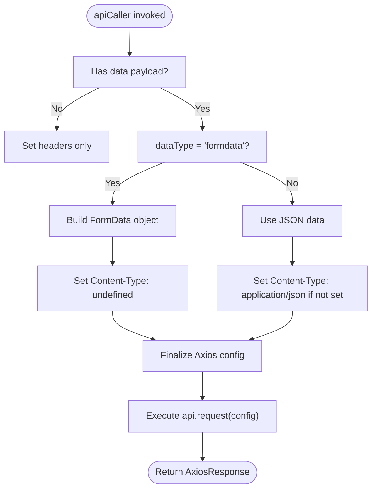
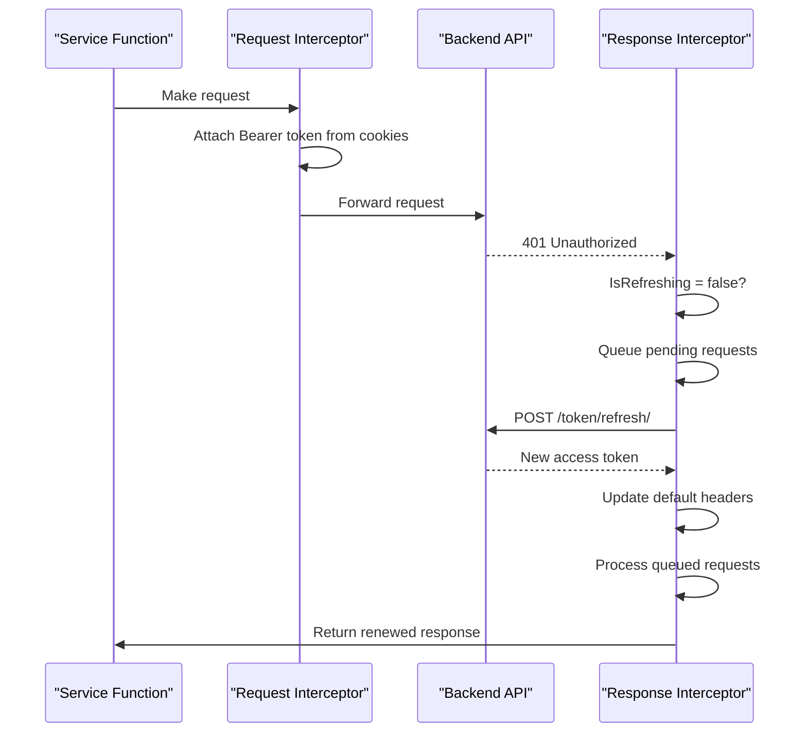

# API Reference

<cite>
**Referenced Files in This Document**   
- [api-caller.ts](file://src/lib/api-caller.ts)
- [api.ts](file://src/lib/api.ts)
- [api-routes.ts](file://src/constants/api-routes.ts)
- [api.d.ts](file://src/types/api.d.ts)
- [auth.ts](file://src/services/auth.ts)
- [departments.ts](file://src/services/departments.ts)
- [employees.ts](file://src/services/employees.ts)
- [executive-members.ts](file://src/services/executive-members.ts)
- [branches.ts](file://src/services/branches.ts)
</cite>

## Table of Contents
1. [Introduction](#introduction)
2. [Authentication](#authentication)
3. [Service Layer Overview](#service-layer-overview)
4. [API Client Wrapper](#api-client-wrapper)
5. [Axios Interceptor & Token Management](#axios-interceptor--token-management)
6. [Service Endpoints](#service-endpoints)
   - [Auth Service](#auth-service)
   - [Departments Service](#departments-service)
   - [Employees Service](#employees-service)
   - [Executive Members Service](#executive-members-service)
   - [Branches Service](#branches-service)
7. [File Upload & Form Submission](#file-upload--form-submission)
8. [Error Handling & Retry Logic](#error-handling--retry-logic)
9. [Client Implementation Guidelines](#client-implementation-guidelines)
10. [Performance Optimization](#performance-optimization)
11. [Security Considerations](#security-considerations)

## Introduction
This document provides comprehensive API documentation for the `cartwrightking-admin-erp` application's internal API client and service layer. It details the HTTP methods, URL patterns, request/response schemas, and authentication mechanisms used across all endpoints. The architecture leverages a service-oriented pattern with dedicated modules for each domain (auth, departments, employees, executive-members, branches), each exposing typed functions for CRUD operations and specialized actions.

The API client is built on Axios with a custom wrapper (`apiCaller`) that supports both JSON and FormData payloads, enabling seamless handling of file uploads and structured data. Automatic token injection and refresh logic are implemented via interceptors, ensuring secure and uninterrupted user sessions. This documentation also covers error handling, retry mechanisms, and best practices for consuming these services in new components.

## Authentication

### Token-Based Authentication
The application uses JWT-based authentication with access and refresh tokens. Tokens are stored in HTTP-only cookies for enhanced security and automatically attached to all outgoing requests.

#### Authentication Endpoints
| Endpoint | Method | Purpose |
|--------|--------|---------|
| `/token/` | POST | Obtain access and refresh tokens using username/password |
| `/token/refresh/` | POST | Refresh expired access token using refresh token |
| `/token/verify/` | POST | Verify validity of an access token |

Tokens are automatically managed by the `ApiClient` class. On 401 responses, a refresh cycle is triggered if the failed request was not itself an authentication call.

**Section sources**
- [api.ts](file://src/lib/api.ts#L1-L150)
- [auth.ts](file://src/services/auth.ts#L1-L47)
- [api-routes.ts](file://src/constants/api-routes.ts#L1-L100)

## Service Layer Overview

The service layer abstracts API interactions into modular, reusable functions. Each service corresponds to a backend resource and exports typed functions for common operations.

### Available Services
- **Auth**: User authentication and token management
- **Departments**: Department CRUD and employee association
- **Employees**: Employee management with profile picture handling
- **Executive Members**: Executive CRUD with file upload support
- **Branches**: Branch management and location mapping

All services use the `apiCaller` wrapper and conform to consistent typing patterns using OpenAPI-generated types from `api.d.ts`.

**Section sources**
- [services/auth.ts](file://src/services/auth.ts)
- [services/departments.ts](file://src/services/departments.ts)
- [services/employees.ts](file://src/services/employees.ts)
- [services/executive-members.ts](file://src/services/executive-members.ts)
- [services/branches.ts](file://src/services/branches.ts)

## API Client Wrapper

### `apiCaller` Function
The `apiCaller` utility provides a unified interface for making HTTP requests, supporting both JSON and FormData content types.

**Diagram sources**
- [api-caller.ts](file://src/lib/api-caller.ts#L1-L84)

**Section sources**
- [api-caller.ts](file://src/lib/api-caller.ts#L1-L84)

### Wrapper Parameters
- `url`: Target endpoint
- `method`: HTTP method (default: "GET")
- `data`: Request payload (object or FormData)
- `options`: Additional Axios config
- `dataType`: "json" or "formdata" (default: "json")

When `dataType` is "formdata", the wrapper ensures `Content-Type` is unset so Axios can set it correctly with boundary information.

## Axios Interceptor & Token Management

### Interceptor Chain
The `ApiClient` class configures request and response interceptors for automatic authentication handling.

**Diagram sources**
- [api.ts](file://src/lib/api.ts#L1-L150)

**Section sources**
- [api.ts](file://src/lib/api.ts#L1-L150)

### Token Refresh Logic
- Triggered on 401 responses (excluding auth endpoints)
- Prevents duplicate refresh attempts with `isRefreshing` flag
- Queues concurrent requests during refresh
- Persists new tokens in cookies
- Redirects to login on refresh failure

## Service Endpoints

### Auth Service
Handles user authentication and token lifecycle.

| Operation | Method | Endpoint | Request Schema | Response Schema |
|---------|--------|----------|----------------|-----------------|
| Login | POST | `/token/` | `LoginRequest` | `LoginResponse` |
| Refresh Token | POST | `/token/refresh/` | `RefreshRequest` | `RefreshResponse` |
| Verify Token | POST | `/token/verify/` | `VerifyRequest` | `void` |
| Logout | N/A | N/A | N/A | N/A |

**Section sources**
- [auth.ts](file://src/services/auth.ts#L1-L47)

### Departments Service
Manages department entities and their relationships.

| Operation | Method | Endpoint | Request Schema | Response Schema |
|---------|--------|----------|----------------|-----------------|
| List | GET | `/departments/` | Query params | `DepartmentListResponse` |
| Detail | GET | `/departments/{id}/` | N/A | `DepartmentDetailResponse` |
| Create | POST | `/departments/` | `DepartmentCreateRequest` | `DepartmentCreateResponse` |
| Update | PUT | `/departments/{id}/` | `DepartmentUpdateRequest` | `DepartmentUpdateResponse` |
| Delete | DELETE | `/departments/{id}/` | N/A | `void` |

Supports pagination via query parameters.

**Section sources**
- [departments.ts](file://src/services/departments.ts#L1-L94)

### Employees Service
Handles employee records with profile picture management.

| Operation | Method | Endpoint | Request Schema | Response Schema |
|---------|--------|----------|----------------|-----------------|
| List | GET | `/employees/` | Query params | `EmployeeListResponse` |
| Detail | GET | `/employees/{id}/` | N/A | `EmployeeDetailResponse` |
| Create | POST | `/employees/` | `EmployeeCreateRequest` | `EmployeeCreateResponse` |
| Update | PATCH | `/employees/{id}/` | `EmployeeUpdateRequest` | `EmployeeUpdateResponse` |
| Delete | DELETE | `/employees/{id}/` | N/A | `void` |
| Upload Picture | POST | `/employees/{id}/profile_picture/upload/` |