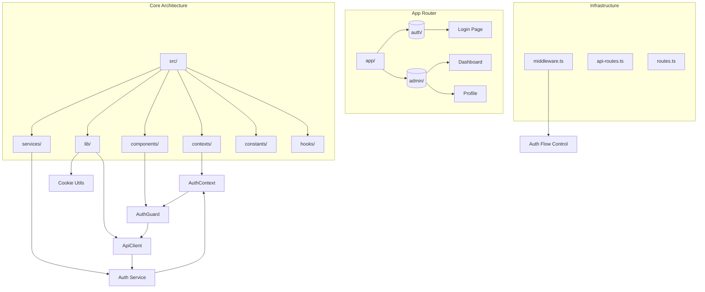
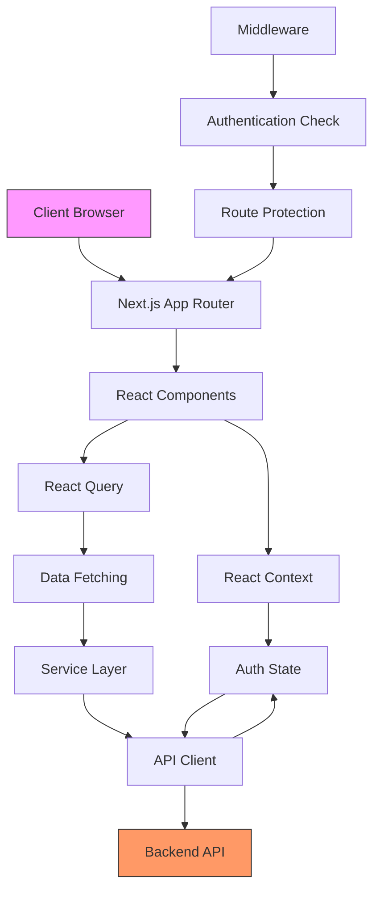
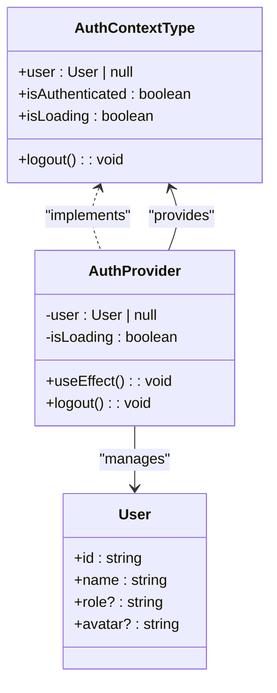
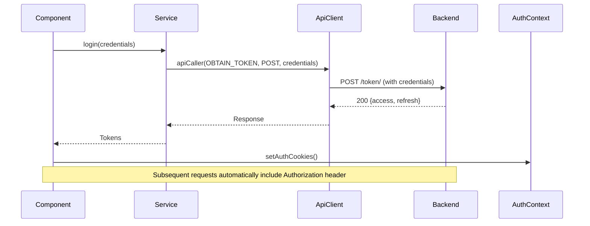
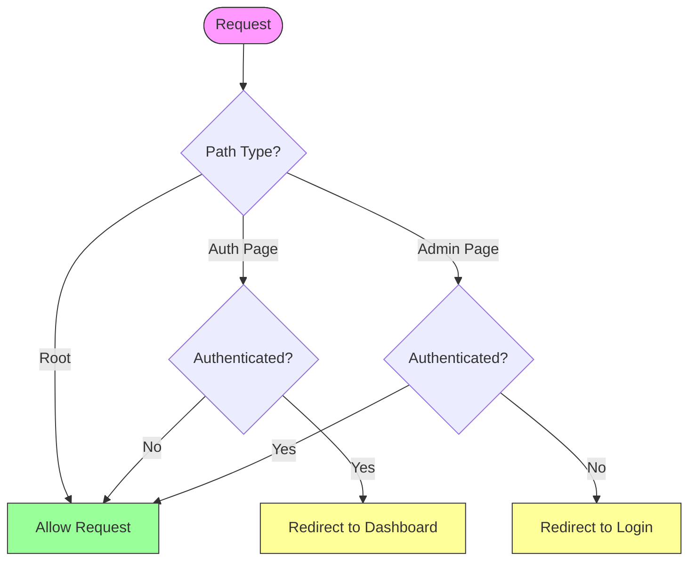

# Architecture Overview

<cite>
**Referenced Files in This Document**   
- [auth-context.tsx](file://src/contexts/auth-context.tsx)
- [api.ts](file://src/lib/api.ts)
- [api-caller.ts](file://src/lib/api-caller.ts)
- [cookies.ts](file://src/lib/cookies.ts)
- [auth.ts](file://src/services/auth.ts)
- [auth-guard.tsx](file://src/components/auth/auth-guard.tsx)
- [middleware.ts](file://src/middleware.ts)
- [routes.ts](file://src/constants/routes.ts)
- [api-routes.ts](file://src/constants/api-routes.ts)
- [login-form.tsx](file://src/components/auth/login-form.tsx)
- [page.tsx](file://src/app/(auth)/login/page.tsx)
</cite>

## Table of Contents
1. [Introduction](#introduction)
2. [Project Structure](#project-structure)
3. [Core Components](#core-components)
4. [Architecture Overview](#architecture-overview)
5. [Detailed Component Analysis](#detailed-component-analysis)
6. [Dependency Analysis](#dependency-analysis)
7. [Performance Considerations](#performance-considerations)
8. [Troubleshooting Guide](#troubleshooting-guide)
9. [Conclusion](#conclusion)

## Introduction
The cartwrightking-admin-erp application is a modern enterprise resource planning (ERP) dashboard built on the Next.js 15 App Router with React 19. This document provides a comprehensive architectural overview of the system, focusing on its component-driven design, authentication flow, data management strategy, and integration patterns. The application follows a clear separation of concerns, leveraging React Context for global state, React Query for declarative data fetching, and a dedicated service layer for API abstraction. The architecture emphasizes security, scalability, and maintainability through well-defined boundaries between frontend components, API services, and backend systems.

## Project Structure
The application follows a feature-based directory structure under the `src` folder, organized to promote scalability and maintainability. The `app` directory leverages the Next.js App Router for routing and layout management, with route groups `(admin)` and `(auth)` isolating administrative and authentication flows. Components are organized by feature domain (e.g., `company-hub`, `departments`) and shared UI elements reside in the `ui` subdirectory. The `contexts` directory contains React Context providers for global state, while `services` encapsulates API communication logic. Utility functions, constants, and hooks are modularized in dedicated directories to ensure reusability and separation of concerns.



**Diagram sources**
- [middleware.ts](file://src/middleware.ts#L1-L47)
- [auth-context.tsx](file://src/contexts/auth-context.tsx#L1-L132)
- [api.ts](file://src/lib/api.ts#L1-L150)

**Section sources**
- [middleware.ts](file://src/middleware.ts#L1-L47)
- [auth-context.tsx](file://src/contexts/auth-context.tsx#L1-L132)
- [api.ts](file://src/lib/api.ts#L1-L150)

## Core Components
The application's core components include the authentication context for managing user state, the API client for handling HTTP requests with automatic token refresh, and the auth guard for protecting routes. The service layer abstracts API endpoints, while React Query hooks provide data fetching capabilities. The middleware enforces authentication rules at the request level, and cookie utilities manage authentication tokens securely on the client side. These components work together to create a secure, responsive, and maintainable admin interface.

**Section sources**
- [auth-context.tsx](file://src/contexts/auth-context.tsx#L1-L132)
- [api.ts](file://src/lib/api.ts#L1-L150)
- [services/auth.ts](file://src/services/auth.ts#L1-L47)

## Architecture Overview
The cartwrightking-admin-erp application implements a layered architecture with clear boundaries between presentation, state management, data access, and infrastructure layers. Built on Next.js 15 App Router, the application leverages React 19 features for enhanced performance and developer experience. The frontend is organized into feature modules under the admin dashboard, each with dedicated pages and components. Authentication is managed through React Context, providing global access to user state across the application. Data fetching and caching are handled by React Query through custom hooks, ensuring efficient data synchronization and reduced network requests. A service layer abstracts API communication, decoupling business logic from HTTP implementation details.



**Diagram sources**
- [auth-context.tsx](file://src/contexts/auth-context.tsx#L1-L132)
- [api.ts](file://src/lib/api.ts#L1-L150)
- [middleware.ts](file://src/middleware.ts#L1-L47)

## Detailed Component Analysis

### Authentication State Management
The application uses React Context to manage authentication state globally. The `AuthProvider` component initializes authentication by checking for existing tokens in cookies and verifying their validity. It exposes a context value containing user information, authentication status, loading state, and logout functionality. This pattern enables any component in the application to access authentication state without prop drilling, while maintaining a single source of truth for user session data.



**Diagram sources**
- [auth-context.tsx](file://src/contexts/auth-context.tsx#L1-L132)

**Section sources**
- [auth-context.tsx](file://src/contexts/auth-context.tsx#L1-L132)

### Data Fetching and API Communication
The application implements a robust service layer for API communication, abstracting HTTP details from business logic. The `api` client uses Axios with interceptors for automatic token attachment and refresh functionality. When a 401 error occurs, the client automatically attempts to refresh the access token before retrying the original request, creating a seamless user experience. The `apiCaller` utility handles different data types (JSON and FormData) and ensures proper content-type headers, while service modules export typed functions for specific API endpoints.



**Diagram sources**
- [api.ts](file://src/lib/api.ts#L1-L150)
- [api-caller.ts](file://src/lib/api-caller.ts#L1-L84)
- [auth.ts](file://src/services/auth.ts#L1-L47)

**Section sources**
- [api.ts](file://src/lib/api.ts#L1-L150)
- [api-caller.ts](file://src/lib/api-caller.ts#L1-L84)
- [services/auth.ts](file://src/services/auth.ts#L1-L47)

### Authentication Flow and Route Protection
The application implements a multi-layered authentication strategy combining middleware and component-level guards. The Next.js middleware intercepts requests to enforce authentication rules at the edge, redirecting unauthenticated users from admin routes and authenticated users from login pages. The `AuthGuard` component provides client-side protection with loading states and programmatic navigation. This dual approach ensures security while providing a smooth user experience during authentication transitions.



**Diagram sources**
- [middleware.ts](file://src/middleware.ts#L1-L47)
- [auth-guard.tsx](file://src/components/auth/auth-guard.tsx#L1-L57)

**Section sources**
- [middleware.ts](file://src/middleware.ts#L1-L47)
- [auth-guard.tsx](file://src/components/auth/auth-guard.tsx#L1-L57)

## Dependency Analysis
The application exhibits a well-structured dependency graph with clear directional flow from presentation to service layers. Components depend on contexts and hooks, which in turn depend on services and utilities. The API client is a central dependency, used by all service modules for HTTP communication. Cookie utilities are consumed by both the API client (for token refresh) and authentication context (for session management). Route constants are imported throughout the application for consistent navigation. This architecture minimizes circular dependencies and promotes testability through dependency injection.

```mermaid
graph LR
    A[