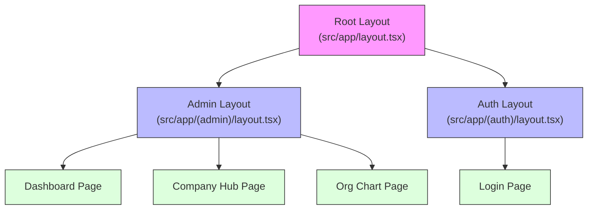
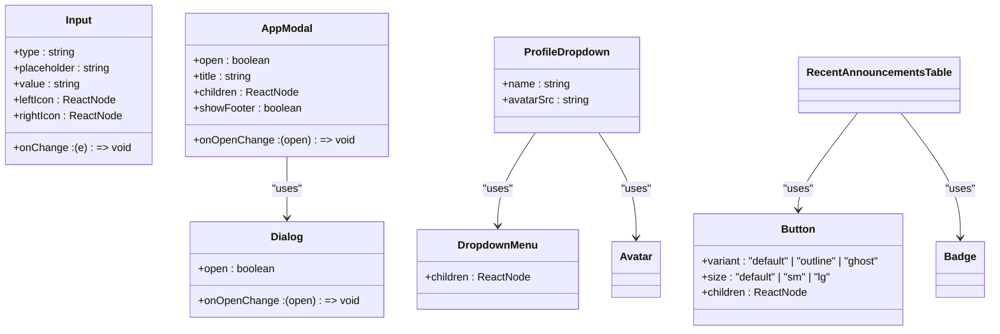
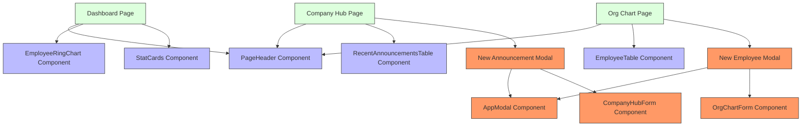

# Component Architecture

<cite>
**Referenced Files in This Document**   
- [layout.tsx](file://src/app/layout.tsx)
- [admin/layout.tsx](file://src/app/(admin)/layout.tsx)
- [auth/layout.tsx](file://src/app/(auth)/layout.tsx)
- [admin-sidebar.tsx](file://src/components/admin/layout/admin-sidebar.tsx)
- [admin-topbar.tsx](file://src/components/admin/layout/admin-topbar.tsx)
- [profile-dropdown.tsx](file://src/components/admin/layout/profile-dropdown.tsx)
- [topbar-search.tsx](file://src/components/admin/layout/topbar-search.tsx)
- [admin-footer-menu.tsx](file://src/components/admin/layout/admin-footer-menu.tsx)
- [use-mobile.ts](file://src/hooks/use-mobile.ts)
- [card-table.tsx](file://src/components/card-table/card-table.tsx)
- [app-modal.tsx](file://src/components/common/app-modal.tsx)
- [page-header.tsx](file://src/components/page-header.tsx)
- [company-hub-form.tsx](file://src/components/company-hub/company-hub-form.tsx)
- [org-chart-form.tsx](file://src/components/org-chart/org-chart-form.tsx)
- [employee-ring-chart.tsx](file://src/components/dashboard/employee-ring-chart.tsx)
- [recent-announcements-table.tsx](file://src/components/announcements/recent-announcements-table.tsx)
- [executive-members-table.tsx](file://src/components/executive-members/executive-members-table.tsx)
- [knowledge-base-table.tsx](file://src/components/knowledge-base/knowledge-base-table.tsx)
- [auth-guard.tsx](file://src/components/auth/auth-guard.tsx)
- [auth-context.tsx](file://src/contexts/auth-context.tsx)
- [upload-queue-context.tsx](file://src/contexts/upload-queue-context.tsx)
</cite>

## Table of Contents
1. [Introduction](#introduction)
2. [Layout Hierarchy and Propagation](#layout-hierarchy-and-propagation)
3. [Component Organization by Feature Domain](#component-organization-by-feature-domain)
4. [Shared UI Primitives and Libraries](#shared-ui-primitives-and-libraries)
5. [Reusable Component Structure](#reusable-component-structure)
6. [Component Composition in Dashboard Modules](#component-composition-in-dashboard-modules)
7. [Responsive Design and Accessibility](#responsive-design-and-accessibility)
8. [Guidelines for Creating New Components](#guidelines-for-creating-new-components)
9. [Conclusion](#conclusion)

## Introduction
The cartwrightking-admin-erp application employs a component-driven architecture built on Next.js App Router, leveraging React's compositional model to deliver a consistent and scalable admin interface. This documentation details the organization of UI components, layout propagation mechanisms, and the integration of shared UI primitives from shadcn/ui and Radix UI. The architecture emphasizes reusability, maintainability, and a clear separation of concerns across feature domains such as dashboard, company-hub, org-chart, and knowledge-base.

**Section sources**
- [layout.tsx](file://src/app/layout.tsx#L1-L36)
- [admin/layout.tsx](file://src/app/(admin)/layout.tsx#L1-L52)

## Layout Hierarchy and Propagation

The application implements a nested layout system using Next.js App Router, where layouts are defined at various route levels to provide shared UI elements and context providers. The root layout in `src/app/layout.tsx` establishes global styles, fonts, and toast notifications. It wraps all pages with a consistent HTML structure and applies the Geist font family.

The admin layout (`src/app/(admin)/layout.tsx`) is applied to all routes under the `(admin)` group, providing authentication protection, query client configuration, and core admin UI components such as the sidebar and topbar. This layout uses `SidebarProvider` from shadcn/ui to manage sidebar state and injects `AuthProvider` and `UploadQueueProvider` to make authentication and file upload context available to all admin pages.

The auth layout (`src/app/(auth)/layout.tsx`) similarly provides authentication context but with `AuthGuard` configured to redirect authenticated users away from login pages. This ensures that users cannot access authentication routes when already logged in.

**Diagram sources**
- [layout.tsx](file://src/app/layout.tsx#L1-L36)
- [admin/layout.tsx](file://src/app/(admin)/layout.tsx#L1-L52)
- [auth/layout.tsx](file://src/app/(auth)/layout.tsx#L1-L24)

**Section sources**
- [layout.tsx](file://src/app/layout.tsx#L1-L36)
- [admin/layout.tsx](file://src/app/(admin)/layout.tsx#L1-L52)
- [auth/layout.tsx](file://src/app/(auth)/layout.tsx#L1-L24)

## Component Organization by Feature Domain

UI components are organized in the `src/components` directory by feature domain, with dedicated subdirectories for each major module: `company-hub`, `org-chart`, `executive-members`, `knowledge-base`, `new-hire`, and `dashboard`. This structure promotes code locality and makes it easier to locate components related to specific business features.

Each feature directory contains both view components (e.g., tables, forms) and utility components specific to that domain. For example, `src/components/company-hub` contains `company-hub-form.tsx` for creating and editing announcements, while `src/components/org-chart` includes `org-chart-form.tsx` for managing employee records. This organization enables independent development and testing of feature components while maintaining a consistent API and styling approach.

**Section sources**
- [company-hub-form.tsx](file://src/components/company-hub/company-hub-form.tsx#L1-L144)
- [org-chart-form.tsx](file://src/components/org-chart/org-chart-form.tsx#L1-L253)

## Shared UI Primitives and Libraries

The application leverages shadcn/ui and Radix UI to provide a consistent design system and accessible UI primitives. The `src/components/ui` directory contains wrapper components for these libraries, allowing for centralized customization of styling and behavior. Components such as `button.tsx`, `input.tsx`, `dropdown-menu.tsx`, and `dialog.tsx` extend the base implementations from shadcn/ui with project-specific styling and default props.

These shared primitives are used throughout the application to ensure visual consistency and accessibility. For example, the `ProfileDropdown` component uses `DropdownMenu` from shadcn/ui to create an accessible user menu in the topbar, while `AppModal` wraps `Dialog` to provide a standardized modal interface across features.

**Diagram sources**
- [ui/button.tsx](file://src/components/ui/button.tsx)
- [ui/input.tsx](file://src/components/ui/input.tsx)
- [ui/dropdown-menu.tsx](file://src/components/ui/dropdown-menu.tsx)
- [ui/dialog.tsx](file://src/components/ui/dialog.tsx)
- [common/app-modal.tsx](file://src/components/common/app-modal.tsx)
- [admin/layout/profile-dropdown.tsx](file://src/components/admin/layout/profile-dropdown.tsx)
- [announcements/recent-announcements-table.tsx](file://src/components/announcements/recent-announcements-table.tsx)

**Section sources**
- [common/app-modal.tsx](file://src/components/common/app-modal.tsx#L36-L105)
- [admin/layout/profile-dropdown.tsx](file://src/components/admin/layout/profile-dropdown.tsx#L22-L70)
- [ui/button.tsx](file://src/components/ui/button.tsx)
- [ui/input.tsx](file://src/components/ui/input.tsx)

## Reusable Component Structure

The `src/components` directory contains several categories of reusable components that support the application's modular architecture:

- **Layout Components**: `admin-sidebar.tsx`, `admin-topbar.tsx`, and `admin-footer-menu.tsx` provide the core navigation and branding elements for the admin interface.
- **Data Display Tables**: The `card-table` directory contains a flexible table system with components like `card-table.tsx`, `card-table-toolbar.tsx`, and `card-table-pagination.tsx` that support sorting, searching, and pagination.
- **Forms**: Domain-specific forms such as `company-hub-form.tsx` and `org-chart-form.tsx` encapsulate complex input logic and validation.
- **Modals**: `app-modal.tsx` provides a standardized modal interface used across features for data entry and confirmation dialogs.

The `card-table` component is particularly noteworthy as a reusable data display solution. It accepts generic type parameters and column definitions, allowing it to be used with different data structures while maintaining a consistent UI. The table supports sorting, pinning of important rows, and responsive grid layouts that adapt to mobile screens.

**Section sources**
- [admin/layout/admin-sidebar.tsx](file://src/components/admin/layout/admin-sidebar.tsx#L40-L122)
- [admin/layout/admin-topbar.tsx](file://src/components/admin/layout/admin-topbar.tsx#L5-L20)
- [card-table/card-table.tsx](file://src/components/card-table/card-table.tsx#L32-L139)
- [common/app-modal.tsx](file://src/components/common/app-modal.tsx#L36-L105)
- [page-header.tsx](file://src/components/page-header.tsx#L25-L59)

## Component Composition in Dashboard Modules

Component composition enables consistent UI patterns across dashboard modules. For example, the dashboard page uses `PageHeader` to display the title and breadcrumb navigation, followed by `EmployeeRingChart` and `StatCards` to visualize key metrics. The `RecentAnnouncementsTable` component is reused across multiple pages to display announcement data with consistent styling and interaction patterns.

The `CompanyHubForm` and `OrgChartForm` components demonstrate how form composition creates maintainable data entry interfaces. Both forms use shared input components like `Input`, `Dropzone`, and `RichTextEditor` from shadcn/ui, ensuring a consistent user experience. The forms also integrate with React Query for data fetching and mutation, with error handling centralized in the component logic.

**Diagram sources**
- [page-header.tsx](file://src/components/page-header.tsx#L25-L59)
- [dashboard/employee-ring-chart.tsx](file://src/components/dashboard/employee-ring-chart.tsx#L81-L164)
- [announcements/recent-announcements-table.tsx](file://src/components/announcements/recent-announcements-table.tsx#L37-L123)
- [company-hub-form.tsx](file://src/components/company-hub/company-hub-form.tsx#L18-L144)
- [org-chart-form.tsx](file://src/components/org-chart/org-chart-form.tsx#L26-L253)

**Section sources**
- [page-header.tsx](file://src/components/page-header.tsx#L25-L59)
- [dashboard/employee-ring-chart.tsx](file://src/components/dashboard/employee-ring-chart.tsx#L81-L164)
- [announcements/recent-announcements-table.tsx](file://src/components/announcements/recent-announcements-table.tsx#L37-L123)
- [company-hub-form.tsx](file://src/components/company-hub/company-hub-form.tsx#L18-L144)
- [org-chart-form.tsx](file://src/components/org-chart/org-chart-form.tsx#L26-L253)

## Responsive Design and Accessibility

Responsive design is implemented through a combination of CSS utilities and React hooks. The `useIsMobile` hook in `src/hooks/use-mobile.ts` detects screen size using window.matchMedia and returns a boolean indicating whether the current viewport is below the mobile breakpoint. This hook is used by components like `CardTable` to adjust layout and behavior on smaller screens.

Accessibility is prioritized through the use of shadcn/ui components, which are built on Radix UI primitives that follow WAI-ARIA guidelines. Interactive elements include proper keyboard navigation, focus management, and ARIA attributes. For example, the `AdminSidebar` uses semantic HTML and ARIA roles to ensure screen reader compatibility, while `TopbarSearch` implements keyboard shortcuts (Ctrl+K) for quick navigation.

The application also uses responsive grid layouts with Tailwind CSS, allowing components to adapt their structure based on screen size. The `CardTable` component, for instance, uses a grid layout with responsive column definitions that collapse gracefully on mobile devices.

**Section sources**
- [use-mobile.ts](file://src/hooks/use-mobile.ts#L4-L18)
- [card-table.tsx](file://src/components/card-table/card-table.tsx#L32-L139)
- [topbar-search.tsx](file://src/components/admin/layout/topbar-search.tsx#L10-L132)
- [admin-sidebar.tsx](file://src/components/admin/layout/admin-sidebar.tsx#L40-L122)

## Guidelines for Creating New Components

When creating new components, follow these conventions to maintain consistency with the existing architecture:

1. **Directory Structure**: Place new components in the appropriate feature directory under `src/components`. For shared components, use `src/components/common` or create a new feature-specific directory.

2. **Component Naming**: Use PascalCase for component names and descriptive file names that reflect the component's purpose (e.g., `NewDepartmentModal.tsx`).

3. **Props Typing**: Define component props using TypeScript interfaces or types, preferring explicit typing over any. Use optional props with default values when appropriate.

4. **Composition over Inheritance**: Build new components by composing existing primitives rather than duplicating code. Leverage shadcn/ui components for standard UI elements.

5. **Responsive Design**: Use the `useIsMobile` hook when component behavior needs to differ between mobile and desktop views. Ensure all interactive elements are accessible via keyboard.

6. **State Management**: For local component state, use React.useState. For shared state, consider using React Context or React Query, depending on whether the state is UI-related or data-related.

7. **Styling**: Use Tailwind CSS for styling, leveraging the existing design tokens and color palette. Avoid inline styles unless absolutely necessary.

8. **Accessibility**: Ensure all interactive elements have appropriate ARIA attributes and keyboard navigation support. Test components with screen readers when possible.

**Section sources**
- [use-mobile.ts](file://src/hooks/use-mobile.ts#L4-L18)
- [card-table.tsx](file://src/components/card-table/card-table.tsx#L32-L139)
- [app-modal.tsx](file://src/components/common/app-modal.tsx#L36-L105)
- [page-header.tsx](file://src/components/page-header.tsx#L25-L59)

## Conclusion

The component-driven architecture of the cartwrightking-admin-erp application provides a scalable and maintainable foundation for the admin interface. By organizing components by feature domain, leveraging shared UI primitives from shadcn/ui and Radix UI, and implementing a consistent layout hierarchy, the application achieves a high degree of reusability and visual consistency. The use of Next.js App Router for layout propagation, combined with React's compositional model, enables efficient code organization and performance optimization. Future development should continue to follow the established patterns for component creation and composition to ensure the