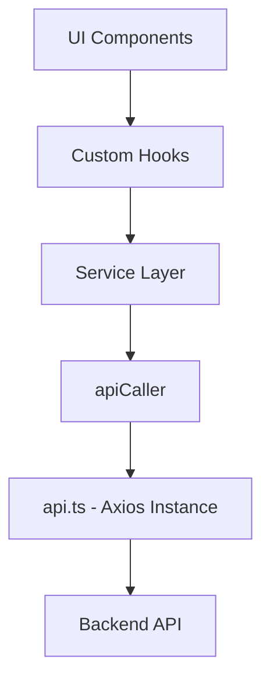
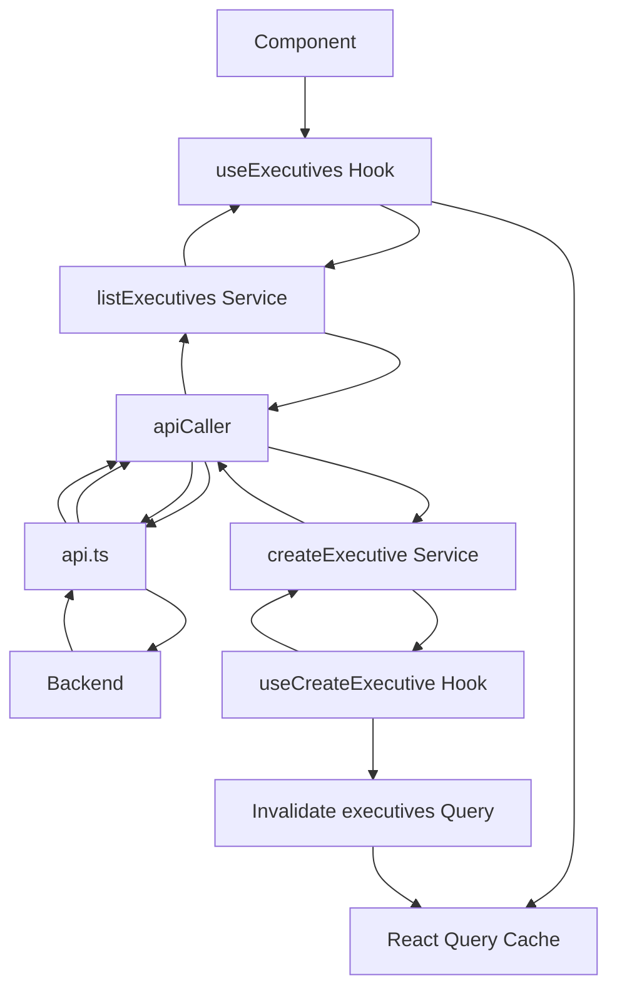
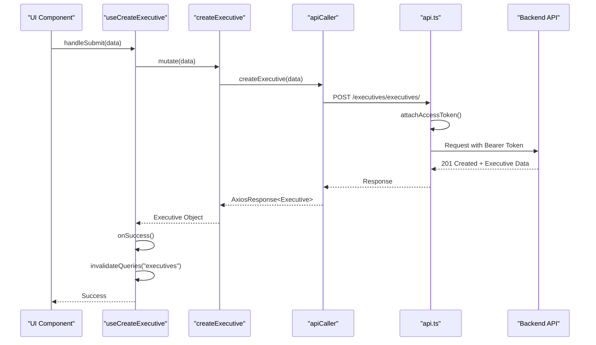
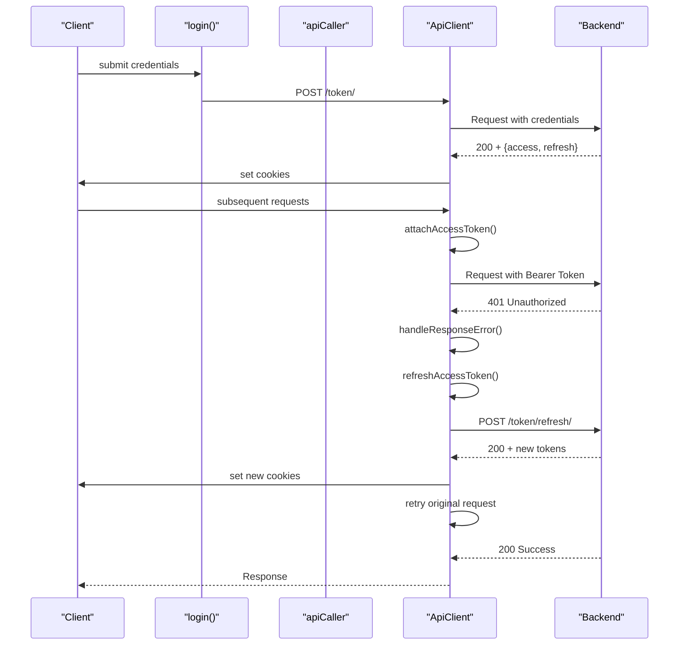
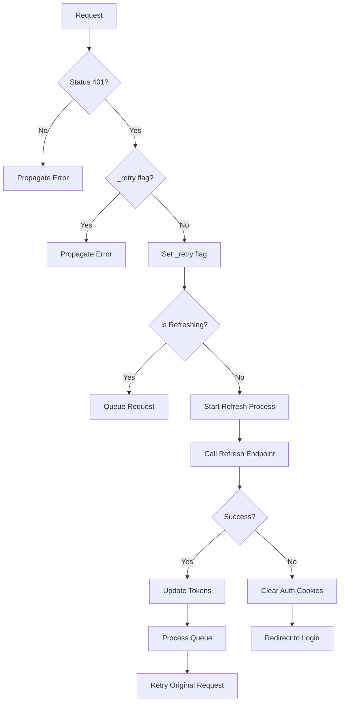

# Data Flow and API Integration

<cite>
**Referenced Files in This Document**   
- [src/lib/api.ts](file://src/lib/api.ts)
- [src/lib/api-caller.ts](file://src/lib/api-caller.ts)
- [src/services/auth.ts](file://src/services/auth.ts)
- [src/services/departments.ts](file://src/services/departments.ts)
- [src/services/executive-members.ts](file://src/services/executive-members.ts)
- [src/constants/api-routes.ts](file://src/constants/api-routes.ts)
- [src/hooks/queries/use-departments.ts](file://src/hooks/queries/use-departments.ts)
- [src/hooks/queries/use-executive-members.ts](file://src/hooks/queries/use-executive-members.ts)
</cite>

## Table of Contents
1. [Introduction](#introduction)
2. [Layered Architecture Overview](#layered-architecture-overview)
3. [Core API Client: api.ts](#core-api-client-api.ts)
4. [Request Abstraction Layer: api-caller.ts](#request-abstraction-layer-api-caller.ts)
5. [Service Layer Organization](#service-layer-organization)
6. [Custom Hooks and React Query Integration](#custom-hooks-and-react-query-integration)
7. [Complete Data Flow Example: Executive Members CRUD](#complete-data-flow-example-executive-members-crud)
8. [Security and Authentication Flow](#security-and-authentication-flow)
9. [Error Handling and Recovery](#error-handling-and-recovery)
10. [Performance Optimization and Caching](#performance-optimization-and-caching)
11. [Conclusion](#conclusion)

## Introduction
This document provides comprehensive documentation for the data flow architecture and API integration patterns in the CartwrightKing Admin ERP application. It details the layered approach from UI components through custom hooks, service layer, API caller abstraction, to the centralized Axios instance. The documentation covers authentication handling, request formatting, domain-based service organization, and end-to-end data flow for CRUD operations with emphasis on security, error recovery, and performance optimization.

## Layered Architecture Overview
The application implements a clean separation of concerns through a layered architecture:
- **Components**: UI elements that consume data via custom hooks
- **Custom Hooks**: React Query-based hooks that abstract data fetching and mutations
- **Service Layer**: Domain-specific modules that define business logic and API interactions
- **apiCaller**: Abstraction layer that standardizes request formatting and payload handling
- **api.ts**: Centralized Axios instance with interceptors for authentication and global error handling

This architecture enables maintainability, testability, and consistent API interaction patterns across the application.

**Diagram sources**
- [src/lib/api.ts](file://src/lib/api.ts#L1-L150)
- [src/lib/api-caller.ts](file://src/lib/api-caller.ts#L1-L84)
- [src/services/executive-members.ts](file://src/services/executive-members.ts#L1-L161)

**Section sources**
- [src/lib/api.ts](file://src/lib/api.ts#L1-L150)
- [src/lib/api-caller.ts](file://src/lib/api-caller.ts#L1-L84)

## Core API Client: api.ts
The `api.ts` file exports a centralized Axios instance configured with interceptors for authentication and error handling. The `ApiClient` class manages token refresh logic and request queuing during token renewal.

Key features:
- Automatic attachment of access tokens to requests
- Intercepted 401 responses trigger token refresh workflow
- Request queuing during token refresh to prevent race conditions
- Automatic redirection to login page after failed token refresh
- Protection against infinite refresh loops for login/verify endpoints

The client handles token storage via cookies and manages the authentication state across page reloads.

**Section sources**
- [src/lib/api.ts](file://src/lib/api.ts#L1-L150)

## Request Abstraction Layer: api-caller.ts
The `api-caller.ts` module abstracts request formatting and payload handling, supporting both JSON and FormData payloads. It serves as the interface between service functions and the Axios instance.

Key capabilities:
- Dynamic content-type handling based on payload type
- Automatic FormData construction from object literals
- Support for file uploads via FormData
- Proper header management to avoid content-type conflicts
- Flexible configuration options for individual requests

The `dataType` parameter allows services to specify whether data should be sent as JSON or FormData, with appropriate header adjustments to ensure correct server interpretation.

**Section sources**
- [src/lib/api-caller.ts](file://src/lib/api-caller.ts#L1-L84)

## Service Layer Organization
The service layer is organized by domain, with each module encapsulating API interactions for a specific business entity. Services are located in the `src/services` directory and include:

- **auth.ts**: Authentication operations (login, token refresh, verification)
- **departments.ts**: Department management and related employee data
- **executive-members.ts**: Executive CRUD operations with file upload support
- **branches.ts**: Branch management operations
- **employees.ts**: Employee management operations

Each service exports typed functions that return Promise-wrapped Axios responses, providing type safety and clear API contracts. Services import `apiCaller` to perform requests, maintaining consistency in request handling patterns.

**Section sources**
- [src/services/auth.ts](file://src/services/auth.ts#L1-L47)
- [src/services/departments.ts](file://src/services/departments.ts#L1-L158)
- [src/services/executive-members.ts](file://src/services/executive-members.ts#L1-L161)
- [src/constants/api-routes.ts](file://src/constants/api-routes.ts#L1-L100)

## Custom Hooks and React Query Integration
Custom hooks in the `src/hooks/queries` directory integrate React Query for data fetching, caching, and state management. These hooks provide a clean interface between components and the service layer.

Key patterns:
- **useQuery**: For data fetching with caching and stale time configuration
- **useMutation**: For create, update, and delete operations
- **useQueryClient**: For cache invalidation after mutations
- **Query Keys**: Structured identifiers for cache management

Hooks automatically invalidate relevant queries after mutations, ensuring UI consistency without manual cache management. The staleTime is set to 60 seconds across all queries, balancing freshness with performance.

**Diagram sources**
- [src/hooks/queries/use-executive-members.ts](file://src/hooks/queries/use-executive-members.ts#L1-L91)
- [src/services/executive-members.ts](file://src/services/executive-members.ts#L1-L161)

**Section sources**
- [src/hooks/queries/use-departments.ts](file://src/hooks/queries/use-departments.ts#L1-L74)
- [src/hooks/queries/use-executive-members.ts](file://src/hooks/queries/use-executive-members.ts#L1-L91)

## Complete Data Flow Example: Executive Members CRUD
This section illustrates the complete data flow for a typical CRUD operation using the executive members module as an example.

### Create Operation Flow

### File Upload Handling
When creating or updating executives with profile pictures, the service constructs FormData objects to handle file uploads. The `apiCaller` sets `Content-Type: undefined` to allow the browser to set the appropriate multipart boundary.

For profile picture removal, the service performs a two-step operation:
1. Update executive data without the picture field
2. Call dedicated DELETE endpoint to remove the stored file

This ensures proper cleanup of both database references and stored files.

**Section sources**
- [src/services/executive-members.ts](file://src/services/executive-members.ts#L1-L161)
- [src/hooks/queries/use-executive-members.ts](file://src/hooks/queries/use-executive-members.ts#L1-L91)

## Security and Authentication Flow
The application implements a robust security model centered around JWT authentication with refresh tokens.

### Authentication Sequence

Key security features:
- HttpOnly cookies for token storage
- Automatic token refresh with request queuing
- Protection against token refresh loops
- Secure SameSite=Lax cookie policy
- Immediate cookie clearing on authentication failure

**Section sources**
- [src/lib/api.ts](file://src/lib/api.ts#L1-L150)
- [src/services/auth.ts](file://src/services/auth.ts#L1-L47)

## Error Handling and Recovery
The application implements comprehensive error handling at multiple levels:

### Response Error Handling
The `handleResponseError` interceptor in `api.ts` manages:
- 401 Unauthorized responses via token refresh
- Request queuing during token refresh
- Authentication state cleanup and redirection
- Propagation of non-401 errors to callers

### Service-Level Error Handling
Services propagate errors to hooks, where React Query's mutation callbacks handle success and error states. The architecture ensures that:
- Failed mutations do not invalidate caches
- User feedback is provided through the UI
- Network errors are distinguishable from validation errors

### Error Recovery Paths

**Section sources**
- [src/lib/api.ts](file://src/lib/api.ts#L1-L150)

## Performance Optimization and Caching
The application leverages React Query for performance optimization through intelligent caching and request deduplication.

### Caching Strategy
- **Stale Time**: 60 seconds across all queries
- **Cache Keys**: Structured with parameters for precise invalidation
- **Automatic Deduplication**: Multiple identical queries within stale time are deduplicated
- **Background Refetching**: Stale data is automatically refreshed in the background

### Pagination and Data Loading
Services support pagination through the `generatePaginationParams` utility, which converts page numbers to zero-based offsets. This enables:
- Efficient loading of large datasets
- Infinite scrolling patterns
- Reduced initial load times

### Query Invalidation
Mutations automatically invalidate relevant queries using `useQueryClient().invalidateQueries()`. This ensures:
- Immediate UI updates after mutations
- Consistent state across related views
- Minimal manual cache management

**Section sources**
- [src/hooks/queries/use-departments.ts](file://src/hooks/queries/use-departments.ts#L1-L74)
- [src/hooks/queries/use-executive-members.ts](file://src/hooks/queries