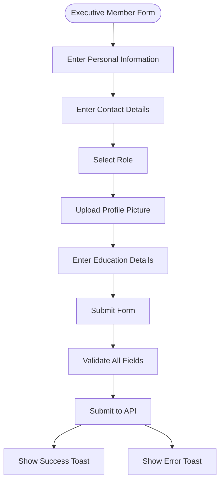

# Form Handling and Validation

<cite>
**Referenced Files in This Document**   
- [company-hub-form.tsx](file://src/components/company-hub/company-hub-form.tsx)
- [executive-member-form.tsx](file://src/components/executive-members/executive-member-form.tsx)
- [new-hire-plan-form.tsx](file://src/components/new-hire/new-hire-plan-form.tsx)
- [org-chart-form.tsx](file://src/components/org-chart/org-chart-form.tsx)
- [dropzone.tsx](file://src/components/ui/dropzone.tsx)
- [rich-text-editor.tsx](file://src/components/ui/rich-text-editor.tsx)
- [selectable-tags.tsx](file://src/components/ui/selectable-tags.tsx)
- [use-executive-members.ts](file://src/hooks/queries/use-executive-members.ts)
- [use-employees.ts](file://src/hooks/queries/use-employees.ts)
- [executive-members.ts](file://src/services/executive-members.ts)
- [employees.ts](file://src/services/employees.ts)
</cite>

## Table of Contents
1. [Introduction](#introduction)
2. [Form Architecture Overview](#form-architecture-overview)
3. [Core Form Components](#core-form-components)
4. [Complex Form Structures](#complex-form-structures)
5. [File Upload Handling](#file-upload-handling)
6. [Rich Text Input Implementation](#rich-text-input-implementation)
7. [Reusable Form Fields](#reusable-form-fields)
8. [Form Lifecycle Management](#form-lifecycle-management)
9. [Validation and Error Handling](#validation-and-error-handling)
10. [Accessibility and User Experience](#accessibility-and-user-experience)
11. [Best Practices for Form Development](#best-practices-for-form-development)

## Introduction
This document provides comprehensive documentation for the form handling architecture in the Cartwright King Admin ERP system. The system utilizes React Hook Form principles with Zod validation patterns to manage complex form interactions across various administrative modules. The documentation covers the implementation of forms for company hub content, executive members, new hire plans, and organizational charts, detailing the integration between UI components, validation logic, and API interactions.

## Form Architecture Overview

**Diagram sources**
- [executive-member-form.tsx](file://src/components/executive-members/executive-member-form.tsx#L25-L266)
- [org-chart-form.tsx](file://src/components/org-chart/org-chart-form.tsx#L26-L253)

**Section sources**
- [executive-member-form.tsx](file://src/components/executive-members/executive-member-form.tsx#L25-L266)
- [org-chart-form.tsx](file://src/components/org-chart/org-chart-form.tsx#L26-L253)

## Core Form Components

The form architecture is built around reusable component patterns that maintain consistency across the application. Each form follows a similar structure with localized state management and standardized submission patterns.

### Form State Management
Forms utilize React's useState and useEffect hooks to manage local state, with initialization from props or API data. The state is synchronized with form inputs through controlled components, ensuring a single source of truth.

### Submission Handling
Form submission is handled through native HTML form submission with preventDefault, allowing integration with React Query mutations for API communication. Success and error states are managed through toast notifications.

**Section sources**
- [executive-member-form.tsx](file://src/components/executive-members/executive-member-form.tsx#L25-L266)
- [org-chart-form.tsx](file://src/components/org-chart/org-chart-form.tsx#L26-L253)

## Complex Form Structures

### Company Hub Form
The company hub form manages announcements and policies with multiple content types and access controls.

**Diagram sources**
- [company-hub-form.tsx](file://src/components/company-hub/company-hub-form.tsx#L18-L144)

**Section sources**
- [company-hub-form.tsx](file://src/components/company-hub/company-hub-form.tsx#L18-L144)

### Executive Member Form
The executive member form handles comprehensive profile information with file upload capabilities.

**Diagram sources**
- [executive-member-form.tsx](file://src/components/executive-members/executive-member-form.tsx#L25-L266)

**Section sources**
- [executive-member-form.tsx](file://src/components/executive-members/executive-member-form.tsx#L25-L266)

## File Upload Handling

### Dropzone Component
The Dropzone component provides a consistent interface for file uploads across forms, supporting drag-and-drop and click-to-upload interactions.

**Diagram sources**
- [dropzone.tsx](file://src/components/ui/dropzone.tsx#L22-L256)

**Section sources**
- [dropzone.tsx](file://src/components/ui/dropzone.tsx#L22-L256)

### File Upload Lifecycle
The file upload process follows a standardized pattern across forms, with special handling for profile picture updates and removals.

**Diagram sources**
- [executive-members.ts](file://src/services/executive-members.ts#L56-L141)
- [employees.ts](file://src/services/employees.ts#L41-L113)

**Section sources**
- [executive-members.ts](file://src/services/executive-members.ts#L56-L141)
- [employees.ts](file://src/services/employees.ts#L41-L113)

## Rich Text Input Implementation

### Rich Text Editor
The RichTextEditor component provides a WYSIWYG interface for content creation with formatting options.

**Diagram sources**
- [rich-text-editor.tsx](file://src/components/ui/rich-text-editor.tsx#L49-L573)

**Section sources**
- [rich-text-editor.tsx](file://src/components/ui/rich-text-editor.tsx#L49-L573)

## Reusable Form Fields

### Selectable Tags Component
The SelectableTags component provides a consistent interface for multi-select functionality across forms.

**Diagram sources**
- [selectable-tags.tsx](file://src/components/ui/selectable-tags.tsx#L40-L184)

**Section sources**
- [selectable-tags.tsx](file://src/components/ui/selectable-tags.tsx#L40-L184)

## Form Lifecycle Management

### Form Initialization
Forms are initialized with optional initial data, which populates the form fields when editing existing records.

**Section sources**
- [company-hub-form.tsx](file://src/components/company-hub/company-hub-form.tsx#L18-L144)
- [executive-member-form.tsx](file://src/components/executive-members/executive-member-form.tsx#L25-L266)

### Form Submission
The form submission process follows a consistent pattern across all forms, with validation and API integration.

**Diagram sources**
- [executive-member-form.tsx](file://src/components/executive-members/executive-member-form.tsx#L25-L266)
- [org-chart-form.tsx](file://src/components/org-chart/org-chart-form.tsx#L26-L253)

**Section sources**
- [executive-member-form.tsx](file://src/components/executive-members/executive-member-form.tsx#L25-L266)
- [org-chart-form.tsx](file://src/components/org-chart/org-chart-form.tsx#L26-L253)

## Validation and Error Handling

### Client-Side Validation
Forms implement client-side validation through required attributes and manual checks before submission.

**Section sources**
- [executive-member-form.tsx](file://src/components/executive-members/executive-member-form.tsx#L25-L266)
- [org-chart-form.tsx](file://src/components/org-chart/org-chart-form.tsx#L26-L253)

### Error Response Handling
The system parses API error responses and displays them as toast notifications.

**Section sources**
- [executive-member-form.tsx](file://src/components/executive-members/executive-member-form.tsx#L25-L266)
- [org-chart-form.tsx](file://src/components/org-chart/org-chart-form.tsx#L26-L253)

## Accessibility and User Experience

### Loading States
Forms manage loading states through React Query mutations, disabling submission during processing.

**Section sources**
- [executive-member-form.tsx](file://src/components/executive-members/executive-member-form.tsx#L25-L266)
- [org-chart-form.tsx](file://src/components/org-chart/org-chart-form.tsx#L26-L253)

### Feedback Mechanisms
The system provides immediate feedback through toast notifications for both success and error states.

**Section sources**
- [executive-member-form.tsx](file://src/components/executive-members/executive-member-form.tsx#L25-L266)
- [org-chart-form.tsx](file://src/components/org-chart/org-chart-form.tsx#L26-L253)

## Best Practices for Form Development

### Creating New Forms
When creating new forms, follow the established patterns for consistency:

1. Use the same form structure with controlled components
2. Implement consistent error handling with toast notifications
3. Follow the same file upload patterns with Dropzone
4. Use RichTextEditor for multi-line content fields
5. Utilize SelectableTags for multi-select functionality

### Extending Validation Schemas
To extend validation schemas, consider the following approaches:

1. Add new fields to the form state and UI components
2. Update the payload construction to include new data
3. Ensure server-side validation supports the new fields
4. Update error handling to display messages for new fields
5. Test both client and server validation scenarios

**Section sources**
- [executive-member-form.tsx](file://src/components/executive-members/executive-member-form.tsx#L25-L266)
- [org-chart-form.tsx](file://src/components/org-chart/org-chart-form.tsx#L26-L253)
- [company-hub-form.tsx](file://src/components/company-hub/company-hub-form.tsx#L18-L144)