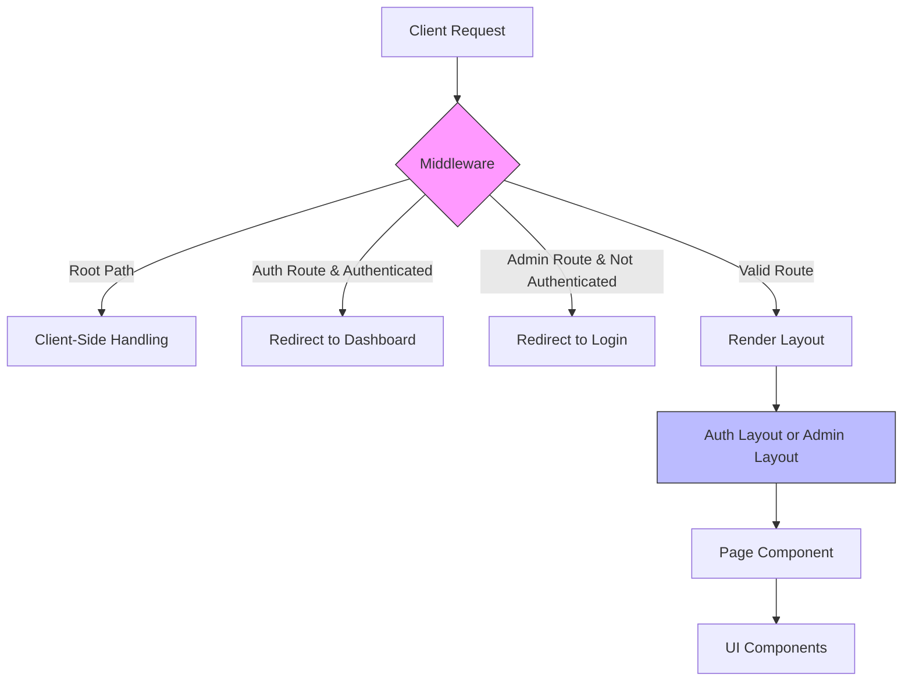
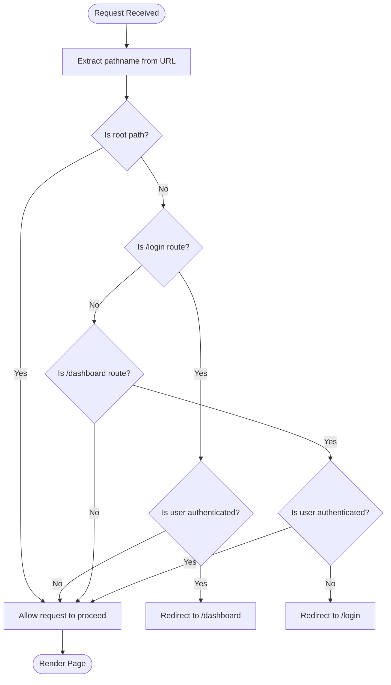
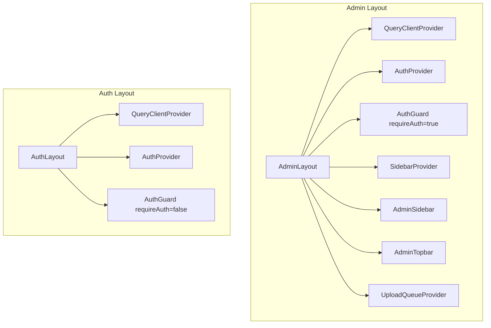
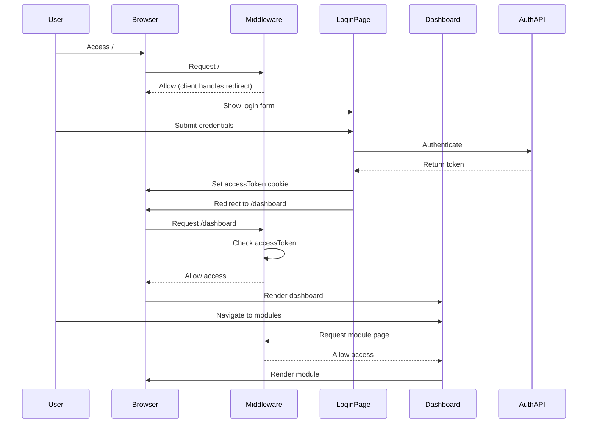
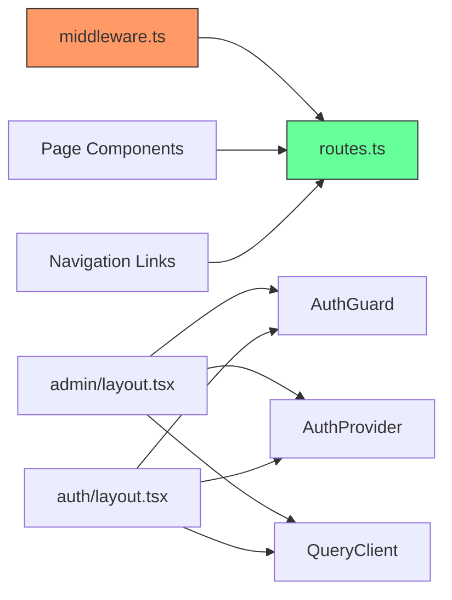

# Routing and Navigation System

<cite>
**Referenced Files in This Document**   
- [middleware.ts](file://src/middleware.ts)
- [routes.ts](file://src/constants/routes.ts)
- [layout.tsx](file://src/app/layout.tsx)
- [auth/layout.tsx](file://src/app/(auth)/layout.tsx)
- [admin/layout.tsx](file://src/app/(admin)/layout.tsx)
</cite>

## Table of Contents
1. [Introduction](#introduction)
2. [Project Structure](#project-structure)
3. [Core Components](#core-components)
4. [Architecture Overview](#architecture-overview)
5. [Detailed Component Analysis](#detailed-component-analysis)
6. [Dependency Analysis](#dependency-analysis)
7. [Performance Considerations](#performance-considerations)
8. [Troubleshooting Guide](#troubleshooting-guide)
9. [Conclusion](#conclusion)

## Introduction
This document provides comprehensive architectural documentation for the routing and navigation system of the Cartwright King Admin ERP application, built using Next.js 15 App Router. It details the file-based routing structure, authentication flow, layout segmentation, and navigation patterns across public and private routes. The system leverages route groups, dynamic segments, middleware-based authentication guards, and centralized route configuration to ensure secure, scalable, and maintainable navigation.

## Project Structure

The application uses a feature-driven file structure under the `src/app` directory, with route groups encapsulating logical sections of the app. Route groups `(admin)` and `(auth)` are used to organize admin dashboard and authentication routes respectively, without affecting the URL structure.

```mermaid
graph TB
subgraph "App Router Structure"
A[src/app]
A --> B[(auth)]
A --> C[(admin)]
A --> D[page.tsx]
A --> E[layout.tsx]
B --> F[/login]
C --> G[/dashboard]
G --> H[company-hub]
G --> I[departments]
G --> J[executive-members]
G --> K[knowledge-base]
G --> L[new-hire-plan]
G --> M[org-chart]
G --> N[profile]
end
```

**Diagram sources**
- [app](file://src/app)
- [app/(auth)](file://src/app/(auth))
- [app/(admin)](file://src/app/(admin))

**Section sources**
- [app](file://src/app)

## Core Components

Key components of the routing system include:
- **File-based routing** with route groups and dynamic segments
- **Centralized route definitions** in `routes.ts`
- **Authentication middleware** for route protection
- **Nested layouts** for admin and auth sections
- **AuthGuard component** for client-side authorization
- **Layout components** providing UI scaffolding

These components work together to enforce access control, maintain UI consistency, and enable scalable navigation.

**Section sources**
- [routes.ts](file://src/constants/routes.ts#L1-L35)
- [middleware.ts](file://src/middleware.ts#L1-L46)
- [layout.tsx](file://src/app/layout.tsx#L1-L37)

## Architecture Overview

The routing architecture follows a layered approach with server-side middleware handling authentication decisions and client-side components managing layout rendering and state.



**Diagram sources**
- [middleware.ts](file://src/middleware.ts#L4-L32)
- [auth/layout.tsx](file://src/app/(auth)/layout.tsx#L7-L23)
- [admin/layout.tsx](file://src/app/(admin)/layout.tsx#L24-L49)

## Detailed Component Analysis

### Route Configuration and Management

The `routes.ts` file defines all application routes as constants, enabling type-safe and reusable route references across the codebase. This includes static routes and dynamic route generators that accept parameters like `id`.

```mermaid
classDiagram
class ROUTES {
+AUTH : { LOGIN : string }
+ADMIN : {
DASHBOARD : string
COMPANY_HUB : string
COMPANY_HUB_EDIT_ID(id : string) : string
DEPARTMENTS_ID(id : string) : string
EXECUTIVE_MEMBERS_ID(id : string) : string
ORG_CHART_PROFILE_ID(id : string) : string
}
}
note right of ROUTES
Centralized route definitions
Prevents hardcoded URLs
Enables type safety
end note
```

**Diagram sources**
- [routes.ts](file://src/constants/routes.ts#L1-L35)

**Section sources**
- [routes.ts](file://src/constants/routes.ts#L1-L35)

### Authentication Guard Logic

The middleware intercepts incoming requests to enforce authentication rules. It checks for an access token and redirects users based on their authentication state and the target route.



**Diagram sources**
- [middleware.ts](file://src/middleware.ts#L4-L32)

**Section sources**
- [middleware.ts](file://src/middleware.ts#L4-L32)

### Layout System and Route Grouping

Route groups `(admin)` and `(auth)` enable logical organization of routes without affecting URLs. Each group has its own layout that wraps all child pages with appropriate context providers and UI components.



**Diagram sources**
- [admin/layout.tsx](file://src/app/(admin)/layout.tsx#L24-L49)
- [auth/layout.tsx](file://src/app/(auth)/layout.tsx#L7-L23)

**Section sources**
- [admin/layout.tsx](file://src/app/(admin)/layout.tsx#L1-L52)
- [auth/layout.tsx](file://src/app/(auth)/layout.tsx#L1-L24)

### Navigation Flow

The navigation flow begins at the login page and progresses to the dashboard upon successful authentication. Users can navigate between dashboard modules using sidebar links or direct URLs.



**Diagram sources**
- [middleware.ts](file://src/middleware.ts#L4-L32)
- [auth/layout.tsx](file://src/app/(auth)/layout.tsx#L7-L23)

### Dynamic Routing and Segments

The system uses dynamic route segments extensively:
- `[id]` for entity-specific views (company, department, executive member)
- `[...slug]` for nested knowledge base paths
- Parameterized route functions in `routes.ts` for type-safe URL generation

This enables flexible content rendering based on URL parameters while maintaining clean, RESTful URLs.

**Section sources**
- [app/(admin)/dashboard/company-hub/[id]/page.tsx](file://src/app/(admin)/dashboard/company-hub/[id]/page.tsx)
- [app/(admin)/dashboard/knowledge-base/[...slug]/page.tsx](file://src/app/(admin)/dashboard/knowledge-base/[...slug]/page.tsx)
- [routes.ts](file://src/constants/routes.ts#L1-L35)

## Dependency Analysis

The routing system has well-defined dependencies between components:



**Diagram sources**
- [middleware.ts](file://src/middleware.ts#L1-L46)
- [routes.ts](file://src/constants/routes.ts#L1-L35)
- [admin/layout.tsx](file://src/app/(admin)/layout.tsx#L1-L52)
- [auth/layout.tsx](file://src/app/(auth)/layout.tsx#L1-L24)

**Section sources**
- [middleware.ts](file://src/middleware.ts#L1-L46)
- [routes.ts](file://src/constants/routes.ts#L1-L35)

## Performance Considerations

The routing system is optimized for performance through:
- **Middleware efficiency**: Lightweight checks that don't require database queries
- **Client-side routing**: Next.js Link components enable instant navigation without full page reloads
- **Layout caching**: Persistent layouts maintain state during navigation
- **Conditional devtools**: React Query devtools only loaded in development

Route transitions are smooth due to Next.js app router's built-in loading states and suspense integration.

## Troubleshooting Guide

Common routing issues and solutions:

**Issue**: User not redirected after login  
**Solution**: Verify `accessToken` is properly set in cookies and middleware can read it

**Issue**: Admin pages accessible without authentication  
**Solution**: Check middleware matcher configuration and ensure it covers all admin routes

**Issue**: Dynamic segments not resolving  
**Solution**: Verify file structure matches pattern (e.g., `[id]/page.tsx`) and parameter names are correct

**Issue**: Layout not rendering  
**Solution**: Ensure layout.tsx files are correctly placed in route group directories

**Issue**: Infinite redirect loop  
**Solution**: Check authentication state logic in middleware and AuthGuard component

**Section sources**
- [middleware.ts](file://src/middleware.ts#L4-L32)
- [auth/layout.tsx](file://src/app/(auth)/layout.tsx#L7-L23)
- [admin/layout.tsx](file://src/app/(admin)/layout.tsx#L24-L49)

## Conclusion

The routing and navigation system provides a robust foundation for the Cartwright King Admin ERP application. By leveraging Next.js 15 App Router features like route groups, dynamic segments, and middleware, the system achieves clean URL structures, secure authentication flows, and maintainable code organization. Centralized route definitions in `routes.ts` ensure consistency and prevent hardcoded URLs. The layout system provides appropriate UI scaffolding for different application sections while maintaining separation between public and private routes. This architecture supports scalable growth as new modules and features are added to the application.