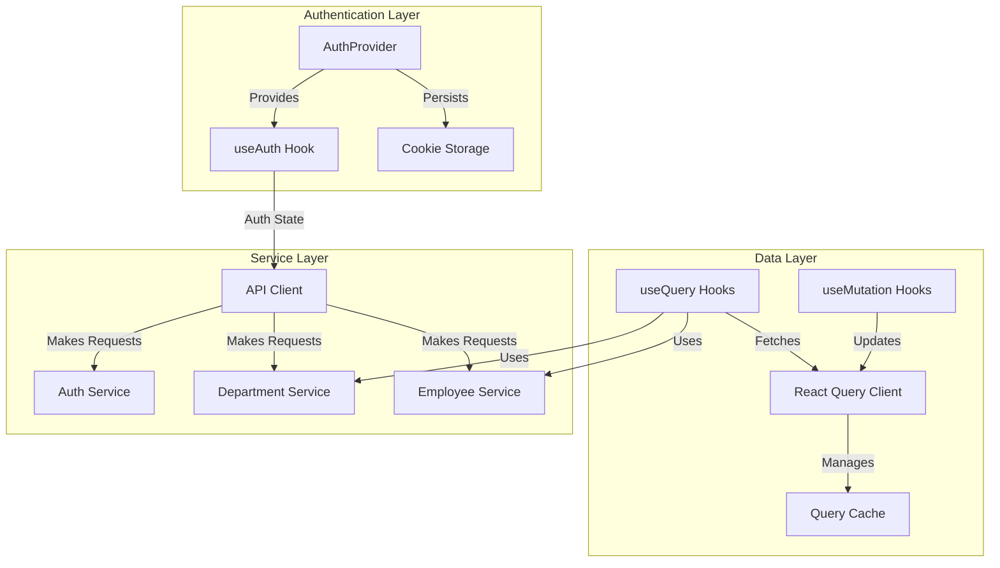
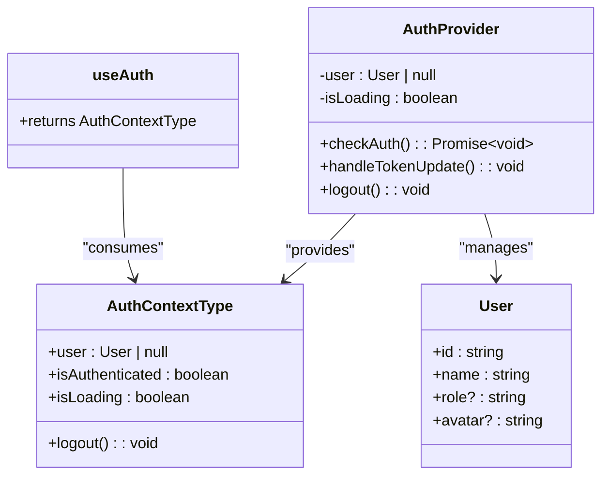
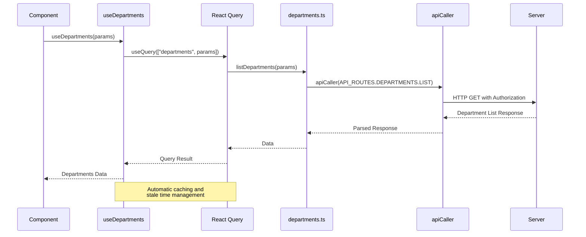

# State Management System

<cite>
**Referenced Files in This Document**   
- [auth-context.tsx](file://src/contexts/auth-context.tsx)
- [use-auth.ts](file://src/hooks/queries/use-auth.ts)
- [cookies.ts](file://src/lib/cookies.ts)
- [api.ts](file://src/lib/api.ts)
- [auth.ts](file://src/services/auth.ts)
- [use-departments.ts](file://src/hooks/queries/use-departments.ts)
- [use-employees.ts](file://src/hooks/queries/use-employees.ts)
- [departments.ts](file://src/services/departments.ts)
- [employees.ts](file://src/services/employees.ts)
- [auth-guard.tsx](file://src/components/auth/auth-guard.tsx)
- [login-form.tsx](file://src/components/auth/login-form.tsx)
- [layout.tsx](file://src/app/(admin)/layout.tsx)
- [page.tsx](file://src/app/(auth)/login/page.tsx)
</cite>

## Table of Contents
1. [Introduction](#introduction)
2. [Core State Management Architecture](#core-state-management-architecture)
3. [Authentication State with React Context](#authentication-state-with-react-context)
4. [Server State Management with React Query](#server-state-management-with-react-query)
5. [Integration Between Authentication and Data Fetching](#integration-between-authentication-and-data-fetching)
6. [State Transitions During Authentication Flow](#state-transitions-during-authentication-flow)
7. [Error Handling and Stale Data Management](#error-handling-and-stale-data-management)
8. [Best Practices for State Consumption](#best-practices-for-state-consumption)
9. [Conclusion](#conclusion)

## Introduction
The cartwrightking-admin-erp application implements a dual state management strategy combining React Context API for global authentication state and React Query for server state synchronization. This architecture ensures consistent user session management while providing efficient, cache-aware data fetching for enterprise resource planning entities such as departments, employees, and executive members. The system handles complex authentication flows including token refresh, persistence via cookies, and seamless integration with API requests.

## Core State Management Architecture

**Diagram sources**
- [auth-context.tsx](file://src/contexts/auth-context.tsx#L23-L122)
- [api.ts](file://src/lib/api.ts#L38-L50)
- [use-departments.ts](file://src/hooks/queries/use-departments.ts#L4-L13)
- [use-employees.ts](file://src/hooks/queries/use-employees.ts#L12-L18)

**Section sources**
- [auth-context.tsx](file://src/contexts/auth-context.tsx#L1-L131)
- [api.ts](file://src/lib/api.ts#L1-L149)
- [use-departments.ts](file://src/hooks/queries/use-departments.ts#L1-L54)
- [use-employees.ts](file://src/hooks/queries/use-employees.ts#L1-L88)

## Authentication State with React Context

The application utilizes React Context API to manage global authentication state through the `AuthProvider` component and `useAuth` hook. This context maintains user session data, authentication status, and loading state across the application. Authentication tokens are persisted using HTTP-only cookies via the `cookies.ts` utility functions, ensuring secure storage and automatic inclusion in API requests.

The `AuthProvider` initializes by checking for existing authentication tokens in cookies during component mount. If valid tokens are found, it verifies the access token and establishes the user session. The context also listens for storage events and custom authentication events to synchronize state across tabs and components. The `logout` function clears authentication cookies and redirects users to the login page.

**Diagram sources**
- [auth-context.tsx](file://src/contexts/auth-context.tsx#L14-L19)
- [auth-context.tsx](file://src/contexts/auth-context.tsx#L23-L122)
- [auth-context.tsx](file://src/contexts/auth-context.tsx#L124-L130)

**Section sources**
- [auth-context.tsx](file://src/contexts/auth-context.tsx#L1-L131)
- [cookies.ts](file://src/lib/cookies.ts#L30-L40)
- [auth-guard.tsx](file://src/components/auth/auth-guard.tsx#L7-L55)

## Server State Management with React Query

React Query serves as the primary solution for server state management, handling data synchronization for entities such as departments, employees, and executive members. Custom hooks in the `src/hooks/queries` directory abstract the complexity of data fetching, providing a clean interface for components to consume server state. These hooks leverage React Query's `useQuery` for data retrieval and `useMutation` for data modifications, with automatic caching, background refetching, and stale time management.

Each entity has dedicated query hooks that define query keys, fetch functions from service layer, and cache behavior. The `staleTime` is set to 60,000 milliseconds (1 minute) across all queries, balancing data freshness with performance. Mutation hooks automatically invalidate relevant queries upon successful operations, ensuring the UI reflects the latest server state without requiring full page reloads.

**Diagram sources**
- [use-departments.ts](file://src/hooks/queries/use-departments.ts#L4-L13)
- [departments.ts](file://src/services/departments.ts#L70-L93)
- [api-caller.ts](file://src/lib/api-caller.ts#L1-L83)

**