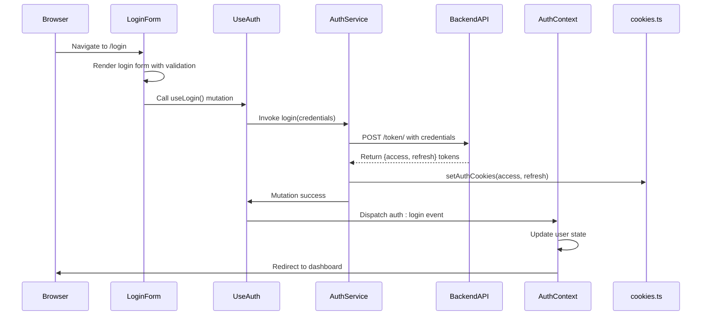
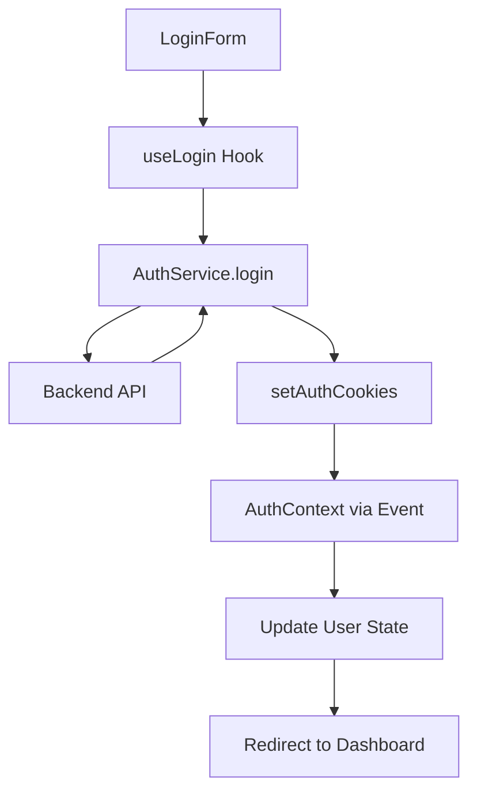
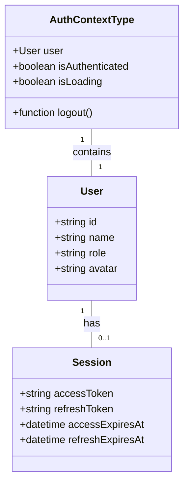
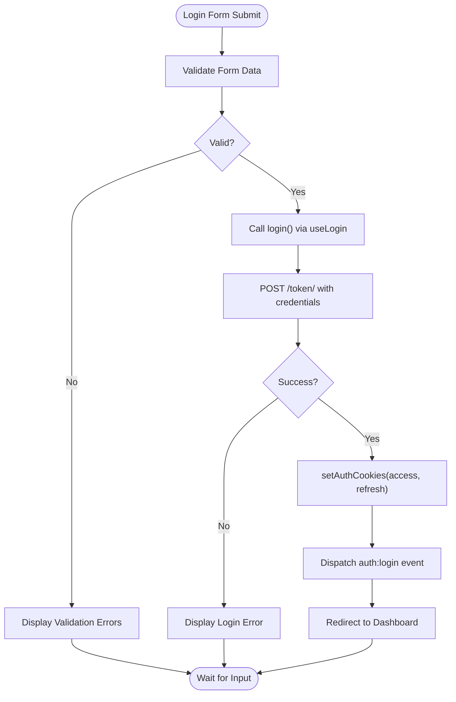
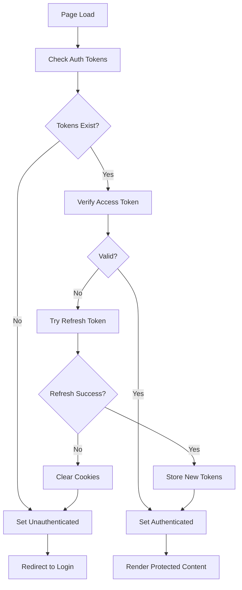

# Authentication System

<cite>
**Referenced Files in This Document**   
- [login-form.tsx](file://src/components/auth/login-form.tsx)
- [auth-context.tsx](file://src/contexts/auth-context.tsx)
- [use-auth.ts](file://src/hooks/queries/use-auth.ts)
- [auth.ts](file://src/services/auth.ts)
- [cookies.ts](file://src/lib/cookies.ts)
- [api-routes.ts](file://src/constants/api-routes.ts)
- [routes.ts](file://src/constants/routes.ts)
</cite>

## Table of Contents
1. [Introduction](#introduction)
2. [Authentication Flow Overview](#authentication-flow-overview)
3. [Core Components and Invocation Relationships](#core-components-and-invocation-relationships)
4. [Domain Model: User and Session](#domain-model-user-and-session)
5. [Login Implementation](#login-implementation)
6. [Token Refresh and Session Management](#token-refresh-and-session-management)
7. [Configuration Options](#configuration-options)
8. [Common Issues and Solutions](#common-issues-and-solutions)
9. [Debugging and Monitoring](#debugging-and-monitoring)
10. [Security Best Practices](#security-best-practices)

## Introduction
The Authentication System in the CartwrightKing Admin ERP application implements a secure, cookie-based JWT authentication mechanism. It supports login, token refresh, and session management workflows using React Query for data fetching, React Hook Form with Zod for validation, and context-based state management. This document details the implementation, integration points, and operational behavior of the authentication sub-system, providing both beginner-friendly explanations and technical depth for advanced developers.

## Authentication Flow Overview
The authentication system follows a client-side, cookie-based JWT pattern where tokens are stored in HTTP-only cookies for enhanced security. Upon successful login, access and refresh tokens are issued and stored via cookies. The system automatically handles token verification on page load and attempts silent refresh when access tokens expire. All authenticated API requests include the access token automatically through axios interceptors.

**Diagram sources**
- [login-form.tsx](file://src/components/auth/login-form.tsx)
- [use-auth.ts](file://src/hooks/queries/use-auth.ts)
- [auth.ts](file://src/services/auth.ts)
- [cookies.ts](file://src/lib/cookies.ts)
- [auth-context.tsx](file://src/contexts/auth-context.tsx)

**Section sources**
- [login-form.tsx](file://src/components/auth/login-form.tsx)
- [auth-context.tsx](file://src/contexts/auth-context.tsx)
- [use-auth.ts](file://src/hooks/queries/use-auth.ts)

## Core Components and Invocation Relationships
The authentication system is composed of several interconnected components that work together to manage user sessions:

- **LoginForm**: UI component that collects credentials and triggers authentication
- **useLogin**: React Query mutation hook that handles login logic
- **AuthContext**: React context that maintains authentication state
- **AuthService**: Service layer that communicates with backend endpoints
- **Cookie Utilities**: Functions that manage token persistence

These components form a unidirectional data flow from UI interaction to state update.

**Diagram sources**
- [login-form.tsx](file://src/components/auth/login-form.tsx)
- [use-auth.ts](file://src/hooks/queries/use-auth.ts)
- [auth.ts](file://src/services/auth.ts)
- [cookies.ts](file://src/lib/cookies.ts)
- [auth-context.tsx](file://src/contexts/auth-context.tsx)

**Section sources**
- [login-form.tsx](file://src/components/auth/login-form.tsx)
- [use-auth.ts](file://src/hooks/queries/use-auth.ts)
- [auth.ts](file://src/services/auth.ts)

## Domain Model: User and Session
The authentication system defines a simple domain model for user and session management.

### User Model
The User interface represents the authenticated user with minimal attributes:
- `id`: Unique identifier
- `name`: Display name
- `role`: User role/permissions
- `avatar`: Profile image URL (optional)

Currently, user details are hardcoded in the context for demonstration purposes.

### Session Model
Sessions are managed through JWT tokens stored in cookies:
- **Access Token**: Short-lived token for API authorization
- **Refresh Token**: Long-lived token for obtaining new access tokens
- **Storage**: Both tokens stored in SameSite=Lax cookies
- **Expiration**: Handled by backend token policies

**Diagram sources**
- [auth-context.tsx](file://src/contexts/auth-context.tsx)
- [services/auth.ts](file://src/services/auth.ts)

**Section sources**
- [auth-context.tsx](file://src/contexts/auth-context.tsx)
- [services/auth.ts](file://src/services/auth.ts)

## Login Implementation
The login process integrates form validation, API communication, and state management through a cohesive workflow.

### Form Validation
The LoginForm uses React Hook Form with Zod schema validation to ensure input integrity:
- Username: Required field
- Password: Minimum 6 characters
- Real-time error feedback via UI components

### API Integration
The login request is processed through:
1. useLogin mutation from React Query
2. AuthService.login function
3. apiCaller utility with axios interceptor
4. Backend token endpoint

Upon success, tokens are immediately stored in cookies and the user is redirected.

**Diagram sources**
- [login-form.tsx](file://src/components/auth/login-form.tsx)
- [use-auth.ts](file://src/hooks/queries/use-auth.ts)
- [auth.ts](file://src/services/auth.ts)
- [cookies.ts](file://src/lib/cookies.ts)

**Section sources**
- [login-form.tsx](file://src/components/auth/login-form.tsx)
- [use-auth.ts](file://src/hooks/queries/use-auth.ts)
- [auth.ts](file://src/services/auth.ts)

## Token Refresh and Session Management
The system implements automatic token refresh and session persistence through several mechanisms.

### Initial Authentication Check
On application load, the AuthProvider checks for existing tokens:
1. Retrieve tokens from cookies
2. Verify access token validity
3. If invalid, attempt refresh using refresh token
4. Update user state accordingly

### Token Refresh Process
When an access token expires:
1. Verification request fails with 401
2. System attempts refresh with stored refresh token
3. New access token is obtained and stored
4. Original request is retried (not implemented in current code)

### Session Events
The system listens for authentication events:
- `storage`: Browser storage changes
- `auth:login`: Successful login notification
- `auth:logout`: Logout notification

**Diagram sources**
- [auth-context.tsx](file://src/contexts/auth-context.tsx)
- [auth.ts](file://src/services/auth.ts)
- [cookies.ts](file://src/lib/cookies.ts)

**Section sources**
- [auth-context.tsx](file://src/contexts/auth-context.tsx)
- [auth.ts](file://src/services/auth.ts)

## Configuration Options
The authentication system includes configurable parameters through constants files.

### Route Configuration
Defined in `routes.ts`:
- Login page: `/login`
- Dashboard redirect: `/dashboard`
- Various admin section routes

### API Endpoint Configuration
Defined in `api-routes.ts`:
- Token obtain: `/token/`
- Token refresh: `/token/refresh/`
- Token verify: `/token/verify/`

These configurations allow centralized management of authentication endpoints and navigation paths.

**Section sources**
- [routes.ts](file://src/constants/routes.ts)
- [api-routes.ts](file://src/constants/api-routes.ts)

## Common Issues and Solutions
This section addresses frequent authentication-related problems and their resolutions.

### Expired Sessions
**Issue**: User is unexpectedly logged out  
**Solution**: