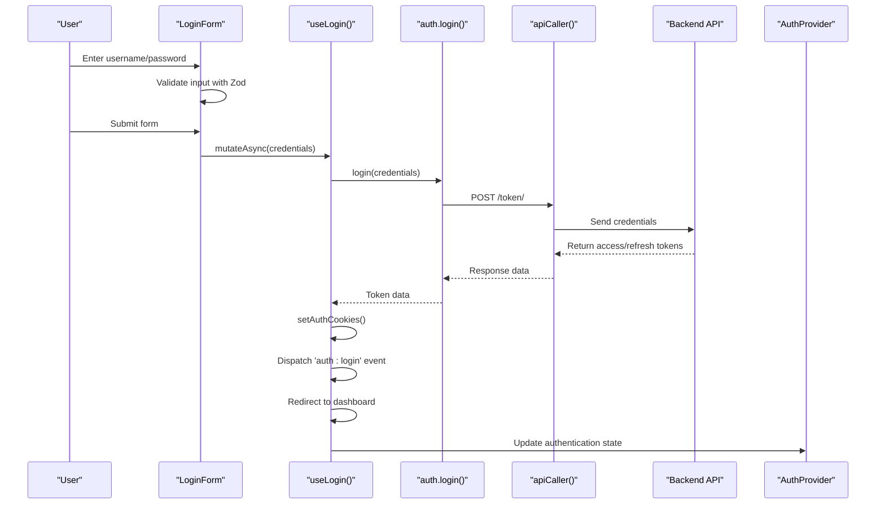
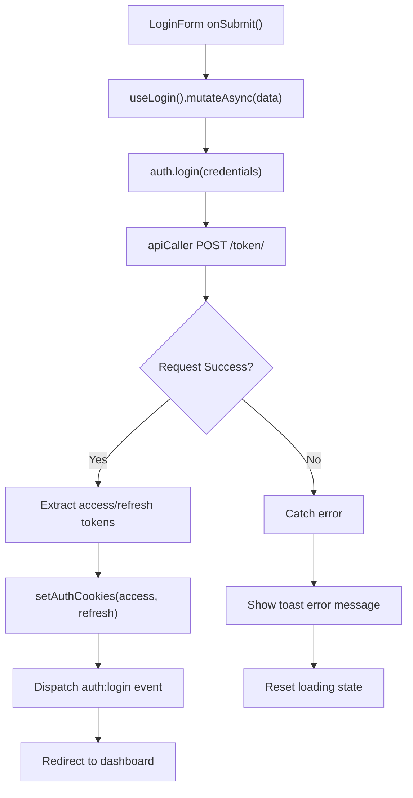
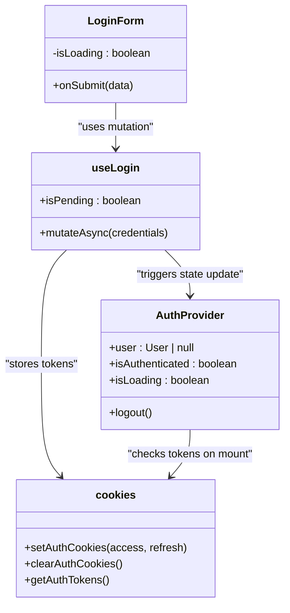

# Login System

<cite>
**Referenced Files in This Document**   
- [login-form.tsx](file://src/components/auth/login-form.tsx)
- [use-auth.ts](file://src/hooks/queries/use-auth.ts)
- [auth.ts](file://src/services/auth.ts)
- [api-caller.ts](file://src/lib/api-caller.ts)
- [cookies.ts](file://src/lib/cookies.ts)
- [auth-context.tsx](file://src/contexts/auth-context.tsx)
- [routes.ts](file://src/constants/routes.ts)
- [api-routes.ts](file://src/constants/api-routes.ts)
</cite>

## Table of Contents
1. [Introduction](#introduction)
2. [Login Flow Overview](#login-flow-overview)
3. [Form Implementation and Validation](#form-implementation-and-validation)
4. [Authentication Service and Request Handling](#authentication-service-and-request-handling)
5. [State Management and Error Handling](#state-management-and-error-handling)
6. [Session Initialization and Redirect Logic](#session-initialization-and-redirect-logic)
7. [Security Considerations](#security-considerations)
8. [Common Issues and UX Improvements](#common-issues-and-ux-improvements)
9. [Best Practices for Securing Login Forms](#best-practices-for-securing-login-forms)
10. [Conclusion](#conclusion)

## Introduction
The Login System is a critical sub-feature of the CartwrightKing Admin ERP application, responsible for authenticating users and establishing secure sessions. This document provides a comprehensive analysis of the login implementation, covering the frontend form, validation logic, authentication service integration, state management, and security mechanisms. The system leverages modern React patterns including React Hook Form, Zod for schema validation, and cookie-based authentication to ensure a secure and user-friendly experience.

**Section sources**
- [login-form.tsx](file://src/components/auth/login-form.tsx#L1-L102)
- [auth-context.tsx](file://src/contexts/auth-context.tsx#L1-L131)

## Login Flow Overview
The login process begins at the `/login` route, which renders the `LoginForm` component. Upon submission, user credentials are validated, securely transmitted to the backend via an authenticated API call, and processed to establish a session. Successful authentication triggers token storage, session initialization through the global auth context, and a redirect to the admin dashboard. The flow is designed to be resilient to network failures and provides immediate feedback for invalid credentials or system errors.

**Diagram sources**
- [login-form.tsx](file://src/components/auth/login-form.tsx#L22-L101)
- [use-auth.ts](file://src/hooks/queries/use-auth.ts#L6-L31)
- [auth.ts](file://src/services/auth.ts#L12-L18)

## Form Implementation and Validation
The login form is implemented using React Hook Form for efficient state management and Zod for robust schema validation. The `loginSchema` enforces minimum requirements: a non-empty username and a password of at least six characters. The form integrates with UI components from the design system, including Input, Label, and Button, ensuring consistency across the application. Visual feedback is provided through error styling and toast notifications.

**Section sources**
- [login-form.tsx](file://src/components/auth/login-form.tsx#L10-L20)
- [login-form.tsx](file://src/components/auth/login-form.tsx#L40-L65)

## Authentication Service and Request Handling
The authentication service uses `apiCaller` to securely transmit credentials to the backend's token endpoint. The request payload is structured as a JSON object containing username and password fields, sent via POST to `/token/`. The `apiCaller` utility ensures proper content-type headers and handles Axios configuration. Upon successful authentication, the backend returns access and refresh tokens, which are immediately stored in HTTP-only cookies for enhanced security.

**Diagram sources**
- [auth.ts](file://src/services/auth.ts#L12-L18)
- [api-caller.ts](file://src/lib/api-caller.ts#L1-L83)
- [cookies.ts](file://src/lib/cookies.ts#L25-L30)

## State Management and Error Handling
The login process employs React's useState hook to manage loading states and prevent duplicate submissions. The `useLogin` mutation from React Query handles the asynchronous login operation, providing built-in loading and error states. Errors are gracefully handled by extracting backend error messages (e.g., "Invalid credentials") and displaying them via toast notifications. Network failures and server errors are caught and presented with user-friendly messages.

**Section sources**
- [login-form.tsx](file://src/components/auth/login-form.tsx#L24-L42)
- [use-auth.ts](file://src/hooks/queries/use-auth.ts#L6-L31)

## Session Initialization and Redirect Logic
Upon successful login, the system initializes the user session by storing authentication tokens in cookies and dispatching a custom 'auth:login' event. The `AuthProvider` listens for this event and updates the global authentication state accordingly. The implementation forces a full page redirect to the admin dashboard using `window.location.href`, ensuring that the new authentication state is properly recognized by all components and preventing potential state synchronization issues.

**Diagram sources**
- [use-auth.ts](file://src/hooks/queries/use-auth.ts#L6-L31)
- [auth-context.tsx](file://src/contexts/auth-context.tsx#L1-L131)
- [cookies.ts](file://src/lib/cookies.ts#L25-L37)

## Security Considerations
The login system implements multiple security measures: credentials are transmitted over HTTPS via secure POST requests, authentication tokens are stored in HTTP-only cookies to prevent XSS attacks, and the system supports token refresh for maintaining secure sessions. The backend enforces rate limiting to prevent brute force attacks, though this is not explicitly configured in the current client implementation. Input validation occurs both client-side (Zod) and server-side for defense in depth.

**Section sources**
- [auth.ts](file://src/services/auth.ts#L12-L18)
- [cookies.ts](file://src/lib/cookies.ts#L1-L41)
- [api-caller.ts](file://src/lib/api-caller.ts#L1-L83)

## Common Issues and UX Improvements
Common issues include incorrect password handling, network connectivity problems, and session expiration. The system addresses these through clear error messaging, loading states during submission, and automatic token refresh mechanisms. For improved accessibility, the form includes proper labeling, keyboard navigation support, and visual indicators for input validation. Future enhancements could include password visibility toggles, remember-me functionality, and multi-factor authentication support.

**Section sources**
- [login-form.tsx](file://src/components/auth/login-form.tsx#L67-L101)
- [auth-context.tsx](file://src/contexts/auth-context.tsx#L30-L80)

## Best Practices for Securing Login Forms
This implementation follows several security best practices: using HTTPS for all authentication requests, storing tokens in HTTP-only cookies, implementing proper input validation, and providing meaningful error messages without revealing sensitive information. Additional recommended practices include implementing CSRF protection (though mitigated by cookie usage), enforcing strong password policies, monitoring for suspicious login attempts, and providing secure password recovery options. The separation of authentication logic into dedicated services and hooks enhances maintainability and security auditing.

**Section sources**
- [auth.ts](file://src/services/auth.ts#L12-L46)
- [cookies.ts](file://src/lib/cookies.ts#L25-L37)
- [use-auth.ts](file://src/hooks/queries/use-auth.ts#L6-L31)

## Conclusion
The Login System in the CartwrightKing Admin ERP application provides a secure