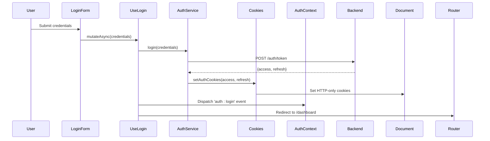
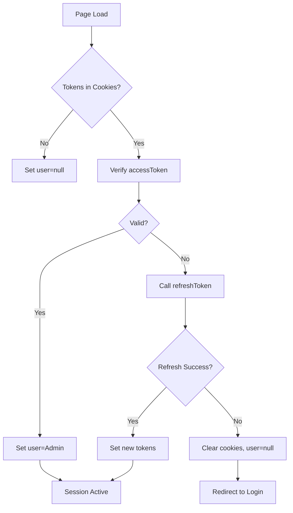
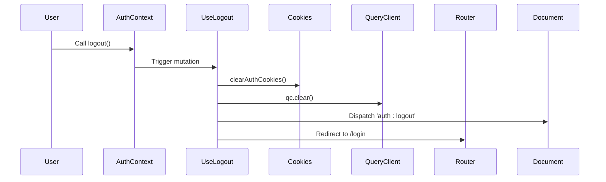
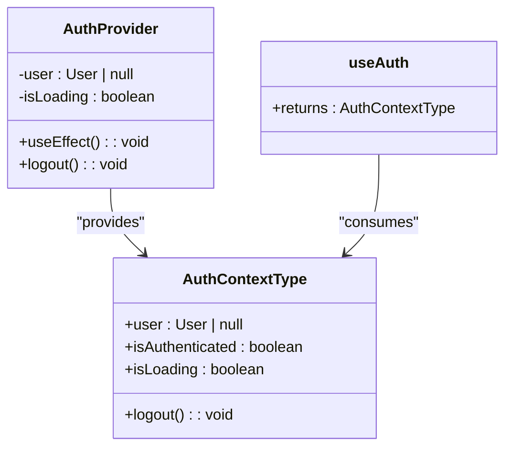
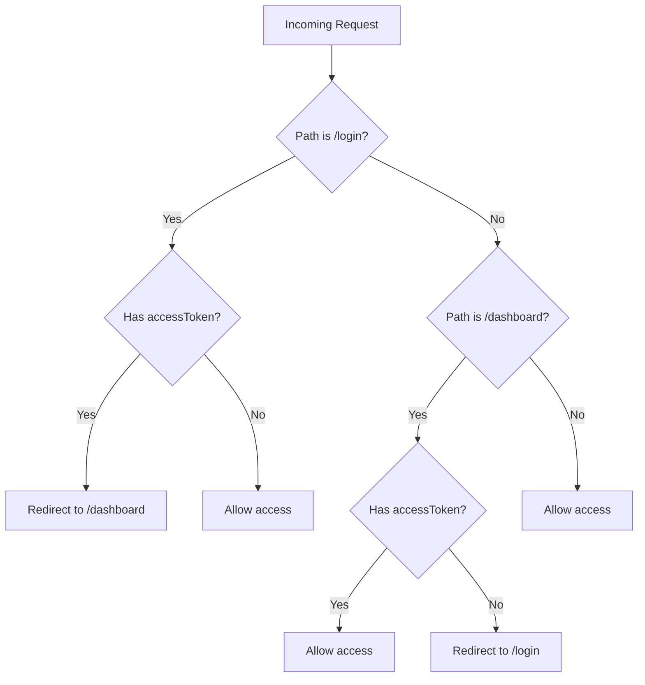

# Session Management

<cite>
**Referenced Files in This Document**   
- [auth-context.tsx](file://src/contexts/auth-context.tsx)
- [cookies.ts](file://src/lib/cookies.ts)
- [auth.ts](file://src/services/auth.ts)
- [middleware.ts](file://src/middleware.ts)
- [login-form.tsx](file://src/components/auth/login-form.tsx)
- [use-auth.ts](file://src/hooks/queries/use-auth.ts)
- [auth-guard.tsx](file://src/components/auth/auth-guard.tsx)
- [routes.ts](file://src/constants/routes.ts)
</cite>

## Table of Contents
1. [Introduction](#introduction)
2. [Session Establishment](#session-establishment)
3. [Session Maintenance](#session-maintenance)
4. [Session Termination](#session-termination)
5. [AuthContext and State Management](#authcontext-and-state-management)
6. [Server-Side Route Protection](#server-side-route-protection)
7. [Security Considerations](#security-considerations)
8. [Troubleshooting Common Issues](#troubleshooting-common-issues)
9. [Conclusion](#conclusion)

## Introduction
This document details the session management system in the Cartwright King admin ERP application. The system implements a secure, cookie-based JWT authentication flow to manage user sessions across the application. It covers the full lifecycle of a session—from login and persistence to logout and server-side validation—using a combination of client-side React context, server middleware, and secure cookie handling. The architecture emphasizes security, reliability, and seamless user experience, including automatic token refresh and cache invalidation.

## Session Establishment
User sessions are initiated through a credential-based login process. When a user submits their username and password via the login form, the `useLogin` mutation is triggered, which calls the `login` service function. This function sends credentials to the backend, receives a JWT access and refresh token pair, and stores them in HTTP-only cookies using the `setAuthCookies` utility. Upon successful authentication, the React Query client invalidates all cached data, ensuring fresh state on subsequent requests, and redirects the user to the dashboard.

**Diagram sources**
- [login-form.tsx](file://src/components/auth/login-form.tsx#L45-L75)
- [use-auth.ts](file://src/hooks/queries/use-auth.ts#L5-L35)
- [auth.ts](file://src/services/auth.ts#L10-L18)
- [cookies.ts](file://src/lib/cookies.ts#L25-L28)

**Section sources**
- [login-form.tsx](file://src/components/auth/login-form.tsx#L1-L103)
- [use-auth.ts](file://src/hooks/queries/use-auth.ts#L5-L35)

## Session Maintenance
Once established, sessions are maintained through client-side context and periodic token validation. The `AuthProvider` component checks for existing tokens on mount by reading `accessToken` and `refreshToken` from cookies. If tokens exist, it attempts to verify the access token via the `verifyToken` API. If verification fails, it automatically attempts to refresh the token using the refresh token. This process ensures uninterrupted user sessions even as access tokens expire.

The `AuthContext` listens for storage and custom events (`auth:login`, `auth:logout`) to synchronize session state across tabs and components. This event-driven approach ensures that session updates are propagated immediately throughout the application.

**Diagram sources**
- [auth-context.tsx](file://src/contexts/auth-context.tsx#L40-L95)
- [auth.ts](file://src/services/auth.ts#L25-L40)
- [cookies.ts](file://src/lib/cookies.ts#L35-L40)

**Section sources**
- [auth-context.tsx](file://src/contexts/auth-context.tsx#L25-L100)
- [auth.ts](file://src/services/auth.ts#L20-L40)

## Session Termination
Session termination is handled both client-side and logically on the server. The `logout` function, accessible via the `useAuth` hook, clears authentication cookies using `clearAuthCookies` and resets the user state in context. It then dispatches an `auth:logout` event to notify all listening components and redirects the user to the login page.

The `useLogout` mutation ensures cache invalidation by calling `queryClient.clear()`, removing all cached data to prevent unauthorized access to stale information. Even if the backend logout fails (currently a no-op), the client enforces logout by clearing local state, adhering to a secure fail-open principle.

**Diagram sources**
- [auth-context.tsx](file://src/contexts/auth-context.tsx#L110-L120)
- [use-auth.ts](file://src/hooks/queries/use-auth.ts#L40-L75)
- [cookies.ts](file://src/lib/cookies.ts#L30-L33)

**Section sources**
- [auth-context.tsx](file://src/contexts/auth-context.tsx#L110-L120)
- [use-auth.ts](file://src/hooks/queries/use-auth.ts#L40-L75)

## AuthContext and State Management
The `AuthContext` serves as the central state management mechanism for session data. It provides a `useAuth` hook that grants components access to the current user, authentication status, loading state, and logout function. The context initializes by checking for valid tokens and verifying session integrity on mount.

It uses `useEffect` to listen for `storage` and custom `auth:login`/`auth:logout` events, enabling real-time synchronization of authentication state across components. This design ensures that UI elements like navigation menus and profile dropdowns update immediately upon login or logout, even if the action originated in another tab or component.

**Diagram sources**
- [auth-context.tsx](file://src/contexts/auth-context.tsx#L15-L20)
- [auth-context.tsx](file://src/contexts/auth-context.tsx#L25-L120)

**Section sources**
- [auth-context.tsx](file://src/contexts/auth-context.tsx#L1-L131)

## Server-Side Route Protection
Route protection is enforced via Next.js middleware. The `middleware.ts` file intercepts all incoming requests and checks for the presence of an `accessToken` in cookies or the `Authorization` header. It uses the `ROUTES` constant to determine whether the requested path is an authentication page or protected admin route.

If an authenticated user attempts to access the login page, they are redirected to the dashboard. Conversely, unauthenticated users attempting to access admin routes are redirected to the login page. This server-side guard prevents unauthorized access even if client-side state is compromised.

**Diagram sources**
- [middleware.ts](file://src/middleware.ts#L10-L45)
- [routes.ts](file://src/constants/routes.ts#L2-L35)

**Section sources**
- [middleware.ts](file://src/middleware.ts#L1-L47)

## Security Considerations
The session management system incorporates several security best practices:
- **HTTP-only cookies**: Tokens are stored in HTTP-only cookies, preventing access via JavaScript and mitigating XSS risks.
- **Secure flag**: Although not explicitly shown, cookies should be served over HTTPS with the Secure flag in production.
- **SameSite=Lax**: Cookies are set with `SameSite=Lax` to protect against CSRF attacks while allowing safe cross-site navigation.
- **Token validation**: All API requests are validated server-side via the `verifyToken` endpoint, ensuring only valid sessions can access protected resources.
- **Automatic refresh**: The refresh mechanism reduces the window of exposure for stolen access tokens by keeping them short-lived.

The system avoids storing tokens in localStorage or sessionStorage, which are more vulnerable to XSS attacks. Instead, it relies on the browser's cookie security model and server-side validation to maintain session integrity.

**Section sources**
- [cookies.ts](file://src/lib/cookies.ts#L1-L41)
- [auth.ts](file://src/services/auth.ts#L25-L40)
- [middleware.ts](file://src/middleware.ts#L20-L25)

## Troubleshooting Common Issues
### Persistent Login After Logout
If a user remains logged in after logout, verify that `clearAuthCookies()` is being called and that the `accessToken` and `refreshToken` cookies are removed from the browser. Check for JavaScript errors that might prevent the logout function from executing fully.

### Unexpected Session Drops
Unexpected session expiration may indicate token refresh failure. Ensure the `refreshToken` API is functioning and that the refresh token is valid. Check browser console logs for `Token refresh failed` messages.

### Redirect Loops
Redirect loops between login and dashboard may occur if the middleware incorrectly detects authentication status. Verify that the `accessToken` cookie is being set correctly with the proper path and domain. Ensure the `ROUTES` constants match the actual application paths.

### Multiple Tab Sync Issues
If session state is not synchronized across tabs, confirm that the `storage` event listener in `AuthProvider` is active. Note that `localStorage` events do not fire on the same tab that made the change, but custom events (`auth:login`, `auth:logout`) ensure cross-component updates.

**Section sources**
- [auth-context.tsx](file://src/contexts/auth-context.tsx#L80-L90)
- [use-auth.ts](file://src/hooks/queries/use-auth.ts#L60-L75)
- [cookies.ts](file://src/lib/cookies.ts#L30-L33)

## Conclusion
The session management system in the Cartwright King ERP application provides a robust, secure, and user-friendly authentication experience. By combining cookie-based JWT storage, client-side context management, server-side route protection, and React Query integration, it ensures reliable session handling across all application states. The architecture prioritizes security through HTTP-only cookies and token validation while maintaining a seamless user experience with automatic refresh and real-time state synchronization.