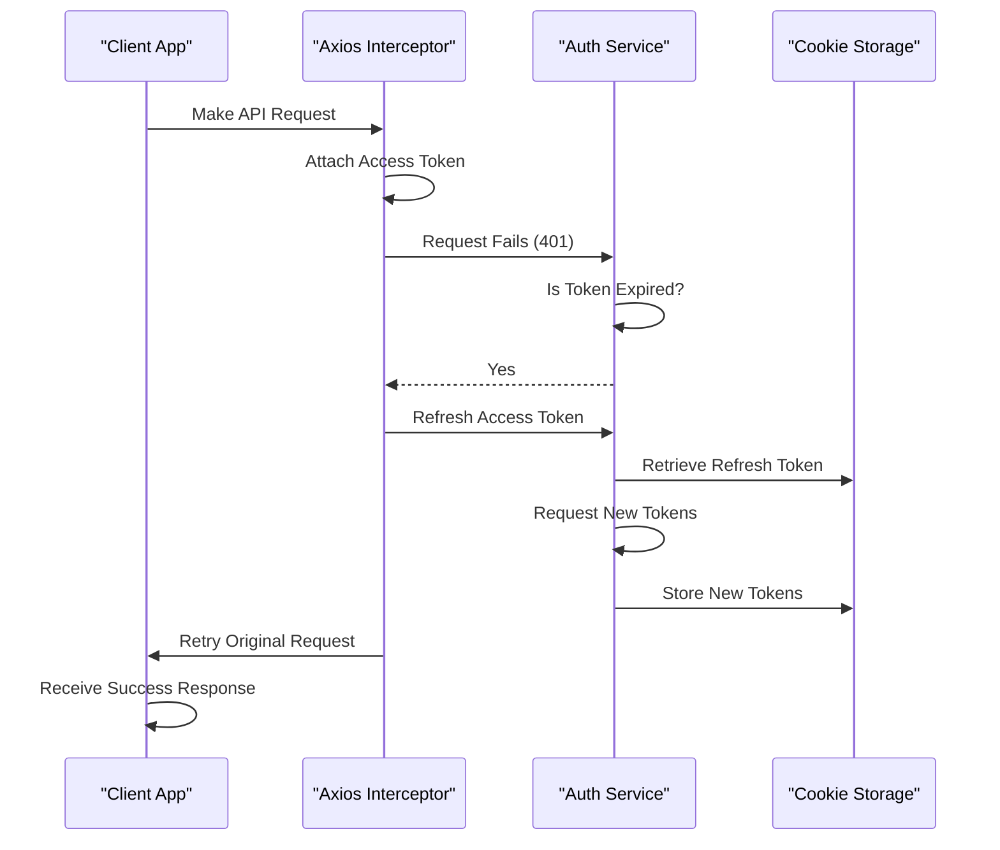
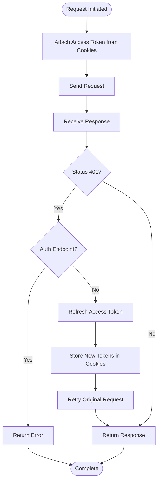
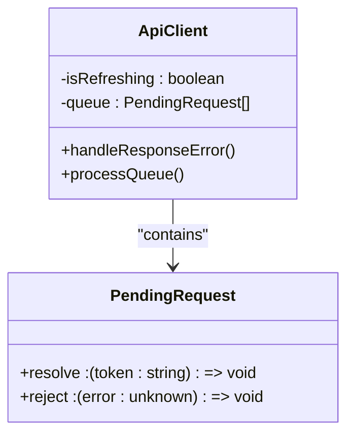

# Token Refresh Mechanism

<cite>
**Referenced Files in This Document**   
- [api.ts](file://src/lib/api.ts)
- [cookies.ts](file://src/lib/cookies.ts)
- [auth-context.tsx](file://src/contexts/auth-context.tsx)
- [auth.ts](file://src/services/auth.ts)
- [api-routes.ts](file://src/constants/api-routes.ts)
</cite>

## Table of Contents
1. [Introduction](#introduction)
2. [Token Refresh Flow Overview](#token-refresh-flow-overview)
3. [Core Components](#core-components)
4. [Interceptor Implementation](#interceptor-implementation)
5. [Concurrent Request Handling](#concurrent-request-handling)
6. [Integration with Auth Context](#integration-with-auth-context)
7. [Edge Case Handling](#edge-case-handling)
8. [Security Considerations](#security-considerations)
9. [Debugging and Monitoring](#debugging-and-monitoring)
10. [Conclusion](#conclusion)

## Introduction
The Token Refresh Mechanism ensures uninterrupted user sessions by automatically renewing expired JWT access tokens through silent background requests. This document details the implementation of a robust token refresh system using axios interceptors, which handles token expiration, manages refresh token storage, and orchestrates retry logic for failed requests. The solution integrates seamlessly with React's authentication context and service layer to maintain a persistent authenticated state without requiring user re-login.

**Section sources**
- [api.ts](file://src/lib/api.ts#L1-L20)
- [auth-context.tsx](file://src/contexts/auth-context.tsx#L1-L20)

## Token Refresh Flow Overview
The token refresh mechanism follows a structured flow to maintain authentication state:
1. Outgoing requests automatically attach the current access token
2. When a 401 Unauthorized response is received, the system triggers a token refresh
3. A single refresh request is made while queuing subsequent requests
4. Upon successful refresh, queued requests are retried with the new token
5. If refresh fails, the user is logged out and redirected to the login page

**Diagram sources**
- [api.ts](file://src/lib/api.ts#L52-L67)
- [cookies.ts](file://src/lib/cookies.ts#L25-L40)

## Core Components
The token refresh system comprises several key components working in concert:
- **ApiClient**: Central class managing axios instance and interceptors
- **Cookie Utilities**: Functions for secure token storage and retrieval
- **Auth Context**: React context providing authentication state
- **Auth Service**: Business logic for authentication operations

These components enable a seamless token lifecycle management system that operates transparently to the user.

**Section sources**
- [api.ts](file://src/lib/api.ts#L19-L146)
- [cookies.ts](file://src/lib/cookies.ts#L1-L40)
- [auth-context.tsx](file://src/contexts/auth-context.tsx#L1-L130)
- [auth.ts](file://src/services/auth.ts#L1-L45)

## Interceptor Implementation
The axios interceptor pattern is implemented through the `ApiClient` class, which sets up request and response interceptors during initialization. The request interceptor automatically attaches the current access token to outgoing requests by reading it from cookies. The response interceptor handles 401 errors by initiating the token refresh process.

Special handling prevents infinite loops by bypassing refresh attempts for authentication endpoints themselves. This ensures that failed login attempts or invalid token verification requests do not trigger additional refresh cycles.

**Diagram sources**
- [api.ts](file://src/lib/api.ts#L38-L50)
- [api.ts](file://src/lib/api.ts#L91-L141)

## Concurrent Request Handling
To handle multiple simultaneous requests during token refresh, the system implements a request queuing mechanism. When the first request encounters an expired token, it initiates the refresh process and sets a flag indicating that a refresh is in progress. Subsequent requests are placed in a queue and suspended until the refresh completes.

This approach prevents multiple concurrent refresh requests and ensures that all pending requests receive the same new access token. The queue is processed either with the new token on success or with the error on failure, maintaining consistency across all pending operations.

**Diagram sources**
- [api.ts](file://src/lib/api.ts#L15-L18)
- [api.ts](file://src/lib/api.ts#L85-L90)

## Integration with Auth Context
The authentication context synchronizes with the token refresh mechanism through event listeners. The `AuthProvider` component listens for storage events and custom authentication events to update the user state when tokens change. During initialization, it verifies the current token and attempts manual refresh if verification fails, ensuring the user remains authenticated across sessions.

The context also handles logout operations by clearing cookies and redirecting to the login page, providing a clean authentication state transition.

**Section sources**
- [auth-context.tsx](file://src/contexts/auth-context.tsx#L23-L122)
- [auth.ts](file://src/services/auth.ts#L25-L40)

## Edge Case Handling
The system addresses several critical edge cases:
- **Invalid refresh tokens**: When refresh fails, cookies are cleared and user is redirected to login
- **Network outages**: Failed refresh attempts due to connectivity issues trigger logout
- **Race conditions**: The queuing mechanism prevents multiple refresh attempts
- **Authentication endpoint failures**: Direct login/verify failures bypass refresh logic

The implementation includes safeguards to prevent infinite loops and ensure graceful degradation when authentication cannot be restored.

**Section sources**
- [api.ts](file://src/lib/api.ts#L95-L100)
- [api.ts](file://src/lib/api.ts#L125-L135)
- [auth-context.tsx](file://src/contexts/auth-context.tsx#L70-L85)

## Security Considerations
Security is maintained through several measures:
- Refresh tokens are stored in HTTP-only cookies with SameSite=Lax policy
- Token refresh is bypassed for authentication endpoints to prevent loops
- Failed refresh attempts result in immediate logout and cookie clearance
- All token operations occur over secure channels (implied by application configuration)

The system follows the principle of least privilege by limiting token exposure and ensuring prompt cleanup of authentication data when sessions end.

**Section sources**
- [cookies.ts](file://src/lib/cookies.ts#L1-L18)
- [api.ts](file://src/lib/api.ts#L110-L115)

## Debugging and Monitoring
The implementation includes comprehensive logging for monitoring token lifecycle events:
- Console logs indicate when token refresh is bypassed for authentication requests
- Error messages are logged when refresh fails or authentication checks encounter issues
- Network requests can be monitored through browser developer tools

Developers can track the token refresh flow through these logs and use breakpoints in the interceptor methods to debug authentication issues during development.

**Section sources**
- [api.ts](file://src/lib/api.ts#L97-L98)
- [auth-context.tsx](file://src/contexts/auth-context.tsx#L78-L79)

## Conclusion
The token refresh mechanism provides a seamless user experience by automatically maintaining authentication state through background token renewal. By leveraging axios interceptors, cookie storage, and React context, the system handles token expiration transparently while addressing edge cases and security concerns. The queuing mechanism ensures reliable handling of concurrent requests during refresh operations, and integration with the authentication context maintains consistent state across the application.