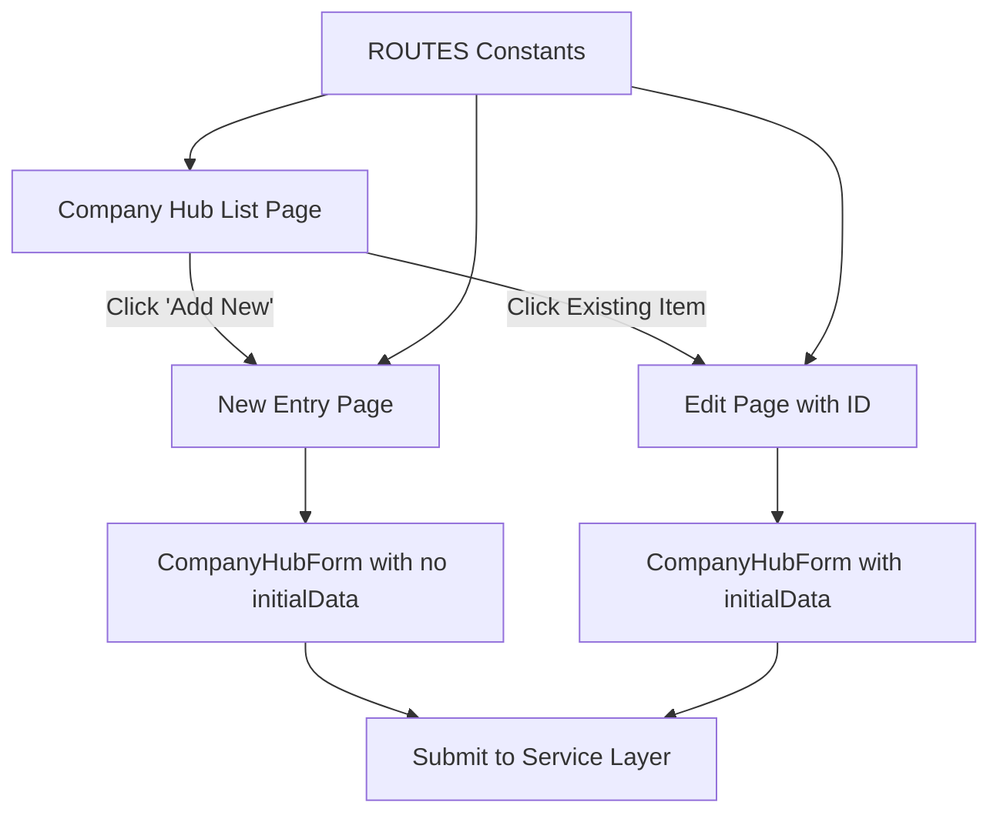
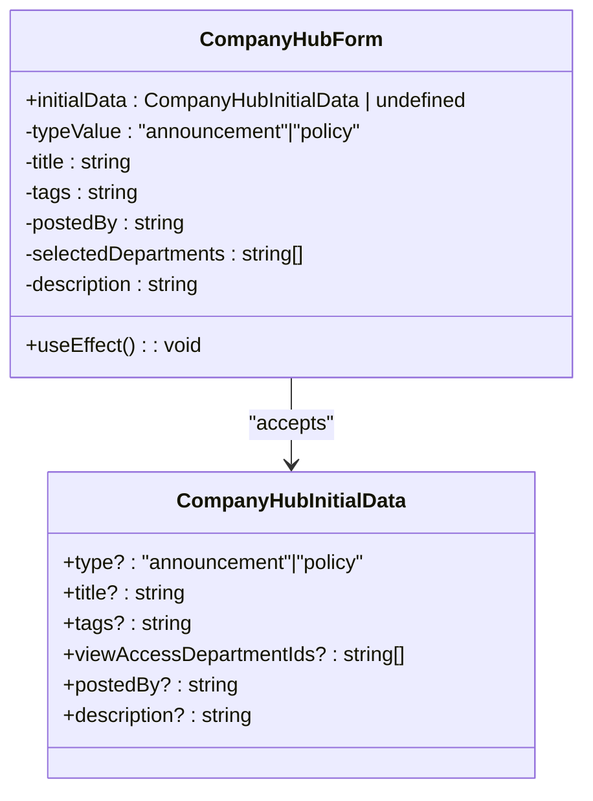
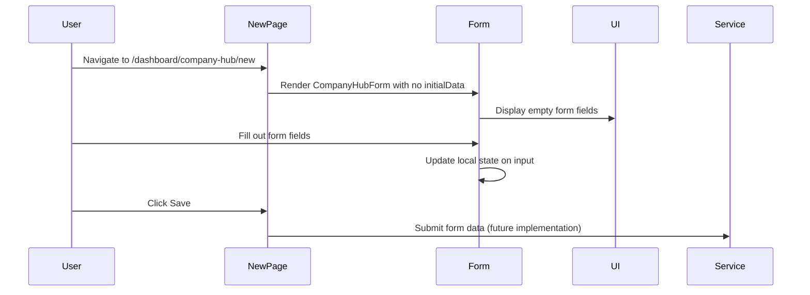

# Company Hub

<cite>
**Referenced Files in This Document**   
- [company-hub-form.tsx](file://src/components/company-hub/company-hub-form.tsx)
- [page.tsx](file://src/app/(admin)/dashboard/company-hub/page.tsx)
- [new/page.tsx](file://src/app/(admin)/dashboard/company-hub/new/page.tsx)
- [[id]/page.tsx](file://src/app/(admin)/dashboard/company-hub/[id]/page.tsx)
- [routes.ts](file://src/constants/routes.ts)
</cite>

## Table of Contents
1. [Introduction](#introduction)
2. [Project Structure](#project-structure)
3. [Core Components](#core-components)
4. [Architecture Overview](#architecture-overview)
5. [Detailed Component Analysis](#detailed-component-analysis)
6. [Dependency Analysis](#dependency-analysis)
7. [Performance Considerations](#performance-considerations)
8. [Troubleshooting Guide](#troubleshooting-guide)
9. [Conclusion](#conclusion)

## Introduction
The Company Hub is a central administrative module within the CartwrightKing ERP system, designed for managing company-wide announcements, policies, and related metadata. It enables administrators to create, view, and edit structured content with access controls, rich text descriptions, and file attachments. This document details the implementation of the Company Hub, focusing on its routing strategy, form handling, state management, and integration patterns.

## Project Structure

```mermaid
graph TD
A[src/app/(admin)/dashboard/company-hub] --> B[page.tsx]
A --> C[new/page.tsx]
A --> D[[id]/page.tsx]
E[src/components/company-hub] --> F[company-hub-form.tsx]
```

**Diagram sources**
- [page.tsx](file://src/app/(admin)/dashboard/company-hub/page.tsx)
- [new/page.tsx](file://src/app/(admin)/dashboard/company-hub/new/page.tsx)
- [[id]/page.tsx](file://src/app/(admin)/dashboard/company-hub/[id]/page.tsx)
- [company-hub-form.tsx](file://src/components/company-hub/company-hub-form.tsx)

**Section sources**
- [page.tsx](file://src/app/(admin)/dashboard/company-hub/page.tsx)
- [new/page.tsx](file://src/app/(admin)/dashboard/company-hub/new/page.tsx)
- [[id]/page.tsx](file://src/app/(admin)/dashboard/company-hub/[id]/page.tsx)
- [company-hub-form.tsx](file://src/components/company-hub/company-hub-form.tsx)

## Core Components

The Company Hub feature is composed of several key components:
- **CompanyHubForm**: A reusable form component for creating and editing company content.
- **Page components**: Three distinct Next.js page components handling list, creation, and editing views.
- **Routing definitions**: Centralized route constants enabling consistent navigation.

These components work together to provide a seamless experience for managing company information.

**Section sources**
- [company-hub-form.tsx](file://src/components/company-hub/company-hub-form.tsx)
- [page.tsx](file://src/app/(admin)/dashboard/company-hub/page.tsx)
- [new/page.tsx](file://src/app/(admin)/dashboard/company-hub/new/page.tsx)
- [[id]/page.tsx](file://src/app/(admin)/dashboard/company-hub/[id]/page.tsx)

## Architecture Overview



**Diagram sources**
- [page.tsx](file://src/app/(admin)/dashboard/company-hub/page.tsx)
- [new/page.tsx](file://src/app/(admin)/dashboard/company-hub/new/page.tsx)
- [[id]/page.tsx](file://src/app/(admin)/dashboard/company-hub/[id]/page.tsx)
- [routes.ts](file://src/constants/routes.ts)

## Detailed Component Analysis

### Company Hub Form Analysis

The `CompanyHubForm` component serves as the central UI for data input, supporting both creation and editing workflows through optional initial data injection.



**Diagram sources**
- [company-hub-form.tsx](file://src/components/company-hub/company-hub-form.tsx#L9-L16)
- [company-hub-form.tsx](file://src/components/company-hub/company-hub-form.tsx#L18-L144)

#### Form State Management

The form utilizes React state hooks to manage all input fields independently. Each field (title, tags, postedBy, etc.) has its own state variable and update function. The `useEffect` hook synchronizes the form state with incoming `initialData`, ensuring proper population when editing existing records.

**Section sources**
- [company-hub-form.tsx](file://src/components/company-hub/company-hub-form.tsx#L18-L144)

#### Input Field Integration

The form integrates various UI components:
- **RadioGroup**: For selecting content type (announcement/policy)
- **Input**: For text fields like title, tags, and postedBy
- **SelectableTags**: For department access selection
- **RichTextEditor**: For rich content description
- **Dropzone**: For file attachments

These components are arranged in a responsive grid layout with consistent styling and labeling.

**Section sources**
- [company-hub-form.tsx](file://src/components/company-hub/company-hub-form.tsx#L45-L140)

### Page-Level Components Analysis

#### List Page ([page.tsx](file://src/app/(admin)/dashboard/company-hub/page.tsx))

The main Company Hub page displays a list of recent announcements and provides a navigation action to create new entries. It uses the `PageHeader` component with breadcrumb navigation and includes a `RecentAnnouncementsTable` for content preview.

**Section sources**
- [page.tsx](file://src/app/(admin)/dashboard/company-hub/page.tsx)

#### Creation Flow ([new/page.tsx](file://src/app/(admin)/dashboard/company-hub/new/page.tsx))

The creation page renders the `CompanyHubForm` without initial data, indicating a new record creation. It includes save actions in the header and follows the same layout structure as other admin pages.



**Diagram sources**
- [new/page.tsx](file://src/app/(admin)/dashboard/company-hub/new/page.tsx)
- [company-hub-form.tsx](file://src/components/company-hub/company-hub-form.tsx)

**Section sources**
- [new/page.tsx](file://src/app/(admin)/dashboard/company-hub/new/page.tsx)

#### Editing Flow ([[id]/page.tsx](file://src/app/(admin)/dashboard/company-hub/[id]/page.tsx))

The editing page uses dynamic routing with `[id]` to load and edit existing records. It retrieves the ID parameter and simulates data fetching using `useEffect`. The fetched data is passed as `initialData` to `CompanyHubForm`.

```mermaid
sequenceDiagram
    participant User
    participant EditPage
    participant useParams
    participant State
    participant Form
    participant UI
    
    User->>EditPage: Navigate to /dashboard/company-hub/123
    EditPage->>useParams: Get id parameter
    useParams-->>EditPage: Return id = "123"
    EditPage->>State: Initialize initialData as null
    EditPage->>useEffect: Fetch data for id
    useEffect->>State: Set mock data for announcement 123
    State-->>Form: Pass initialData to CompanyHubForm
    Form->>UI: Populate form with existing values