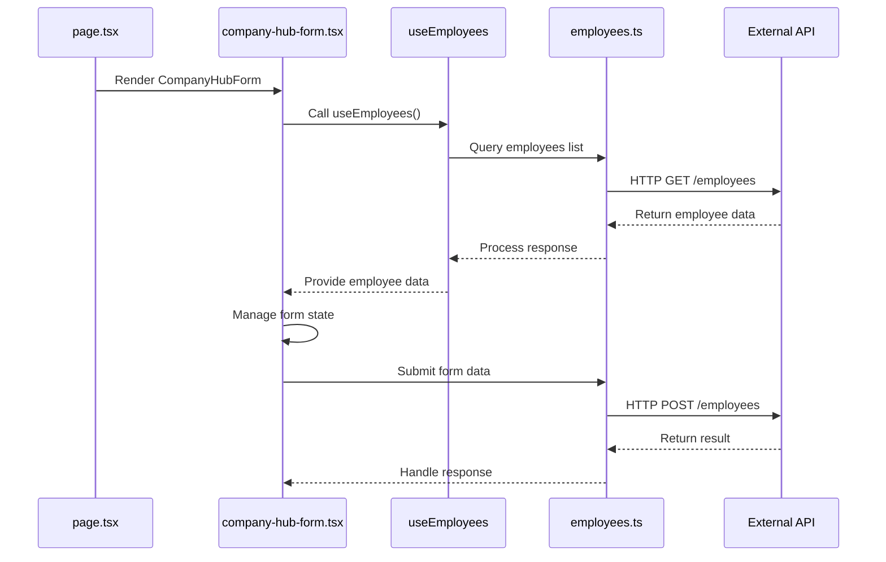
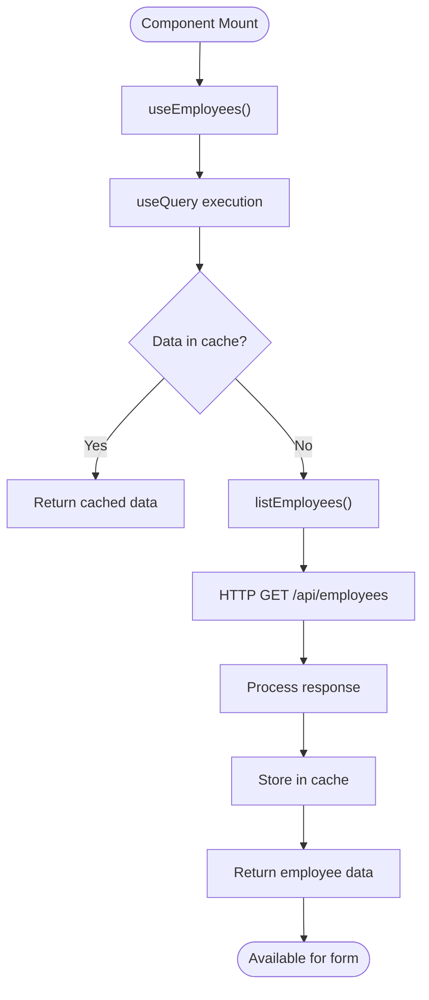
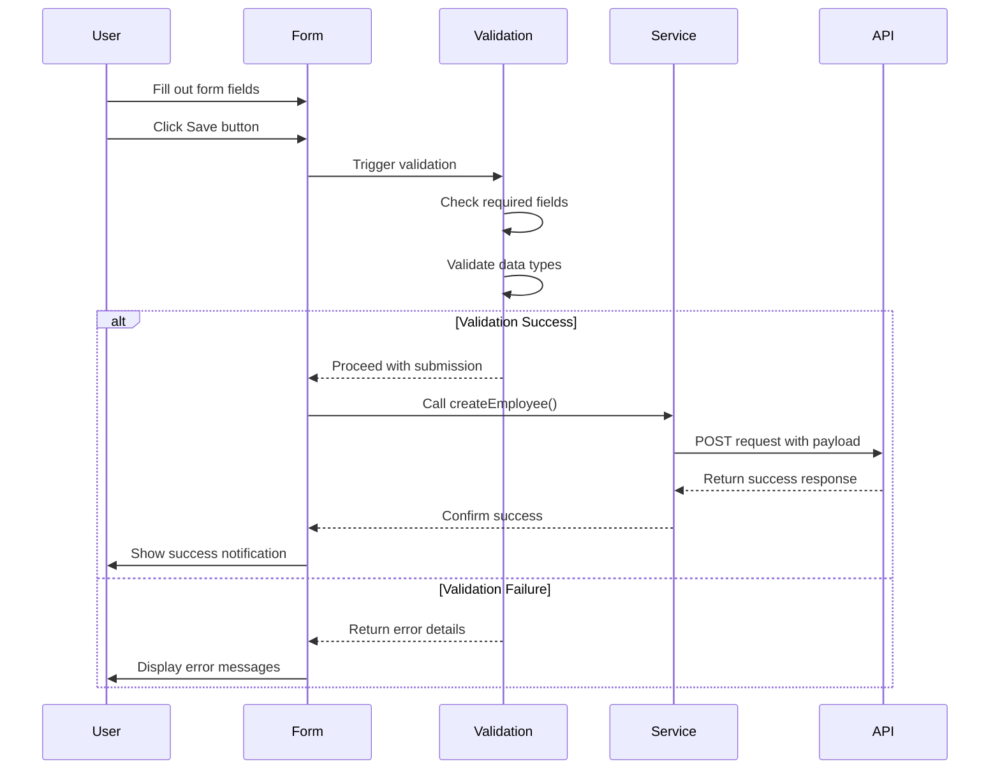
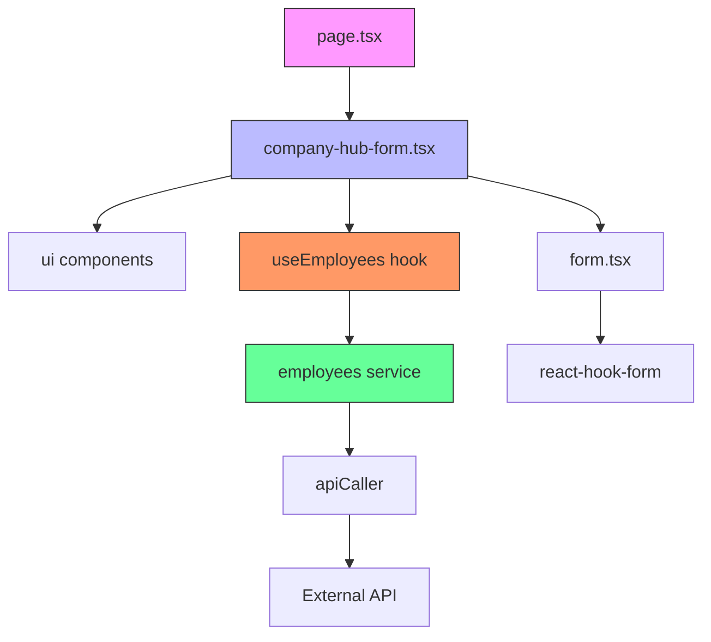

# Create New Company Record

<cite>
**Referenced Files in This Document**   
- [page.tsx](file://src/app/(admin)/dashboard/company-hub/new/page.tsx)
- [company-hub-form.tsx](file://src/components/company-hub/company-hub-form.tsx)
- [use-employees.ts](file://src/hooks/queries/use-employees.ts)
- [employees.ts](file://src/services/employees.ts)
- [form.tsx](file://src/components/ui/form.tsx)
</cite>

## Table of Contents
1. [Introduction](#introduction)
2. [Project Structure](#project-structure)
3. [Core Components](#core-components)
4. [Architecture Overview](#architecture-overview)
5. [Detailed Component Analysis](#detailed-component-analysis)
6. [Dependency Analysis](#dependency-analysis)
7. [Performance Considerations](#performance-considerations)
8. [Troubleshooting Guide](#troubleshooting-guide)
9. [Conclusion](#conclusion)

## Introduction
This document provides a comprehensive guide to the creation workflow for new company records within the Company Hub module of the CartwrightKing Admin ERP system. It details the implementation of form initialization and submission handling, focusing on the integration between the `new/page.tsx` route and the `company-hub-form.tsx` component. The documentation covers form state management, employee data integration via the `useEmployees` hook, validation mechanisms using React Hook Form and Zod, and API persistence through the service layer. Special attention is given to default values, field constraints, success/error feedback, and common issues such as validation failures or API errors.

## Project Structure
The Company Hub creation functionality is organized within the Next.js app directory structure under the admin dashboard. The entry point for creating new company records resides in the `new` directory, while shared UI components and business logic are maintained in dedicated component and service modules.

```mermaid
graph TB
subgraph "App Routes"
A[src/app/(admin)/dashboard/company-hub/new/page.tsx] --> B[CompanyHubForm]
end
subgraph "Components"
B --> C[company-hub/company-hub-form.tsx]
C --> D[ui/input]
C --> E[ui/radio-group]
C --> F[ui/dropzone]
C --> G[ui/selectable-tags]
C --> H[ui/rich-text-editor]
end
subgraph "Data Layer"
I[use-employees.ts] --> J[employees.ts]
J --> K[API Service]
end
C --> I
```

**Diagram sources**
- [page.tsx](file://src/app/(admin)/dashboard/company-hub/new/page.tsx)
- [company-hub-form.tsx](file://src/components/company-hub/company-hub-form.tsx)
- [use-employees.ts](file://src/hooks/queries/use-employees.ts)
- [employees.ts](file://src/services/employees.ts)

**Section sources**
- [page.tsx](file://src/app/(admin)/dashboard/company-hub/new/page.tsx)
- [company-hub-form.tsx](file://src/components/company-hub/company-hub-form.tsx)

## Core Components
The core functionality for creating new company records revolves around two primary components: the route handler (`page.tsx`) and the form implementation (`company-hub-form.tsx`). These components work together to initialize the form, manage state, handle user input, and coordinate with backend services for data persistence.

**Section sources**
- [page.tsx](file://src/app/(admin)/dashboard/company-hub/new/page.tsx)
- [company-hub-form.tsx](file://src/components/company-hub/company-hub-form.tsx)

## Architecture Overview
The creation workflow follows a client-side component architecture where the page component renders the form, which in turn manages its own state and interacts with data fetching hooks for employee information. The architecture separates concerns between presentation, state management, and data access layers.



**Diagram sources**
- [page.tsx](file://src/app/(admin)/dashboard/company-hub/new/page.tsx)
- [company-hub-form.tsx](file://src/components/company-hub/company-hub-form.tsx)
- [use-employees.ts](file://src/hooks/queries/use-employees.ts)
- [employees.ts](file://src/services/employees.ts)

## Detailed Component Analysis

### Company Hub Form Implementation
The `CompanyHubForm` component implements a comprehensive form for collecting company information with various input types and state management patterns.

#### Form State Management
The form utilizes React's useState hook to manage individual field states including type selection, title, tags, posted-by information, selected departments, and description content. Default values are established through the `initialData` prop with fallbacks to sensible defaults.

```mermaid
classDiagram
class CompanyHubForm {
+initialData : CompanyHubInitialData | undefined
-typeValue : "announcement"|"policy"
-title : string
-tags : string
-postedBy : string
-selectedDepartments : string[]
-description : string
+CompanyHubForm({initialData})
}
class CompanyHubInitialData {
+type? : "announcement"|"policy"
+title? : string
+tags? : string
+viewAccessDepartmentIds? : string[]
+postedBy? : string
+description? : string
}
CompanyHubForm --> CompanyHubInitialData : uses
```

**Diagram sources**
- [company-hub-form.tsx](file://src/components/company-hub/company-hub-form.tsx)

#### Employee Data Integration
The form integrates employee data through the `useEmployees` hook, which provides access to the employee listing service. This hook leverages React Query for efficient data fetching, caching, and state synchronization.



**Diagram sources**
- [use-employees.ts](file://src/hooks/queries/use-employees.ts)
- [employees.ts](file://src/services/employees.ts)

#### Form Submission Process
The form submission process involves validation, API communication, and user feedback mechanisms. Although the current implementation shows state management, the actual submission logic would integrate with React Hook Form and Zod for validation.



**Diagram sources**
- [company-hub-form.tsx](file://src/components/company-hub/company-hub-form.tsx)
- [employees.ts](file://src/services/employees.ts)

## Dependency Analysis
The creation workflow depends on several key modules and services that provide essential functionality for data management and user interface components.



**Diagram sources**
- [page.tsx](file://src/app/(admin)/dashboard/company-hub/new/page.tsx)
- [company-hub-form.tsx](file://src/components/company-hub/company-hub-form.tsx)
- [use-employees.ts](file://src/hooks/queries/use-employees.ts)
- [employees.ts](file://src/services/employees.ts)
- [form.tsx](file://src/components/ui/form.tsx)

**Section sources**
- [page.tsx](file://src/app/(admin)/dashboard/company-hub/new/page.tsx)
- [company-hub-form.tsx](file://src/components/company-hub/company-hub-form.tsx)
- [use-employees.ts](file://src/hooks/queries/use-employees.ts)
- [employees.ts](file://src/services/employees.ts)

## Performance Considerations
The implementation considers performance through React Query's caching mechanism in the `useEmployees` hook, which sets a stale time of 60,000 milliseconds (1 minute) to balance data freshness with network efficiency. The form component uses controlled components with individual state variables, which provides predictable state management but may benefit from consolidation using React Hook Form for complex validation scenarios.

## Troubleshooting Guide
Common issues in the creation workflow typically involve validation failures, API errors, or data loading problems. The system should implement proper error handling to address these scenarios.

**Section sources**
- [company-hub-form.tsx](file://src/components/company-hub/company-hub-form.tsx)
- [employees.ts](file://src/services/employees.ts)
- [use-employees.ts](file://src/hooks/queries/use-employees.ts)

## Conclusion
The Company Hub creation workflow demonstrates a well-structured approach to form management in a React application. By separating concerns between route handling, form implementation, and data services, the codebase maintains clarity and scalability. The integration of employee data through dedicated hooks enables reusable data access patterns across the application. Future enhancements could include implementing proper form validation with React Hook Form and Zod, adding optimistic UI updates, and improving error handling for a more robust user experience.