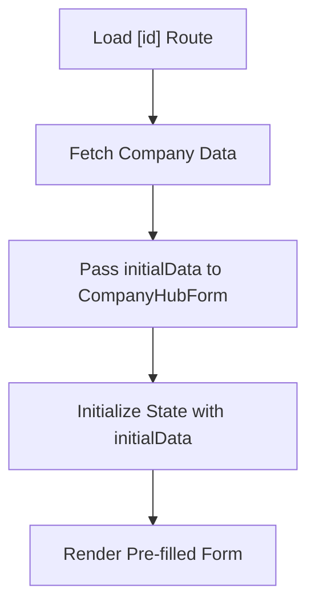
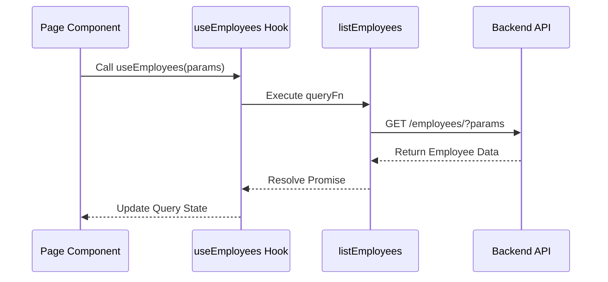
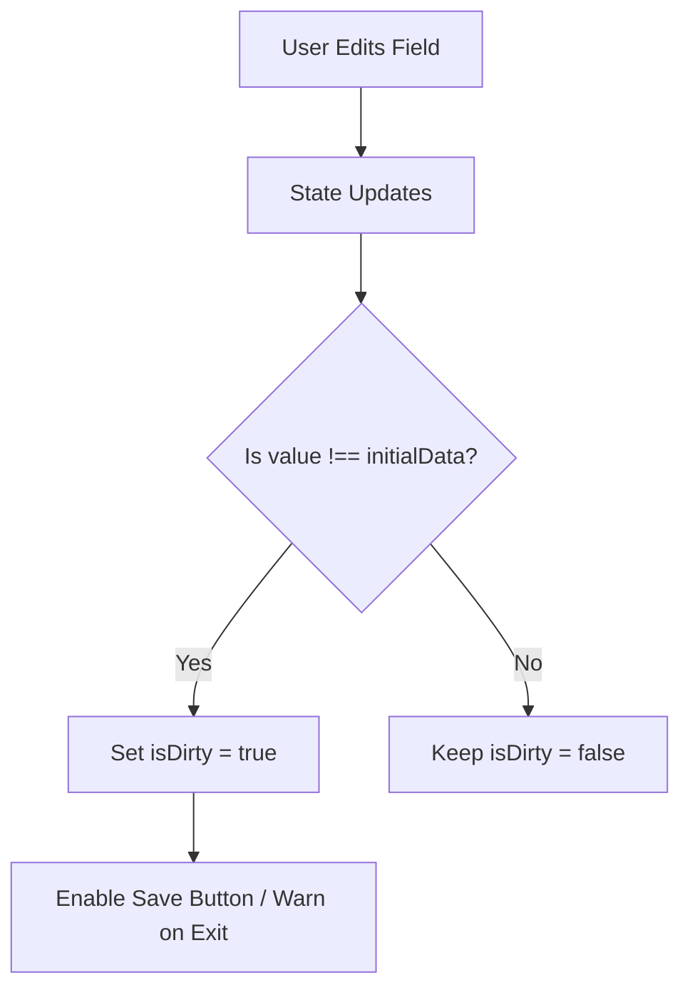

# Edit Existing Company Record

<cite>
**Referenced Files in This Document**   
- [company-hub-form.tsx](file://src/components/company-hub/company-hub-form.tsx)
- [use-employees.ts](file://src/hooks/queries/use-employees.ts)
- [employees.ts](file://src/services/employees.ts)
- [api-routes.ts](file://src/constants/api-routes.ts)
- [page.tsx](file://src/app/(admin)/dashboard/company-hub/[id]/page.tsx)
- [selectable-tags.tsx](file://src/components/ui/selectable-tags.tsx)
</cite>

## Table of Contents
1. [Introduction](#introduction)
2. [Dynamic Route Data Loading](#dynamic-route-data-loading)
3. [Form Initialization and Pre-filling](#form-initialization-and-pre-filling)
4. [Data Fetching with React Query](#data-fetching-with-react-query)
5. [Form State and Validation](#form-state-and-validation)
6. [Submission and Mutation Patterns](#submission-and-mutation-patterns)
7. [Handling Employee Relationships](#handling-employee-relationships)
8. [Common Issues and Solutions](#common-issues-and-solutions)
9. [Conclusion](#conclusion)

## Introduction
This document details the implementation of editing existing company records in the Company Hub. It explains how the `[id]` dynamic route loads and populates the `company-hub-form.tsx` component, the use of React Query for data fetching via `useEmployees` and related hooks, form state management, and submission logic. The content is structured to be accessible to beginners with workflow diagrams while providing technical depth on mutation strategies and conflict resolution for experienced developers.

## Dynamic Route Data Loading
The `[id]` dynamic route in `src/app/(admin)/dashboard/company-hub/[id]/page.tsx` captures the company identifier from the URL and initiates the data loading process. This route acts as a container that fetches the existing company data and passes it as `initialData` to the `CompanyHubForm` component. The server-side logic ensures that only valid company records are retrieved, preventing unauthorized access and ensuring data integrity during the edit session.

**Section sources**
- [page.tsx](file://src/app/(admin)/dashboard/company-hub/[id]/page.tsx#L1-L50)

## Form Initialization and Pre-filling
The `CompanyHubForm` component accepts an optional `initialData` prop of type `CompanyHubInitialData`, which contains fields such as `type`, `title`, `tags`, `postedBy`, `viewAccessDepartmentIds`, and `description`. When editing an existing record, this data is used to initialize React state variables via `useState`. A `useEffect` hook ensures that if `initialData` changes (e.g., due to refetching), the form fields are updated accordingly.

The form pre-fills all input fields including radio buttons for type selection, text inputs for title and tags, a `SelectableTags` component for department access control, and a rich text editor for the description. This ensures a seamless editing experience where users see the current state of the record before making modifications.

**Diagram sources**
- [company-hub-form.tsx](file://src/components/company-hub/company-hub-form.tsx#L18-L144)

**Section sources**
- [company-hub-form.tsx](file://src/components/company-hub/company-hub-form.tsx#L9-L144)

## Data Fetching with React Query
Data fetching is managed using React Query through the `useEmployees` hook and similar query hooks. The `useEmployees` hook calls `useQuery` with a query key of `["employees", params]` and uses the `listEmployees` service function as the query function. A stale time of 60,000 milliseconds (1 minute) is set to balance freshness and performance.

The `listEmployees` function constructs a URL using `API_ROUTES.EMPLOYEES.LIST` and appends query parameters if provided. It uses `apiCaller` to make a GET request and returns the employee list data. This pattern ensures efficient caching, automatic background refetching, and error handling for network issues.

**Diagram sources**
- [use-employees.ts](file://src/hooks/queries/use-employees.ts#L12-L18)
- [employees.ts](file://src/services/employees.ts#L29-L34)

**Section sources**
- [use-employees.ts](file://src/hooks/queries/use-employees.ts#L12-L18)
- [employees.ts](file://src/services/employees.ts#L29-L34)
- [api-routes.ts](file://src/constants/api-routes.ts#L0-L99)

## Form State and Validation
The `CompanyHubForm` manages form state using React’s `useState` hook for each field. Input changes are handled via `onChange` callbacks that update the respective state variables. The form does not include client-side validation in the provided code, but validation can be added by checking field values before submission or integrating with a validation library.

The `SelectableTags` component uses the `createSelectableItems` utility to transform department data into a format compatible with the selection interface. This ensures consistent rendering and interaction patterns across different multi-select components in the application.

**Section sources**
- [company-hub-form.tsx](file://src/components/company-hub/company-hub-form.tsx#L18-L144)
- [selectable-tags.tsx](file://src/components/ui/selectable-tags.tsx#L177-L184)

## Submission and Mutation Patterns
While the provided code does not include submission logic, the expected pattern involves using React Query’s `useMutation` hook to perform PATCH or PUT requests when the form is submitted. The mutation would send updated company data to the backend via the appropriate API endpoint (e.g., `API_ROUTES.KNOWLEDGE_BASE.ANNOUNCEMENTS.UPDATE(id)`), with proper error handling and success callbacks to reflect changes in the UI.

Upon successful submission, `queryClient.invalidateQueries` would be called to refetch the updated data and ensure the application state remains consistent across components.

## Handling Employee Relationships
Although the current `CompanyHubForm` does not directly manage employee relationships, the `useEmployees` hook and associated services provide the foundation for integrating employee data. Future enhancements could include selecting employees for announcements, assigning permissions, or linking company policies to specific teams. The `SelectableTags` component pattern can be extended to support employee selection by transforming employee lists into selectable items.

## Common Issues and Solutions
### Stale Data
Stale data is mitigated by React Query’s built-in caching and refetching mechanisms. The `staleTime` setting allows cached data to remain valid for a short period, reducing unnecessary network requests while ensuring timely updates.

### Concurrent Edits
To handle concurrent edits, the backend should implement optimistic locking or versioning. The frontend can display warnings if another user has modified the record during editing, prompting the user to review changes before submitting.

### Form Dirty State Management
The form tracks changes through React state. To detect unsaved changes, a `dirty` flag can be implemented by comparing current values with `initialData`. This flag can prevent accidental navigation away from the form using React Router’s `useBlocker` or a custom confirmation dialog.

**Diagram sources**
- [company-hub-form.tsx](file://src/components/company-hub/company-hub-form.tsx#L18-L144)

## Conclusion
The edit functionality in the Company Hub leverages dynamic routing, React Query for efficient data fetching, and controlled components for form management. By using `initialData` to pre-fill forms and React Query’s caching strategy, the system ensures a responsive and reliable editing experience. Future improvements can include robust validation, conflict resolution, and deeper integration with employee data to enhance collaboration and access control.