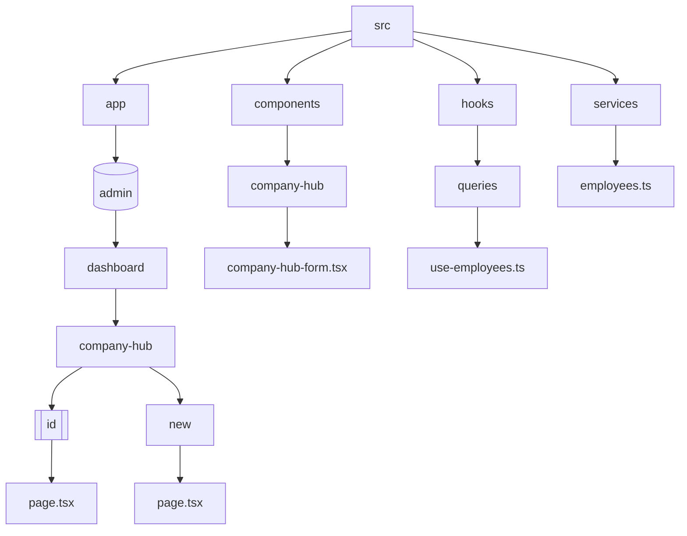
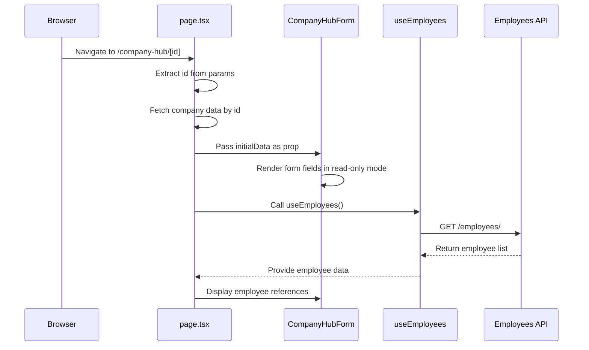
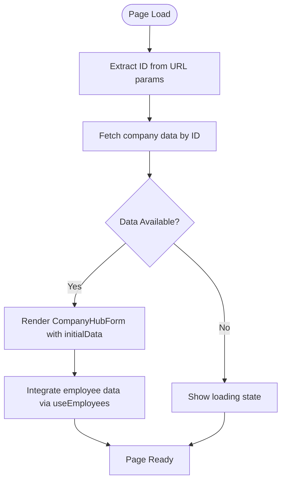
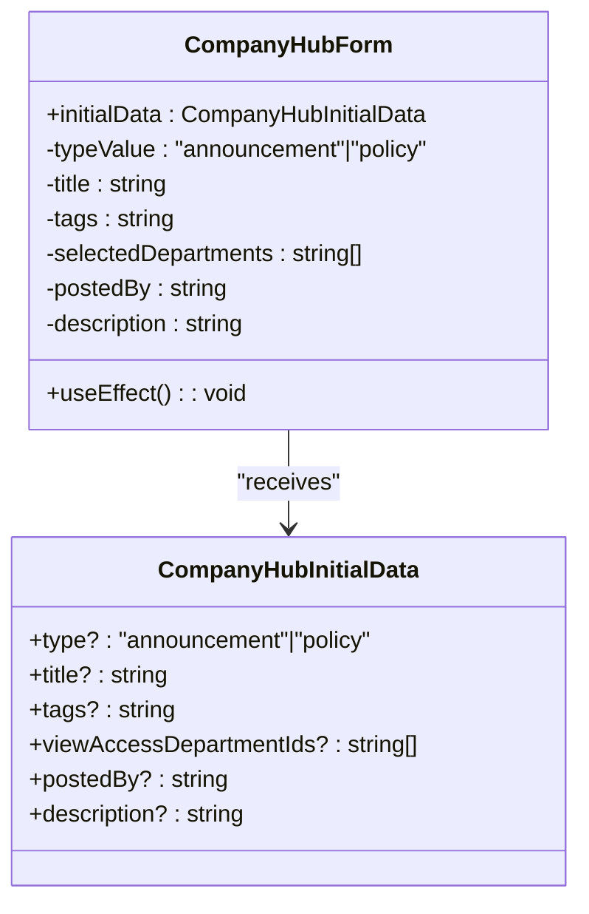
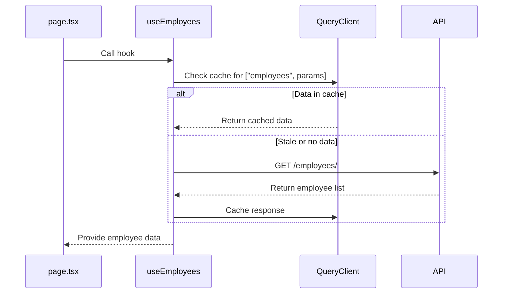
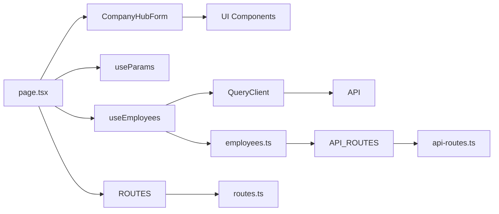

# View Company Information

<cite>
**Referenced Files in This Document**   
- [page.tsx](file://src/app/(admin)/dashboard/company-hub/[id]/page.tsx)
- [company-hub-form.tsx](file://src/components/company-hub/company-hub-form.tsx)
- [use-employees.ts](file://src/hooks/queries/use-employees.ts)
- [employees.ts](file://src/services/employees.ts)
- [routes.ts](file://src/constants/routes.ts)
- [api-routes.ts](file://src/constants/api-routes.ts)
</cite>

## Table of Contents
1. [Introduction](#introduction)
2. [Project Structure](#project-structure)
3. [Core Components](#core-components)
4. [Architecture Overview](#architecture-overview)
5. [Detailed Component Analysis](#detailed-component-analysis)
6. [Dependency Analysis](#dependency-analysis)
7. [Performance Considerations](#performance-considerations)
8. [Troubleshooting Guide](#troubleshooting-guide)
9. [Conclusion](#conclusion)

## Introduction
This document explains how the Company Hub view functionality renders company information using dynamic routing and integrates employee data via React Query. It covers the implementation of read-only data display, loading states, error handling, and performance optimization strategies within the CartwrightKing Admin ERP system.

## Project Structure

**Diagram sources**
- [page.tsx](file://src/app/(admin)/dashboard/company-hub/[id]/page.tsx)
- [company-hub-form.tsx](file://src/components/company-hub/company-hub-form.tsx)
- [use-employees.ts](file://src/hooks/queries/use-employees.ts)

**Section sources**
- [page.tsx](file://src/app/(admin)/dashboard/company-hub/[id]/page.tsx)
- [company-hub-form.tsx](file://src/components/company-hub/company-hub-form.tsx)

## Core Components

The Company Hub view functionality centers around two key components: the dynamic route handler in `page.tsx` and the reusable `CompanyHubForm` component. These work together to display company information with support for dynamic routing through the `[id]` parameter.

**Section sources**
- [page.tsx](file://src/app/(admin)/dashboard/company-hub/[id]/page.tsx)
- [company-hub-form.tsx](file://src/components/company-hub/company-hub-form.tsx)

## Architecture Overview

**Diagram sources**
- [page.tsx](file://src/app/(admin)/dashboard/company-hub/[id]/page.tsx)
- [use-employees.ts](file://src/hooks/queries/use-employees.ts)
- [employees.ts](file://src/services/employees.ts)

## Detailed Component Analysis

### Company Hub View Implementation

The Company Hub view uses Next.js App Router's dynamic routing feature with the `[id]` segment to display specific company records. The `page.tsx` file acts as the route handler that extracts the ID parameter and loads the corresponding data.

**Diagram sources**
- [page.tsx](file://src/app/(admin)/dashboard/company-hub/[id]/page.tsx)
- [use-employees.ts](file://src/hooks/queries/use-employees.ts)

#### Dynamic Routing with [id]

The `[id]` directory enables dynamic routing, allowing the system to display different company records based on the URL parameter. The `useParams()` hook from Next.js navigation retrieves the ID value, which is then used to fetch the appropriate company data.

**Section sources**
- [page.tsx](file://src/app/(admin)/dashboard/company-hub/[id]/page.tsx)
- [routes.ts](file://src/constants/routes.ts)

#### Data Rendering Patterns

The implementation uses React state and effects to manage data loading:

- `useState` initializes the `initialData` state
- `useEffect` simulates data fetching when the ID changes
- Conditional rendering handles the loading state (`initialData ?? undefined`)

This pattern ensures that the form only renders when data is available, preventing undefined value errors.

**Section sources**
- [page.tsx](file://src/app/(admin)/dashboard/company-hub/[id]/page.tsx)

#### Loading States and Error Handling

While the current implementation shows a mock data loading process, a production-ready version would include proper loading indicators and error boundaries. The conditional prop passing (`initialData ?? undefined`) provides basic protection against null values.

**Section sources**
- [page.tsx](file://src/app/(admin)/dashboard/company-hub/[id]/page.tsx)

### CompanyHubForm Component Analysis

The `CompanyHubForm` component serves dual purposes: data entry and read-only display. When viewing company information, it operates in read-only mode by receiving pre-filled `initialData`.

**Diagram sources**
- [company-hub-form.tsx](file://src/components/company-hub/company-hub-form.tsx)

#### Read-Only Mode Functionality

The form component uses the `initialData` prop to populate its internal state variables. This allows it to display structured company information without requiring additional API calls for field population.

**Section sources**
- [company-hub-form.tsx](file://src/components/company-hub/company-hub-form.tsx)

#### Data Integration with useEmployees Hook

The `useEmployees` hook from React Query provides employee data integration capabilities:

**Diagram sources**
- [use-employees.ts](file://src/hooks/queries/use-employees.ts)
- [employees.ts](file://src/services/employees.ts)

The hook implements caching with a 60-second stale time, balancing fresh data with performance optimization.

**Section sources**
- [use-employees.ts](file://src/hooks/queries/use-employees.ts)

## Dependency Analysis

**Diagram sources**
- [page.tsx](file://src/app/(admin)/dashboard/company-hub/[id]/page.tsx)
- [company-hub-form.tsx](file://src/components/company-hub/company-hub-form.tsx)
- [use-employees.ts](file://src/hooks/queries/use-employees.ts)
- [employees.ts](file://src/services/employees.ts)

## Performance Considerations

The implementation leverages React Query's caching mechanism to optimize performance:

- Data is cached for 60 seconds (`staleTime: 60_000`)
- Subsequent visits to company profiles may retrieve data from cache
- The `useQuery` hook handles loading, error, and success states automatically
- Background refetching ensures data freshness without blocking the UI

For large employee datasets, pagination parameters can be passed to the `useEmployees` hook to limit response size and improve load times.

**Section sources**
- [use-employees.ts](file://src/hooks/queries/use-employees.ts)

## Troubleshooting Guide

Common issues and solutions for the Company Hub view functionality:

**Slow Data Loading**
- **Cause**: Large employee datasets or network latency
- **Solution**: Implement pagination in `useEmployees` calls with `params` object containing page and limit values

**Missing Employee References**
- **Cause**: Employee data not loaded or API errors
- **Solution**: Add error boundary around employee data display and provide fallback content

**Stale Company Data**
- **Cause**: Cached data not refreshing
- **Solution**: Adjust `staleTime` parameter or manually invalidate queries when needed

**Routing Issues with [id]**
- **Cause**: Invalid ID format or missing data
- **Solution**: Add validation for the ID parameter and handle 404 cases appropriately

**Section sources**
- [page.tsx](file://src/app/(admin)/dashboard/company-hub/[id]/page.tsx)
- [use-employees.ts](file://src/hooks/queries/use-employees.ts)

## Conclusion

The Company Hub view functionality demonstrates a robust implementation of dynamic routing, data fetching, and component reuse. By leveraging Next.js App Router and React Query, the system efficiently displays company information while maintaining good performance through caching. The `CompanyHubForm` component's flexibility allows it to serve both creation and viewing purposes, reducing code duplication. Future improvements could include proper error handling, loading skeletons, and enhanced employee data integration.