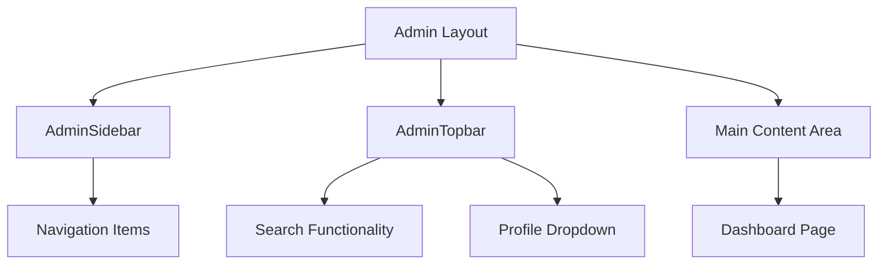
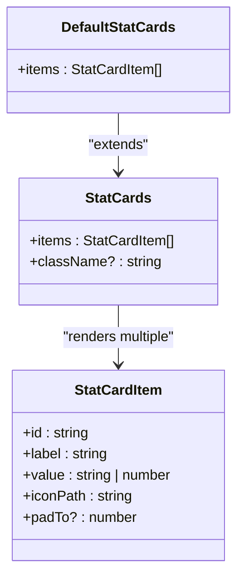
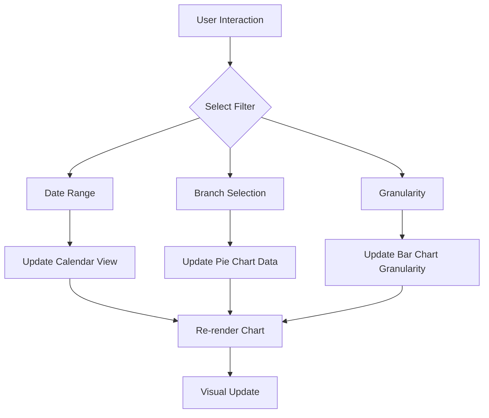
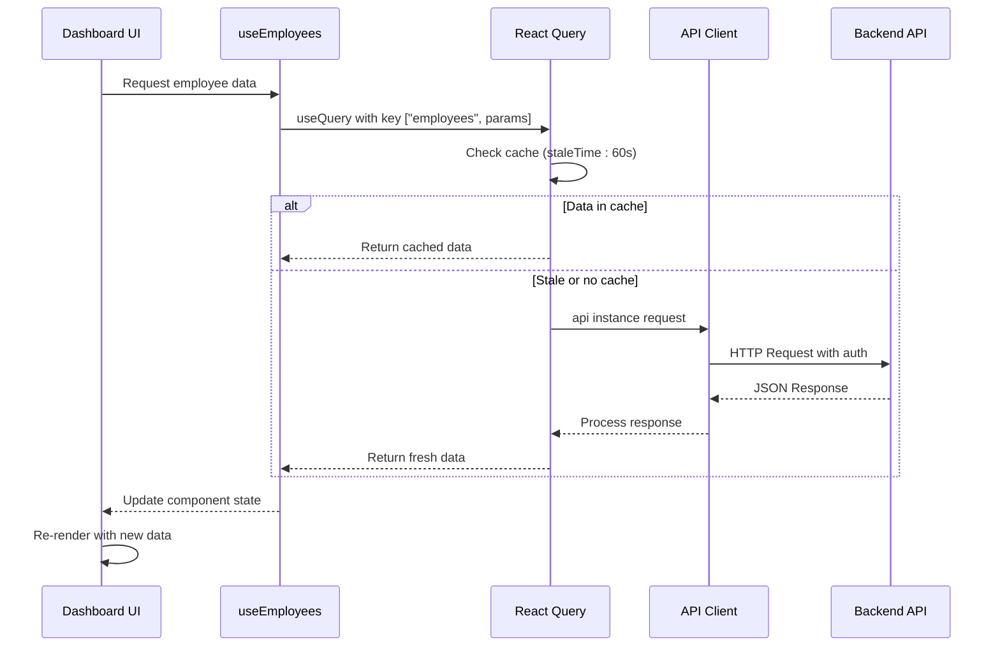
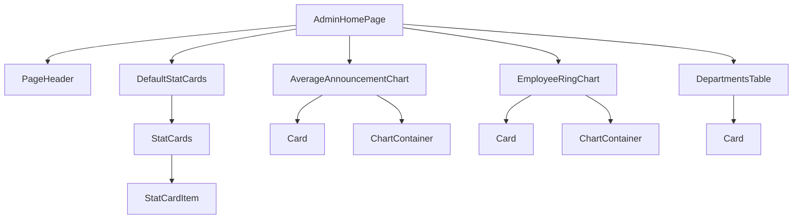

# Dashboard Modules

<cite>
**Referenced Files in This Document**   
- [page.tsx](file://src/app/(admin)/dashboard/page.tsx)
- [stat-cards.tsx](file://src/components/dashboard/stat-cards.tsx)
- [average-announcement-chart.tsx](file://src/components/dashboard/average-announcement-chart.tsx)
- [employee-ring-chart.tsx](file://src/components/dashboard/employee-ring-chart.tsx)
- [admin-sidebar.tsx](file://src/components/admin/layout/admin-sidebar.tsx)
- [admin-topbar.tsx](file://src/components/admin/layout/admin-topbar.tsx)
- [routes.ts](file://src/constants/routes.ts)
- [use-employees.ts](file://src/hooks/queries/use-employees.ts)
- [api.ts](file://src/lib/api.ts)
- [api.d.ts](file://src/types/api.d.ts)
</cite>

## Table of Contents
1. [Introduction](#introduction)
2. [Dashboard Layout and Navigation](#dashboard-layout-and-navigation)
3. [Core Dashboard Components](#core-dashboard-components)
4. [Data Flow and API Integration](#data-flow-and-api-integration)
5. [Component Hierarchy and Public Interfaces](#component-hierarchy-and-public-interfaces)
6. [Performance Considerations](#performance-considerations)

## Introduction
The Dashboard Modules section provides the central administrative interface for the ERP system, serving as the primary entry point for administrators. It offers a comprehensive overview of organizational metrics through visualizations, stat cards, and data tables. The dashboard integrates with multiple backend services to display real-time data across departments, employees, announcements, and executive members. This document details the architecture, implementation, and user interaction patterns of the dashboard modules.

## Dashboard Layout and Navigation

The administrative dashboard employs a structured layout with consistent navigation elements. The interface is divided into three primary components: sidebar navigation, topbar controls, and main content area.

**Diagram sources**
- [admin-sidebar.tsx](file://src/components/admin/layout/admin-sidebar.tsx#L40-L122)
- [admin-topbar.tsx](file://src/components/admin/layout/admin-topbar.tsx#L5-L20)

The sidebar navigation provides access to all administrative modules with clear visual indicators for the active route. Navigation items include Dashboard, Company Hub, Knowledge Base, New Hire Plan, Departments, Org Chart/Directory, and Executive Members. The topbar includes a collapsible sidebar trigger, search functionality, and user profile controls. Users can navigate between modules through the sidebar, with visual feedback indicating the current location in the application.

**Section sources**
- [admin-sidebar.tsx](file://src/components/admin/layout/admin-sidebar.tsx#L40-L122)
- [admin-topbar.tsx](file://src/components/admin/layout/admin-topbar.tsx#L5-L20)
- [routes.ts](file://src/constants/routes.ts#L5-L34)

## Core Dashboard Components

The dashboard consists of several key components that visualize organizational metrics and provide quick access to critical data.

### Stat Cards
The StatCards component displays key performance indicators through visually distinct cards. Each card presents a metric with an icon, label, and value. The DefaultStatCards implementation shows metrics for office branches, departments, policies, and people.

**Diagram sources**
- [stat-cards.tsx](file://src/components/dashboard/stat-cards.tsx#L23-L47)

### Data Visualization Components
The dashboard includes two primary data visualization components: AverageAnnouncementChart and EmployeeRingChart.

The AverageAnnouncementChart displays monthly announcement rates as a bar chart with interactive date range selection and granularity controls. Users can filter data by day, week, month, or year, with a popover calendar for custom date ranges.

The EmployeeRingChart presents employee distribution by department as an interactive pie chart. Users can filter data by branch (All Branches, Lahore, Karachi, Islamabad, Faisalabad) with dynamic resizing based on container dimensions. The chart includes a central label showing the total number of hires and a legend with percentage values.

**Diagram sources**
- [average-announcement-chart.tsx](file://src/components/dashboard/average-announcement-chart.tsx#L13-L97)
- [employee-ring-chart.tsx](file://src/components/dashboard/employee-ring-chart.tsx#L81-L164)

**Section sources**
- [stat-cards.tsx](file://src/components/dashboard/stat-cards.tsx#L23-L47)
- [average-announcement-chart.tsx](file://src/components/dashboard/average-announcement-chart.tsx#L13-L97)
- [employee-ring-chart.tsx](file://src/components/dashboard/employee-ring-chart.tsx#L81-L164)

## Data Flow and API Integration

The dashboard components receive data through a combination of static mock data and dynamic API integration. The architecture follows a React Query-based data fetching pattern with automatic caching and revalidation.

**Diagram sources**
- [use-employees.ts](file://src/hooks/queries/use-employees.ts#L12-L18)
- [api.ts](file://src/lib/api.ts#L12-L149)
- [api.d.ts](file://src/types/api.d.ts#L0-L799)

The API client implements automatic token refresh and error handling for authentication. When a 401 error occurs, the client automatically attempts to refresh the access token before retrying the original request. This ensures seamless user experience without requiring manual re-authentication.

**Section sources**
- [use-employees.ts](file://src/hooks/queries/use-employees.ts#L12-L18)
- [api.ts](file://src/lib/api.ts#L12-L149)
- [api.d.ts](file://src/types/api.d.ts#L0-L799)

## Component Hierarchy and Public Interfaces

The dashboard follows a modular component architecture with well-defined public interfaces and props.

**Diagram sources**
- [page.tsx](file://src/app/(admin)/dashboard/page.tsx#L1-L34)

The primary components expose the following public interfaces:

**StatCards Component**
- Props:
  - `items`: Array of StatCardItem objects containing id, label, value, iconPath, and optional padTo
  - `className`: Optional CSS class for custom styling
- Event Handling: None (display-only component)

**AverageAnnouncementChart Component**
- Props:
  - `data`: Array of objects with month (string) and value (number) properties
- Event Handling:
  - Date range selection via popover calendar
  - Granularity selection via dropdown (Day, Week, Month, Year)

**EmployeeRingChart Component**
- Props: None (self-contained data)
- Event Handling:
  - Branch selection via dropdown, updating the displayed data

**Section sources**
- [page.tsx](file://src/app/(admin)/dashboard/page.tsx#L1-L34)
- [stat-cards.tsx](file://src/components/dashboard/stat-cards.tsx#L23-L47)
- [average-announcement-chart.tsx](file://src/components/dashboard/average-announcement-chart.tsx#L13-L97)
- [employee-ring-chart.tsx](file://src/components/dashboard/employee-ring-chart.tsx#L81-L164)

## Performance Considerations

The dashboard implements several performance optimizations to ensure smooth rendering of multiple data visualizations.

The EmployeeRingChart uses ResizeObserver to dynamically adjust chart dimensions based on container size, preventing layout thrashing. The component memoizes configuration data using Object.fromEntries and React.useMemo patterns to minimize re-renders.

Data fetching is optimized through React Query's caching mechanism with a 60-second stale time, reducing unnecessary API calls. The query keys include parameters, enabling efficient cache invalidation when data changes.

For data visualization, the components use recharts with optimized rendering paths. The bar and pie charts implement hover effects with CSS transitions rather than JavaScript animations, improving performance. The chart containers are sized with flex-1 and min-height properties to ensure consistent layout across different screen sizes.

The dashboard layout minimizes re-renders by using stable component references and avoiding inline function definitions in render methods. Event handlers are defined as stable references using React.useCallback where appropriate.

**Section sources**
- [employee-ring-chart.tsx](file://src/components/dashboard/employee-ring-chart.tsx#L81-L164)
- [use-employees.ts](file://src/hooks/queries/use-employees.ts#L12-L18)
- [average-announcement-chart.tsx](file://src/components/dashboard/average-announcement-chart.tsx#L13-L97)