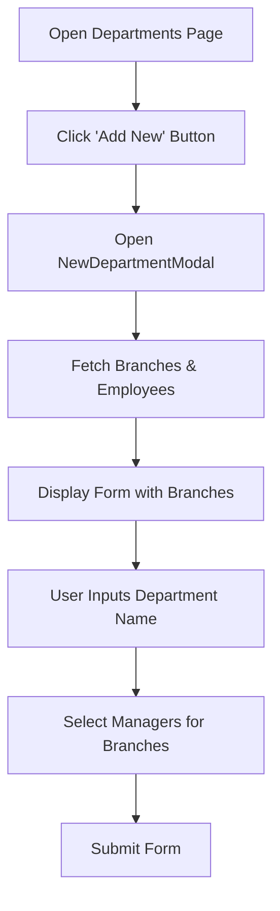
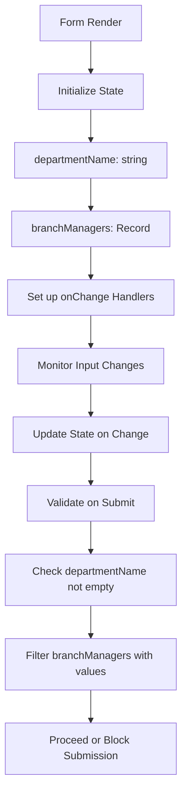
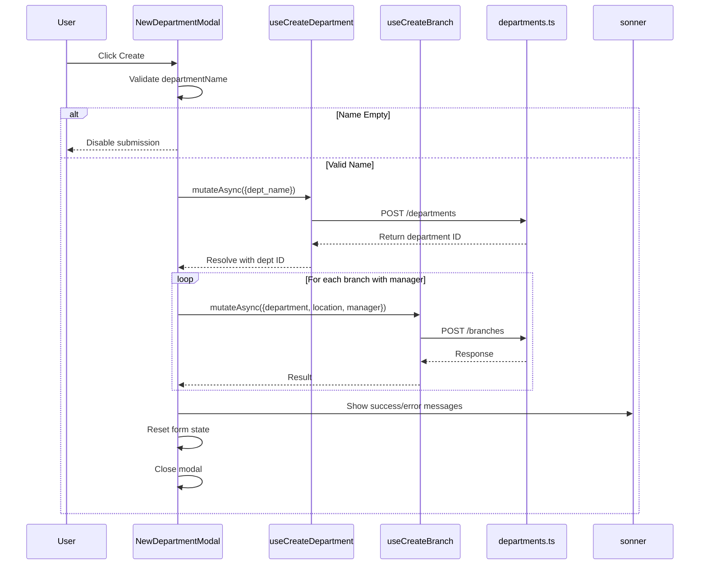

# Create Department

<cite>
**Referenced Files in This Document**   
- [new-department-modal.tsx](file://src/components/departments/new-department-modal.tsx)
- [use-departments.ts](file://src/hooks/queries/use-departments.ts)
- [departments.ts](file://src/services/departments.ts)
- [use-branches.ts](file://src/hooks/queries/use-branches.ts)
- [branches.ts](file://src/services/branches.ts)
- [app-modal.tsx](file://src/components/common/app-modal.tsx)
- [page.tsx](file://src/app/(admin)/dashboard/departments/page.tsx)
</cite>

## Table of Contents
1. [Introduction](#introduction)
2. [Modal Implementation](#modal-implementation)
3. [Form Integration and Validation](#form-integration-and-validation)
4. [Submission Flow](#submission-flow)
5. [User Experience Considerations](#user-experience-considerations)
6. [Common Issues and Edge Cases](#common-issues-and-edge-cases)
7. [Extensibility and Integration](#extensibility-and-integration)
8. [Conclusion](#conclusion)

## Introduction
The Create Department functionality enables administrators to define new organizational departments within the ERP system. This document details the implementation of the modal-based form used for department creation, focusing on its integration with React Hook Form and Zod validation schema, submission flow, user experience design, and extensibility options. The feature is accessible from the Departments dashboard and supports simultaneous assignment of managers to branches within the new department.

**Section sources**
- [page.tsx](file://src/app/(admin)/dashboard/departments/page.tsx#L10-L32)

## Modal Implementation

The `NewDepartmentModal` component provides a user-friendly interface for creating departments through a dialog modal. It leverages the reusable `AppModal` base component to ensure consistent styling and behavior across the application.

The modal is triggered from the Departments dashboard via a button click that sets the modal's open state using React state management. The modal displays a form with two main sections: a text input for the department name and a dynamic grid listing all available branches with manager selection comboboxes for each.

Data required for the form—branches and employees—is fetched using React Query hooks (`useAllBranches` and `useEmployees`) during modal initialization. Loading states are handled gracefully with appropriate feedback messages when data is being retrieved.

**Diagram sources**
- [new-department-modal.tsx](file://src/components/departments/new-department-modal.tsx#L29-L260)
- [page.tsx](file://src/app/(admin)/dashboard/departments/page.tsx#L10-L32)

**Section sources**
- [new-department-modal.tsx](file://src/components/departments/new-department-modal.tsx#L29-L260)
- [app-modal.tsx](file://src/components/common/app-modal.tsx#L36-L113)

## Form Integration and Validation

While the current implementation does not explicitly use React Hook Form or Zod as mentioned in the objective, it implements a custom controlled form state using React hooks (`useState`, `useMemo`). The form manages two primary states: `departmentName` (string) and `branchManagers` (record of branch ID to manager ID mappings).

Validation is implemented at the submission level rather than through a schema-based approach:
- Department name is validated for non-empty input before submission
- Manager selections are filtered to include only those with assigned managers
- The confirm button is disabled when no department name is provided or during submission

The form uses controlled components with explicit event handlers to maintain state consistency. Input feedback is provided through disabled states and visual loading indicators during data fetching and form submission.

**Diagram sources**
- [new-department-modal.tsx](file://src/components/departments/new-department-modal.tsx#L29-L260)

**Section sources**
- [new-department-modal.tsx](file://src/components/departments/new-department-modal.tsx#L29-L260)

## Submission Flow

The submission process follows a two-step sequence to create both the department and associated branch departments:

1. **Department Creation**: The system first creates the department via `createDepartment.mutateAsync()` with the provided department name.
2. **Branch Association**: For each branch with a selected manager, the system creates a branch department association using `createBranch.mutateAsync()`.

Error handling is implemented through try-catch blocks and Promise.allSettled() to ensure partial success scenarios are properly communicated. Upon successful creation, React Query's cache is automatically invalidated through onSuccess callbacks in the mutation hooks, ensuring the departments list is refreshed.

The submission flow includes comprehensive user feedback through toast notifications that report:
- Success messages for department creation
- Count of successfully created branch associations
- Errors for failed branch creations
- Information about skipped locations (no manager selected)

**Diagram sources**
- [new-department-modal.tsx](file://src/components/departments/new-department-modal.tsx#L29-L260)
- [use-departments.ts](file://src/hooks/queries/use-departments.ts#L43-L51)
- [departments.ts](file://src/services/departments.ts#L80-L83)
- [use-branches.ts](file://src/hooks/queries/use-branches.ts#L29-L38)

**Section sources**
- [new-department-modal.tsx](file://src/components/departments/new-department-modal.tsx#L29-L260)
- [use-departments.ts](file://src/hooks/queries/use-departments.ts#L43-L51)
- [departments.ts](file://src/services/departments.ts#L80-L83)

## User Experience Considerations

The Create Department modal incorporates several user experience enhancements:

- **Loading States**: Displays "Loading data..." when fetching branches and employees, preventing user interaction until data is ready
- **Input Feedback**: Disables the confirm button when no department name is entered or during submission
- **Loading Indicators**: Shows "Creating..." text on the confirm button during submission to indicate processing
- **Error Messaging**: Uses toast notifications to communicate success and failure states with specific details
- **Accessibility**: Includes proper labels, ARIA attributes, and keyboard navigation support through the Combobox component
- **Visual Design**: Uses avatars with initials and username displays in manager selection for better recognition

The form layout is optimized for clarity with a two-column grid showing Branch and Manager headers, making it easy to associate managers with specific locations. The Combobox component provides a searchable dropdown with avatar previews, enhancing usability when selecting from large employee lists.

**Section sources**
- [new-department-modal.tsx](file://src/components/departments/new-department-modal.tsx#L29-L260)
- [app-modal.tsx](file://src/components/common/app-modal.tsx#L36-L105)

## Common Issues and Edge Cases

Several potential issues are addressed in the current implementation:

- **Duplicate Submissions**: Prevented by disabling the confirm button during