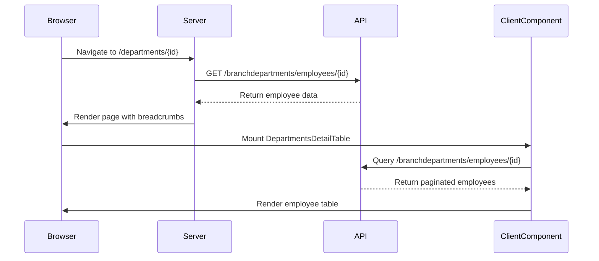
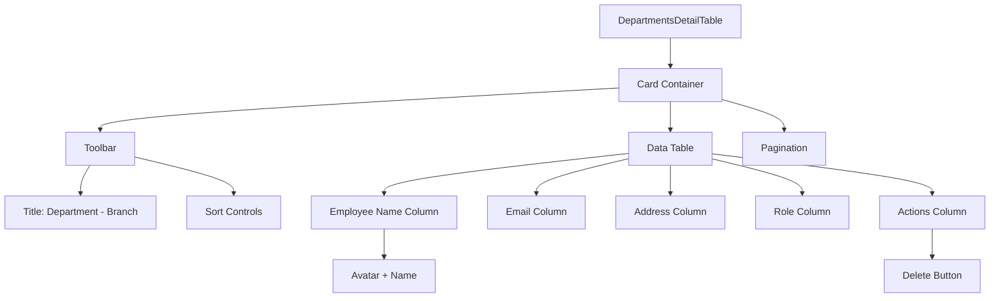
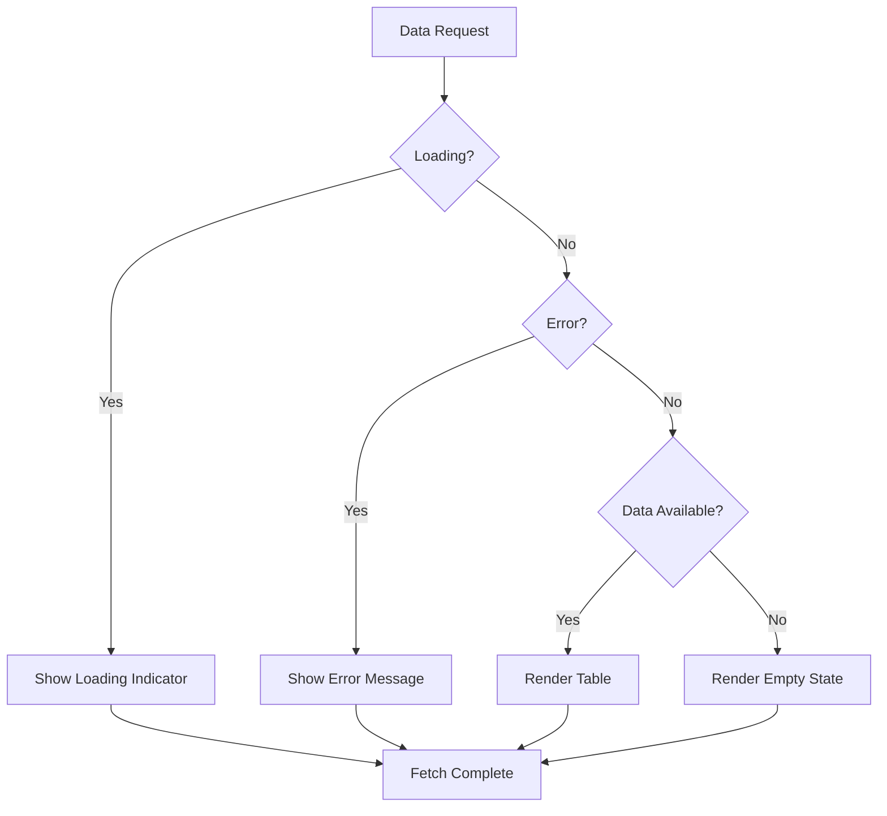

# Department Detail View

<cite>
**Referenced Files in This Document**   
- [page.tsx](file://src/app/(admin)/dashboard/departments/[id]/page.tsx)
- [departments-detail-table.tsx](file://src/components/departments/departments-detail-table.tsx)
- [use-departments.ts](file://src/hooks/queries/use-departments.ts)
- [departments.ts](file://src/services/departments.ts)
- [routes.ts](file://src/constants/routes.ts)
- [api-routes.ts](file://src/constants/api-routes.ts)
- [api.d.ts](file://src/types/api.d.ts)
</cite>

## Table of Contents
1. [Introduction](#introduction)
2. [Dynamic Route Implementation](#dynamic-route-implementation)
3. [Data Retrieval and State Management](#data-retrieval-and-state-management)
4. [UI Structure and Presentation](#ui-structure-and-presentation)
5. [Error Handling and Loading States](#error-handling-and-loading-states)
6. [User Experience and Navigation](#user-experience-and-navigation)
7. [Extension and Customization](#extension-and-customization)
8. [Common Issues and Troubleshooting](#common-issues-and-troubleshooting)

## Introduction
The Department Detail View provides a comprehensive interface for viewing and managing department-specific information within the ERP system. This view enables administrators to examine employee listings, organizational hierarchy, and department metadata through a structured and intuitive interface. The implementation leverages Next.js dynamic routing, React Server Components, and client-side data fetching to deliver a responsive user experience.

**Section sources**
- [page.tsx](file://src/app/(admin)/dashboard/departments/[id]/page.tsx#L1-L53)

## Dynamic Route Implementation
The Department Detail View utilizes Next.js dynamic routing through the `[id]` parameter in the file path `src/app/(admin)/dashboard/departments/[id]/page.tsx`. This route pattern enables the system to handle requests for any department ID dynamically. The page component receives the ID parameter through the `params` prop, which is typed as a Promise to accommodate Next.js App Router's asynchronous rendering capabilities.

The route structure follows the pattern defined in `ROUTES.ADMIN.DEPARTMENTS_ID`, which generates URLs in the format `/dashboard/departments/{id}`. When a user navigates to a specific department, the dynamic segment captures the branch department ID, which serves as the primary key for data retrieval operations.

```mermaid
flowchart TD
A[User Navigation] --> B{Route Pattern Match}
B --> C[/dashboard/departments/[id]/]
C --> D[Extract ID Parameter]
D --> E[Fetch Department Data]
E --> F[Render Detail View]
```

**Diagram sources**
- [page.tsx](file://src/app/(admin)/dashboard/departments/[id]/page.tsx#L1-L53)
- [routes.ts](file://src/constants/routes.ts#L0-L34)

**Section sources**
- [page.tsx](file://src/app/(admin)/dashboard/departments/[id]/page.tsx#L1-L53)
- [routes.ts](file://src/constants/routes.ts#L25-L26)

## Data Retrieval and State Management
The Department Detail View implements a two-phase data retrieval strategy to optimize performance and user experience. The server component in `page.tsx` initiates data fetching during server-side rendering to populate breadcrumb information with department and branch names. This initial fetch uses the `getBranchDepartmentEmployees` service function with the captured ID parameter.

The client component `DepartmentsDetailTable` manages subsequent data operations using React Query through the `useBranchDepartmentEmployees` hook. This hook implements caching with a stale time of 60,000 milliseconds, reducing unnecessary network requests. The data flow follows a structured pattern: the server component passes the branch department ID to the client component, which then manages pagination, sorting, and real-time data updates.



**Diagram sources**
- [page.tsx](file://src/app/(admin)/dashboard/departments/[id]/page.tsx#L15-L35)
- [departments-detail-table.tsx](file://src/components/departments/departments-detail-table.tsx#L15-L25)
- [use-departments.ts](file://src/hooks/queries/use-departments.ts#L22-L32)

**Section sources**
- [page.tsx](file://src/app/(admin)/dashboard/departments/[id]/page.tsx#L15-L35)
- [departments-detail-table.tsx](file://src/components/departments/departments-detail-table.tsx#L15-L25)
- [use-departments.ts](file://src/hooks/queries/use-departments.ts#L22-L32)
- [departments.ts](file://src/services/departments.ts#L130-L152)

## UI Structure and Presentation
The Department Detail View presents information through the `DepartmentsDetailTable` component, which displays employee data in a structured tabular format. The table includes columns for employee name, email, address, role, and action buttons. Employee names are displayed with avatars that show profile pictures when available, with fallback initials generated from the name.

The UI implements responsive design principles with grid-based column layouts that adapt to different screen sizes. The table header and row styling use consistent CSS classes to maintain visual hierarchy, with hover effects on rows to enhance interactivity. The toolbar displays the department and branch name in the title, providing immediate context for the displayed data.



**Diagram sources**
- [departments-detail-table.tsx](file://src/components/departments/departments-detail-table.tsx#L0-L180)

**Section sources**
- [departments-detail-table.tsx](file://src/components/departments/departments-detail-table.tsx#L0-L180)

## Error Handling and Loading States
The Department Detail View implements comprehensive error handling and loading state management to ensure a robust user experience. During server-side rendering, the page component wraps the initial data fetch in a try-catch block, allowing it to gracefully handle API failures by defaulting to generic "Department" and "Branch" labels in breadcrumbs.

The client component employs React Query's built-in error handling, displaying user-friendly messages when data retrieval fails. Loading states are managed through the query's `isLoading` flag, which renders a loading indicator while data is being fetched. The component also handles empty states by returning an empty array when no employee data is available, preventing rendering errors.



**Diagram sources**
- [departments-detail-table.tsx](file://src/components/departments/departments-detail-table.tsx#L75-L110)

**Section sources**
- [page.tsx](file://src/app/(admin)/dashboard/departments/[id]/page.tsx#L20-L35)
- [departments-detail-table.tsx](file://src/components/departments/departments-detail-table.tsx#L75-L110)

## User Experience and Navigation
The Department Detail View enhances user experience through contextual breadcrumbs, intuitive navigation, and consistent UI patterns. The breadcrumb trail includes links back to the dashboard and departments list, enabling one-click navigation to higher-level views. The page title dynamically updates based on the retrieved department and branch names, providing immediate context.

Navigation to the detail view is typically initiated from the departments list table, where each row contains a clickable link that uses the `ROUTES.ADMIN.DEPARTMENTS_ID` function to generate the appropriate URL. This consistent navigation pattern ensures users can easily move between list and detail views while maintaining application state.

**Section sources**
- [page.tsx](file://src/app/(admin)/dashboard/departments/[id]/page.tsx#L36-L52)
- [routes.ts](file://src/constants/routes.ts#L25-L26)
- [departments-table.tsx](file://src/components/departments/departments-table.tsx#L196-L223)

## Extension and Customization
The Department Detail View can be extended with additional tabs or related data sections through component composition. The current implementation provides a foundation for adding tabs for department metrics, performance reviews, or training records. Customization options include adding filter controls, export functionality, or integration with other ERP modules such as payroll or time tracking.

To extend the view, developers can modify the `DepartmentsDetailTable` component to accept additional props for related data, or create new tab components that share the same data context. The use of React Query ensures that additional data requests can be efficiently managed alongside the primary employee data.

**Section sources**
- [departments-detail-table.tsx](file://src/components/departments/departments-detail-table.tsx#L38-L45)

## Common Issues and Troubleshooting
Common issues with the Department Detail View include data consistency problems, loading sequence conflicts, and navigation errors. When department IDs are invalid or missing, the view defaults to generic labels but may fail to load employee data. To troubleshoot, verify that the branch department ID exists in the database and that the user has appropriate permissions.

Loading sequence issues may occur when the server-side fetch completes after client-side rendering begins. This can be addressed by ensuring proper error boundaries and loading state management. Navigation problems can be resolved by validating route parameters and implementing client-side guards to prevent access to unauthorized departments.

**Section sources**
- [page.tsx](file://src/app/(admin)/dashboard/departments/[id]/page.tsx#L20-L35)
- [departments-detail-table.tsx](file://src/components/departments/departments-detail-table.tsx#L75-L110)