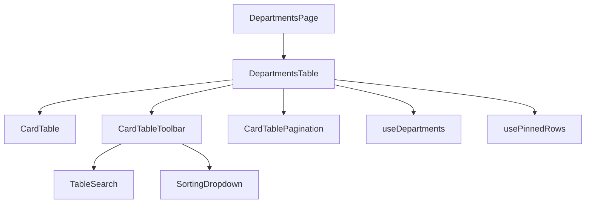
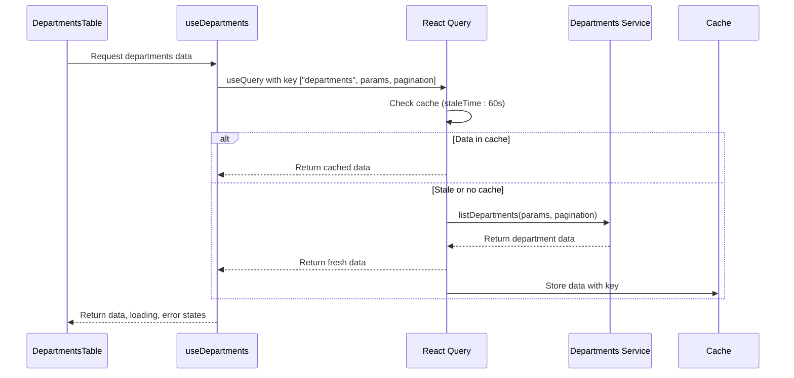
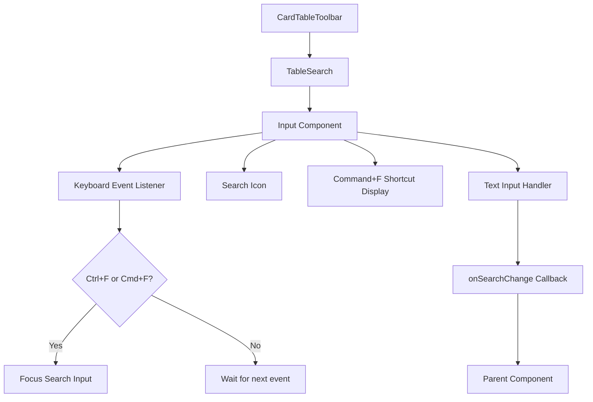
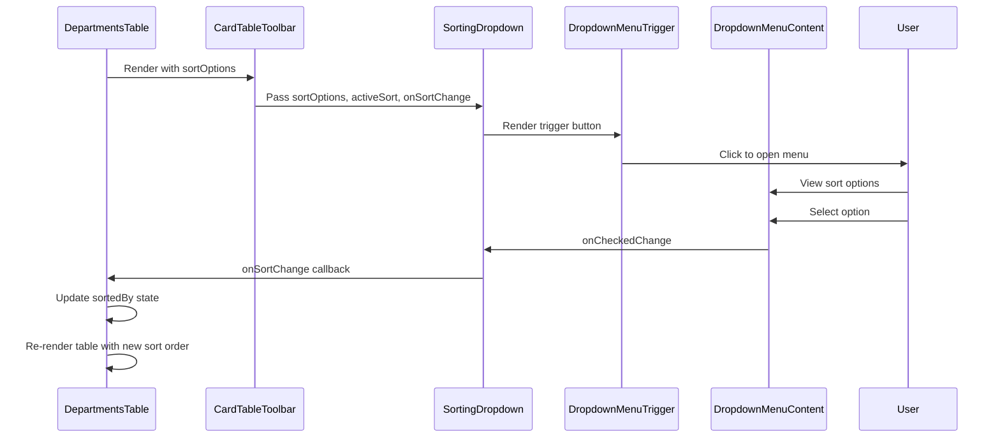
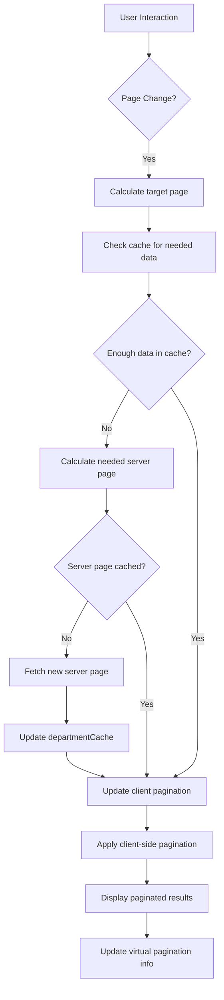
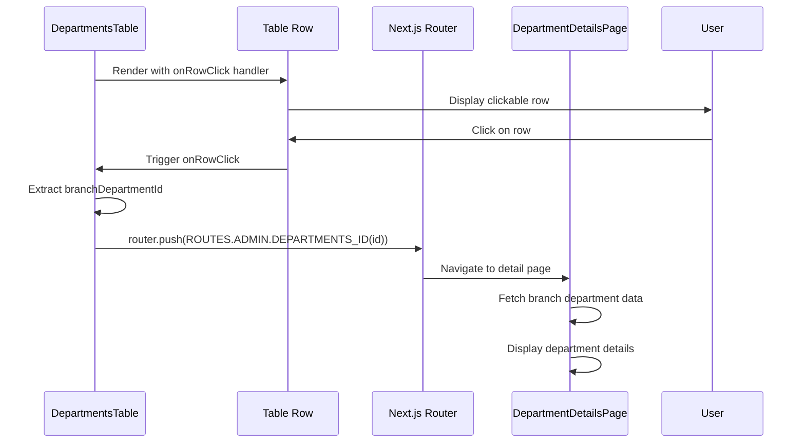
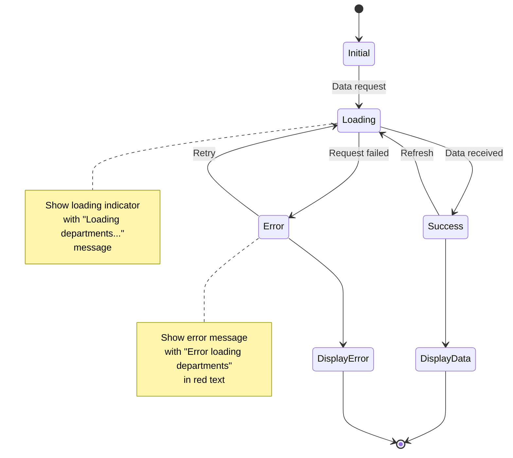
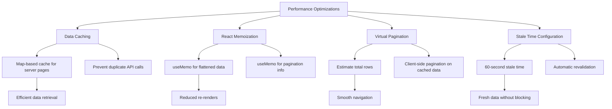

# Departments List

<cite>
**Referenced Files in This Document**   
- [departments-table.tsx](file://src/components/departments/departments-table.tsx)
- [card-table.tsx](file://src/components/card-table/card-table.tsx)
- [use-departments.ts](file://src/hooks/queries/use-departments.ts)
- [departments.ts](file://src/services/departments.ts)
- [card-table-toolbar.tsx](file://src/components/card-table/card-table-toolbar.tsx)
- [table-search.tsx](file://src/components/card-table/table-search.tsx)
- [sorting-dropdown.tsx](file://src/components/card-table/sorting-dropdown.tsx)
- [card-table-pagination.tsx](file://src/components/card-table/card-table-pagination.tsx)
- [page.tsx](file://src/app/(admin)/dashboard/departments/page.tsx)
- [pagination-utils.ts](file://src/lib/pagination-utils.ts)
- [departments-detail-table.tsx](file://src/components/departments/departments-detail-table.tsx)
- [new-department-modal.tsx](file://src/components/departments/new-department-modal.tsx)
</cite>

## Table of Contents
1. [Introduction](#introduction)
2. [Core Components Overview](#core-components-overview)
3. [Data Fetching and Caching](#data-fetching-and-caching)
4. [Table Implementation](#table-implementation)
5. [Toolbar and Search Functionality](#toolbar-and-search-functionality)
6. [Sorting Mechanism](#sorting-mechanism)
7. [Pagination Strategy](#pagination-strategy)
8. [Row Actions and Navigation](#row-actions-and-navigation)
9. [Loading and Empty States](#loading-and-empty-states)
10. [Performance Optimization](#performance-optimization)
11. [Customization and Extensibility](#customization-and-extensibility)

## Introduction
The Departments List feature provides a comprehensive interface for managing organizational departments across multiple branches. This document details the implementation of the paginated departments table, focusing on the integration of React Query for data fetching, the hybrid pagination strategy, and the component architecture that enables efficient data display and interaction.

**Section sources**
- [departments-table.tsx](file://src/components/departments/departments-table.tsx#L1-L245)
- [page.tsx](file://src/app/(admin)/dashboard/departments/page.tsx#L1-L35)

## Core Components Overview
The Departments List feature is built around several key components that work together to provide a seamless user experience. The main components include the DepartmentsTable, which orchestrates the display of department data, and the underlying CardTable infrastructure that provides the table rendering capabilities.



**Diagram sources**
- [departments-table.tsx](file://src/components/departments/departments-table.tsx#L1-L245)
- [card-table.tsx](file://src/components/card-table/card-table.tsx#L1-L139)
- [card-table-toolbar.tsx](file://src/components/card-table/card-table-toolbar.tsx#L1-L61)
- [card-table-pagination.tsx](file://src/components/card-table/card-table-pagination.tsx#L1-L132)

**Section sources**
- [departments-table.tsx](file://src/components/departments/departments-table.tsx#L1-L245)
- [card-table.tsx](file://src/components/card-table/card-table.tsx#L1-L139)

## Data Fetching and Caching
The Departments List feature utilizes React Query through the useDepartments hook to handle data fetching, caching, and revalidation. This approach ensures efficient data management and optimal performance.



**Diagram sources**
- [use-departments.ts](file://src/hooks/queries/use-departments.ts#L11-L20)
- [departments.ts](file://src/services/departments.ts#L74-L108)

**Section sources**
- [use-departments.ts](file://src/hooks/queries/use-departments.ts#L11-L20)
- [departments.ts](file://src/services/departments.ts#L74-L108)

## Table Implementation
The DepartmentsTable component implements a sophisticated table structure that handles complex data relationships between departments and their branch locations. The table uses a hybrid approach to manage data from multiple server pages while providing client-side pagination.

```mermaid
classDiagram
class DepartmentsTable {
+serverPagination : {page, pageSize}
+clientPagination : {pageIndex, pageSize}
+departmentCache : Map<number, Department[]>
+allFlattenedDepartments : DepartmentRow[]
+paginatedDepartments : DepartmentRow[]
+totalEstimatedRows : number
}
class DepartmentRow {
+id : string
+branchDepartmentId : string
+department : string
+branchLocation : string
+managerName : string
+staffCount : number
}
class Department {
+id : number
+dept_name : string
+employee_count : number
+branch_departments : BranchDepartment[]
}
class BranchDepartment {
+id : number
+branch : Branch
+employee_count : number
+manager : Manager
}
DepartmentsTable --> DepartmentRow : "creates"
DepartmentsTable --> Department : "fetches"
Department --> BranchDepartment : "contains"
```

**Diagram sources**
- [departments-table.tsx](file://src/components/departments/departments-table.tsx#L29-L241)
- [departments.ts](file://src/services/departments.ts#L14-L35)

**Section sources**
- [departments-table.tsx](file://src/components/departments/departments-table.tsx#L29-L241)

## Toolbar and Search Functionality
The table toolbar provides essential controls for searching and filtering department data. The TableSearch component implements keyboard shortcuts and a clean interface for text-based filtering.



**Diagram sources**
- [card-table-toolbar.tsx](file://src/components/card-table/card-table-toolbar.tsx#L1-L61)
- [table-search.tsx](file://src/components/card-table/table-search.tsx#L1-L48)

**Section sources**
- [card-table-toolbar.tsx](file://src/components/card-table/card-table-toolbar.tsx#L1-L61)
- [table-search.tsx](file://src/components/card-table/table-search.tsx#L1-L48)

## Sorting Mechanism
The sorting functionality is implemented through the SortingDropdown component, which provides a user-friendly interface for selecting sort criteria. The component integrates with the table's sorting state to enable dynamic data ordering.



**Diagram sources**
- [card-table-toolbar.tsx](file://src/components/card-table/card-table-toolbar.tsx#L1-L61)
- [sorting-dropdown.tsx](file://src/components/card-table/sorting-dropdown.tsx#L1-L33)

**Section sources**
- [card-table-toolbar.tsx](file://src/components/card-table/card-table-toolbar.tsx#L1-L61)
- [sorting-dropdown.tsx](file://src/components/card-table/sorting-dropdown.tsx#L1-L33)

## Pagination Strategy
The Departments List implements a sophisticated hybrid pagination strategy that combines server-side and client-side pagination to optimize performance while maintaining a smooth user experience.



**Diagram sources**
- [departments-table.tsx](file://src/components/departments/departments-table.tsx#L29-L241)
- [card-table-pagination.tsx](file://src/components/card-table/card-table-pagination.tsx#L1-L132)
- [pagination-utils.ts](file://src/lib/pagination-utils.ts#L1-L121)

**Section sources**
- [departments-table.tsx](file://src/components/departments/departments-table.tsx#L29-L241)
- [card-table-pagination.tsx](file://src/components/card-table/card-table-pagination.tsx#L1-L132)

## Row Actions and Navigation
The table implements row-level actions and navigation through dynamic routing, enabling users to interact with department records and access detailed views.



**Diagram sources**
- [departments-table.tsx](file://src/components/departments/departments-table.tsx#L29-L241)
- [departments-detail-table.tsx](file://src/components/departments/departments-detail-table.tsx#L1-L180)
- [page.tsx](file://src/app/(admin)/dashboard/departments/[id]/page.tsx#L1-L53)

**Section sources**
- [departments-table.tsx](file://src/components/departments/departments-table.tsx#L29-L241)
- [departments-detail-table.tsx](file://src/components/departments/departments-detail-table.tsx#L1-L180)

## Loading and Empty States
The implementation includes comprehensive handling of loading and error states to provide feedback during data fetching operations and in case of failures.



**Diagram sources**
- [departments-table.tsx](file://src/components/departments/departments-table.tsx#L29-L241)
- [departments-detail-table.tsx](file://src/components/departments/departments-detail-table.tsx#L1-L180)

**Section sources**
- [departments-table.tsx](file://src/components/departments/departments-table.tsx#L29-L241)

## Performance Optimization
The Departments List feature incorporates several performance optimizations to handle large datasets efficiently, including data caching, memoization, and virtual pagination.



**Diagram sources**
- [departments-table.tsx](file://src/components/departments/departments-table.tsx#L29-L241)
- [use-departments.ts](file://src/hooks/queries/use-departments.ts#L11-L20)
- [pagination-utils.ts](file://src/lib/pagination-utils.ts#L1-L121)

**Section sources**
- [departments-table.tsx](file://src/components/departments/departments-table.tsx#L29-L241)
- [use-departments.ts](file://src/hooks/queries/use-departments.ts#L11-L20)

## Customization and Extensibility
The component architecture supports customization and extension through configurable props and modular design, allowing for adaptation to various use cases.

```mermaid
classDiagram
class CardTable {
+columns : ColumnDef<TData, TValue>[]
+data : TData[]
+toolbar : ReactNode
+footer : Function
+rowClassName : Function
+onRowClick : Function
}
class DepartmentsTable {
+className : string
}
class CardTableToolbar {
+title : string
+sortOptions : {label, value}[]
+activeSort : string
+onSortChange : Function
+onSearchChange : Function
}
class CardTablePagination {
+paginationInfo : PaginationInfo
+onPageChange : Function
}
DepartmentsTable --> CardTable : "uses"
DepartmentsTable --> CardTableToolbar : "uses"
DepartmentsTable --> CardTablePagination : "uses"
CardTable ..> CardTableToolbar : "accepts as prop"
CardTable ..> CardTablePagination : "accepts as prop"
```

**Diagram sources**
- [card-table.tsx](file://src/components/card-table/card-table.tsx#L1-L139)
- [departments-table.tsx](file://src