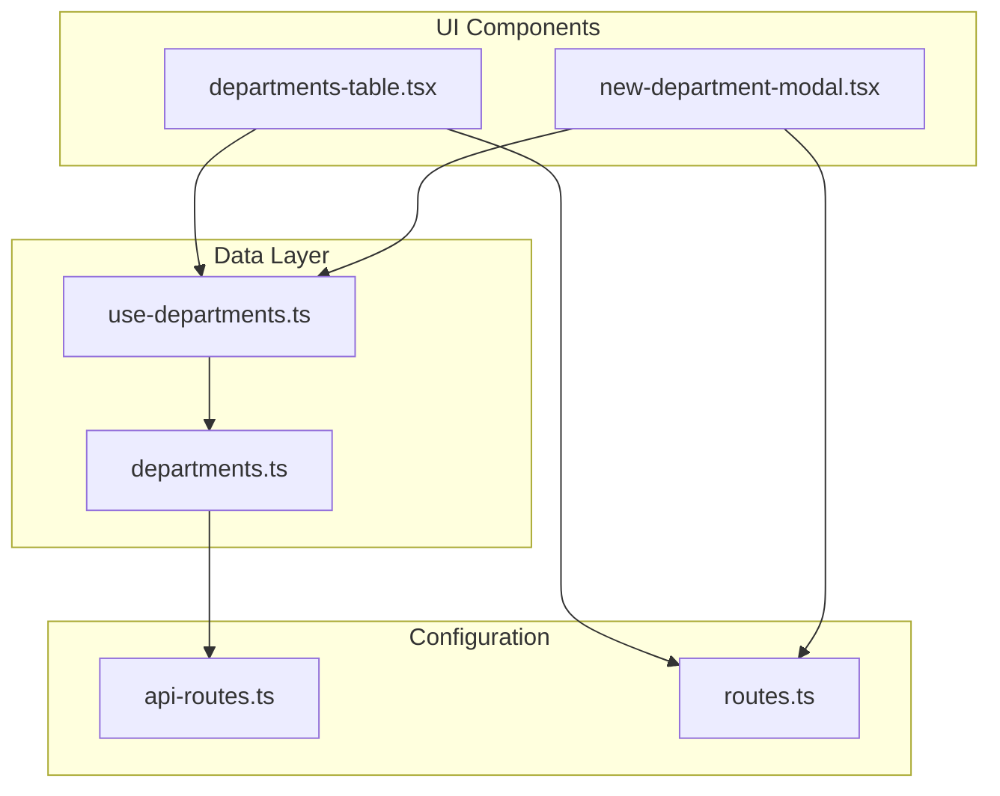
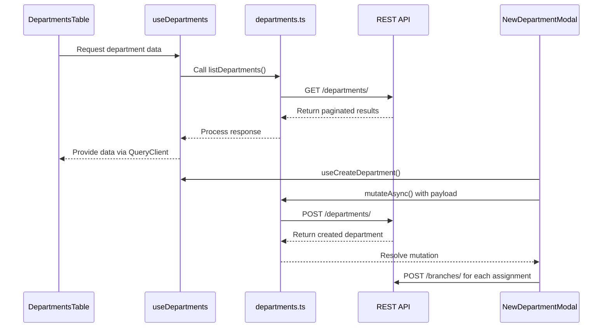
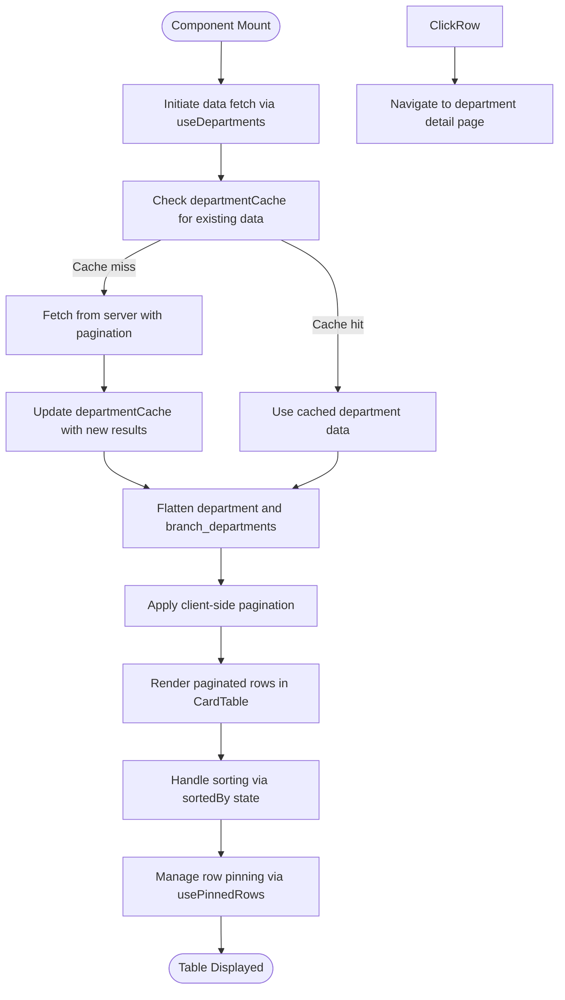
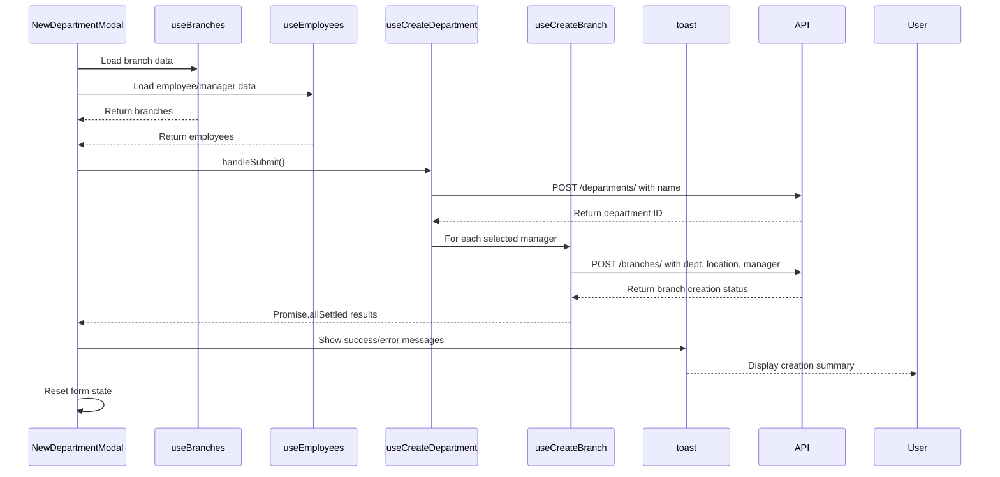
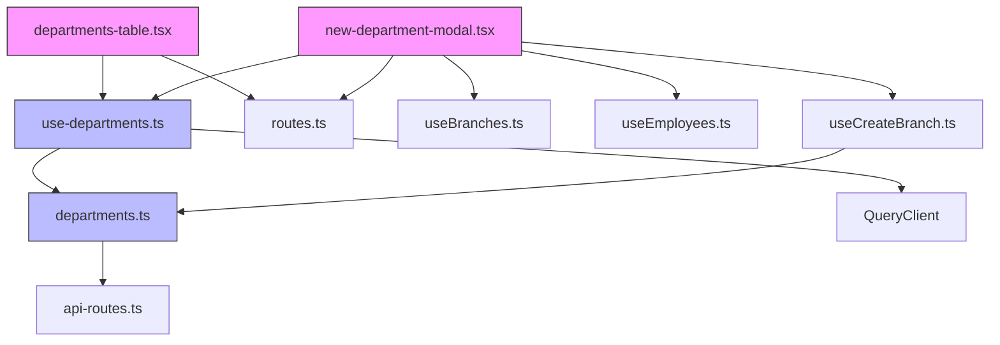

# Departments

<cite>
**Referenced Files in This Document**   
- [departments-table.tsx](file://src/components/departments/departments-table.tsx)
- [new-department-modal.tsx](file://src/components/departments/new-department-modal.tsx)
- [use-departments.ts](file://src/hooks/queries/use-departments.ts)
- [departments.ts](file://src/services/departments.ts)
- [api-routes.ts](file://src/constants/api-routes.ts)
- [routes.ts](file://src/constants/routes.ts)
</cite>

## Table of Contents
1. [Introduction](#introduction)
2. [Project Structure](#project-structure)
3. [Core Components](#core-components)
4. [Architecture Overview](#architecture-overview)
5. [Detailed Component Analysis](#detailed-component-analysis)
6. [Dependency Analysis](#dependency-analysis)
7. [Performance Considerations](#performance-considerations)
8. [Troubleshooting Guide](#troubleshooting-guide)
9. [Conclusion](#conclusion)

## Introduction
The Departments module is a central component of the CartwrightKing Admin ERP system, designed to organize company structure by functional units across multiple branches. This module enables administrators to view, manage, and create departments with associated branch-level configurations, including staffing and managerial assignments. It integrates seamlessly with employee and branch data to provide a comprehensive organizational view.

## Project Structure
The Departments module is organized under the admin dashboard with dedicated routes for listing, creating, and viewing individual departments. The implementation follows a component-based architecture with clear separation between UI components, data services, and routing logic.

**Diagram sources**
- [departments-table.tsx](file://src/components/departments/departments-table.tsx)
- [new-department-modal.tsx](file://src/components/departments/new-department-modal.tsx)
- [use-departments.ts](file://src/hooks/queries/use-departments.ts)
- [departments.ts](file://src/services/departments.ts)
- [api-routes.ts](file://src/constants/api-routes.ts)
- [routes.ts](file://src/constants/routes.ts)

**Section sources**
- [departments-table.tsx](file://src/components/departments/departments-table.tsx)
- [new-department-modal.tsx](file://src/components/departments/new-department-modal.tsx)

## Core Components
The Departments module consists of two primary components: the departments table for displaying organizational data and the modal interface for creating new departments. These components work in conjunction with custom hooks and API services to provide a complete management solution.

**Section sources**
- [departments-table.tsx](file://src/components/departments/departments-table.tsx#L29-L241)
- [new-department-modal.tsx](file://src/components/departments/new-department-modal.tsx#L29-L260)

## Architecture Overview
The Departments module follows a layered architecture pattern with distinct responsibilities for UI presentation, state management, data fetching, and API integration. The system implements server-side pagination for efficient data loading while maintaining client-side virtual pagination for smooth user experience.

**Diagram sources**
- [departments-table.tsx](file://src/components/departments/departments-table.tsx#L29-L241)
- [use-departments.ts](file://src/hooks/queries/use-departments.ts#L11-L20)
- [departments.ts](file://src/services/departments.ts#L44-L73)
- [new-department-modal.tsx](file://src/components/departments/new-department-modal.tsx#L29-L260)

## Detailed Component Analysis

### Departments Table Analysis
The DepartmentsTable component implements a sophisticated data presentation system that handles hierarchical department-branch relationships. It combines server-side and client-side pagination to efficiently display flattened data while maintaining performance.

**Diagram sources**
- [departments-table.tsx](file://src/components/departments/departments-table.tsx#L29-L241)

**Section sources**
- [departments-table.tsx](file://src/components/departments/departments-table.tsx#L29-L241)

### New Department Modal Analysis
The NewDepartmentModal component provides a form-based interface for creating departments with branch-specific configurations. It orchestrates multiple API calls to establish department-branch relationships and handles asynchronous operations with appropriate user feedback.

**Diagram sources**
- [new-department-modal.tsx](file://src/components/departments/new-department-modal.tsx#L29-L260)

**Section sources**
- [new-department-modal.tsx](file://src/components/departments/new-department-modal.tsx#L29-L260)

## Dependency Analysis
The Departments module has well-defined dependencies across the application stack, following a unidirectional data flow pattern. The component hierarchy ensures separation of concerns while maintaining necessary integration points.

**Diagram sources**
- [departments-table.tsx](file://src/components/departments/departments-table.tsx)
- [new-department-modal.tsx](file://src/components/departments/new-department-modal.tsx)
- [use-departments.ts](file://src/hooks/queries/use-departments.ts)
- [departments.ts](file://src/services/departments.ts)
- [api-routes.ts](file://src/constants/api-routes.ts)
- [routes.ts](file://src/constants/routes.ts)

**Section sources**
- [departments-table.tsx](file://src/components/departments/departments-table.tsx)
- [new-department-modal.tsx](file://src/components/departments/new-department-modal.tsx)
- [use-departments.ts](file://src/hooks/queries/use-departments.ts)
- [departments.ts](file://src/services/departments.ts)

## Performance Considerations
The Departments module implements several performance optimizations to handle potentially large datasets efficiently:

1. **Caching Strategy**: The `departmentCache` Map stores server responses by page number, preventing redundant API calls when navigating between pages.

2. **Virtual Pagination**: The component uses server pagination for data retrieval but implements client-side virtual pagination for the flattened department-branch data, reducing the number of API calls while maintaining responsive UI.

3. **Memoization**: Critical computations like data flattening and pagination are wrapped in `useMemo` to prevent unnecessary recalculations during re-renders.

4. **Stale Time Configuration**: The `useDepartments` hook configures a 60-second stale time, balancing data freshness with network efficiency.

5. **Batched Operations**: When creating multiple branch departments, the system uses `Promise.allSettled` to process operations in parallel rather than sequentially.

**Section sources**
- [departments-table.tsx](file://src/components/departments/departments-table.tsx#L29-L241)
- [use-departments.ts](file://src/hooks/queries/use-departments.ts#L11-L20)

## Troubleshooting Guide
Common issues in the Departments module typically relate to data loading, form submission, and hierarchical data display. The following patterns address these concerns:

### Hierarchical Data Display Issues
When dealing with department-branch relationships, ensure the data transformation correctly flattens the hierarchy:
- Verify that `branch_departments` array is properly processed
- Check that manager data is safely accessed with null checks
- Confirm pagination calculations account for the flattened row count

### Form Submission Handling
The modal form handles complex submission logic with multiple API calls:
- Ensure department creation completes before branch creation attempts
- Implement proper error handling with `Promise.allSettled` to allow partial success
- Provide clear feedback about which operations succeeded or failed
- Reset form state appropriately after submission

### Data Fetching Problems
Address common data loading issues by:
- Verifying API route configuration in `api-routes.ts`
- Checking query parameters and pagination settings
- Ensuring proper cache invalidation after mutations
- Validating that dependent data (branches, employees) loads correctly

**Section sources**
- [departments-table.tsx](file://src/components/departments/departments-table.tsx#L29-L241)
- [new-department-modal.tsx](file://src/components/departments/new-department-modal.tsx#L29-L260)
- [use-departments.ts](file://src/hooks/queries/use-departments.ts#L11-L20)
- [departments.ts](file://src/services/departments.ts#L44-L73)

## Conclusion
The Departments module provides a robust solution for organizing company structure by functional units, with comprehensive features for data display, creation, and management. Its architecture balances performance and usability through strategic caching, virtual pagination, and clear separation of concerns. The implementation demonstrates effective use of React patterns, custom hooks, and API integration to create a maintainable and scalable component system. Future enhancements could include additional department attributes, workflow approvals, or integration with organizational chart visualization.