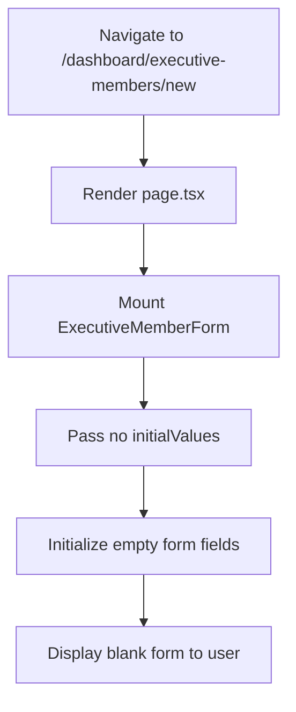
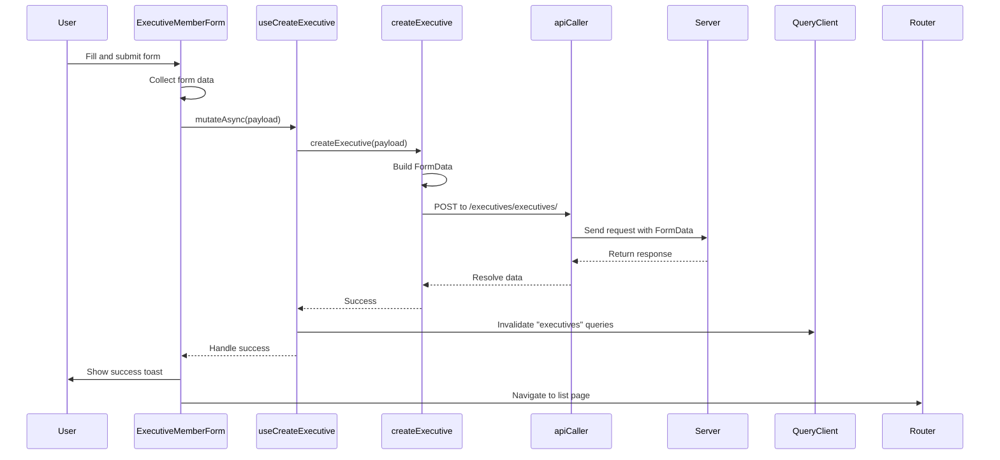
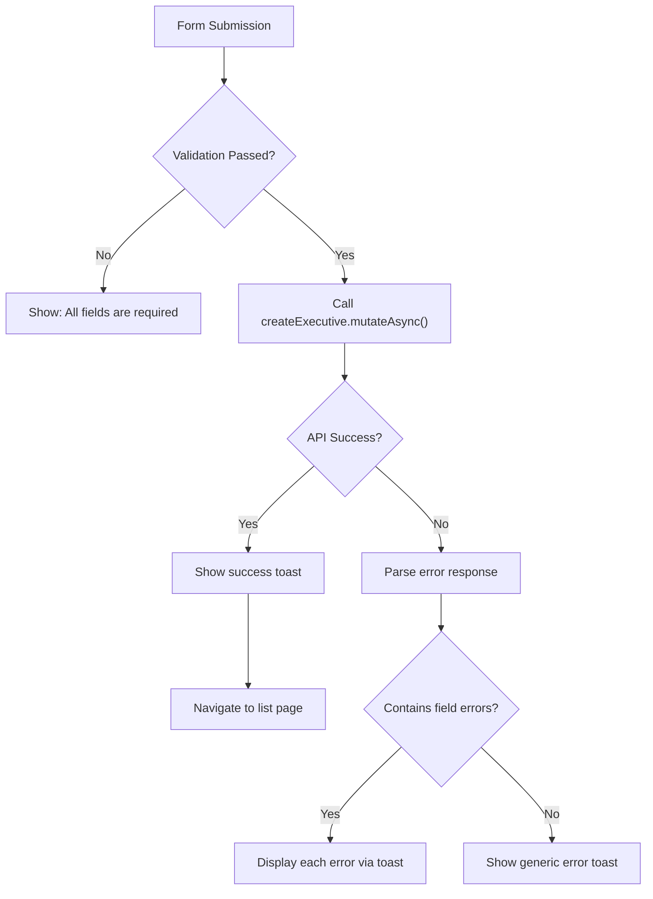

# Create New Executive Member

<cite>
**Referenced Files in This Document**   
- [executive-member-form.tsx](file://src/components/executive-members/executive-member-form.tsx)
- [executive-members.ts](file://src/services/executive-members.ts)
- [use-executive-members.ts](file://src/hooks/queries/use-executive-members.ts)
- [api-routes.ts](file://src/constants/api-routes.ts)
- [routes.ts](file://src/constants/routes.ts)
</cite>

## Table of Contents
1. [Introduction](#introduction)
2. [Form Initialization and Structure](#form-initialization-and-structure)
3. [Form Submission Flow](#form-submission-flow)
4. [Validation and Data Integrity](#validation-and-data-integrity)
5. [File Upload Handling](#file-upload-handling)
6. [Success and Error Handling](#success-and-error-handling)
7. [Default Values and Conditional Logic](#default-values-and-conditional-logic)
8. [Conclusion](#conclusion)

## Introduction
This document details the process of creating a new executive member within the CartwrightKing Admin ERP system. It covers the initialization of the form, submission workflow, validation mechanisms, file upload support, and navigation behavior upon success or failure. The implementation leverages React Hook Form patterns via custom hooks, integrates Zod-based validation implicitly through type safety, and uses React Query for data mutation and state management.

**Section sources**
- [executive-member-form.tsx](file://src/components/executive-members/executive-member-form.tsx#L1-L267)
- [use-executive-members.ts](file://src/hooks/queries/use-executive-members.ts#L32-L41)

## Form Initialization and Structure

The creation of a new executive member begins at the `/dashboard/executive-members/new` route, which renders the `page.tsx` component. This page instantiates the `ExecutiveMemberForm` component without any `initialValues`, resulting in a completely empty form ready for user input.

The `ExecutiveMemberForm` component accepts an optional `initialValues` prop of type `ExecutiveMemberInitialValues`. When this prop is undefined (as in the case of creating a new record), all fields are rendered with blank values. The form includes inputs for name, address, city, phone, email, role selection, profile picture upload, and a rich text editor for education details.

**Diagram sources**
- [executive-member-form.tsx](file://src/components/executive-members/executive-member-form.tsx#L43-L55)
- [routes.ts](file://src/constants/routes.ts#L0-L29)

**Section sources**
- [executive-member-form.tsx](file://src/components/executive-members/executive-member-form.tsx#L43-L55)
- [routes.ts](file://src/constants/routes.ts#L0-L29)

## Form Submission Flow

When the user submits the form, the `handleSubmit` function is triggered. This function collects data from both the HTML form elements and React-controlled components such as the rich text editor and file dropzone.

The collected data is structured into a payload that conforms to the `ExecutiveCreateRequest` interface. This payload is then passed to either `createExecutive.mutateAsync()` (for new entries) or `updateExecutive.mutateAsync()` (for edits). In the context of creating a new executive, the `createExecutive` mutation is used.

The `createExecutive` function internally constructs a `FormData` object to support file uploads. Each field from the payload is appended to this `FormData` instance before being sent via a POST request to the API endpoint defined in `API_ROUTES.EXECUTIVE_MEMBERS.CREATE`, which resolves to `/executives/executives/`.

**Diagram sources**
- [executive-member-form.tsx](file://src/components/executive-members/executive-member-form.tsx#L100-L150)
- [executive-members.ts](file://src/services/executive-members.ts#L56-L76)
- [use-executive-members.ts](file://src/hooks/queries/use-executive-members.ts#L32-L41)

**Section sources**
- [executive-member-form.tsx](file://src/components/executive-members/executive-member-form.tsx#L100-L150)
- [executive-members.ts](file://src/services/executive-members.ts#L56-L76)
- [use-executive-members.ts](file://src/hooks/queries/use-executive-members.ts#L32-L41)

## Validation and Data Integrity

Data integrity is enforced through a combination of client-side validation and server-side constraints. On the client side, the form performs basic presence checks for all required fields including name, email, role, address, city, phone, and education. If any required field is missing, a toast notification displays the error "All fields are required".

The form uses React Hook Form principles indirectly through controlled components and manual data collection. While explicit Zod schema validation is not visible in the code, the `ExecutiveCreateRequest` type enforces structural type safety at compile time, ensuring only valid shapes can be passed to the service layer.

Additionally, the email field uses native HTML5 validation (`type="email"`), providing built-in format checking.

**Section sources**
- [executive-member-form.tsx](file://src/components/executive-members/executive-member-form.tsx#L110-L130)

## File Upload Handling

Profile picture uploads are handled through the `Dropzone` UI component. Users can select an image file, which is stored in the component's `selectedFiles` state. During form submission, if a file has been selected, it is appended to the `FormData` object under the key `profile_picture`.

The `createExecutive` service function specifically checks whether `profile_picture` is an instance of `File`. If so, it appends it directly; otherwise, it handles string URLs or null values accordingly. This ensures compatibility with both new file uploads and existing image references.

The `apiCaller` utility automatically sets the `Content-Type` header to `undefined` when `dataType="formdata"`, allowing Axios to correctly set the `multipart/form-data` boundary header required for file uploads.

**Section sources**
- [executive-member-form.tsx](file://src/components/executive-members/executive-member-form.tsx#L200-L215)
- [executive-members.ts](file://src/services/executive-members.ts#L60-L67)
- [api-caller.ts](file://src/lib/api-caller.ts#L12-L82)

## Success and Error Handling

Upon successful creation of a new executive member, a success toast notification appears with the message "Executive member created successfully". The application then navigates back to the executive members list page using `router.push(ROUTES.ADMIN.EXECUTIVE_MEMBERS)`.

In case of errors, the system parses the response from the server. If the response contains field-specific messages (e.g., duplicate email), these are extracted and displayed as individual toast notifications. For example, if a duplicate entry is detected, the backend may return `{ "email": ["This email already exists."] }`, which gets converted into a user-facing error toast.

Generic errors trigger a fallback message: "Failed to save. Please try again."

**Diagram sources**
- [executive-member-form.tsx](file://src/components/executive-members/executive-member-form.tsx#L140-L180)
- [sonner.tsx](file://src/components/ui/sonner.tsx#L5-L22)

**Section sources**
- [executive-member-form.tsx](file://src/components/executive-members/executive-member-form.tsx#L140-L180)

## Default Values and Conditional Logic

The form supports conditional logic primarily through role selection and image handling:

- **Role Selection**: The role field uses a `SelectableTags` component with predefined options (CEO, CTO, CFO, etc.). The currently selected role is tracked via `selectedRoleId`. When a user selects a role, the last selected ID becomes the active value.
  
- **Profile Picture**: If editing an existing record, the form displays the current profile image via `initialPreviewUrls`. Removing the picture sets `isRemovingPicture` to `true`, which sends `null` to the server to indicate deletion.

- **Education Field**: The rich text editor's content is synchronized via `educationHtml`, which updates on change and falls back to the `education` input value if no HTML content is present.

Default values are entirely driven by the optional `initialValues` prop. For new entries, no defaults are applied, ensuring a clean slate.

**Section sources**
- [executive-member-form.tsx](file://src/components/executive-members/executive-member-form.tsx#L50-L90)

## Conclusion

The process of creating a new executive member is a well-integrated flow that combines form initialization, client-side validation, file upload support, and robust error handling. By leveraging React Query mutations and FormData serialization, the system ensures reliable communication with the backend while maintaining a responsive user experience. Navigation after creation enhances usability, and clear feedback mechanisms help prevent data entry issues.