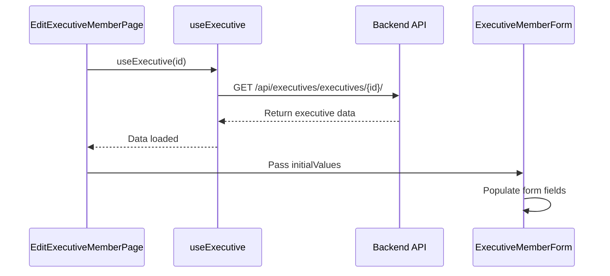
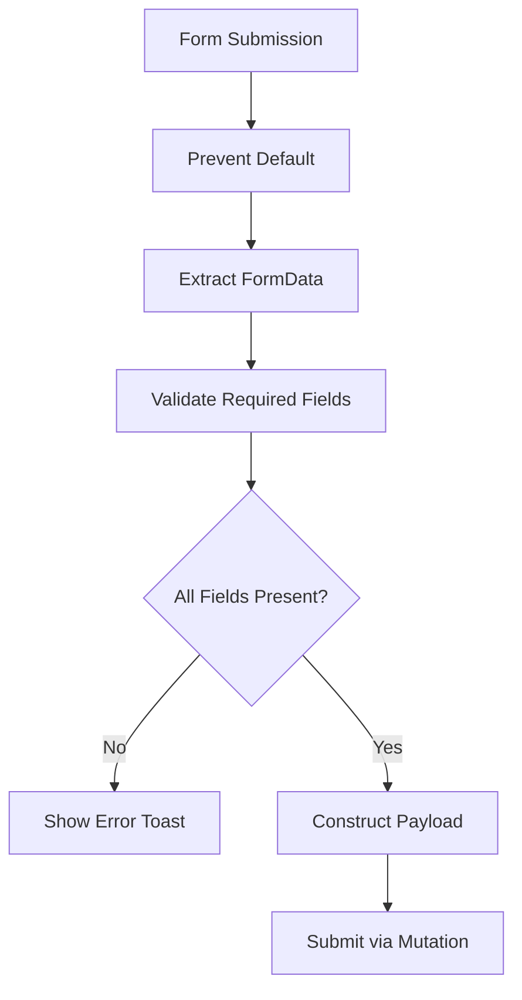
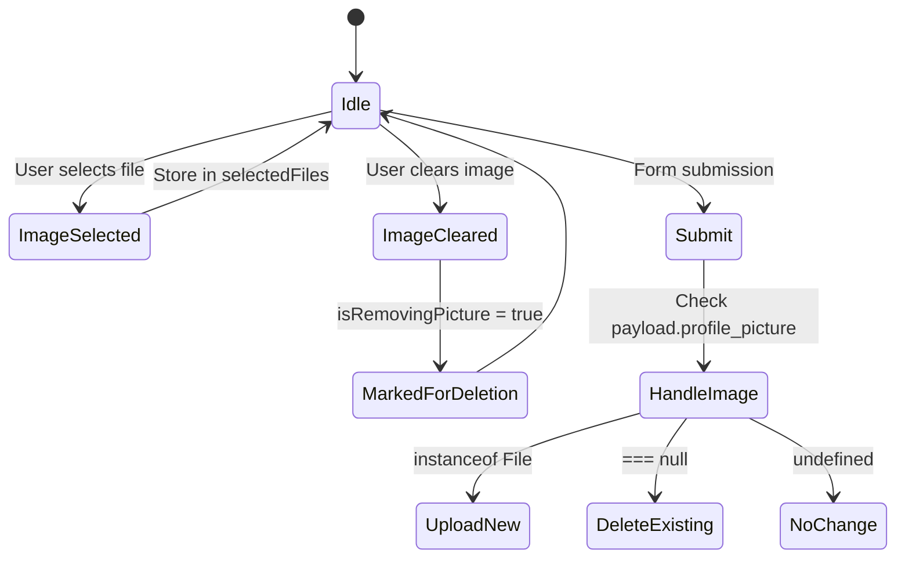
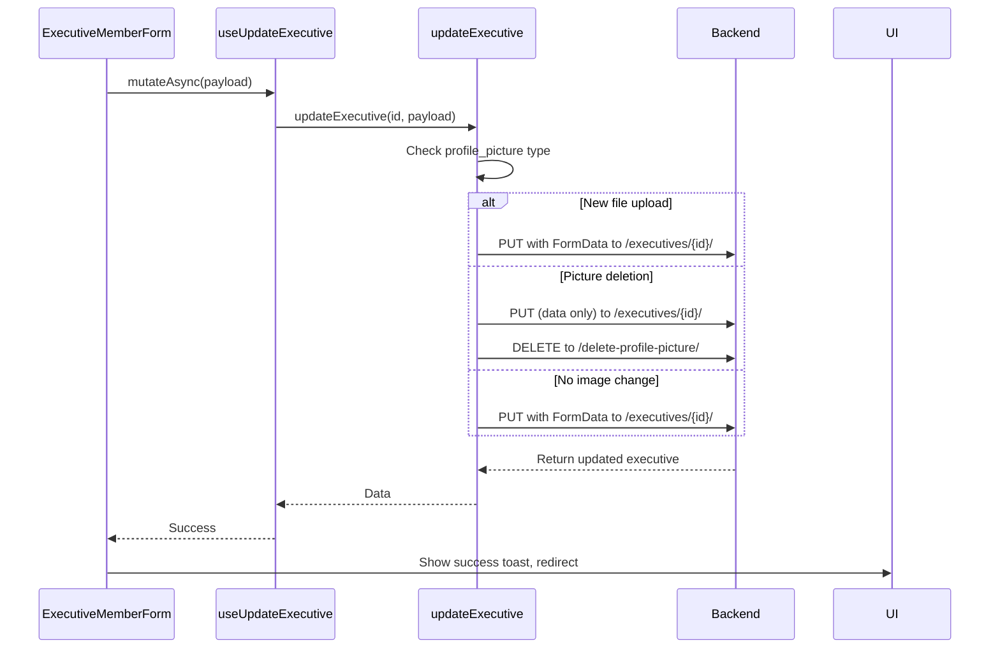

# Edit Executive Member Profile

<cite>
**Referenced Files in This Document**   
- [edit/page.tsx](file://src/app/(admin)/dashboard/executive-members/[id]/edit/page.tsx)
- [executive-member-form.tsx](file://src/components/executive-members/executive-member-form.tsx)
- [use-executive-members.ts](file://src/hooks/queries/use-executive-members.ts)
- [executive-members.ts](file://src/services/executive-members.ts)
- [api-routes.ts](file://src/constants/api-routes.ts)
</cite>

## Table of Contents
1. [Introduction](#introduction)
2. [Form Initialization and Data Prefilling](#form-initialization-and-data-prefilling)
3. [Form Validation and State Management](#form-validation-and-state-management)
4. [Image Upload and Deletion](#image-upload-and-deletion)
5. [Update Flow and API Integration](#update-flow-and-api-integration)
6. [Submit Handler and Button Integration](#submit-handler-and-button-integration)
7. [Error Handling and User Feedback](#error-handling-and-user-feedback)
8. [Best Practices for Form State and UX](#best-practices-for-form-state-and-ux)

## Introduction
This document details the implementation of the executive member profile editing functionality in the CartwrightKing Admin ERP system. It covers the full lifecycle of editing an executive member, from data fetching and form initialization to submission, image handling, and error management. The implementation leverages React Query for data fetching and mutation, form state management via React hooks, and integrates with backend APIs through dedicated service functions.

**Section sources**
- [edit/page.tsx](file://src/app/(admin)/dashboard/executive-members/[id]/edit/page.tsx#L1-L67)

## Form Initialization and Data Prefilling
The edit page initializes by retrieving the executive member ID from the URL parameters using `useParams`. It then fetches the existing executive member data via the `useExecutive` hook, which queries the `GET /api/executives/executives/{id}/` endpoint. Upon successful retrieval, the fetched data is transformed into `ExecutiveMemberInitialValues` and passed to the `ExecutiveMemberForm` component to pre-fill all form fields.

The form supports both creation and editing modes via the `isEdit` flag, and conditionally renders based on whether `initialValues` are available. Loading and error states are handled gracefully with appropriate UI feedback.

**Diagram sources**
- [edit/page.tsx](file://src/app/(admin)/dashboard/executive-members/[id]/edit/page.tsx#L1-L67)
- [use-executive-members.ts](file://src/hooks/queries/use-executive-members.ts#L23-L30)
- [executive-member-form.tsx](file://src/components/executive-members/executive-member-form.tsx#L25-L266)

**Section sources**
- [edit/page.tsx](file://src/app/(admin)/dashboard/executive-members/[id]/edit/page.tsx#L1-L67)
- [use-executive-members.ts](file://src/hooks/queries/use-executive-members.ts#L23-L30)

## Form Validation and State Management
Form validation is implemented through a combination of HTML5 constraints and manual validation in the `handleSubmit` function. All fields are required, and validation is performed before submission. The form uses React state to manage dynamic inputs such as role selection, education content (via RichTextEditor), and file uploads.

The `SelectableTags` component provides a user-friendly interface for role selection, with predefined options including CEO, CTO, CFO, and others. The education field uses a rich text editor that supports formatted content, with its state managed via `educationHtml`.

**Diagram sources**
- [executive-member-form.tsx](file://src/components/executive-members/executive-member-form.tsx#L44-L266)

**Section sources**
- [executive-member-form.tsx](file://src/components/executive-members/executive-member-form.tsx#L25-L266)

## Image Upload and Deletion
Image handling is managed through the `Dropzone` component, which supports file selection, preview, and clearing. When a new image is selected, it is stored in `selectedFiles` state. If the user clears the image and an existing `profileImageUrl` is present, `isRemovingPicture` is set to `true`, indicating that the profile picture should be deleted upon submission.

The system supports three image scenarios:
1. No change to existing image
2. Upload of a new image (handled via `FormData`)
3. Explicit deletion of current image (sent as `null` in payload)

**Diagram sources**
- [executive-member-form.tsx](file://src/components/executive-members/executive-member-form.tsx#L25-L266)
- [executive-members.ts](file://src/services/executive-members.ts#L78-L141)

**Section sources**
- [executive-member-form.tsx](file://src/components/executive-members/executive-member-form.tsx#L25-L266)

## Update Flow and API Integration
The update process is orchestrated through the `useUpdateExecutive` mutation, which calls the `updateExecutive` service function. This function determines the appropriate action based on the `profile_picture` field in the payload:

- If a `File` object is present, it sends a `PUT` request with `FormData` to `/api/executives/executives/{id}/`
- If `null` is specified, it first updates the executive data, then calls `DELETE /api/executives/executives/{id}/delete-profile-picture/`
- Otherwise, it performs a standard `PUT` update without image changes

The API routes are defined in `api-routes.ts`, ensuring consistent endpoint references across the application.

**Diagram sources**
- [executive-member-form.tsx](file://src/components/executive-members/executive-member-form.tsx#L44-L44)
- [use-executive-members.ts](file://src/hooks/queries/use-executive-members.ts#L43-L53)
- [executive-members.ts](file://src/services/executive-members.ts#L78-L141)
- [api-routes.ts](file://src/constants/api-routes.ts#L90-L99)

**Section sources**
- [executive-members.ts](file://src/services/executive-members.ts#L78-L141)
- [use-executive-members.ts](file://src/hooks/queries/use-executive-members.ts#L43-L53)

## Submit Handler and Button Integration
The form uses a ref-based pattern to enable external submission. The `ExecutiveMemberForm` accepts an `onRegisterSubmit` callback that registers the submit function with the parent component. This allows the "Save" button in the `PageHeader` to trigger form submission without being inside the form element.

The `formRef` is used with `requestSubmit()` to trigger native form validation and the `handleSubmit` function. This pattern decouples the submit button from the form structure while maintaining proper HTML form behavior.

**Diagram sources**
- [edit/page.tsx](file://src/app/(admin)/dashboard/executive-members/[id]/edit/page.tsx#L1-L67)
- [executive-member-form.tsx](file://src/components/executive-members/executive-member-form.tsx#L25-L266)

**Section sources**
- [edit/page.tsx](file://src/app/(admin)/dashboard/executive-members/[id]/edit/page.tsx#L1-L67)
- [executive-member-form.tsx](file://src/components/executive-members/executive-member-form.tsx#L25-L266)

## Error Handling and User Feedback
Error handling is implemented in the `handleSubmit` function's catch block. API response errors are parsed and displayed as individual toast notifications. Field-specific errors from the backend are extracted from the response data and shown with their respective field names.

Network errors or unknown issues trigger a generic "Failed to save" message. Success submissions redirect to the executive members list with a confirmation toast. The `useMutation` hooks also handle query invalidation to ensure fresh data is fetched after successful operations.

**Section sources**
- [executive-member-form.tsx](file://src/components/executive-members/executive-member-form.tsx#L25-L266)

## Best Practices for Form State and UX
The implementation follows several best practices:
- **Controlled Components**: Form fields are controlled via `defaultValue` and state management
- **Progressive Enhancement**: External submit button enhances usability without breaking core functionality
- **Optimistic Updates**: React Query handles cache invalidation for seamless data synchronization
- **Graceful Degradation**: Loading and error states are clearly communicated
- **Accessibility**: Proper labels, form structure, and semantic HTML
- **Performance**: `useMemo` for static role options and `useEffect` dependency optimization
- **Type Safety**: Comprehensive TypeScript interfaces for requests, responses, and form values

These patterns ensure a maintainable, user-friendly, and robust form implementation that can be extended or modified with minimal risk.

**Section sources**
- [executive-member-form.tsx](file://src/components/executive-members/executive-member-form.tsx#L25-L266)
- [use-executive-members.ts](file://src/hooks/queries/use-executive-members.ts#L43-L53)
- [executive-members.ts](file://src/services/executive-members.ts#L78-L141)