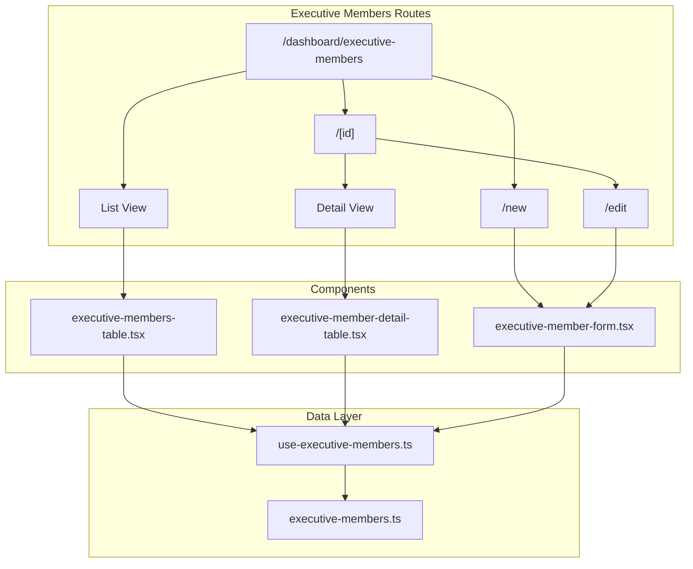
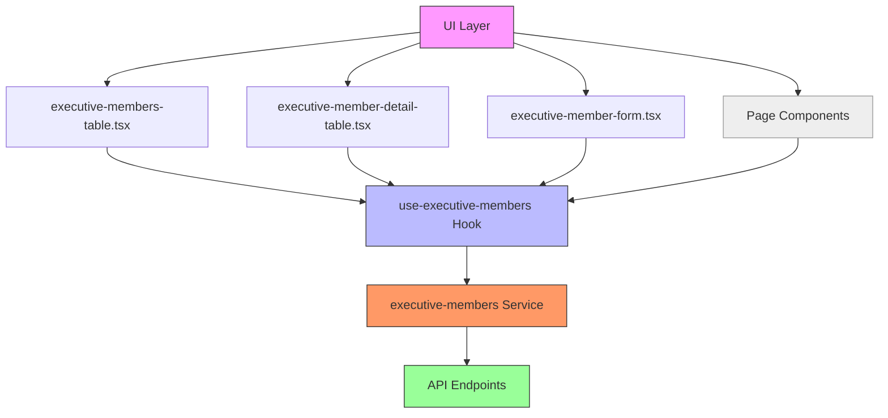
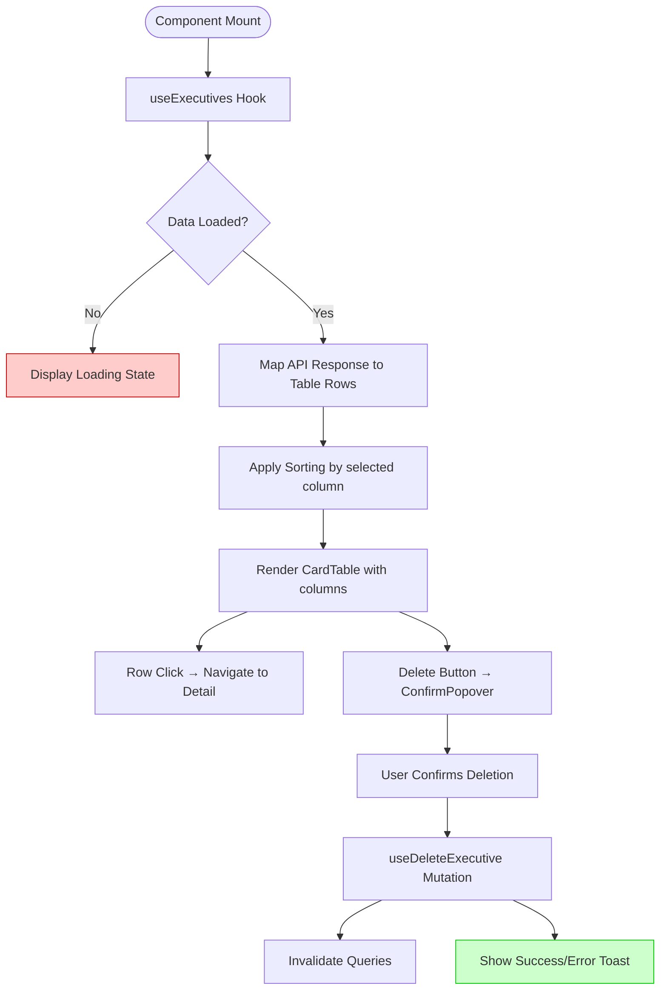
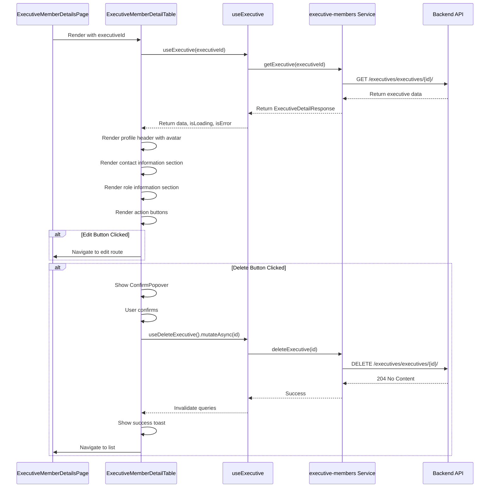
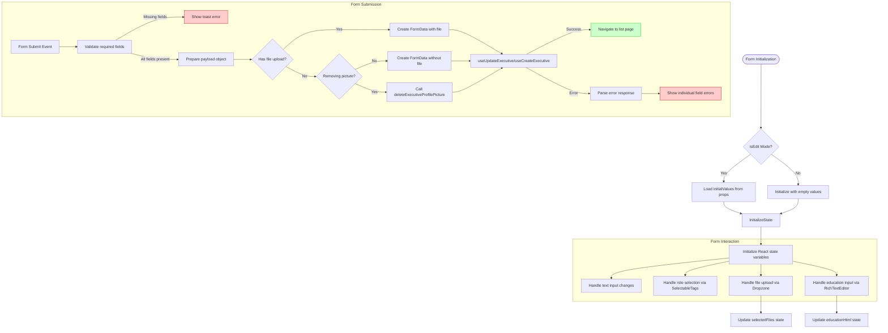
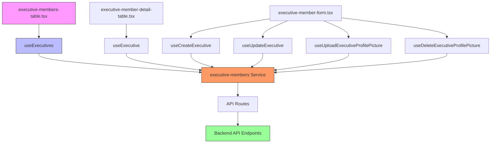

# Executive Members

<cite>
**Referenced Files in This Document**   
- [executive-members.ts](file://src/services/executive-members.ts)
- [use-executive-members.ts](file://src/hooks/queries/use-executive-members.ts)
- [executive-member-form.tsx](file://src/components/executive-members/executive-member-form.tsx)
- [executive-members-table.tsx](file://src/components/executive-members/executive-members-table.tsx)
- [executive-member-detail-table.tsx](file://src/components/executive-members/executive-member-detail-table.tsx)
- [page.tsx](file://src/app/(admin)/dashboard/executive-members/page.tsx)
- [page.tsx](file://src/app/(admin)/dashboard/executive-members/[id]/page.tsx)
- [page.tsx](file://src/app/(admin)/dashboard/executive-members/new/page.tsx)
- [page.tsx](file://src/app/(admin)/dashboard/executive-members/[id]/edit/page.tsx)
- [api-routes.ts](file://src/constants/api-routes.ts)
- [routes.ts](file://src/constants/routes.ts)
</cite>

## Table of Contents
1. [Introduction](#introduction)
2. [Project Structure](#project-structure)
3. [Core Components](#core-components)
4. [Architecture Overview](#architecture-overview)
5. [Detailed Component Analysis](#detailed-component-analysis)
6. [Dependency Analysis](#dependency-analysis)
7. [Performance Considerations](#performance-considerations)
8. [Troubleshooting Guide](#troubleshooting-guide)
9. [Conclusion](#conclusion)

## Introduction
The Executive Members feature provides a comprehensive interface for managing leadership team profiles within the Cartwright King ERP system. This documentation details the implementation of CRUD (Create, Read, Update, Delete) operations for executive members, focusing on the user interface components, data management hooks, and service layer integration. The system enables administrators to maintain accurate leadership information including personal details, roles, education, and profile pictures through an intuitive interface.

## Project Structure
The Executive Members feature follows a structured organization within the Next.js application, with dedicated routes for different operations and reusable components for consistent UI patterns. The feature is organized under the admin dashboard with specific sub-routes for listing, viewing details, creating, and editing executive members.

**Diagram sources**
- [page.tsx](file://src/app/(admin)/dashboard/executive-members/page.tsx)
- [page.tsx](file://src/app/(admin)/dashboard/executive-members/[id]/page.tsx)
- [page.tsx](file://src/app/(admin)/dashboard/executive-members/new/page.tsx)
- [page.tsx](file://src/app/(admin)/dashboard/executive-members/[id]/edit/page.tsx)

**Section sources**
- [page.tsx](file://src/app/(admin)/dashboard/executive-members/page.tsx)
- [page.tsx](file://src/app/(admin)/dashboard/executive-members/[id]/page.tsx)
- [page.tsx](file://src/app/(admin)/dashboard/executive-members/new/page.tsx)
- [page.tsx](file://src/app/(admin)/dashboard/executive-members/[id]/edit/page.tsx)

## Core Components
The Executive Members feature consists of several core components that work together to provide a complete management interface. The system uses a component-based architecture with clear separation between presentation, data management, and service layers. Key components include the executive members table for listing records, detail table for viewing comprehensive information, and form component for data entry and editing operations.

**Section sources**
- [executive-members-table.tsx](file://src/components/executive-members/executive-members-table.tsx)
- [executive-member-detail-table.tsx](file://src/components/executive-members/executive-member-detail-table.tsx)
- [executive-member-form.tsx](file://src/components/executive-members/executive-member-form.tsx)

## Architecture Overview
The Executive Members feature implements a layered architecture that follows React best practices with proper separation of concerns. The system uses React Server Components for route handlers, client components for interactive elements, and a custom hook-based data management approach for state synchronization.

**Diagram sources**
- [executive-members-table.tsx](file://src/components/executive-members/executive-members-table.tsx)
- [executive-member-detail-table.tsx](file://src/components/executive-members/executive-member-detail-table.tsx)
- [executive-member-form.tsx](file://src/components/executive-members/executive-member-form.tsx)
- [use-executive-members.ts](file://src/hooks/queries/use-executive-members.ts)
- [executive-members.ts](file://src/services/executive-members.ts)

## Detailed Component Analysis

### Executive Members Table Analysis
The ExecutiveMembersTable component provides a paginated, sortable interface for viewing all executive members. It integrates with the useExecutives hook to fetch data and displays key information including name, email, role, city, and phone number in a tabular format. The table includes action buttons for deletion and pinning records, with proper loading and error states.

**Diagram sources**
- [executive-members-table.tsx](file://src/components/executive-members/executive-members-table.tsx)
- [use-executive-members.ts](file://src/hooks/queries/use-executive-members.ts)

**Section sources**
- [executive-members-table.tsx](file://src/components/executive-members/executive-members-table.tsx)

### Executive Member Detail Analysis
The ExecutiveMemberDetailTable component provides a comprehensive view of an individual executive member's information. It fetches data using the useExecutive hook and displays personal details, contact information, and role information in a structured layout. The component includes edit and delete actions with proper navigation and confirmation workflows.

**Diagram sources**
- [executive-member-detail-table.tsx](file://src/components/executive-members/executive-member-detail-table.tsx)
- [use-executive-members.ts](file://src/hooks/queries/use-executive-members.ts)
- [executive-members.ts](file://src/services/executive-members.ts)

**Section sources**
- [executive-member-detail-table.tsx](file://src/components/executive-members/executive-member-detail-table.tsx)

### Executive Member Form Analysis
The ExecutiveMemberForm component handles both creation and editing of executive member records. It manages form state including file uploads for profile pictures and rich text input for education details. The form implements client-side validation and integrates with React Query mutations for data persistence.

**Diagram sources**
- [executive-member-form.tsx](file://src/components/executive-members/executive-member-form.tsx)
- [use-executive-members.ts](file://src/hooks/queries/use-executive-members.ts)
- [executive-members.ts](file://src/services/executive-members.ts)

**Section sources**
- [executive-member-form.tsx](file://src/components/executive-members/executive-member-form.tsx)

## Dependency Analysis
The Executive Members feature has a well-defined dependency chain that ensures proper data flow and state management. The components depend on custom hooks for data operations, which in turn depend on service functions that communicate with the backend API.

**Diagram sources**
- [executive-members-table.tsx](file://src/components/executive-members/executive-members-table.tsx)
- [executive-member-detail-table.tsx](file://src/components/executive-members/executive-member-detail-table.tsx)
- [executive-member-form.tsx](file://src/components/executive-members/executive-member-form.tsx)
- [use-executive-members.ts](file://src/hooks/queries/use-executive-members.ts)
- [executive-members.ts](file://src/services/executive-members.ts)
- [api-routes.ts](file://src/constants/api-routes.ts)

**Section sources**
- [executive-members-table.tsx](file://src/components/executive-members/executive-members-table.tsx)
- [executive-member-detail-table.tsx](file://src/components/executive-members/executive-member-detail-table.tsx)
- [executive-member-form.tsx](file://src/components/executive-members/executive-member-form.tsx)
- [use-executive-members.ts](file://src/hooks/queries/use-executive-members.ts)
- [executive-members.ts](file://src/services/executive-members.ts)

## Performance Considerations
The Executive Members feature implements several performance optimizations to ensure responsive user experience. The use of React Query provides automatic caching with a 60-second stale time, reducing unnecessary API calls when users navigate between views. The component structure follows React best practices with proper memoization of expensive computations through useMemo hooks. Form state management is optimized to minimize re-renders, and file uploads are handled efficiently through FormData objects that support streaming to the server. The table component implements virtualization concepts through pagination and selective rendering of only visible content.

## Troubleshooting Guide
Common issues with the Executive Members feature typically relate to form validation, file uploads, and permission handling. When form submission fails, check that all required fields (name, address, city, phone, email, role, education) are populated. For image upload failures, verify that the file is an image type and under the 800x400 pixel size limit enforced by the Dropzone component. If data fails to load, check network connectivity and API endpoint availability. The system implements comprehensive error handling with toast notifications that display specific validation errors from the backend API. For role-based access issues, ensure the authenticated user has appropriate permissions to perform CRUD operations on executive members. When debugging, examine the network tab to verify API requests and responses, and check the console for any JavaScript errors that might prevent component rendering.

**Section sources**
- [executive-member-form.tsx](file://src/components/executive-members/executive-member-form.tsx)
- [executive-members.ts](file://src/services/executive-members.ts)
- [use-executive-members.ts](file://src/hooks/queries/use-executive-members.ts)

## Conclusion
The Executive Members feature provides a robust and user-friendly interface for managing leadership team profiles within the Cartwright King ERP system. The implementation follows modern React patterns with proper separation of concerns between UI components, data management hooks, and service layers. The system supports full CRUD operations with comprehensive validation and error handling. Key strengths include the consistent use of React Query for data synchronization, efficient form state management, and proper handling of file uploads for profile pictures. The architecture allows for easy maintenance and extension, with clear pathways for adding new features or modifying existing functionality.