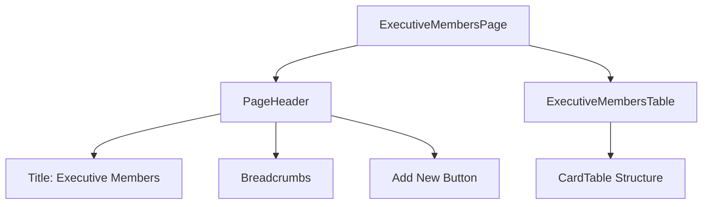
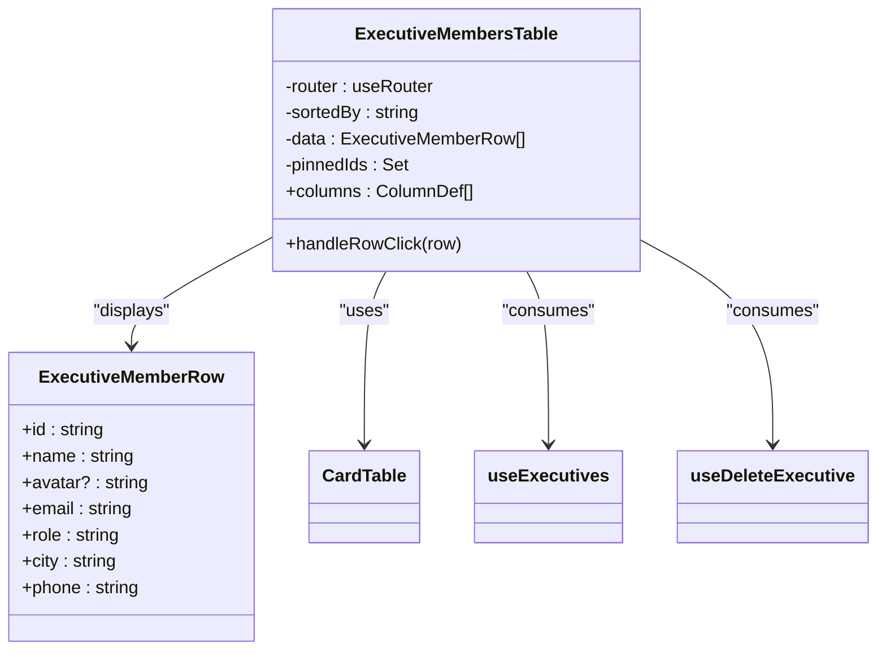
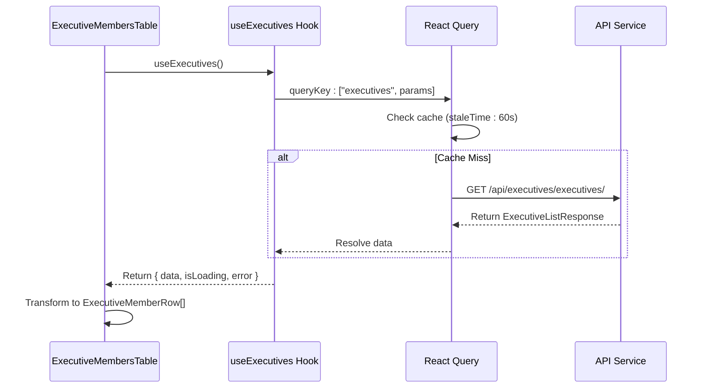
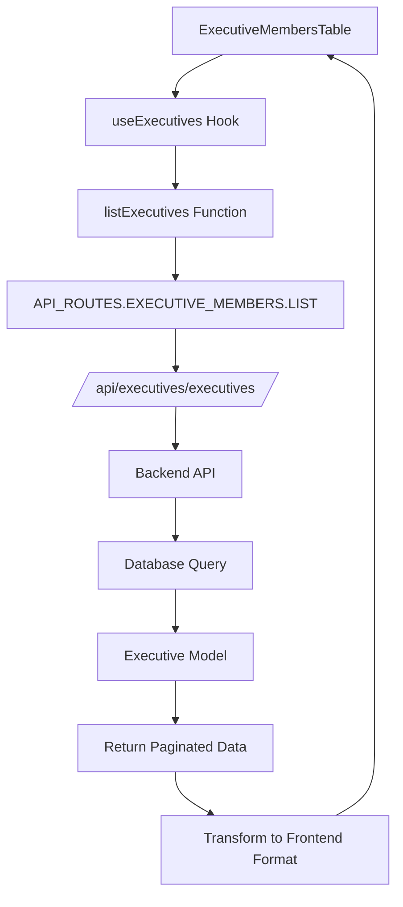
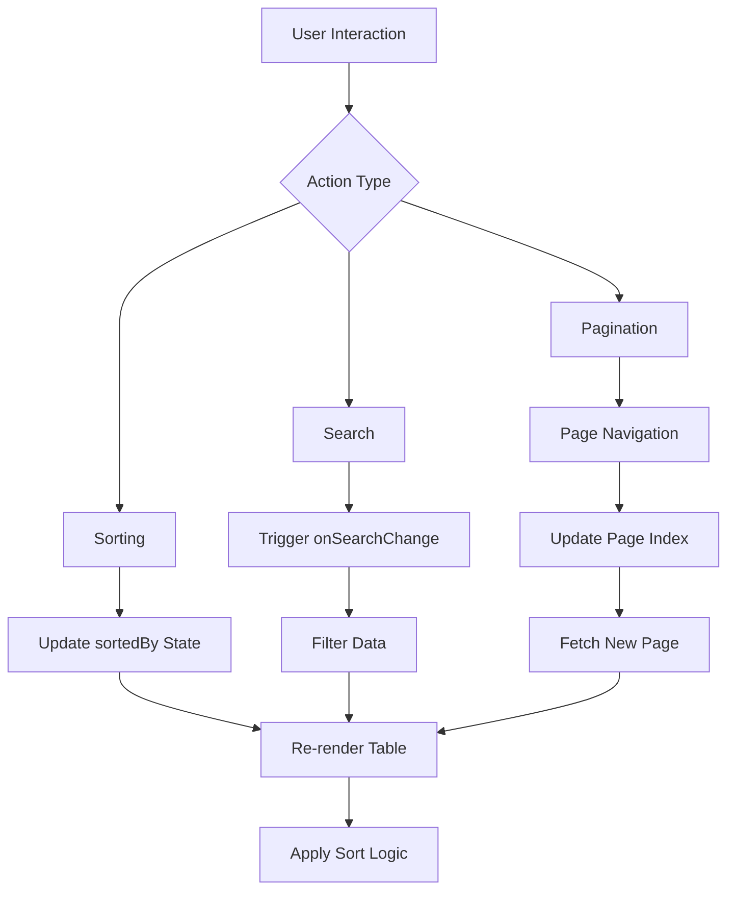
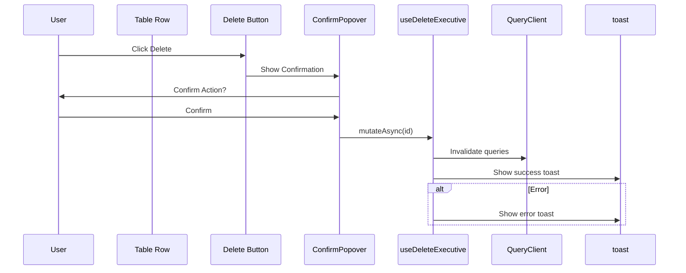
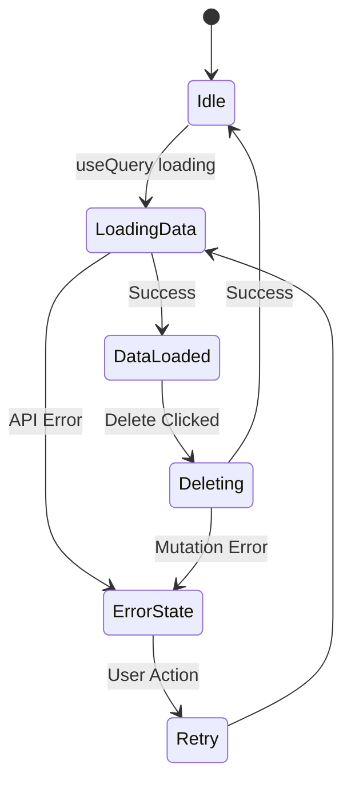
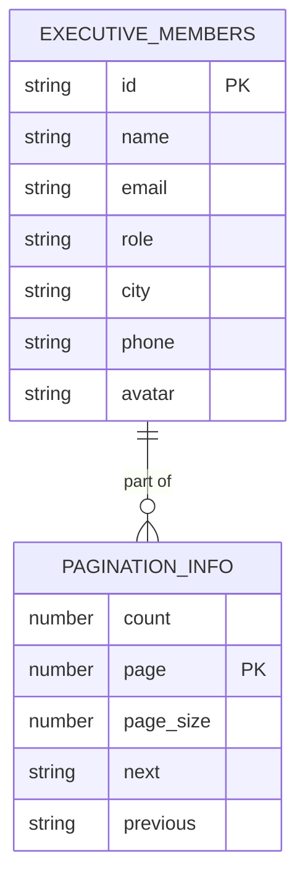
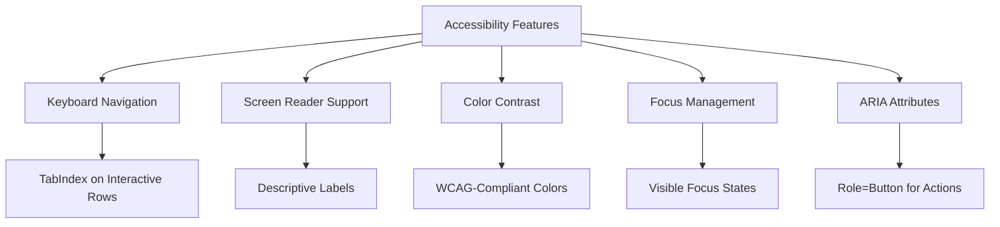
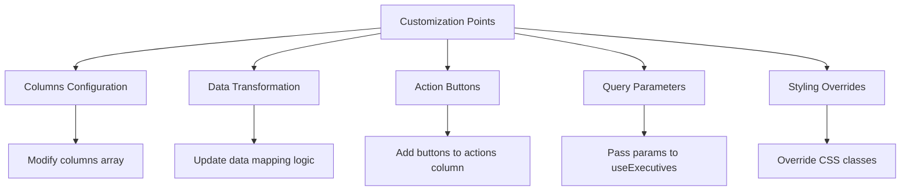

# List Executive Members

<cite>
**Referenced Files in This Document**   
- [page.tsx](file://src/app/(admin)/dashboard/executive-members/page.tsx)
- [executive-members-table.tsx](file://src/components/executive-members/executive-members-table.tsx)
- [use-executive-members.ts](file://src/hooks/queries/use-executive-members.ts)
- [executive-members.ts](file://src/services/executive-members.ts)
- [card-table.tsx](file://src/components/card-table/card-table.tsx)
- [card-table-toolbar.tsx](file://src/components/card-table/card-table-toolbar.tsx)
- [card-table-pagination.tsx](file://src/components/card-table/card-table-pagination.tsx)
- [api-routes.ts](file://src/constants/api-routes.ts)
- [api.d.ts](file://src/types/api.d.ts)
</cite>

## Table of Contents
1. [Introduction](#introduction)
2. [Page Structure and Layout](#page-structure-and-layout)
3. [Executive Members Table Component](#executive-members-table-component)
4. [Data Fetching with useExecutives Hook](#data-fetching-with-useexecutives-hook)
5. [API Integration and Service Layer](#api-integration-and-service-layer)
6. [Table Features: Sorting, Search, and Pagination](#table-features-sorting-search-and-pagination)
7. [User Interaction and Row Actions](#user-interaction-and-row-actions)
8. [Loading States and Error Handling](#loading-states-and-error-handling)
9. [Performance Considerations for Large Datasets](#performance-considerations-for-large-datasets)
10. [Accessibility Features in Table Design](#accessibility-features-in-table-design)
11. [Customization and Extension Guidance](#customization-and-extension-guidance)

## Introduction
The Executive Members listing page provides a comprehensive interface for viewing and managing executive personnel within the organization. This document details how the `page.tsx` renders a fully functional table using the `ExecutiveMembersTable` component, which integrates with backend services through React Query hooks. The implementation supports key features including pagination, sorting, search functionality, and responsive design patterns. Data is fetched from the `/api/executives/executives/` endpoint via a dedicated service layer, ensuring separation of concerns and maintainability.

## Page Structure and Layout
The executive members listing page is structured using a header and content layout pattern. The `PageHeader` component displays the title "Executive Members" with breadcrumb navigation linking back to the dashboard. A primary action button labeled "Add New" enables creation of new executive records, navigating to the appropriate form page. The main content area contains the `ExecutiveMembersTable` component wrapped in responsive padding.

**Diagram sources**
- [page.tsx](file://src/app/(admin)/dashboard/executive-members/page.tsx#L1-L30)

**Section sources**
- [page.tsx](file://src/app/(admin)/dashboard/executive-members/page.tsx#L1-L30)

## Executive Members Table Component
The `ExecutiveMembersTable` component implements a client-side table using React Table (TanStack) integrated with custom UI components. It defines columns for name, email, role, city, phone, and actions. Each row includes an avatar rendered from the profile picture URL, with fallback initials generated from the executive's name. The role field is displayed as a styled badge with a pink background.

The table uses a responsive grid layout with defined column proportions (`grid-cols-[1.2fr_1.5fr_0.8fr_0.8fr_1fr_0.8fr]`) to ensure proper spacing across viewports. Clicking on a row navigates to the detailed view of that executive member.

**Diagram sources**
- [executive-members-table.tsx](file://src/components/executive-members/executive-members-table.tsx#L1-L191)

**Section sources**
- [executive-members-table.tsx](file://src/components/executive-members/executive-members-table.tsx#L1-L191)

## Data Fetching with useExecutives Hook
The `useExecutives` hook from `use-executive-members.ts` leverages React Query to fetch executive data from the API. It uses the query key `["executives", params]` for caching and deduplication, with a stale time of 60,000 milliseconds (1 minute). The hook returns data in a standardized format that matches the `ExecutiveListResponse` type, which includes pagination metadata and an array of executive objects.

The component processes the API response by mapping the raw data to the `ExecutiveMemberRow` interface, extracting relevant fields and transforming the profile picture URL for avatar display. This transformation handles both direct array responses and paginated responses with a `results` property.

**Diagram sources**
- [use-executive-members.ts](file://src/hooks/queries/use-executive-members.ts#L1-L91)
- [executive-members-table.tsx](file://src/components/executive-members/executive-members-table.tsx#L1-L191)

**Section sources**
- [use-executive-members.ts](file://src/hooks/queries/use-executive-members.ts#L1-L91)

## API Integration and Service Layer
The executive members data is accessed through the `executive-members.ts` service file, which defines the `listExecutives` function. This function constructs the appropriate URL using the `API_ROUTES.EXECUTIVE_MEMBERS.LIST` constant and optionally appends query parameters for filtering or pagination. The request is made using the `apiCaller` utility with the GET method.

The API endpoint `/api/executives/executives/` returns a paginated response conforming to the `PaginatedExecutiveList` schema, which includes count, next/previous links, and results array. Type definitions are derived from OpenAPI specifications in `api.d.ts`, ensuring type safety throughout the stack.

**Diagram sources**
- [executive-members.ts](file://src/services/executive-members.ts#L1-L161)
- [api-routes.ts](file://src/constants/api-routes.ts#L1-L100)
- [api.d.ts](file://src/types/api.d.ts#L1-L2163)

**Section sources**
- [executive-members.ts](file://src/services/executive-members.ts#L1-L161)

## Table Features: Sorting, Search, and Pagination
The table implements sorting, search, and pagination capabilities through integration with the `card-table` component suite. The `CardTableToolbar` provides a search input, sorting dropdown with options for all columns, and a filter button. Sorting state is managed locally in the `ExecutiveMembersTable` component using React's `useState` hook.

Pagination is handled by the `CardTablePagination` component, which supports both client-side and server-side pagination patterns. When server-side pagination information is available, it uses the `paginationInfo` prop to calculate page counts and control navigation. The pagination controls display page numbers with ellipsis for large result sets, following accessibility best practices.

**Diagram sources**
- [card-table-toolbar.tsx](file://src/components/card-table/card-table-toolbar.tsx#L1-L62)
- [card-table-pagination.tsx](file://src/components/card-table/card-table-pagination.tsx#L1-L133)
- [pagination-utils.ts](file://src/lib/pagination-utils.ts#L1-L122)

**Section sources**
- [executive-members-table.tsx](file://src/components/executive-members/executive-members-table.tsx#L1-L191)

## User Interaction and Row Actions
Each table row supports multiple interactive features. Clicking on a row navigates to the detailed view of that executive member. The actions column includes a delete button implemented with a confirmation popover to prevent accidental deletions. The delete operation uses the `useDeleteExecutive` mutation hook, which optimistically updates the UI and shows appropriate toast notifications upon success or failure.

The table also supports row pinning functionality through the `usePinnedRows` hook, allowing users to keep specific executives visible at the top of the list. This feature persists the pinned state within the component's scope and updates the visual presentation accordingly.

**Diagram sources**
- [executive-members-table.tsx](file://src/components/executive-members/executive-members-table.tsx#L1-L191)
- [use-executive-members.ts](file://src/hooks/queries/use-executive-members.ts#L1-L91)

**Section sources**
- [executive-members-table.tsx](file://src/components/executive-members/executive-members-table.tsx#L1-L191)

## Loading States and Error Handling
The table implementation includes comprehensive loading and error states. While data is being fetched, the component displays skeleton rows to provide visual feedback. The `useExecutives` hook exposes loading and error states through React Query's standard interface, though the current implementation does not explicitly render error messages in the UI.

Error handling is implemented in the delete mutation, where caught errors are logged to the console and displayed as toast notifications. The component manages its own loading state for delete operations by tracking the `deletingId` and disabling the delete button during the request to prevent duplicate submissions.

**Section sources**
- [executive-members-table.tsx](file://src/components/executive-members/executive-members-table.tsx#L1-L191)
- [use-executive-members.ts](file://src/hooks/queries/use-executive-members.ts#L1-L91)

## Performance Considerations for Large Datasets
For large datasets, the implementation employs several performance optimizations. React Query's caching mechanism with a 60-second stale time reduces unnecessary network requests. The `useMemo` hook is used to memoize the transformation of API data to table rows, preventing expensive reprocessing on every render.

The table uses virtualization principles through controlled rendering of only visible rows, though full virtualization is not implemented. Column definitions are stable references to prevent unnecessary re-renders. The pagination system supports server-side pagination, which limits the amount of data transferred and rendered at any given time.

**Section sources**
- [executive-members-table.tsx](file://src/components/executive-members/executive-members-table.tsx#L1-L191)
- [card-table-pagination.tsx](file://src/components/card-table/card-table-pagination.tsx#L1-L133)

## Accessibility Features in Table Design
The table implementation includes several accessibility features. Interactive elements have appropriate ARIA roles and keyboard navigation support. The table rows are clickable with both mouse and keyboard input (via tabIndex). The delete button is contained within a span that stops event propagation to prevent row navigation when clicking the action.

Color contrast meets WCAG standards, with text colors providing sufficient contrast against background colors. The UI components use semantic HTML elements where possible, and interactive controls have descriptive labels. Focus states are visible for keyboard navigation, and the confirmation popover ensures destructive actions require explicit user confirmation.

**Section sources**
- [executive-members-table.tsx](file://src/components/executive-members/executive-members-table.tsx#L1-L191)
- [card-table.tsx](file://src/components/card-table/card-table.tsx#L1-L143)

## Customization and Extension Guidance
The table component can be customized by modifying the columns array in the `ExecutiveMembersTable` component. Additional columns can be added by defining new `ColumnDef` objects with appropriate accessor keys and cell renderers. Custom actions can be integrated into the actions column alongside the existing delete and pin buttons.

To extend functionality, developers can add new query parameters to the `useExecutives` hook call, which will be automatically included in the API request. Server-side filtering, sorting, and searching can be implemented by enhancing the backend API and passing appropriate parameters through the service layer.

**Section sources**
- [executive-members-table.tsx](file://src/components/executive-members/executive-members-table.tsx#L1-L191)