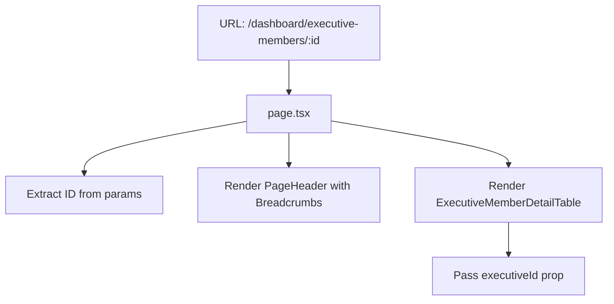
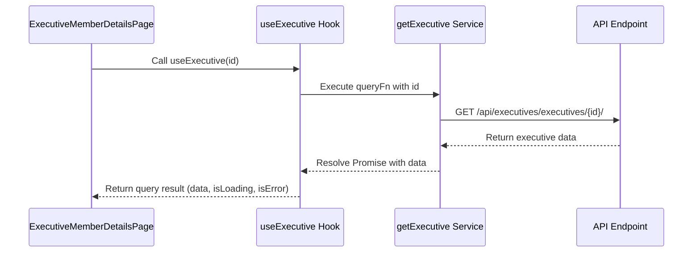
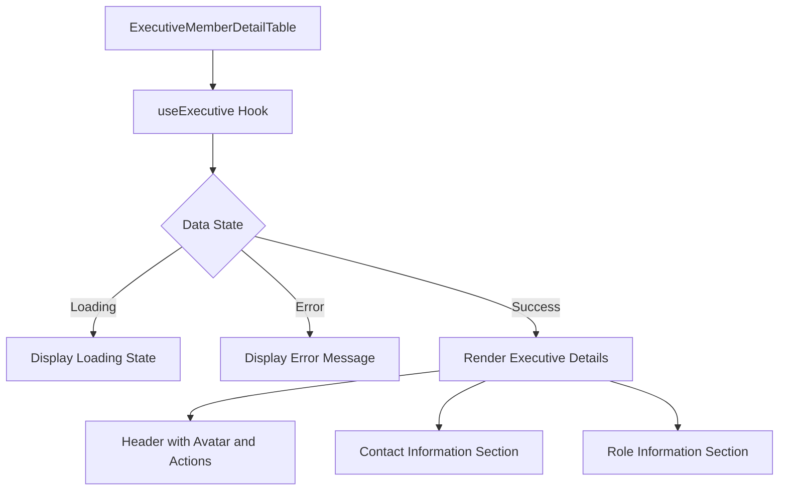
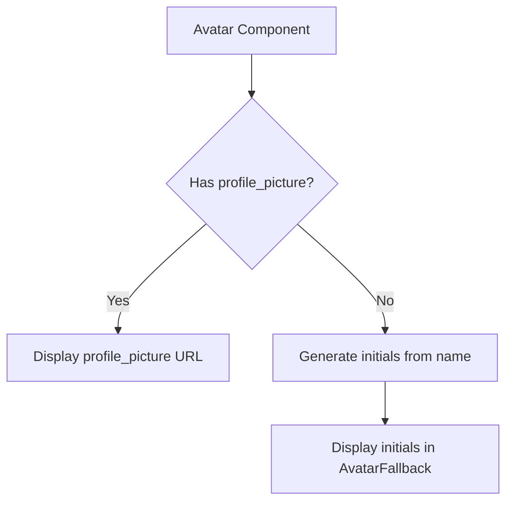

# View Executive Member Details

<cite>
**Referenced Files in This Document**   
- [page.tsx](file://src/app/(admin)/dashboard/executive-members/[id]/page.tsx)
- [executive-member-detail-table.tsx](file://src/components/executive-members/executive-member-detail-table.tsx)
- [use-executive-members.ts](file://src/hooks/queries/use-executive-members.ts)
- [executive-members.ts](file://src/services/executive-members.ts)
- [api-routes.ts](file://src/constants/api-routes.ts)
- [routes.ts](file://src/constants/routes.ts)
- [api.d.ts](file://src/types/api.d.ts)
</cite>

## Table of Contents
1. [Introduction](#introduction)
2. [Route and Page Structure](#route-and-page-structure)
3. [Data Fetching with useExecutive Hook](#data-fetching-with-useexecutive-hook)
4. [Executive Member Detail Display](#executive-member-detail-display)
5. [Breadcrumb Navigation](#breadcrumb-navigation)
6. [Loading and Error States](#loading-and-error-states)
7. [Profile Image Rendering](#profile-image-rendering)
8. [Caching and Data Consistency](#caching-and-data-consistency)
9. [Extensibility and Responsive Design](#extensibility-and-responsive-design)

## Introduction
This document details the implementation of the executive member details view in the CartwrightKing Admin ERP system. It covers how individual executive profiles are retrieved, displayed, and managed within the application, focusing on the data flow from API to UI components, state management, error handling, and user experience considerations.

## Route and Page Structure

The executive member details page is located at `src/app/(admin)/dashboard/executive-members/[id]/page.tsx` and serves as the entry point for viewing a specific executive's information. The route uses Next.js dynamic routing with the `[id]` parameter to capture the executive identifier from the URL.

The page component renders a `PageHeader` with breadcrumb navigation and includes the `ExecutiveMemberDetailTable` component, passing the executive ID as a prop for data retrieval and display.

**Diagram sources**
- [page.tsx](file://src/app/(admin)/dashboard/executive-members/[id]/page.tsx#L1-L30)

**Section sources**
- [page.tsx](file://src/app/(admin)/dashboard/executive-members/[id]/page.tsx#L1-L30)

## Data Fetching with useExecutive Hook

The `useExecutive` hook, defined in `use-executive-members.ts`, is responsible for fetching executive member data from the API. It leverages React Query for efficient data fetching, caching, and state management.

The hook calls the `getExecutive` service function, which makes an HTTP GET request to the `/api/executives/executives/{id}/` endpoint. This endpoint is defined in `API_ROUTES.EXECUTIVE_MEMBERS.DETAIL(id)` within the `api-routes.ts` constants file.

React Query's `useQuery` hook is configured with:
- A query key of `["executives", id]` for caching and refetching identification
- An enabled condition that ensures the query only runs when a valid ID is provided
- A stale time of 60,000 milliseconds (1 minute) to balance freshness and performance

**Diagram sources**
- [use-executive-members.ts](file://src/hooks/queries/use-executive-members.ts#L23-L30)
- [executive-members.ts](file://src/services/executive-members.ts#L51-L54)
- [api-routes.ts](file://src/constants/api-routes.ts#L0-L99)

**Section sources**
- [use-executive-members.ts](file://src/hooks/queries/use-executive-members.ts#L23-L30)
- [executive-members.ts](file://src/services/executive-members.ts#L51-L54)

## Executive Member Detail Display

The `ExecutiveMemberDetailTable` component renders the comprehensive profile information for an executive member. It receives the `executiveId` prop and uses the `useExecutive` hook to access the data.

The component displays the following information in a structured layout:
- **Personal Information**: Name and role displayed prominently with avatar
- **Contact Information**: Email, phone, address, and city in a two-column grid
- **Role Information**: Position and education details

The education field uses `dangerouslySetInnerHTML` to render formatted content, allowing for rich text presentation of educational background.

**Diagram sources**
- [executive-member-detail-table.tsx](file://src/components/executive-members/executive-member-detail-table.tsx#L0-L149)

**Section sources**
- [executive-member-detail-table.tsx](file://src/components/executive-members/executive-member-detail-table.tsx#L0-L149)

## Breadcrumb Navigation

The page implements breadcrumb navigation through the `PageHeader` component, providing users with clear context and easy navigation back to previous sections. The breadcrumb trail includes:
- Dashboard
- Org Chart/Directory
- Executive Members list
- Current page: Executive Member Details

This hierarchical navigation helps users understand their location within the application and provides one-click access to parent views.

**Section sources**
- [page.tsx](file://src/app/(admin)/dashboard/executive-members/[id]/page.tsx#L1-L30)
- [routes.ts](file://src/constants/routes.ts#L0-L34)

## Loading and Error States

The `ExecutiveMemberDetailTable` component implements robust loading and error handling to ensure a smooth user experience:

- **Loading State**: When data is being fetched, a loading message is displayed within a Card component. This prevents layout shifts and informs users that content is being retrieved.
- **Error State**: If the API request fails or returns no data, an error message is displayed in red text. This handles cases such as invalid IDs or network issues.
- **Empty State**: The component checks for both `isError` and the absence of `executiveMember` data to ensure comprehensive error coverage.

The component uses React Query's built-in `isLoading` and `isError` flags to manage these states efficiently.

**Section sources**
- [executive-member-detail-table.tsx](file://src/components/executive-members/executive-member-detail-table.tsx#L30-L70)

## Profile Image Rendering

The executive's profile image is rendered using the `Avatar` component from the UI library. The implementation includes:

- **Image Source**: The `src` attribute is set to `executiveMember.profile_picture`, with a fallback to undefined if no picture is available
- **Alt Text**: The executive's name is used as alternative text for accessibility
- **Fallback Display**: When no profile picture is available, an avatar fallback is generated using the first letters of the executive's name
- **Styling**: The avatar is sized at 16 units with appropriate text sizing in the fallback

The profile picture URL is stored as a URI in the API response, allowing for both internal and external image hosting.

**Diagram sources**
- [executive-member-detail-table.tsx](file://src/components/executive-members/executive-member-detail-table.tsx#L66-L70)

**Section sources**
- [executive-member-detail-table.tsx](file://src/components/executive-members/executive-member-detail-table.tsx#L66-L70)
- [api.d.ts](file://src/types/api.d.ts#L0-L2163)

## Caching and Data Consistency

The application implements a comprehensive caching strategy using React Query to optimize performance and ensure data consistency:

- **Query Keys**: The `["executives", id]` query key creates a unique cache entry for each executive, enabling efficient data retrieval and deduplication
- **Stale Time**: With a stale time of 60 seconds, data remains fresh while reducing unnecessary network requests
- **Automatic Refetching**: React Query automatically handles refetching when components mount or when network connectivity is restored
- **Cache Invalidation**: While not explicitly shown, the use of consistent query keys across the application (e.g., in list views) would enable automatic cache updates when data is modified

This caching approach ensures that users see up-to-date information while minimizing API calls and improving application responsiveness.

**Section sources**
- [use-executive-members.ts](file://src/hooks/queries/use-executive-members.ts#L23-L30)

## Extensibility and Responsive Design

The implementation supports extensibility and responsive layout through several design choices:

- **Responsive Grid**: The contact and role information sections use a responsive grid (`grid-cols-1 md:grid-cols-2`) that stacks on mobile and displays side-by-side on larger screens
- **Component Architecture**: The separation of the detail table into its own component allows for easy reuse and modification
- **Extensible Sections**: The current implementation shows contact and role information, but additional sections (e.g., employment history, achievements) can be added by extending the component
- **Action Buttons**: Edit and delete actions are integrated with proper confirmation dialogs, following the same pattern that can be applied to other actions

The design accommodates future enhancements such as additional detail tabs, document attachments, or relationship visualizations while maintaining a clean, professional appearance.

**Section sources**
- [executive-member-detail-table.tsx](file://src/components/executive-members/executive-member-detail-table.tsx#L0-L149)
- [page.tsx](file://src/app/(admin)/dashboard/executive-members/[id]/page.tsx#L1-L30)