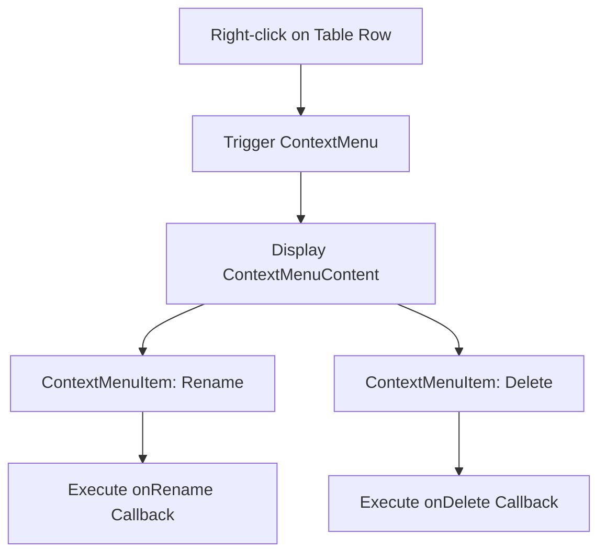
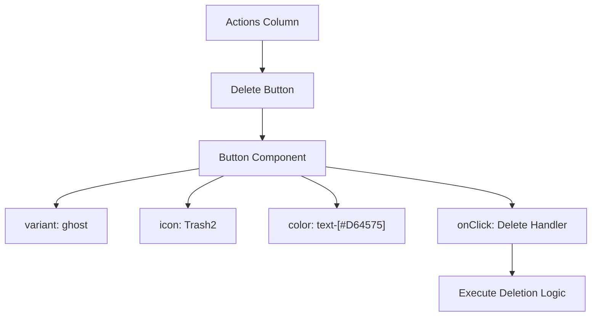

# Context Menus

<cite>
**Referenced Files in This Document**   
- [row-context-menus.tsx](file://src/components/knowledge-base/row-context-menus.tsx)
- [pin-row-button.tsx](file://src/components/card-table/pin-row-button.tsx)
- [use-pinned-rows.ts](file://src/hooks/use-pinned-rows.ts)
- [knowledge-base-table.tsx](file://src/components/knowledge-base/knowledge-base-table.tsx)
- [context-menu.tsx](file://src/components/ui/context-menu.tsx)
- [button.tsx](file://src/components/ui/button.tsx)
</cite>

## Table of Contents
1. [Introduction](#introduction)
2. [Inline Action Menus in Table Rows](#inline-action-menus-in-table-rows)
3. [PinRowButton Integration and State Management](#pinrowbutton-integration-and-state-management)
4. [Delete Action Implementation](#delete-action-implementation)
5. [Event Propagation Handling](#event-propagation-handling)
6. [Common UI/UX Issues and Solutions](#common-uiux-issues-and-solutions)
7. [Extending Context Menus with Additional Actions](#extending-context-menus-with-additional-actions)
8. [Conclusion](#conclusion)

## Introduction
This document details the implementation of context menus within the Knowledge Base module of the CartwrightKing Admin ERP system. It focuses on inline action menus in table rows, specifically the Delete and Pin actions. The integration between `row-context-menus.tsx` and `PinRowButton` for managing pinned state persistence and visual feedback is explained. The use of the Button component with the Trash2 icon for deletion, event propagation handling to prevent unwanted navigation, and solutions to common issues such as menu overlap and accessibility are covered. Guidance is also provided for extending context menus with additional actions while maintaining clean UI/UX patterns.

## Inline Action Menus in Table Rows
Inline action menus are implemented within table rows to provide quick access to row-specific operations such as Rename and Delete. These menus are triggered via right-click using the `RowContextMenu` component, which wraps the row content with Radix UI's `ContextMenu` primitives. The menu displays two primary actions: Rename (with Pen icon) and Delete (with Trash2 icon styled in red). The `onSelect` prop of each `ContextMenuItem` is bound to callback functions passed as props (`onRename`, `onDelete`), enabling parent components to define the behavior. This pattern ensures consistent interaction across the application while allowing for contextual action definitions.



**Diagram sources**
- [row-context-menus.tsx](file://src/components/knowledge-base/row-context-menus.tsx#L33-L53)

**Section sources**
- [row-context-menus.tsx](file://src/components/knowledge-base/row-context-menus.tsx#L33-L53)
- [context-menu.tsx](file://src/components/ui/context-menu.tsx#L0-L252)

## PinRowButton Integration and State Management
The `PinRowButton` component integrates with the `usePinnedRows` hook to manage the pinned state of table rows. It receives three props: `row` (the current table row), `pinnedIds` (a Set of pinned row IDs), and `togglePin` (a callback to update the pinned state). The button's visual state (filled or outlined pin) is determined by checking if the row's ID exists in `pinnedIds`. Clicking the button invokes `togglePin(id)`, which updates the Set accordingly. The `usePinnedRows` hook uses `useMemo` to sort the data, ensuring pinned rows appear at the top while preserving relative order within pinned and unpinned groups. This enables persistent visual organization without modifying the underlying data structure.

```mermaid
classDiagram
class PinRowButton {
+row : Row<TData>
+pinnedIds : Set<string>
+togglePin : (id : string) => void
+render() : JSX.Element
}
class usePinnedRows {
+rows : TItem[]
+pinnedIds : Set<string>
+togglePin(id : string) : void
+ordered : TItem[]
+return : { pinnedIds, togglePin, ordered }
}
PinRowButton --> usePinnedRows : "consumes pinnedIds, togglePin"
usePinnedRows --> PinRowButton : "provides state and toggle"
```

**Diagram sources**
- [pin-row-button.tsx](file://src/components/card-table/pin-row-button.tsx#L12-L28)
- [use-pinned-rows.ts](file://src/hooks/use-pinned-rows.ts#L4-L35)

**Section sources**
- [pin-row-button.tsx](file://src/components/card-table/pin-row-button.tsx#L12-L28)
- [use-pinned-rows.ts](file://src/hooks/use-pinned-rows.ts#L4-L35)
- [knowledge-base-table.tsx](file://src/components/knowledge-base/knowledge-base-table.tsx#L74-L76)

## Delete Action Implementation
The Delete action is implemented using a Button component with the Trash2 icon from Lucide React. It is placed within the Actions column of the table, alongside the PinRowButton. The button uses the `ghost` variant and is styled with a red text color (`text-[#D64575]`) to indicate its destructive nature. Unlike the context menu Delete option, this inline button provides a direct, one-click deletion method. However, it currently lacks a confirmation step, which could lead to accidental deletions. Best practice would involve integrating a confirmation dialog or popover before executing the delete operation to enhance user safety.



**Diagram sources**
- [knowledge-base-table.tsx](file://src/components/knowledge-base/knowledge-base-table.tsx#L148-L150)

**Section sources**
- [knowledge-base-table.tsx](file://src/components/knowledge-base/knowledge-base-table.tsx#L148-L150)
- [button.tsx](file://src/components/ui/button.tsx#L37-L56)

## Event Propagation Handling
Event propagation is properly managed to prevent unwanted row navigation when interacting with action buttons. While the table rows have an `onRowClick` handler that navigates to a detail page, the action buttons (Delete and Pin) do not stop propagation explicitly in the current implementation. This could lead to the row click handler being triggered after the button action. To prevent this, event propagation should be stopped at the button level using `e.stopPropagation()` within the `onClick` handlers of the action buttons. This ensures that clicking an action button only performs the intended action without triggering the row's navigation behavior.

**Section sources**
- [knowledge-base-table.tsx](file://src/components/knowledge-base/knowledge-base-table.tsx#L148-L150)
- [pin-row-button.tsx](file://src/components/card-table/pin-row-button.tsx#L12-L28)

## Common UI/UX Issues and Solutions
Several UI/UX issues are present or potential in the current implementation:

1. **Menu Overlap**: Context menus may overlap with other UI elements or screen edges. This can be mitigated by using Radix UI's positioning system with collision detection or by constraining menu placement within the table container.

2. **Accessibility Concerns**: Icon-only buttons lack text labels, which