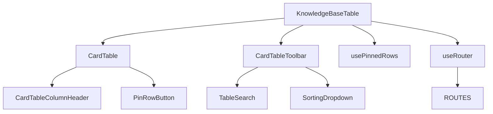
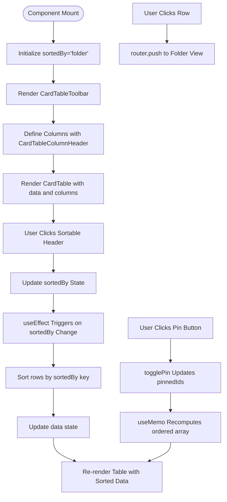
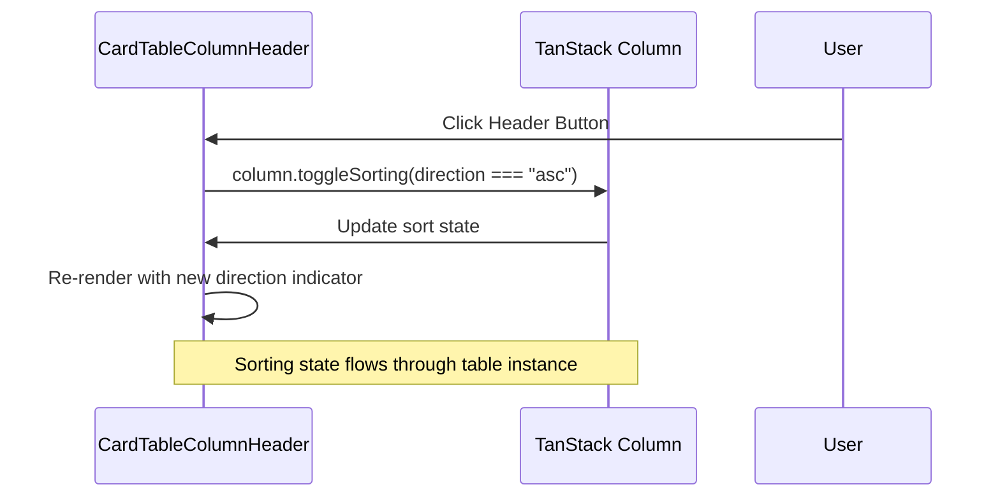
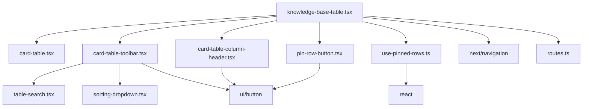

# Document Management

<cite>
**Referenced Files in This Document**   
- [knowledge-base-table.tsx](file://src/components/knowledge-base/knowledge-base-table.tsx)
- [use-pinned-rows.ts](file://src/hooks/use-pinned-rows.ts)
- [card-table-column-header.tsx](file://src/components/card-table/card-table-column-header.tsx)
- [card-table-toolbar.tsx](file://src/components/card-table/card-table-toolbar.tsx)
- [pin-row-button.tsx](file://src/components/card-table/pin-row-button.tsx)
- [card-table.tsx](file://src/components/card-table/card-table.tsx)
- [routes.ts](file://src/constants/routes.ts)
</cite>

## Table of Contents
1. [Introduction](#introduction)
2. [Core Components](#core-components)
3. [Architecture Overview](#architecture-overview)
4. [Detailed Component Analysis](#detailed-component-analysis)
5. [Dependency Analysis](#dependency-analysis)
6. [Performance Considerations](#performance-considerations)
7. [Troubleshooting Guide](#troubleshooting-guide)
8. [Conclusion](#conclusion)

## Introduction
The Knowledge Base document management system provides a structured interface for organizing and accessing organizational documents through a table-based UI. Built using TanStack Table, the system enables users to sort, navigate, and manage folders with features like row pinning, sorting, and direct navigation. This document details the implementation of the `KnowledgeBaseTable` component, its integration with supporting utilities, and best practices for extension and maintenance.

## Core Components

The document management functionality centers around the `KnowledgeBaseTable` component, which renders structured data with sortable columns for Folder, Created By, Access Level, and Date Created. The table supports row-level actions including deletion and pinning, with navigation to folder-specific views via `router.push`. Sorting is managed through React state and synchronized using `useEffect`, while the `usePinnedRows` hook handles row pinning logic. The table toolbar provides search and sorting controls, enabling efficient data filtering and organization.

**Section sources**
- [knowledge-base-table.tsx](file://src/components/knowledge-base/knowledge-base-table.tsx#L1-L162)

## Architecture Overview



**Diagram sources**
- [knowledge-base-table.tsx](file://src/components/knowledge-base/knowledge-base-table.tsx#L1-L162)
- [card-table.tsx](file://src/components/card-table/card-table.tsx#L1-L142)
- [card-table-toolbar.tsx](file://src/components/card-table/card-table-toolbar.tsx#L1-L61)
- [use-pinned-rows.ts](file://src/hooks/use-pinned-rows.ts#L1-L38)
- [routes.ts](file://src/constants/routes.ts#L1-L34)

## Detailed Component Analysis

### KnowledgeBaseTable Analysis

The `KnowledgeBaseTable` component implements a fully functional document management interface using TanStack Table. It defines columns for Folder, Created By, Access Level, and Date Created, each utilizing `CardTableColumnHeader` for sortable headers. The Folder column displays an icon alongside the folder name, while the Created By column shows an avatar and name. Access Level is visually represented using color-coded badges, and Date Created displays formatted date strings.

Row-level actions are provided in the Actions column, including a delete button and `PinRowButton` for toggling row pinning. The table is wrapped in a Card component and includes a `CardTableToolbar` with search, sorting, and filter controls. Data sorting is controlled by the `sortedBy` state, which triggers a `useEffect` that sorts the static `rows` data and updates the `data` state accordingly.

Navigation to folder-specific views is implemented through the `onRowClick` prop, which uses `router.push` with a dynamic route from the `ROUTES` constant. The table uses a grid layout with proportional column sizing defined in `headerClassName` and `rowClassName`.



**Diagram sources**
- [knowledge-base-table.tsx](file://src/components/knowledge-base/knowledge-base-table.tsx#L1-L162)

**Section sources**
- [knowledge-base-table.tsx](file://src/components/knowledge-base/knowledge-base-table.tsx#L1-L162)

### usePinnedRows Hook Analysis

The `usePinnedRows` hook provides row pinning functionality for tables. It maintains a `Set` of pinned row IDs in state and provides a `togglePin` function to add or remove IDs from this set. The hook uses `useMemo` to compute an `ordered` array that places pinned rows at the top while preserving relative order within pinned and unpinned groups. The sorting logic first applies any optional comparator, then sorts by pin status (pinned rows first). This hook is generic and can be used with any item type that has an `id` property.

```mermaid
classDiagram
class usePinnedRows~TItem~ {
+pinnedIds : Set<string>
+togglePin(id : string) : void
+isPinned(id : string) : boolean
+ordered : TItem[]
-setPinnedIds : React.Dispatch<React.SetStateAction<Set<string>>>
}
usePinnedRows~TItem~ --> TItem : "extends { id : string }"
```

**Diagram sources**
- [use-pinned-rows.ts](file://src/hooks/use-pinned-rows.ts#L4-L35)

**Section sources**
- [use-pinned-rows.ts](file://src/hooks/use-pinned-rows.ts#L4-L35)

### CardTableColumnHeader Analysis

The `CardTableColumnHeader` component renders sortable table headers with a chevron icon. It accepts a TanStack Table `column` object and a `title` string. The component checks if the column is sortable using `getCanSort()`. If sortable, it renders a ghost button that toggles sorting direction when clicked. The button displays the title and a `ChevronsUpDown` icon. The component handles both ascending and descending sort states, providing visual feedback through the icon orientation.



**Diagram sources**
- [card-table-column-header.tsx](file://src/components/card-table/card-table-column-header.tsx#L12-L27)

**Section sources**
- [card-table-column-header.tsx](file://src/components/card-table/card-table-column-header.tsx#L12-L27)

## Dependency Analysis

The document management system has a well-defined dependency structure. The `KnowledgeBaseTable` component depends on several UI components from the `card-table` directory, including `CardTable`, `CardTableToolbar`, `CardTableColumnHeader`, and `PinRowButton`. It also relies on the `usePinnedRows` hook for pinning functionality and `useRouter` for navigation. The `CardTableToolbar` component depends on `TableSearch` and `SortingDropdown` for its functionality. All components use standard UI elements from the `ui` directory, such as `Button`, `Avatar`, and `Badge`. The routing system depends on constants defined in `routes.ts`.



**Diagram sources**
- [knowledge-base-table.tsx](file://src/components/knowledge-base/knowledge-base-table.tsx#L1-L162)
- [card-table-toolbar.tsx](file://src/components/card-table/card-table-toolbar.tsx#L1-L61)
- [card-table-column-header.tsx](file://src/components/card-table/card-table-column-header.tsx#L1-L30)
- [pin-row-button.tsx](file://src/components/card-table/pin-row-button.tsx#L1-L29)
- [use-pinned-rows.ts](file://src/hooks/use-pinned-rows.ts#L1-L38)

**Section sources**
- [knowledge-base-table.tsx](file://src/components/knowledge-base/knowledge-base-table.tsx#L1-L162)
- [card-table-toolbar.tsx](file://src/components/card-table/card-table-toolbar.tsx#L1-L61)
- [card-table-column-header.tsx](file://src/components/card-table/card-table-column-header.tsx#L1-L30)
- [pin-row-button.tsx](file://src/components/card-table/pin-row-button.tsx#L1-L29)
- [use-pinned-rows.ts](file://src/hooks/use-pinned-rows.ts#L1-L38)

## Performance Considerations

The document management system implements several performance optimizations. The `usePinnedRows` hook uses `useMemo` to prevent unnecessary recomputation of the ordered array, only recalculating when the input rows, comparator, or pinned IDs change. The `togglePin` function is memoized with `useCallback` to prevent unnecessary re-renders of child components. Column definitions are defined inside the component but do not cause performance issues as they are not functions of props. The `useEffect` for sorting operates on a static data set, which is efficient for small to medium datasets. For larger datasets, consider implementing server-side sorting and pagination to improve performance.

## Troubleshooting Guide

Common issues in the document management system include stale data display and sorting inconsistencies. Stale data can occur if the `useEffect` dependency array is incomplete; ensure all relevant state variables are included. Sorting inconsistencies may arise if the sort key does not exist on all data objects; the current implementation handles this by using nullish coalescing (`?? ""`). When extending the table with new columns, ensure custom cell renderers are properly memoized to prevent unnecessary re-renders. For issues with row pinning, verify that all data items have a unique `id` property, as the pinning functionality relies on this for tracking. Navigation issues can be debugged by checking the route generation in `ROUTES.ADMIN.KNOWLEDGE_BASE_FOLDER_ID` and ensuring the target page exists.

**Section sources**
- [knowledge-base-table.tsx](file://src/components/knowledge-base/knowledge-base-table.tsx#L1-L162)
- [use-pinned-rows.ts](file://src/hooks/use-pinned-rows.ts#L1-L38)
- [routes.ts](file://src/constants/routes.ts#L1-L34)

## Conclusion

The document management system provides a robust foundation for organizing and accessing knowledge base content. By leveraging TanStack Table and custom hooks like `usePinnedRows`, it delivers a feature-rich interface with sorting, pinning, and navigation capabilities. The component-based architecture allows for easy extension and maintenance, while the use of React's optimization hooks ensures good performance. Future enhancements could include server-side data fetching, real-time updates, and more sophisticated filtering options to further improve the user experience.