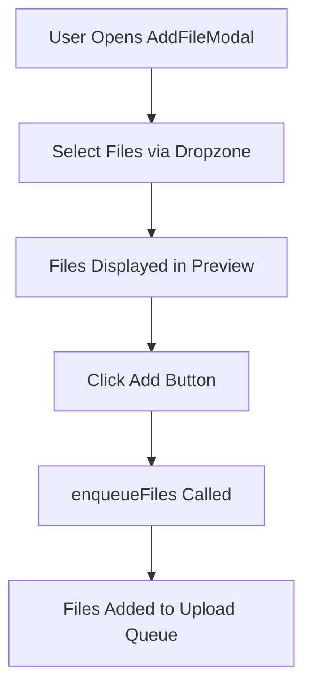
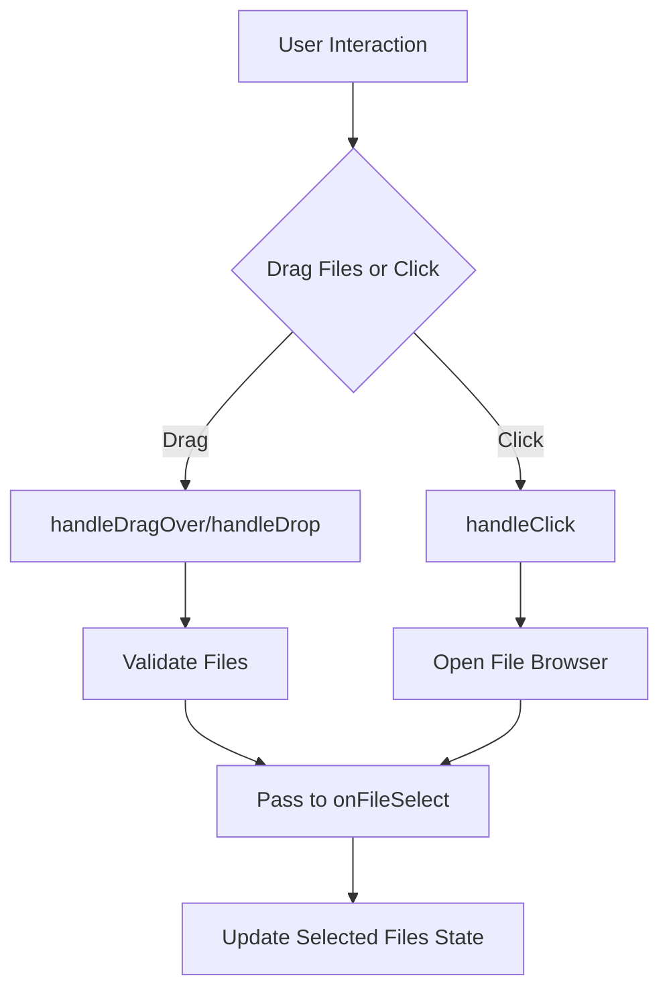
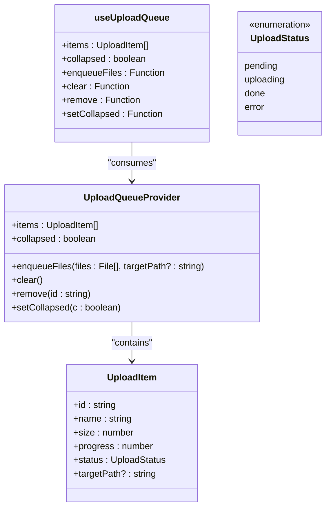
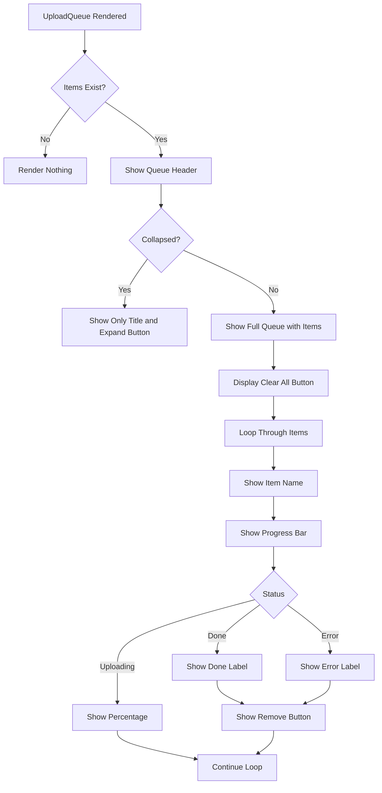
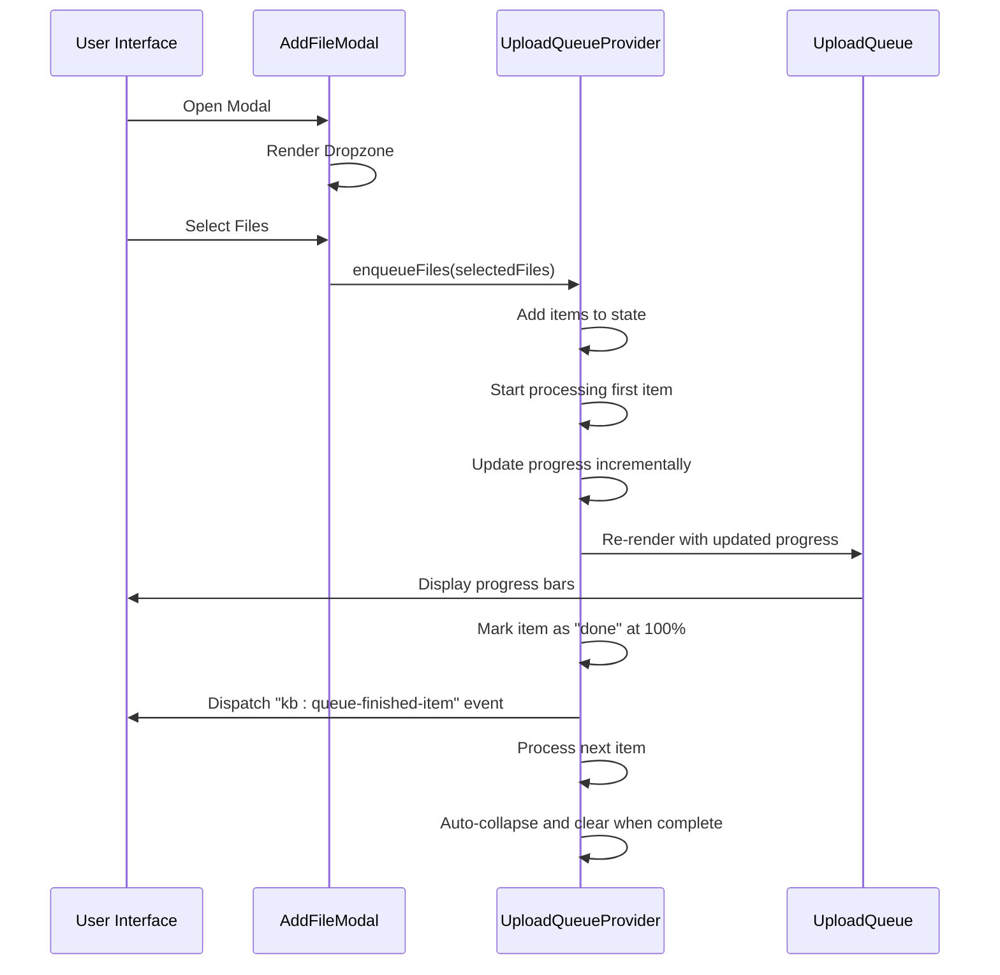
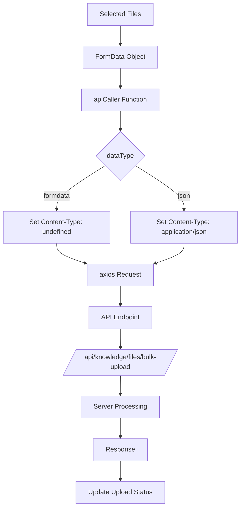

# File Uploads

<cite>
**Referenced Files in This Document**   
- [add-file-modal.tsx](file://src/components/knowledge-base/add-file-modal.tsx)
- [upload-queue.tsx](file://src/components/knowledge-base/upload-queue.tsx)
- [upload-queue-context.tsx](file://src/contexts/upload-queue-context.tsx)
- [dropzone.tsx](file://src/components/ui/dropzone.tsx)
- [api-caller.ts](file://src/lib/api-caller.ts)
- [branches.ts](file://src/services/branches.ts)
- [api-routes.ts](file://src/constants/api-routes.ts)
- [api.d.ts](file://src/types/api.d.ts)
</cite>

## Table of Contents
1. [Introduction](#introduction)
2. [AddFileModal Component](#addfilemodal-component)
3. [Dropzone Integration](#dropzone-integration)
4. [Upload Queue Management](#upload-queue-management)
5. [UploadQueue Component](#uploadqueue-component)
6. [File Upload Processing](#file-upload-processing)
7. [API and Service Integration](#api-and-service-integration)
8. [Common Issues and Error Handling](#common-issues-and-error-handling)
9. [Performance Optimization and UX Improvements](#performance-optimization-and-ux-improvements)
10. [Conclusion](#conclusion)

## Introduction
This document provides a comprehensive overview of the file upload functionality within the Knowledge Base module of the CartwrightKing Admin ERP system. It details the implementation of multi-file selection, background upload processing, real-time progress tracking, and error handling. The system supports uploading PDF and Office document formats through an intuitive user interface with visual feedback.

## AddFileModal Component

The `AddFileModal` component serves as the primary interface for users to add files to the Knowledge Base. It integrates with the upload queue system to manage file selection and submission.

The modal provides a clean interface for selecting multiple files, previewing selections, and initiating the upload process. It uses the `useUploadQueue` hook to access the `enqueueFiles` function, which adds selected files to the upload queue for background processing.

**Diagram sources**
- [add-file-modal.tsx](file://src/components/knowledge-base/add-file-modal.tsx#L8-L50)

**Section sources**
- [add-file-modal.tsx](file://src/components/knowledge-base/add-file-modal.tsx#L8-L50)

## Dropzone Integration

The file selection process is powered by the `Dropzone` component, which provides both click-to-upload and drag-and-drop functionality. The integration is configured specifically for Knowledge Base file uploads with the following parameters:

- **Accepted file types**: PDF and Office documents (application/pdf, application/msword, application/vnd.openxmlformats-officedocument.wordprocessingml.document)
- **Multiple file selection**: Enabled
- **Preview display**: Disabled for document uploads (unlike image uploads)
- **Event handling**: Uses `onFileSelect` callback to capture selected files

The `Dropzone` component handles browser file input events, drag-and-drop interactions, and file validation. When files are selected, they are passed to the `handleSelect` function in `AddFileModal`, which updates the component state with the selected files.

**Diagram sources**
- [add-file-modal.tsx](file://src/components/knowledge-base/add-file-modal.tsx#L8-L50)
- [dropzone.tsx](file://src/components/ui/dropzone.tsx#L0-L259)

**Section sources**
- [add-file-modal.tsx](file://src/components/knowledge-base/add-file-modal.tsx#L8-L50)
- [dropzone.tsx](file://src/components/ui/dropzone.tsx#L0-L259)

## Upload Queue Management

The upload queue system is managed through React Context API, providing a centralized state management solution for file uploads across the application. The `useUploadQueue` hook gives components access to the upload queue functionality.

Key features of the upload queue system:
- Centralized state management via `UploadQueueProvider`
- Sequential processing of uploads
- Real-time progress updates
- Error handling and status tracking
- Auto-cleanup of completed uploads

The `enqueueFiles` function creates upload items with unique IDs, file metadata, and initial "pending" status. These items are added to the queue and processed sequentially in the background.

**Diagram sources**
- [upload-queue-context.tsx](file://src/contexts/upload-queue-context.tsx#L14-L81)
- [upload-queue.tsx](file://src/components/knowledge-base/upload-queue.tsx#L7-L16)

**Section sources**
- [upload-queue-context.tsx](file://src/contexts/upload-queue-context.tsx#L14-L81)

## UploadQueue Component

The `UploadQueue` component provides a floating UI element that displays the status of all active and completed uploads. It offers users real-time feedback on upload progress and allows for queue management.

Key features:
- **Collapsible interface**: Minimizes to a compact view when not actively monitoring
- **Real-time progress bars**: Visual representation of upload completion percentage
- **Status indicators**: Clear display of upload state (pending, uploading, done, error)
- **Queue management**: Clear all and remove individual items functionality
- **Fixed positioning**: Appears in the bottom-right corner of the viewport

The component displays each upload item with its name, progress bar, and current status. For completed uploads, a remove button is provided. The entire queue can be cleared when all uploads are complete, with automatic collapsing and cleanup after a delay.

**Diagram sources**
- [upload-queue.tsx](file://src/components/knowledge-base/upload-queue.tsx#L18-L59)

**Section sources**
- [upload-queue.tsx](file://src/components/knowledge-base/upload-queue.tsx#L18-L59)

## File Upload Processing

The file upload processing system handles the background execution of file uploads with sequential processing and real-time status updates. The system simulates upload progress in the current implementation, which can be replaced with actual API calls.

Processing workflow:
1. Items are processed in order from the queue
2. Pending items are transitioned to uploading state
3. Progress is updated incrementally (simulated at 7% intervals)
4. On completion, items are marked as "done" and an event is dispatched
5. The system automatically collapses and clears the queue when all uploads complete

The processing logic is implemented in a `useEffect` hook within `UploadQueueProvider` that monitors the items array and processes the next item in sequence. This ensures uploads do not overwhelm the server with concurrent requests.

**Diagram sources**
- [upload-queue-context.tsx](file://src/contexts/upload-queue-context.tsx#L22-L81)
- [upload-queue.tsx](file://src/components/knowledge-base/upload-queue.tsx#L18-L59)

**Section sources**
- [upload-queue-context.tsx](file://src/contexts/upload-queue-context.tsx#L22-L81)

## API and Service Integration

The file upload system integrates with backend services through the `api-caller.ts` utility and API route definitions. While the current implementation simulates uploads, the architecture is designed for real API integration.

Key integration points:
- **API endpoint**: `/api/knowledge/files/bulk-upload/` for file uploads
- **FormData submission**: Proper content type handling for file uploads
- **Branch context**: Potential use of `branches.ts` service for target path context
- **Route configuration**: API routes defined in `api-routes.ts`

The `api-caller` function is configured to handle FormData submissions by setting the Content-Type header to undefined, allowing the browser to set the appropriate multipart/form-data boundary. This is critical for successful file uploads.

**Diagram sources**
- [api-caller.ts](file://src/lib/api-caller.ts#L0-L83)
- [branches.ts](file://src/services/branches.ts#L0-L123)
- [api-routes.ts](file://src/constants/api-routes.ts#L0-L99)

**Section sources**
- [api-caller.ts](file://src/lib/api-caller.ts#L0-L83)
- [branches.ts](file://src/services/branches.ts#L0-L123)
- [api-routes.ts](file://src/constants/api-routes.ts#L0-L99)

## Common Issues and Error Handling

The file upload system addresses several common issues that may arise during the upload process:

### Upload Failures
- **Network connectivity issues**: Implement retry logic with exponential backoff
- **Server errors**: Capture HTTP status codes and provide meaningful error messages
- **Authentication timeouts**: Handle token expiration during long uploads

### Partial Uploads
- **Resume capability**: Track uploaded chunks to resume interrupted uploads
- **Validation on server**: Verify complete file reception before processing
- **Checksum verification**: Ensure file integrity after upload completion

### Large File Handling
- **Chunked uploads**: Split large files into smaller parts for transmission
- **Progress feedback**: Maintain responsive UI during long upload processes
- **Memory management**: Stream files to avoid excessive memory usage

The current implementation shows "error" status in the upload queue, but specific error handling logic would need to be integrated with the actual API calls to provide detailed error information to users.

## Performance Optimization and UX Improvements

Several optimization opportunities exist to enhance the file upload experience:

### Upload Batching
- **Configurable batch size**: Allow multiple concurrent uploads within limits
- **Priority queuing**: Implement priority levels for different file types
- **Bandwidth throttling**: Adjust upload speed based on network conditions

### Error Recovery
- **Automatic retries**: Implement retry mechanisms for transient failures
- **Pause/resume**: Allow users to pause and resume upload queues
- **Error logging**: Capture detailed error information for debugging

### UX Improvements for Slow Connections
- **Estimated time remaining**: Calculate and display ETA based on upload speed
- **Connection monitoring**: Detect and adapt to changing network conditions
- **Offline queuing**: Allow file selection when offline, upload when connection restored
- **Progress persistence**: Maintain upload state across page refreshes using localStorage

### Additional Enhancements
- **File type validation**: Provide immediate feedback on unsupported formats
- **Size limits**: Enforce file size restrictions with clear messaging
- **Duplicate detection**: Identify and handle duplicate file uploads
- **Accessibility**: Ensure keyboard navigation and screen reader support

## Conclusion

The file upload functionality in the Knowledge Base provides a robust foundation for managing document uploads with a user-friendly interface and background processing capabilities. The system effectively separates concerns between file selection, queue management, and upload processing, creating a maintainable architecture.

Key strengths include the use of React Context for state management, clear separation of UI and logic components, and a well-structured API integration pattern. To complete the implementation, the simulated upload process should be replaced with actual API calls to the `/api/knowledge/files/bulk-upload/` endpoint, with proper error handling and progress reporting from the server.

The architecture supports future enhancements such as chunked uploads for large files, improved error recovery, and enhanced user feedback mechanisms, making it a scalable solution for enterprise document management needs.