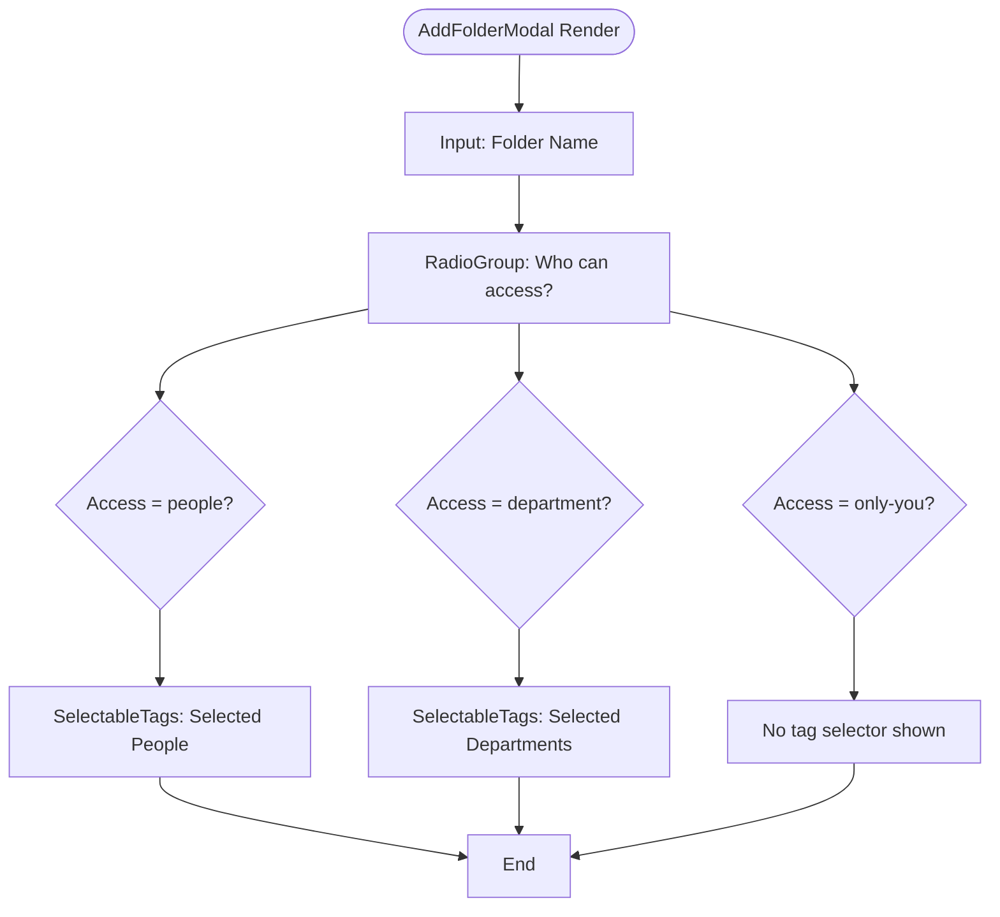
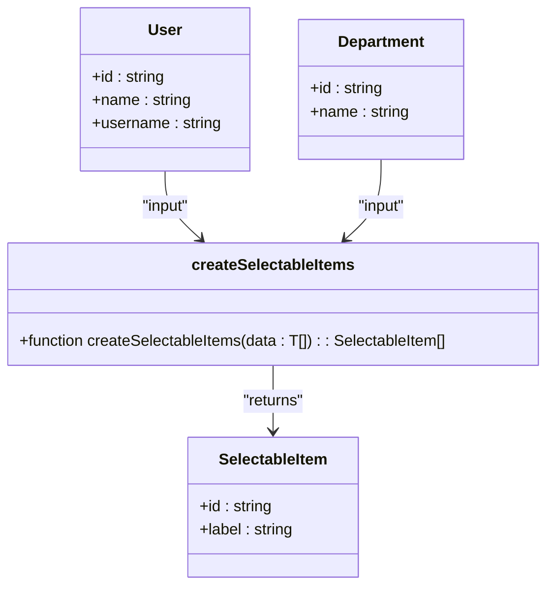

# Folder Organization

<cite>
**Referenced Files in This Document**   
- [add-folder-modal.tsx](file://src/components/knowledge-base/add-folder-modal.tsx)
- [app-modal.tsx](file://src/components/common/app-modal.tsx)
- [selectable-tags.tsx](file://src/components/ui/selectable-tags.tsx)
- [page.tsx](file://src/app/(admin)/dashboard/knowledge-base/[...slug]/page.tsx)
- [page.tsx](file://src/app/(admin)/dashboard/knowledge-base/page.tsx)
- [routes.ts](file://src/constants/routes.ts)
</cite>

## Table of Contents
1. [Introduction](#introduction)
2. [Hierarchical Routing Implementation](#hierarchical-routing-implementation)
3. [AddFolderModal Component Structure](#addfoldermodal-component-structure)
4. [State Management and Access Control](#state-management-and-access-control)
5. [Integration with User and Department Data](#integration-with-user-and-department-data)
6. [UI Consistency with AppModal](#ui-consistency-with-appmodal)
7. [Common Issues and Edge Cases](#common-issues-and-edge-cases)
8. [Best Practices for Folder Creation](#best-practices-for-folder-creation)

## Introduction
This document details the implementation of folder organization within the Knowledge Base module of the CartwrightKing Admin ERP system. It covers hierarchical routing using dynamic slug paths, the structure and behavior of the AddFolderModal component, access control mechanisms, and integration with user and department data sources. The design emphasizes usability, consistency, and robust state management.

**Section sources**
- [add-folder-modal.tsx](file://src/components/knowledge-base/add-folder-modal.tsx#L1-L117)
- [page.tsx](file://src/app/(admin)/dashboard/knowledge-base/page.tsx#L1-L31)

## Hierarchical Routing Implementation
The Knowledge Base supports nested folder navigation through Next.js dynamic routing using the `[...slug]` catch-all segment. This enables deep linking to any folder level within the hierarchy. The route path `/dashboard/knowledge-base/[...slug]` captures all segments after `knowledge-base` as an array, allowing reconstruction of the full folder path.

When a user navigates to a nested folder (e.g., `/dashboard/knowledge-base/Projects/Q4-Report`), the `slug` parameter receives `["Projects", "Q4-Report"]`. These segments are decoded and used to generate breadcrumb navigation and resolve the current folder's content via the `getFolderData` utility. Clicking on a subfolder triggers a navigation event that appends the new segment to the existing path.

```mermaid
flowchart TD
A[/dashboard/knowledge-base] --> B[/dashboard/knowledge-base/Projects]
B --> C[/dashboard/knowledge-base/Projects/Q4-Report]
C --> D[/dashboard/knowledge-base/Projects/Q4-Report/Drafts]
E[User Clicks Folder] --> F[Dispatch kb:open-folder Event]
F --> G[Append Encoded Segment to Path]
G --> H[Router Push New URL]
```

**Diagram sources**
- [page.tsx](file://src/app/(admin)/dashboard/knowledge-base/[...slug]/page.tsx#L21-L53)

**Section sources**
- [page.tsx](file://src/app/(admin)/dashboard/knowledge-base/[...slug]/page.tsx#L1-L77)

## AddFolderModal Component Structure
The `AddFolderModal` component provides a form interface for creating new folders with configurable access settings. It includes:

- **Folder Name Input**: A text input field bound to the `folderName` state, with real-time updates via `onChange`.
- **Access Control Radio Buttons**: Three options: "Only You", "Specific People", and "Specific Department", controlled by the `access` state.
- **Dynamic Tag Selection**: Conditional rendering of `SelectableTags` based on the selected access type, allowing selection from users or departments.
- **Form Validation**: The "Create" button is disabled when the folder name is empty or contains only whitespace.

The modal is wrapped in `AppModal` for consistent presentation and behavior across the application.



**Diagram sources**
- [add-folder-modal.tsx](file://src/components/knowledge-base/add-folder-modal.tsx#L23-L108)

**Section sources**
- [add-folder-modal.tsx](file://src/components/knowledge-base/add-folder-modal.tsx#L1-L117)

## State Management and Access Control
The component manages four key state variables using React hooks:

- `folderName`: Tracks the input value for the folder name.
- `access`: Stores the selected access type (`only-you`, `people`, or `department`).
- `selectedPeople`: Holds an array of user IDs selected for access.
- `selectedDepartments`: Holds an array of department IDs granted access.

State updates are handled via dedicated setter functions (`setFolderName`, `setAccess`, etc.). The `canCreate` computed property determines whether the confirm button should be enabled, based solely on the presence of a non-empty folder name.

Conditional rendering ensures that the appropriate `SelectableTags` component appears only when its corresponding access type is selected, preventing unnecessary UI clutter and reducing cognitive load.

**Section sources**
- [add-folder-modal.tsx](file://src/components/knowledge-base/add-folder-modal.tsx#L23-L108)

## Integration with User and Department Data
The `createSelectableItems` utility function transforms raw data objects (e.g., users, departments) into a standardized format compatible with the `SelectableTags` component. It maps each item using the `id` and `name` properties to generate `SelectableItem` objects with `id` and `label` fields.

In the current implementation, mock data arrays (`users`, `departments`) are used to populate the selection lists. In a production environment, these would be replaced with data fetched via API calls or context providers. The transformation ensures consistent rendering and interaction patterns across different entity types.



**Diagram sources**
- [selectable-tags.tsx](file://src/components/ui/selectable-tags.tsx#L177-L184)

**Section sources**
- [selectable-tags.tsx](file://src/components/ui/selectable-tags.tsx#L40-L197)

## UI Consistency with AppModal
The `AddFolderModal` leverages the reusable `AppModal` component to ensure visual and behavioral consistency across modals in the application. `AppModal` accepts props for title, description, icon, and action buttons, enabling standardized presentation.

Key features include:
- **Header with Icon**: Displays a title and optional icon (e.g., building-2.svg).
- **Scrollable Body**: Supports overflow content with a maximum height of 65vh.
- **Footer Actions**: Includes Cancel and Confirm buttons with configurable text, variants, and disabled states.
- **Controlled Open State**: Uses `open` and `onOpenChange` props for external control.

This abstraction reduces duplication and ensures that all modals follow the same accessibility and interaction patterns.

**Section sources**
- [app-modal.tsx](file://src/components/common/app-modal.tsx#L36-L105)

## Common Issues and Edge Cases
Several potential issues are addressed or require attention:

- **Invalid Folder Names**: Empty or whitespace-only names disable the create button via the `canCreate` check.
- **Access Control Misconfigurations**: No validation prevents empty selections when "Specific People" or "Specific Department" is chosen; this could lead to folders with no accessible users.
- **UI State Leaks**: The modal does not reset form fields upon closing, potentially leaving stale data for the next open.
- **Duplicate Folder Names**: No deduplication logic exists to prevent creation of folders with identical names in the same parent.

These represent opportunities for enhancement, such as adding validation feedback, resetting state on close, and implementing server-side uniqueness checks.

**Section sources**
- [add-folder-modal.tsx](file://src/components/knowledge-base/add-folder-modal.tsx#L23-L108)

## Best Practices for Folder Creation
To ensure robust and user-friendly folder creation:

1. **Validate Inputs**: Always trim and check folder names before submission.
2. **Reset Modal State**: Clear `folderName`, `selectedPeople`, and `selectedDepartments` when the modal closes.
3. **Enforce Selections**: When "Specific People" or "Specific Department" is selected, validate that at least one entity is chosen before enabling creation.
4. **Handle Duplicates**: Check for existing folder names at the target level and prompt users accordingly.
5. **Use Real Data Sources**: Replace mock `users` and `departments` arrays with actual data from APIs or context.
6. **Provide Feedback**: Show success/error messages after folder creation attempts.
7. **Maintain Accessibility**: Ensure all interactive elements have proper labels and keyboard navigation support.

Following these practices enhances reliability, usability, and maintainability of the folder organization system.

**Section sources**
- [add-folder-modal.tsx](file://src/components/knowledge-base/add-folder-modal.tsx#L23-L108)
- [app-modal.tsx](file://src/components/common/app-modal.tsx#L36-L105)