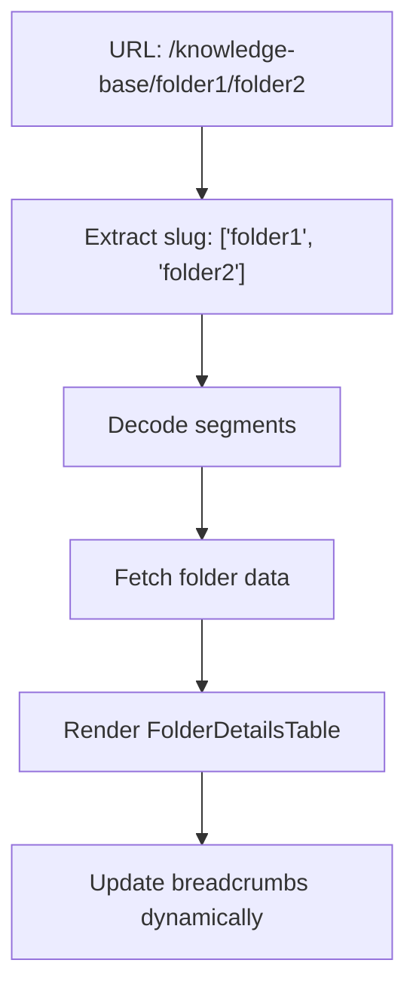
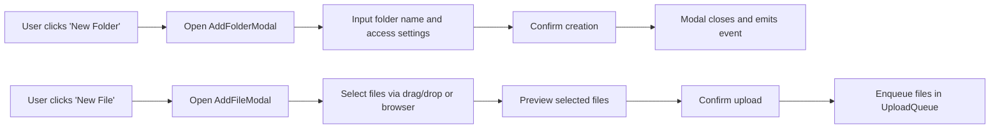
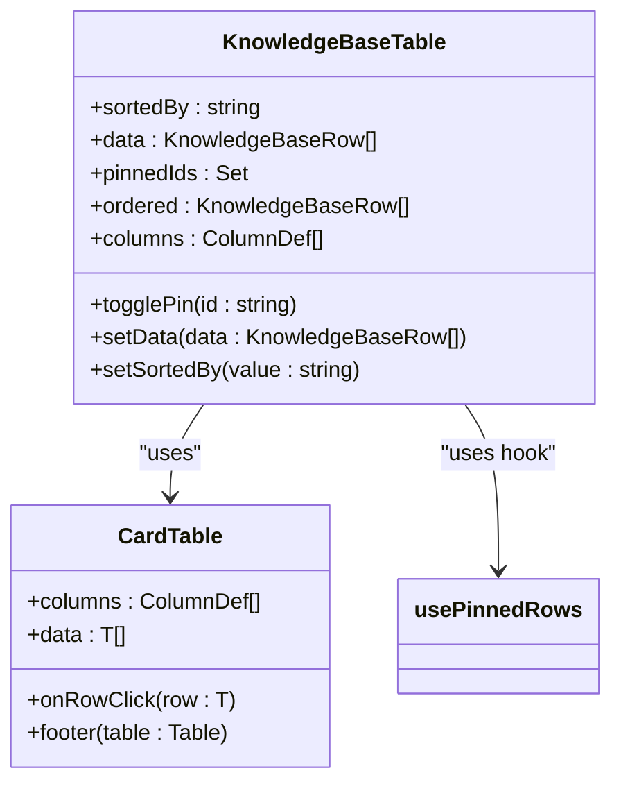
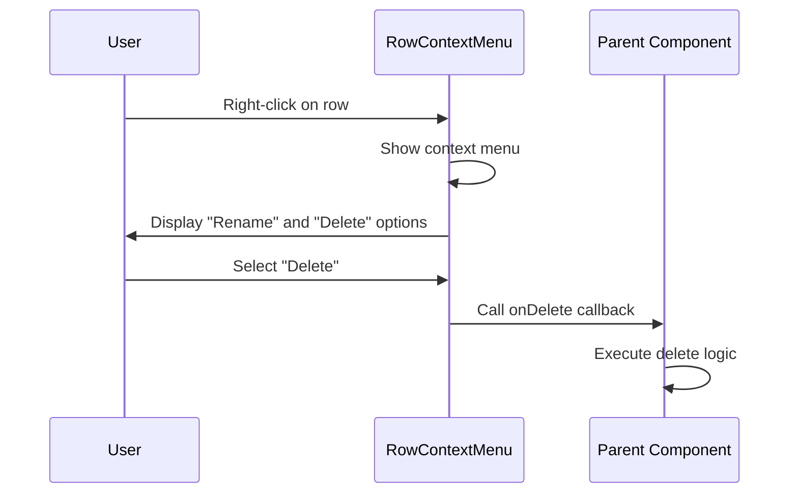
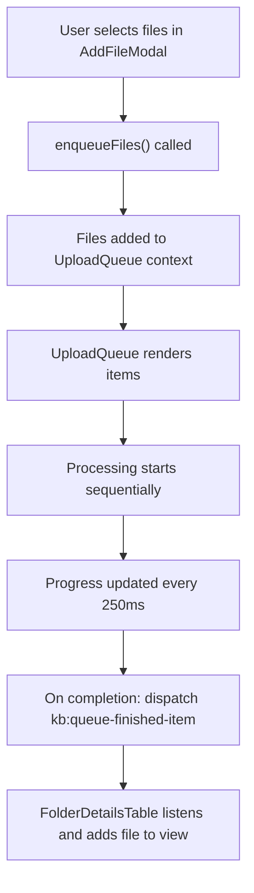
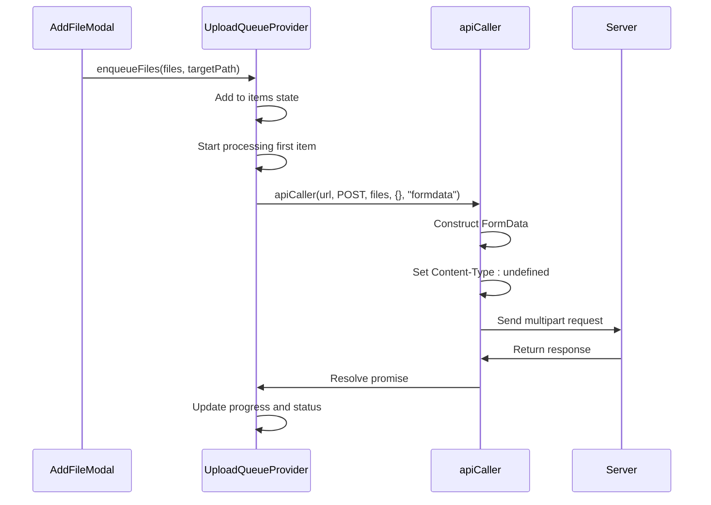
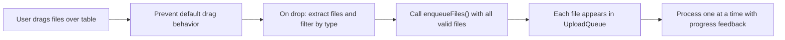

# Knowledge Base

<cite>
**Referenced Files in This Document**   
- [page.tsx](file://src/app/(admin)/dashboard/knowledge-base/[...slug]/page.tsx)
- [folder-details-table.tsx](file://src/components/knowledge-base/folder-details-table.tsx)
- [knowledge-base-table.tsx](file://src/components/knowledge-base/knowledge-base-table.tsx)
- [add-folder-modal.tsx](file://src/components/knowledge-base/add-folder-modal.tsx)
- [add-file-modal.tsx](file://src/components/knowledge-base/add-file-modal.tsx)
- [row-context-menus.tsx](file://src/components/knowledge-base/row-context-menus.tsx)
- [upload-queue.tsx](file://src/components/knowledge-base/upload-queue.tsx)
- [upload-queue-context.tsx](file://src/contexts/upload-queue-context.tsx)
- [api-caller.ts](file://src/lib/api-caller.ts)
- [branches.ts](file://src/services/branches.ts)
</cite>

## Table of Contents
1. [Introduction](#introduction)
2. [Hierarchical Navigation and Dynamic Routing](#hierarchical-navigation-and-dynamic-routing)
3. [Folder and File Creation via Modals](#folder-and-file-creation-via-modals)
4. [Structured Content Display with knowledge-base-table.tsx](#structured-content-display-with-knowledge-basetabletsx)
5. [Inline Actions with row-context-menus.tsx](#inline-actions-with-row-context-menustsx)
6. [Upload Queue Management](#upload-queue-management)
7. [File Upload Integration via api-caller.ts](#file-upload-integration-via-api-callerts)
8. [Branch Management via branches.ts](#branch-management-via-branchests)
9. [Drag-and-Drop and Batch Operations](#drag-and-drop-and-batch-operations)
10. [Common Issues and Implementation Strategies](#common-issues-and-implementation-strategies)
11. [Conclusion](#conclusion)

## Introduction
The Knowledge Base module in the ERP system serves as a centralized document and file management solution, enabling users to organize, access, and manage content through a hierarchical structure. It supports dynamic navigation, file and folder creation, upload queue visualization, and inline actions for efficient content management. This document details the implementation of core features including dynamic routing, modal-based creation, structured data display, context menus, upload handling, and backend integration.

**Section sources**
- [page.tsx](file://src/app/(admin)/dashboard/knowledge-base/[...slug]/page.tsx#L1-L77)
- [folder-details-table.tsx](file://src/components/knowledge-base/folder-details-table.tsx#L1-L211)

## Hierarchical Navigation and Dynamic Routing
The Knowledge Base implements hierarchical navigation using Next.js dynamic routing with the `[...slug]` pattern. This allows the system to represent nested folder structures in the URL path, enabling deep linking and state persistence across folder levels. The `page.tsx` file in the `[...slug]` directory captures the path segments and decodes them to reconstruct the current folder hierarchy. Breadcrumb navigation is dynamically generated based on the decoded path segments, providing users with intuitive navigation and context awareness.

**Diagram sources**
- [page.tsx](file://src/app/(admin)/dashboard/knowledge-base/[...slug]/page.tsx#L45-L65)

**Section sources**
- [page.tsx](file://src/app/(admin)/dashboard/knowledge-base/[...slug]/page.tsx#L45-L77)

## Folder and File Creation via Modals
Folder and file creation are handled through dedicated modal components: `AddFolderModal` and `AddFileModal`. These modals provide user-friendly interfaces for inputting metadata and selecting files. The `AddFolderModal` supports setting access levels (private, specific people, or department-wide), while the `AddFileModal` allows multiple file selection via drag-and-drop or file browser. Both modals integrate with the upload queue system to manage file processing asynchronously.

**Diagram sources**
- [add-folder-modal.tsx](file://src/components/knowledge-base/add-folder-modal.tsx#L23-L108)
- [add-file-modal.tsx](file://src/components/knowledge-base/add-file-modal.tsx#L8-L50)

**Section sources**
- [add-folder-modal.tsx](file://src/components/knowledge-base/add-folder-modal.tsx#L1-L108)
- [add-file-modal.tsx](file://src/components/knowledge-base/add-file-modal.tsx#L1-L50)

## Structured Content Display with knowledge-base-table.tsx
The `knowledge-base-table.tsx` component renders structured content using a customizable table layout. It supports sorting by various columns (folder, created by, access level, date created), pinning of important rows, and responsive design. The table uses `CardTable` as a base component with custom column definitions for displaying file icons, avatars, badges for access levels, and action buttons. Sorting is implemented via React state management, with locale-aware string comparison for consistent ordering.

**Diagram sources**
- [knowledge-base-table.tsx](file://src/components/knowledge-base/knowledge-base-table.tsx#L54-L159)

**Section sources**
- [knowledge-base-table.tsx](file://src/components/knowledge-base/knowledge-base-table.tsx#L1-L159)

## Inline Actions with row-context-menus.tsx
The `row-context-menus.tsx` component provides inline context menus for table rows, enabling actions like rename and delete directly from the UI. When a user right-clicks or interacts with a row, a context menu appears with action items. The component accepts callback functions (`onRename`, `onDelete`) as props, allowing parent components to define specific behavior. Icons from Lucide are used for visual clarity, and the menu is styled consistently with the application's design system.

**Diagram sources**
- [row-context-menus.tsx](file://src/components/knowledge-base/row-context-menus.tsx#L33-L53)

**Section sources**
- [row-context-menus.tsx](file://src/components/knowledge-base/row-context-menus.tsx#L1-L53)

## Upload Queue Management
The upload queue is managed by the `UploadQueue` component and its associated context provider `UploadQueueProvider`. The queue displays real-time upload progress for multiple files, including status indicators (pending, uploading, done, error), progress bars, and cancellation options. Files are processed sequentially to avoid overwhelming the server. Upon completion, a custom DOM event (`kb:queue-finished-item`) is dispatched to notify other components, such as `FolderDetailsTable`, to update their state with newly uploaded files.

**Diagram sources**
- [upload-queue.tsx](file://src/components/knowledge-base/upload-queue.tsx#L18-L59)
- [upload-queue-context.tsx](file://src/contexts/upload-queue-context.tsx#L22-L81)

**Section sources**
- [upload-queue.tsx](file://src/components/knowledge-base/upload-queue.tsx#L1-L59)
- [upload-queue-context.tsx](file://src/contexts/upload-queue-context.tsx#L1-L81)

## File Upload Integration via api-caller.ts
File uploads are handled through the `apiCaller` utility in `api-caller.ts`, which abstracts Axios requests with support for both JSON and FormData payloads. When uploading files, the `dataType` parameter is set to `"formdata"`, which automatically configures the request headers and constructs a `FormData` object from the provided files. The utility ensures proper `Content-Type` handling by setting it to `undefined`, allowing the browser to set the correct multipart boundary. This enables seamless integration with backend APIs for file ingestion.

**Diagram sources**
- [api-caller.ts](file://src/lib/api-caller.ts#L12-L82)
- [add-file-modal.tsx](file://src/components/knowledge-base/add-file-modal.tsx#L8-L50)

**Section sources**
- [api-caller.ts](file://src/lib/api-caller.ts#L1-L82)

## Branch Management via branches.ts
The `branches.ts` service provides CRUD operations for branch entities within the ERP system. It uses `apiCaller` to communicate with the backend API, supporting listing, retrieving, creating, updating, and deleting branches. The service exports typed interfaces for request and response payloads, ensuring type safety across the application. While not directly part of the Knowledge Base UI, this service demonstrates the pattern used for backend integration, which could be extended to support metadata tagging or location-based access control in future Knowledge Base enhancements.

**Section sources**
- [branches.ts](file://src/services/branches.ts#L1-L53)

## Drag-and-Drop and Batch Operations
The Knowledge Base supports drag-and-drop file uploads directly onto the `FolderDetailsTable` component. The table listens to `dragover` and `drop` events, filtering for valid file types (PDF, DOC, DOCX) before enqueuing them for upload. Batch operations are supported through the upload queue, which can handle multiple files simultaneously, displaying individual progress and allowing bulk clearing. The `AddFileModal` also supports selecting multiple files at once, enabling batch uploads from the file browser.

**Diagram sources**
- [folder-details-table.tsx](file://src/components/knowledge-base/folder-details-table.tsx#L150-L170)

**Section sources**
- [folder-details-table.tsx](file://src/components/knowledge-base/folder-details-table.tsx#L1-L211)

## Common Issues and Implementation Strategies
The system addresses common file management issues through specific implementation strategies:
- **Upload Failures**: Simulated