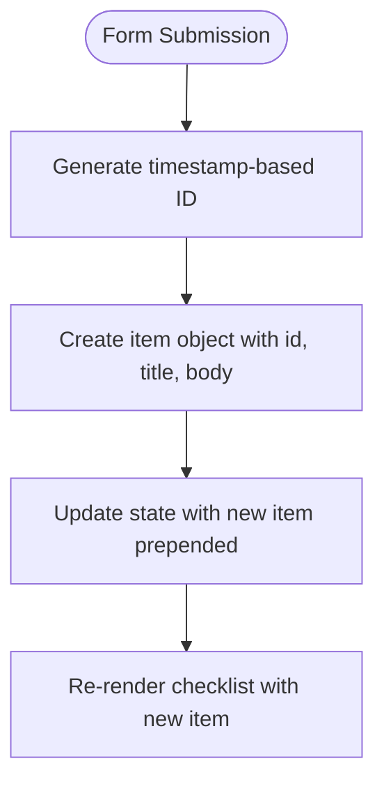

# Checklist Management

<cite>
**Referenced Files in This Document**  
- [checklist-card.tsx](file://src/components/new-hire/checklist-card.tsx)
- [new-task-modal.tsx](file://src/components/new-hire/new-task-modal.tsx)
- [checklist-item.tsx](file://src/components/new-hire/checklist-item.tsx)
- [new-hire-plan-form.tsx](file://src/components/new-hire/new-hire-plan-form.tsx)
</cite>

## Table of Contents
1. [Component Architecture](#component-architecture)
2. [State Management Strategy](#state-management-strategy)
3. [Interaction Flow](#interaction-flow)
4. [Data Structure and Item Creation](#data-structure-and-item-creation)
5. [Rich Content Handling](#rich-content-handling)
6. [Common Issues and Solutions](#common-issues-and-solutions)
7. [Extensibility Points](#extensibility-points)

## Component Architecture

The checklist management system is built around three primary components: `ChecklistCard`, `ChecklistItem`, and `NewTaskModal`. These components work together to provide a complete interface for managing onboarding tasks and training items.

The `ChecklistCard` component serves as the container for either tasks or training items, using the `variant` prop to distinguish between the two categories. This prop accepts either "task" or "training" values, allowing the system to maintain separate checklists while reusing the same underlying component structure.

**Diagram sources**
- [checklist-card.tsx](file://src/components/new-hire/checklist-card.tsx#L8-L43)
- [new-task-modal.tsx](file://src/components/new-hire/new-task-modal.tsx#L16-L68)
- [checklist-item.tsx](file://src/components/new-hire/checklist-item.tsx#L5-L22)

**Section sources**
- [checklist-card.tsx](file://src/components/new-hire/checklist-card.tsx#L8-L43)
- [new-task-modal.tsx](file://src/components/new-hire/new-task-modal.tsx#L9-L14)

## State Management Strategy

The checklist system employs React's `useState` hook to manage item state within the `ChecklistCard` component. The state is initialized with the `initial` prop, which contains an array of `ChecklistItemData` objects.

The `handleDelete` function implements a functional state update pattern, filtering out the item with the specified ID from the previous state. This approach ensures that state updates are predictable and avoids potential issues with stale closures.

**Section sources**
- [checklist-card.tsx](file://src/components/new-hire/checklist-card.tsx#L15-L17)

## Interaction Flow

The user interaction flow begins when an HR administrator clicks the add button on a `ChecklistCard`, which triggers the `setOpen(true)` function to display the `NewTaskModal`.

**Diagram sources**
- [checklist-card.tsx](file://src/components/new-hire/checklist-card.tsx#L25-L43)
- [new-task-modal.tsx](file://src/components/new-hire/new-task-modal.tsx#L16-L68)

**Section sources**
- [checklist-card.tsx](file://src/components/new-hire/checklist-card.tsx#L25-L43)
- [new-task-modal.tsx](file://src/components/new-hire/new-task-modal.tsx#L16-L68)

## Data Structure and Item Creation

The system uses a consistent data structure for checklist items, defined as `ChecklistItemData` with `id`, `title`, and `body` properties. When creating new items, the system generates stable IDs using a timestamp-based approach to prevent SSR/CSR mismatches.

The `onCreate` callback in `NewTaskModal` receives the title and detail from the form inputs and passes them to the parent component. The parent then prepends the new item to the existing list using the spread operator, ensuring that newly added items appear at the top of the checklist.

**Diagram sources**
- [checklist-card.tsx](file://src/components/new-hire/checklist-card.tsx#L38-L42)
- [new-task-modal.tsx](file://src/components/new-hire/new-task-modal.tsx#L30-L34)

**Section sources**
- [checklist-card.tsx](file://src/components/new-hire/checklist-card.tsx#L38-L42)
- [new-hire-plan-form.tsx](file://src/components/new-hire/new-hire-plan-form.tsx#L9-L9)

## Rich Content Handling

The system supports rich text editing through the `RichTextEditor` component, which allows users to format checklist item details with various text styles. The editor maintains its state independently within the `NewTaskModal` component, with changes propagated through the `onChange` callback.

File attachments are handled by the `Dropzone` component, which accepts various file types including images, PDFs, and Excel documents. The component provides a drag-and-drop interface for uploading files related to specific checklist items.

**Diagram sources**
- [new-task-modal.tsx](file://src/components/new-hire/new-task-modal.tsx#L53-L65)

**Section sources**
- [new-task-modal.tsx](file://src/components/new-hire/new-task-modal.tsx#L53-L65)

## Common Issues and Solutions

### Lost Edits During Modal Dismissal
When users dismiss the `NewTaskModal` without saving, any entered content is lost. This behavior is by design, as the modal uses controlled components that only update parent state upon confirmation.

**Solution**: Implement local storage persistence for draft content, automatically saving form inputs as users type and restoring them if the modal is reopened.

### Duplicate Item Creation
Rapid consecutive clicks on the "Add" button could potentially create duplicate items due to the asynchronous nature of state updates.

**Solution**: Disable the confirm button during submission and implement a debouncing mechanism to prevent rapid successive calls to the `onCreate` callback.

**Section sources**
- [new-task-modal.tsx](file://src/components/new-hire/new-task-modal.tsx#L30-L34)

## Extensibility Points

The checklist management system provides several extensibility points for developers:

1. **Validation**: Add form validation to the `NewTaskModal` by extending the `handleConfirm` function to check required fields before calling `onCreate`.

2. **Item Reordering**: Implement drag-and-drop functionality by adding event handlers to `ChecklistItem` and modifying the state update logic in `ChecklistCard`.

3. **Custom Fields**: Extend the `ChecklistItemData` interface to include additional properties such as due dates, priority levels, or assignees.

4. **Integration Hooks**: Add additional callbacks to `ChecklistCard` for events like item completion or editing, enabling deeper integration with other system components.

These extensibility points maintain the component's modular design while allowing for customization based on specific organizational needs.

**Section sources**
- [checklist-card.tsx](file://src/components/new-hire/checklist-card.tsx#L8-L43)
- [new-task-modal.tsx](file://src/components/new-hire/new-task-modal.tsx#L9-L14)