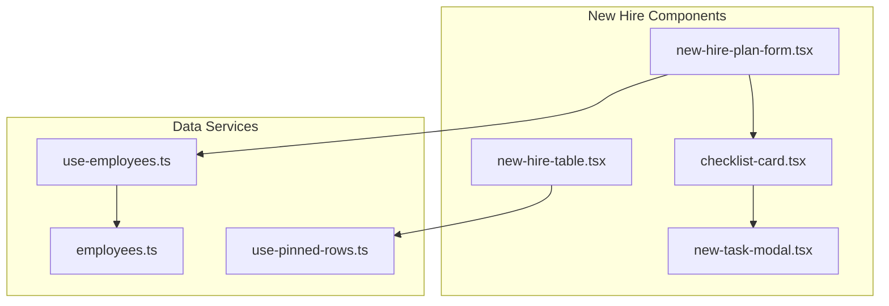
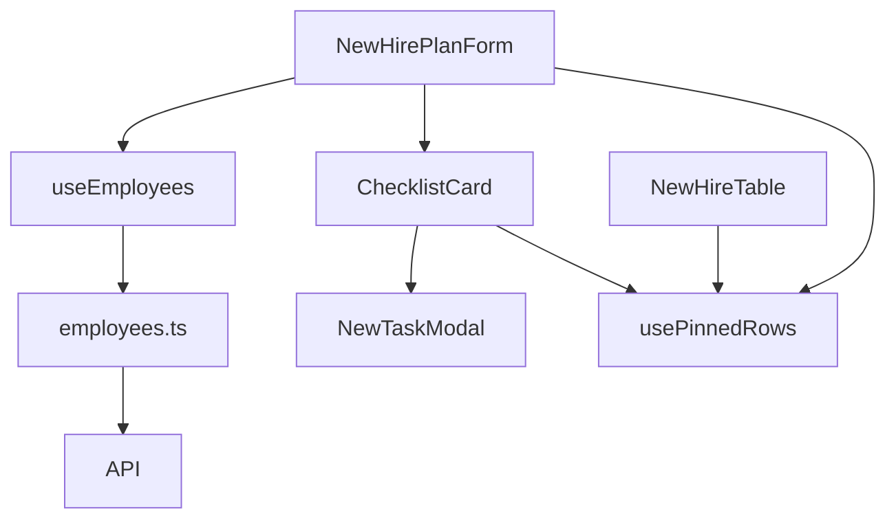
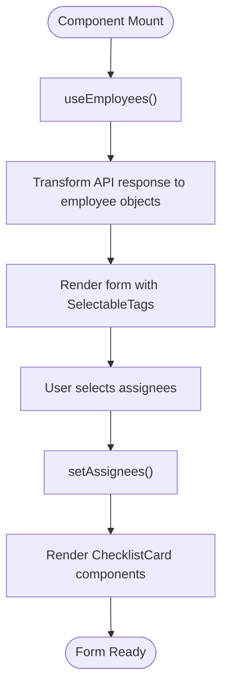
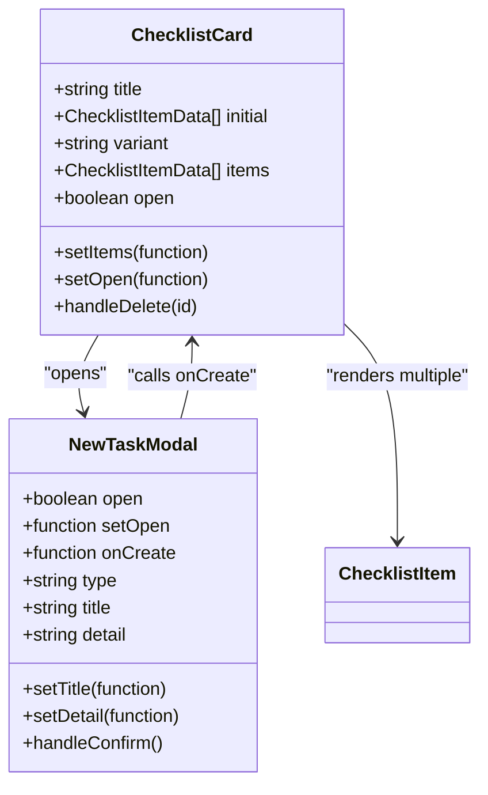
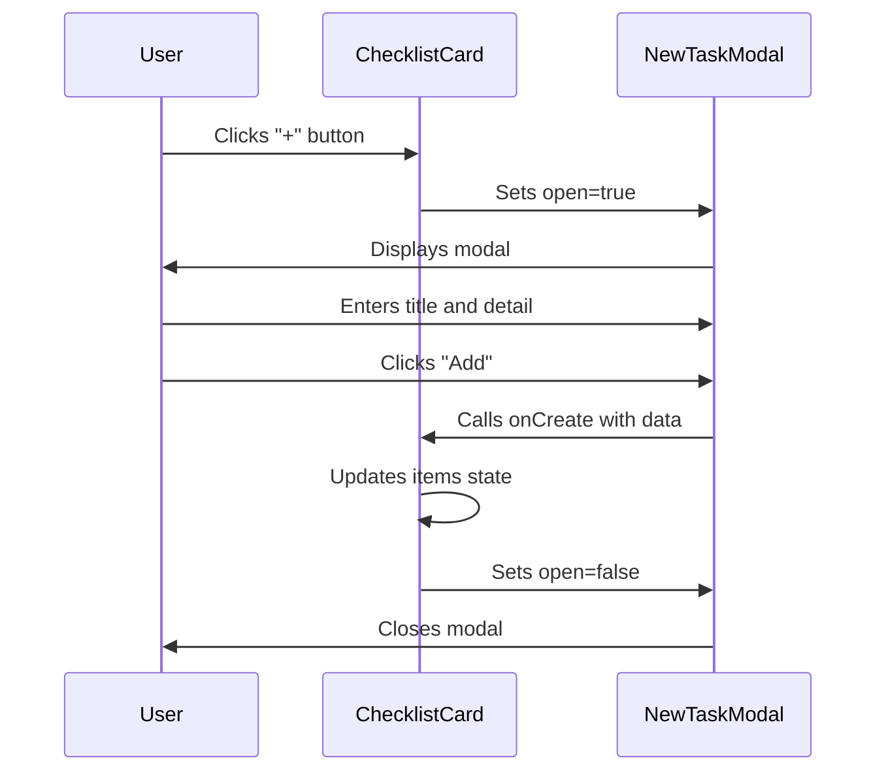
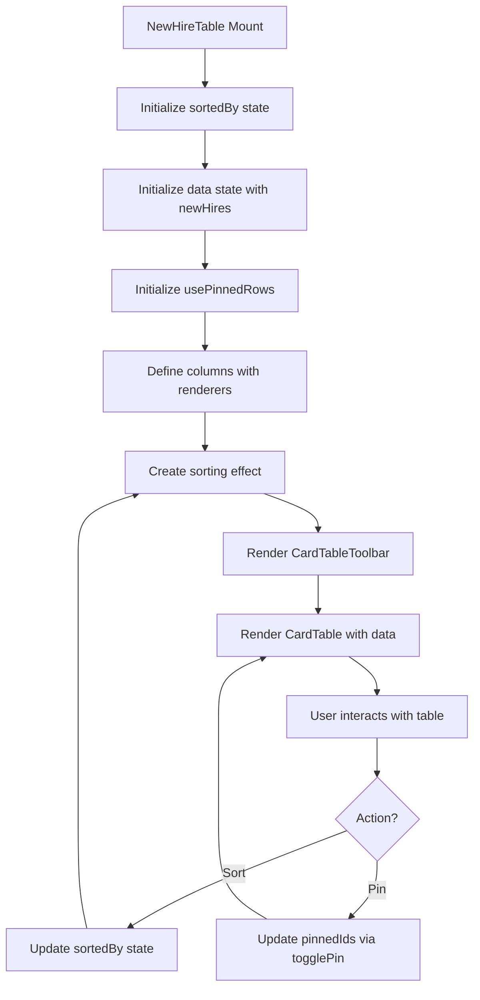
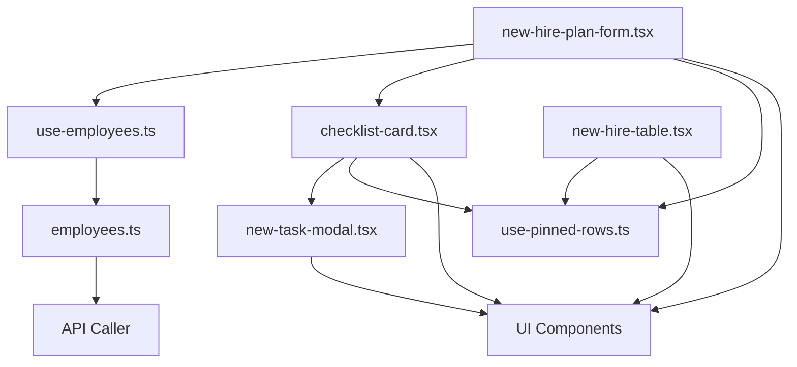

# New Hire Plan

<cite>
**Referenced Files in This Document**   
- [new-hire-plan-form.tsx](file://src/components/new-hire/new-hire-plan-form.tsx)
- [checklist-card.tsx](file://src/components/new-hire/checklist-card.tsx)
- [new-task-modal.tsx](file://src/components/new-hire/new-task-modal.tsx)
- [new-hire-table.tsx](file://src/components/new-hire/new-hire-table.tsx)
- [use-employees.ts](file://src/hooks/queries/use-employees.ts)
- [employees.ts](file://src/services/employees.ts)
- [use-pinned-rows.ts](file://src/hooks/use-pinned-rows.ts)
</cite>

## Table of Contents
1. [Introduction](#introduction)
2. [Project Structure](#project-structure)
3. [Core Components](#core-components)
4. [Architecture Overview](#architecture-overview)
5. [Detailed Component Analysis](#detailed-component-analysis)
6. [Dependency Analysis](#dependency-analysis)
7. [Performance Considerations](#performance-considerations)
8. [Troubleshooting Guide](#troubleshooting-guide)
9. [Conclusion](#conclusion)

## Introduction
The New Hire Plan feature is designed to streamline the onboarding process for new employees by providing structured checklists and task management tools. This system enables HR administrators to assign personalized onboarding plans with predefined tasks and training items, ensuring consistency and completeness across departments. The implementation includes a plan creation form, dynamic checklist display, and task management modal, all integrated with real employee data. The feature supports both task and training workflows, with visual indicators for status and assignment. This documentation provides a comprehensive overview of the implementation for both HR administrators and developers, detailing form validation, dynamic state updates, and integration patterns.

## Project Structure
The New Hire Plan functionality is organized under the `src/components/new-hire` directory, with dedicated components for form creation, checklist display, and table management. The feature integrates with employee data services and leverages shared UI components for consistency. The page-level routing is handled through Next.js App Router under `(admin)/dashboard/new-hire-plan`, with separate routes for viewing and creating plans. The component structure follows a modular pattern, separating concerns between data fetching, state management, and presentation.

**Diagram sources**
- [new-hire-plan-form.tsx](file://src/components/new-hire/new-hire-plan-form.tsx)
- [checklist-card.tsx](file://src/components/new-hire/checklist-card.tsx)
- [new-task-modal.tsx](file://src/components/new-hire/new-task-modal.tsx)
- [new-hire-table.tsx](file://src/components/new-hire/new-hire-table.tsx)
- [use-employees.ts](file://src/hooks/queries/use-employees.ts)
- [employees.ts](file://src/services/employees.ts)
- [use-pinned-rows.ts](file://src/hooks/use-pinned-rows.ts)

**Section sources**
- [new-hire-plan-form.tsx](file://src/components/new-hire/new-hire-plan-form.tsx)
- [checklist-card.tsx](file://src/components/new-hire/checklist-card.tsx)
- [new-task-modal.tsx](file://src/components/new-hire/new-task-modal.tsx)
- [new-hire-table.tsx](file://src/components/new-hire/new-hire-table.tsx)

## Core Components
The New Hire Plan feature consists of four primary components that work together to provide a complete onboarding workflow. The `NewHirePlanForm` serves as the main interface for creating new onboarding plans, integrating employee selection and checklist management. The `ChecklistCard` component displays and manages individual checklists for tasks and training, supporting dynamic item addition and deletion. The `NewTaskModal` provides a structured interface for adding new items to checklists, with support for rich text content and file attachments. The `NewHireTable` component displays existing plans in a tabular format with sorting, filtering, and pinning capabilities. These components are designed to work together seamlessly, sharing state and data through React hooks and context.

**Section sources**
- [new-hire-plan-form.tsx](file://src/components/new-hire/new-hire-plan-form.tsx#L19-L97)
- [checklist-card.tsx](file://src/components/new-hire/checklist-card.tsx#L8-L43)
- [new-task-modal.tsx](file://src/components/new-hire/new-task-modal.tsx#L16-L68)
- [new-hire-table.tsx](file://src/components/new-hire/new-hire-table.tsx#L44-L152)

## Architecture Overview
The New Hire Plan feature follows a client-side component architecture with React hooks managing state and data fetching. The system uses a composition pattern where higher-level components orchestrate data flow to specialized subcomponents. Data is fetched through React Query hooks that interface with API services, providing caching and automatic refetching. State management is handled locally within components using React's useState and useMemo hooks, with shared utility hooks for common patterns like row pinning. The architecture separates concerns between data access, business logic, and presentation, enabling maintainability and extensibility.

**Diagram sources**
- [new-hire-plan-form.tsx](file://src/components/new-hire/new-hire-plan-form.tsx)
- [use-employees.ts](file://src/hooks/queries/use-employees.ts)
- [employees.ts](file://src/services/employees.ts)
- [use-pinned-rows.ts](file://src/hooks/use-pinned-rows.ts)

## Detailed Component Analysis

### New Hire Plan Form Analysis
The `NewHirePlanForm` component serves as the central interface for creating new onboarding plans. It integrates employee data from the `useEmployees` hook, which fetches employee information from the backend API. The component uses React's useState to manage selected assignees and useMemo to transform employee data into a format suitable for the SelectableTags component. The form displays two checklist cards for tasks and training, each initialized with sample data. Employee selection is implemented with a searchable dropdown that displays avatars and department information, providing visual feedback for assigned personnel.

**Diagram sources**
- [new-hire-plan-form.tsx](file://src/components/new-hire/new-hire-plan-form.tsx#L19-L97)
- [use-employees.ts](file://src/hooks/queries/use-employees.ts#L12-L18)

**Section sources**
- [new-hire-plan-form.tsx](file://src/components/new-hire/new-hire-plan-form.tsx#L19-L97)

### Checklist Card Analysis
The `ChecklistCard` component manages a collection of checklist items, supporting both tasks and training workflows through its variant prop. It maintains internal state for the list of items using useState, with built-in functionality for adding and removing items. The component renders a "+" button that opens the `NewTaskModal` when clicked, passing the variant type to determine whether a task or training item is being added. Each checklist item is rendered with a delete button, allowing for removal from the list. The component uses controlled state updates to ensure consistent UI behavior and prevent race conditions during item manipulation.

**Diagram sources**
- [checklist-card.tsx](file://src/components/new-hire/checklist-card.tsx#L8-L43)
- [new-task-modal.tsx](file://src/components/new-hire/new-task-modal.tsx#L16-L68)

**Section sources**
- [checklist-card.tsx](file://src/components/new-hire/checklist-card.tsx#L8-L43)

### New Task Modal Analysis
The `NewTaskModal` component provides a structured interface for adding new tasks or training items to a checklist. It accepts props for controlling visibility, handling creation events, and specifying the type of item being added. The modal uses local state to manage the title and detail fields, with React's useState hook ensuring consistent updates. Form validation is implemented through controlled inputs that update state on change. The component supports rich text editing for detailed descriptions and includes a dropzone for file attachments. Upon confirmation, the modal calls the onCreate callback with the entered data, allowing the parent component to handle state updates.

**Diagram sources**
- [new-task-modal.tsx](file://src/components/new-hire/new-task-modal.tsx#L16-L68)
- [checklist-card.tsx](file://src/components/new-hire/checklist-card.tsx#L8-L43)

**Section sources**
- [new-task-modal.tsx](file://src/components/new-hire/new-task-modal.tsx#L16-L68)

### New Hire Table Analysis
The `NewHireTable` component displays a list of existing onboarding plans in a tabular format with sorting and pinning capabilities. It uses React's useState to manage the current sort column and useMemo to sort data based on user selection. The component integrates with the `usePinnedRows` custom hook, which manages pinned row state across the application. Column definitions specify how data is rendered, including avatar stacks for multiple assignees and badges for status indicators. The table supports sorting by department, creation date, status, and assigned-by fields, with visual feedback for the active sort column. Pinned rows appear at the top of the table regardless of sort order, providing quick access to important plans.

**Diagram sources**
- [new-hire-table.tsx](file://src/components/new-hire/new-hire-table.tsx#L44-L152)
- [use-pinned-rows.ts](file://src/hooks/use-pinned-rows.ts#L4-L35)

**Section sources**
- [new-hire-table.tsx](file://src/components/new-hire/new-hire-table.tsx#L44-L152)

## Dependency Analysis
The New Hire Plan feature has a well-defined dependency structure that separates concerns between components and services. The `NewHirePlanForm` depends on employee data through the `useEmployees` hook, which in turn depends on the `employees.ts` service module. The checklist components have a parent-child relationship, with `ChecklistCard` rendering `NewTaskModal` and `ChecklistItem` components. The table component depends on the `usePinnedRows` utility hook for managing pinned state across the application. All components share dependencies on UI primitives like Card, Button, and Avatar from the component library. The dependency graph shows a clear hierarchy with data flowing from services through hooks to presentation components.

**Diagram sources**
- [new-hire-plan-form.tsx](file://src/components/new-hire/new-hire-plan-form.tsx)
- [use-employees.ts](file://src/hooks/queries/use-employees.ts)
- [employees.ts](file://src/services/employees.ts)
- [use-pinned-rows.ts](file://src/hooks/use-pinned-rows.ts)
- [checklist-card.tsx](file://src/components/new-hire/checklist-card.tsx)
- [new-task-modal.tsx](file://src/components/new-hire/new-task-modal.tsx)
- [new-hire-table.tsx](file://src/components/new-hire/new-hire-table.tsx)

**Section sources**
- [new-hire-plan-form.tsx](file://src/components/new-hire/new-hire-plan-form.tsx)
- [use-employees.ts](file://src/hooks/queries/use-employees.ts)
- [employees.ts](file://src/services/employees.ts)
- [use-pinned-rows.ts](file://src/hooks/use-pinned-rows.ts)

## Performance Considerations
The New Hire Plan implementation includes several performance optimizations to ensure responsive user interactions. The `useMemo` hook is used extensively to prevent unnecessary recalculations, particularly in data transformation operations like converting API responses to employee objects. The `usePinnedRows` custom hook implements memoization to avoid recomputing sorted data on every render. The table component uses React's `useEffect` to apply sorting only when dependencies change, rather than on every render cycle. State updates are batched where possible, and event handlers are memoized with `useCallback` to prevent unnecessary re-renders of child components. The use of React Query provides automatic caching and deduplication of API requests, reducing network overhead and improving perceived performance.

## Troubleshooting Guide
Common issues with the New Hire Plan feature typically relate to data loading, state synchronization, and form validation. If employee data fails to load in the assignee selector, verify that the `useEmployees` hook is properly configured and that the API endpoint is accessible. For checklist items that don't persist after addition, ensure that the `onCreate` callback in `NewTaskModal` properly updates the parent component's state. If sorting in the table doesn't work as expected, check that the `sortedBy` state is correctly linked to the column definitions. For issues with pinned rows not appearing at the top, verify that the `usePinnedRows` hook is receiving the correct data array and that the `ordered` property is being used for rendering. Form validation errors can be diagnosed by checking that input onChange handlers are properly updating state and that required fields have appropriate default values.

**Section sources**
- [new-hire-plan-form.tsx](file://src/components/new-hire/new-hire-plan-form.tsx)
- [checklist-card.tsx](file://src/components/new-hire/checklist-card.tsx)
- [new-task-modal.tsx](file://src/components/new-hire/new-task-modal.tsx)
- [new-hire-table.tsx](file://src/components/new-hire/new-hire-table.tsx)
- [use-employees.ts](file://src/hooks/queries/use-employees.ts)
- [employees.ts](file://src/services/employees.ts)

## Conclusion
The New Hire Plan feature provides a comprehensive solution for onboarding new employees through structured checklists and task management. The implementation demonstrates effective use of React patterns, including custom hooks for data fetching and state management, component composition for reusable UI elements, and proper separation of concerns between presentation and logic. The system integrates seamlessly with employee data services, providing HR administrators with a powerful tool for managing onboarding workflows. For developers, the codebase offers clear extension points for adding new checklist types, integrating with additional data sources, or enhancing the user interface. The combination of form validation, dynamic state updates, and persistent data management creates a robust foundation for future enhancements to the onboarding process.