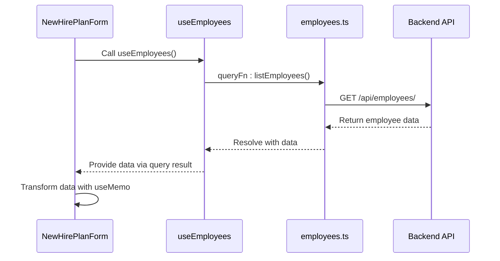
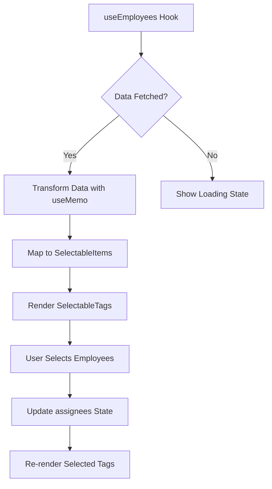
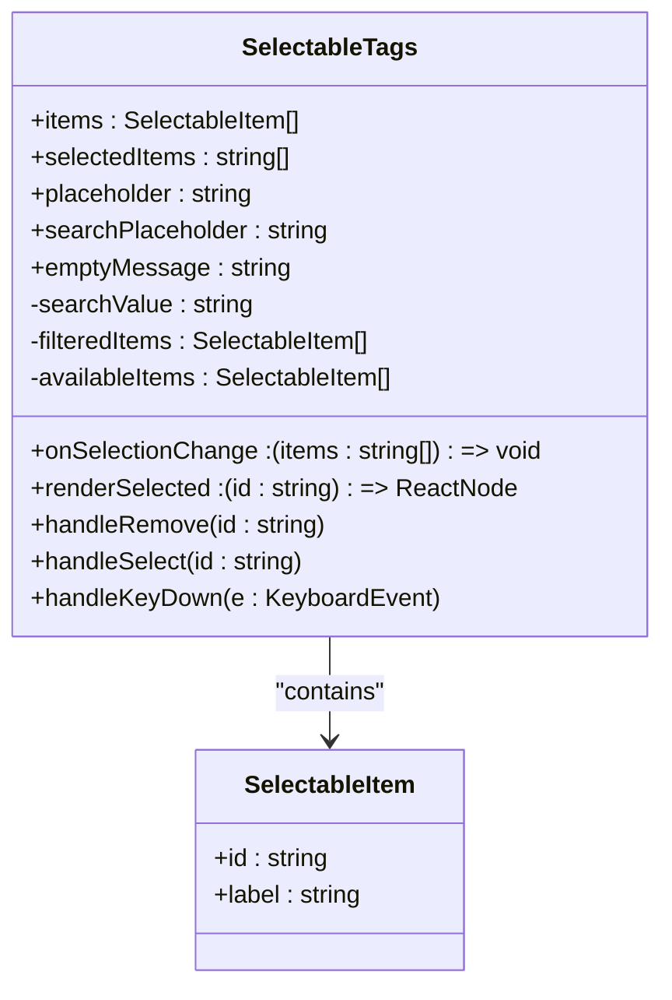
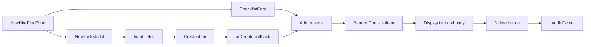

# Plan Creation

<cite>
**Referenced Files in This Document**   
- [new-hire-plan-form.tsx](file://src/components/new-hire/new-hire-plan-form.tsx)
- [use-employees.ts](file://src/hooks/queries/use-employees.ts)
- [selectable-tags.tsx](file://src/components/ui/selectable-tags.tsx)
- [checklist-card.tsx](file://src/components/new-hire/checklist-card.tsx)
- [employees.ts](file://src/services/employees.ts)
- [api.d.ts](file://src/types/api.d.ts)
- [api-routes.ts](file://src/constants/api-routes.ts)
</cite>

## Table of Contents
1. [Introduction](#introduction)
2. [Training Checklists Form Overview](#new-hire-plan-form-overview)
3. [Employee Data Integration](#employee-data-integration)
4. [Form State Management](#form-state-management)
5. [Selectable Tags Implementation](#selectable-tags-implementation)
6. [Checklist Initialization and Management](#checklist-initialization-and-management)
7. [Performance Optimization and Common Issues](#performance-optimization-and-common-issues)
8. [Conclusion](#conclusion)

## Introduction
The Training Checklists creation process enables HR administrators to design structured onboarding workflows by assigning employees and defining task and training checklists. This document details the implementation of the `NewHirePlanForm` component, its integration with employee data, state management patterns, and user interface behaviors. The system supports dynamic employee selection, avatar rendering, department display, and interactive checklist management through reusable UI components and React hooks.

## Training Checklists Form Overview

The `NewHirePlanForm` component serves as the central interface for creating onboarding plans. It allows HR administrators to assign one or more employees to a new hire plan and define both task and training checklists that guide the onboarding process.

The form is composed of two primary sections:
1. **Employee Assignment**: A multi-select input using `SelectableTags` to choose assignees from the organization's employee list.
2. **Checklist Configuration**: Two side-by-side checklist cards for defining tasks and training items.

The component leverages React's `useState` and `useMemo` hooks for efficient state management and rendering optimizations.

**Section sources**
- [new-hire-plan-form.tsx](file://src/components/new-hire/new-hire-plan-form.tsx#L19-L97)

## Employee Data Integration

The form integrates with the `useEmployees` hook to fetch and display employee data from the backend API. This hook utilizes React Query for data fetching, caching, and automatic refetching based on query keys.

Employee data is retrieved from the `/api/employees/` endpoint and can be returned in either paginated format (with `results` array) or as a direct array. The component handles both response formats through conditional logic in the `useMemo` transformation.

Key employee attributes mapped from the API include:
- `id`: Unique identifier for the employee
- `full_name`: Display name (fallback to `name` if not available)
- `username`: Login identifier
- `department_name`: Organizational unit (fallback to `department`)
- `profile_picture_url`: Avatar image URL (fallback to `profile_picture`)

This flexible mapping ensures compatibility with varying API response structures while maintaining consistent internal data representation.

**Diagram sources**
- [new-hire-plan-form.tsx](file://src/components/new-hire/new-hire-plan-form.tsx#L22-L38)
- [use-employees.ts](file://src/hooks/queries/use-employees.ts#L12-L18)
- [employees.ts](file://src/services/employees.ts#L20-L30)
- [api-routes.ts](file://src/constants/api-routes.ts#L50-L56)

**Section sources**
- [new-hire-plan-form.tsx](file://src/components/new-hire/new-hire-plan-form.tsx#L22-L38)
- [use-employees.ts](file://src/hooks/queries/use-employees.ts#L12-L18)

## Form State Management

The form maintains two primary state variables:
- `assignees`: An array of employee IDs (as strings) representing selected employees
- `employees`: Transformed employee data derived from the API response

State updates are handled through React's `useState` setter functions, with `setAssignees` being passed directly to the `onSelectionChange` callback of `SelectableTags`. This creates a controlled component pattern where the parent form manages the selection state.

The use of `React.useMemo` for transforming employee data ensures that expensive operations (such as mapping and fallback handling) are only performed when the underlying data changes, rather than on every render. This optimization prevents unnecessary reprocessing of employee lists during other state updates.

**Diagram sources**
- [new-hire-plan-form.tsx](file://src/components/new-hire/new-hire-plan-form.tsx#L22-L43)

**Section sources**
- [new-hire-plan-form.tsx](file://src/components/new-hire/new-hire-plan-form.tsx#L22-L43)

## Selectable Tags Implementation

The `SelectableTags` component provides a multi-selection interface for choosing employees to assign to the new hire plan. It accepts several props that customize its behavior:

- `items`: Array of selectable options (employee names)
- `selectedItems`: Current selection state
- `onSelectionChange`: Callback for updating selection
- `renderSelected`: Custom renderer for displaying selected items

The custom `renderSelected` function displays each selected employee with their avatar, full name, and department. Avatars are rendered using the `Avatar` component with:
- `AvatarImage`: Displays the employee's profile picture if available
- `AvatarFallback`: Shows initials when no image is present

The component supports searching through the employee list with real-time filtering. Available items are filtered based on the search input, and selections are excluded from the available list to prevent duplicate selections.

**Diagram sources**
- [selectable-tags.tsx](file://src/components/ui/selectable-tags.tsx#L40-L174)
- [new-hire-plan-form.tsx](file://src/components/new-hire/new-hire-plan-form.tsx#L45-L97)

**Section sources**
- [selectable-tags.tsx](file://src/components/ui/selectable-tags.tsx#L40-L174)
- [new-hire-plan-form.tsx](file://src/components/new-hire/new-hire-plan-form.tsx#L45-L97)

## Checklist Initialization and Management

The form initializes two checklist configurations:
- **Tasks Checklist**: Left column with predefined task items
- **Training Checklists**: Right column with predefined training items

Each checklist is managed by the `ChecklistCard` component, which maintains its own internal state for checklist items using `useState`. The initial items are defined as static arrays within `NewHirePlanForm` and passed as the `initial` prop.

New items can be added through the `NewTaskModal`, which appears when the user clicks the plus button. The modal supports both task and training types with appropriate labeling. When a new item is created, it is prepended to the checklist with a timestamp-based ID to ensure uniqueness and avoid hydration mismatches between server and client rendering.

The `ChecklistItem` component renders individual checklist entries with:
- Title and body text
- Delete button (with click propagation prevention)
- Click-to-edit behavior

**Diagram sources**
- [new-hire-plan-form.tsx](file://src/components/new-hire/new-hire-plan-form.tsx#L50-L97)
- [checklist-card.tsx](file://src/components/new-hire/checklist-card.tsx#L10-L43)
- [new-task-modal.tsx](file://src/components/new-hire/new-task-modal.tsx#L10-L71)

**Section sources**
- [new-hire-plan-form.tsx](file://src/components/new-hire/new-hire-plan-form.tsx#L50-L97)
- [checklist-card.tsx](file://src/components/new-hire/checklist-card.tsx#L10-L43)

## Performance Optimization and Common Issues

###