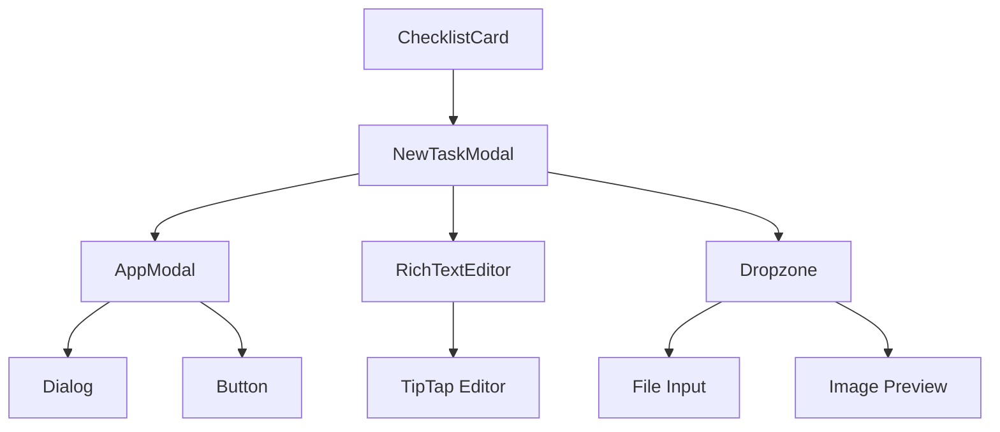
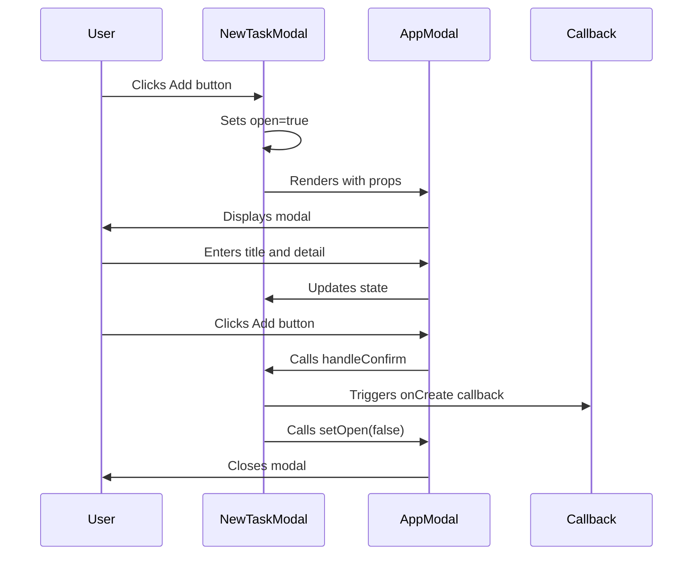
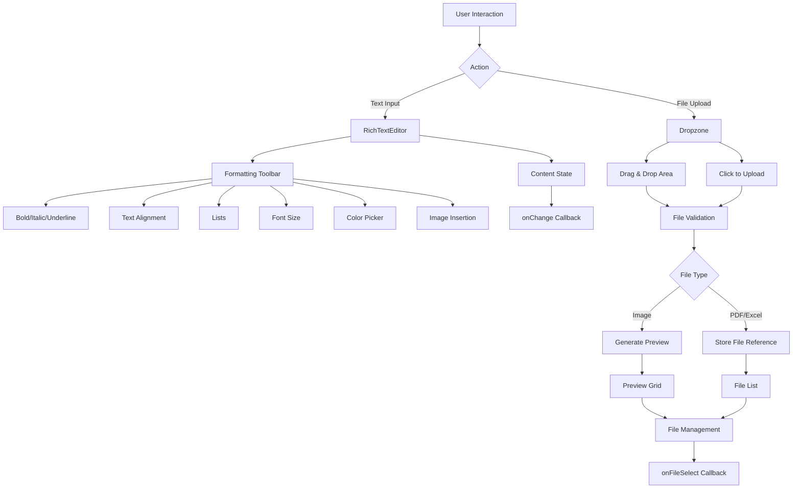
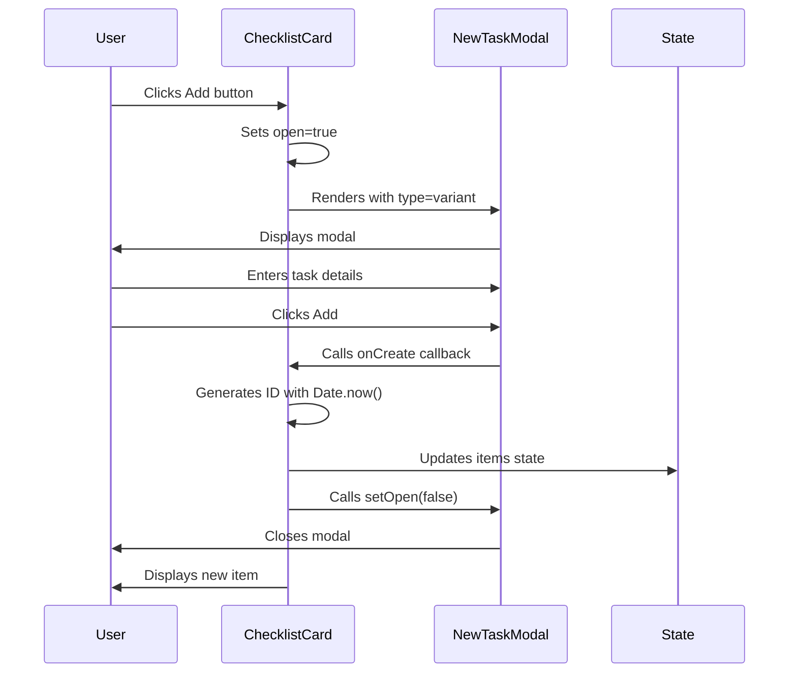
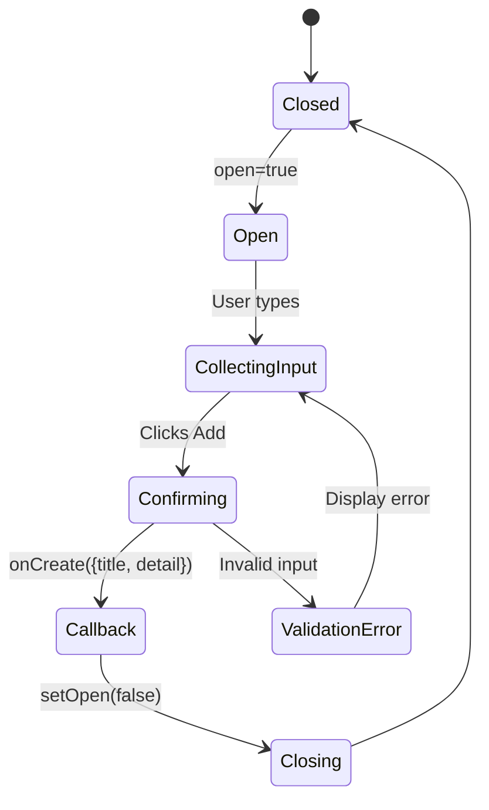

# Task Handling

<cite>
**Referenced Files in This Document**   
- [new-task-modal.tsx](file://src/components/new-hire/new-task-modal.tsx)
- [app-modal.tsx](file://src/components/common/app-modal.tsx)
- [rich-text-editor.tsx](file://src/components/ui/rich-text-editor.tsx)
- [dropzone.tsx](file://src/components/ui/dropzone.tsx)
- [checklist-card.tsx](file://src/components/new-hire/checklist-card.tsx)
- [checklist-item.tsx](file://src/components/new-hire/checklist-item.tsx)
- [new-hire-plan-form.tsx](file://src/components/new-hire/new-hire-plan-form.tsx)
</cite>

## Table of Contents
1. [Introduction](#introduction)
2. [Core Components](#core-components)
3. [Architecture Overview](#architecture-overview)
4. [Detailed Component Analysis](#detailed-component-analysis)
5. [Integration and Usage](#integration-and-usage)
6. [State Management and Workflow](#state-management-and-workflow)
7. [Common Issues and Solutions](#common-issues-and-solutions)
8. [Conclusion](#conclusion)

## Introduction

The New Hire Plan system in the CartwrightKing Admin ERP platform features a flexible task handling mechanism centered around the `NewTaskModal` component. This modal serves as a unified interface for creating both tasks and training items within onboarding checklists, enabling HR administrators to efficiently build structured onboarding plans. The component leverages conditional rendering based on a `type` prop to dynamically adapt its UI and behavior, providing a consistent yet context-aware experience. Integrated with core UI components like `AppModal`, `RichTextEditor`, and `Dropzone`, it supports rich content creation and file attachments, ensuring comprehensive task documentation. This document details the implementation, integration, and practical usage of this mechanism, offering guidance for both HR users and developers.

## Core Components

The task handling functionality is built upon several key components that work together to provide a seamless user experience. The `NewTaskModal` acts as the primary interface for creating new checklist items, while `AppModal` provides the foundational modal presentation layer. The `RichTextEditor` enables formatted text input for task descriptions, and `Dropzone` facilitates file attachments. These components are orchestrated within the `ChecklistCard` container, which manages the list of tasks or training items and triggers the modal. The data structure for checklist items is defined by the `ChecklistItemData` type, ensuring consistency across the system.

**Section sources**
- [new-task-modal.tsx](file://src/components/new-hire/new-task-modal.tsx#L9-L68)
- [app-modal.tsx](file://src/components/common/app-modal.tsx#L36-L105)
- [rich-text-editor.tsx](file://src/components/ui/rich-text-editor.tsx#L49-L573)
- [dropzone.tsx](file://src/components/ui/dropzone.tsx#L22-L256)

## Architecture Overview

The task handling mechanism follows a modular, component-based architecture where specialized UI components are composed to create a cohesive user experience. The `NewTaskModal` serves as a wrapper that configures and integrates lower-level components based on the current context (task vs. training). This design promotes reusability and maintainability, as changes to the modal presentation, text editing, or file upload functionality can be made independently.



**Diagram sources**
- [new-task-modal.tsx](file://src/components/new-hire/new-task-modal.tsx#L16-L68)
- [app-modal.tsx](file://src/components/common/app-modal.tsx#L36-L105)
- [rich-text-editor.tsx](file://src/components/ui/rich-text-editor.tsx#L49-L573)
- [dropzone.tsx](file://src/components/ui/dropzone.tsx#L22-L256)

## Detailed Component Analysis

### NewTaskModal Component

The `NewTaskModal` component is the central piece of the task handling mechanism, responsible for collecting user input and creating new checklist items. It accepts several props that define its behavior and appearance, with the `type` prop being particularly important for determining whether it's creating a task or training item.

#### Props Interface
The component's interface, defined by `NewTaskModalProps`, includes:
- `open`: Controls the visibility of the modal
- `setOpen`: Function to update the open state
- `onCreate`: Callback triggered when a new item is created
- `type`: Determines whether the modal is for "task" or "training" (defaults to "task")

The modal uses conditional rendering to display appropriate titles, descriptions, and labels based on the `type` prop, ensuring the UI is contextually relevant.

```mermaid
classDiagram
class NewTaskModal {
+open : boolean
+setOpen : (open : boolean) => void
+onCreate : (task : {title : string, detail : string}) => void
+type : "task" | "training"
-title : string
-detail : string
-handleConfirm() : void
}
```

**Diagram sources**
- [new-task-modal.tsx](file://src/components/new-hire/new-task-modal.tsx#L9-L14)

**Section sources**
- [new-task-modal.tsx](file://src/components/new-hire/new-task-modal.tsx#L9-L68)

### AppModal Integration

The `NewTaskModal` leverages `AppModal` as its presentation layer, inheriting consistent styling and behavior across the application. This integration ensures that all modals in the system share a unified look and feel, including the header with icon, title, and description, as well as the footer with action buttons.

The `AppModal` component accepts various props to customize its appearance and behavior:
- `title` and `description`: Set the modal header content
- `icon`: Specifies the icon to display in the header
- `confirmText` and `cancelText`: Label the action buttons
- `onConfirm` and `onCancel`: Define the callback functions for the buttons

This design allows `NewTaskModal` to focus on its specific functionality while delegating presentation concerns to the reusable `AppModal` component.



**Diagram sources**
- [new-task-modal.tsx](file://src/components/new-hire/new-task-modal.tsx#L16-L68)
- [app-modal.tsx](file://src/components/common/app-modal.tsx#L36-L105)

**Section sources**
- [app-modal.tsx](file://src/components/common/app-modal.tsx#L36-L105)

### RichTextEditor and Dropzone Components

The `NewTaskModal` incorporates two powerful input components to enhance the functionality of task creation: `RichTextEditor` for formatted text input and `Dropzone` for file attachments.

#### RichTextEditor
The `RichTextEditor` component provides a WYSIWYG interface for creating richly formatted task descriptions. It supports:
- Text formatting (bold, italic, underline, strikethrough)
- Text alignment (left, center, right)
- Lists (bulleted and numbered)
- Font size adjustment
- Text and highlight color customization
- Image insertion via URL

The editor is implemented using the TipTap framework and is fully controlled, synchronizing its content with the parent component's state through the `onChange` callback.

#### Dropzone
The `Dropzone` component enables users to attach files to tasks, supporting multiple file types including images, PDFs, and Excel files. It provides:
- Drag-and-drop file upload
- Click-to-upload functionality
- File preview for images
- Multiple file selection
- File removal capability

The component accepts an `accept` prop that specifies the allowed MIME types, ensuring only appropriate files can be uploaded.



**Diagram sources**
- [rich-text-editor.tsx](file://src/components/ui/rich-text-editor.tsx#L49-L573)
- [dropzone.tsx](file://src/components/ui/dropzone.tsx#L22-L256)

**Section sources**
- [rich-text-editor.tsx](file://src/components/ui/rich-text-editor.tsx#L49-L573)
- [dropzone.tsx](file://src/components/ui/dropzone.tsx#L22-L256)

## Integration and Usage

The `NewTaskModal` is integrated into the onboarding workflow through the `ChecklistCard` component, which represents a category of tasks or training items within a new hire plan. When a user clicks the "Add" button on a checklist card, the modal is triggered with the appropriate `variant` type.

The integration demonstrates a closure pattern where the `onCreate` callback maintains context about the specific checklist card that opened the modal. This ensures that newly created items are added to the correct list. The callback generates a stable ID for the new item using a timestamp-based approach, avoiding potential issues with server-side rendering.



**Diagram sources**
- [checklist-card.tsx](file://src/components/new-hire/checklist-card.tsx#L8-L43)
- [new-task-modal.tsx](file://src/components/new-hire/new-task-modal.tsx#L16-L68)

**Section sources**
- [checklist-card.tsx](file://src/components/new-hire/checklist-card.tsx#L8-L43)
- [checklist-item.tsx](file://src/components/new-hire/checklist-item.tsx#L5-L22)
- [new-hire-plan-form.tsx](file://src/components/new-hire/new-hire-plan-form.tsx#L9-L9)

## State Management and Workflow

The task handling mechanism employs a straightforward state management approach using React's `useState` hook within the `NewTaskModal` component. Two state variables track the user input:
- `title`: Stores the task or training title
- `detail`: Stores the rich text description

The initial state for these variables is determined by the `type` prop, with default values of "Task 1" or "Training 1" for the title. As the user types, the `onChange` handlers update the state, ensuring the UI remains synchronized with the input.

The confirmation workflow follows a clear sequence:
1. User clicks the "Add" button in the modal footer
2. The `handleConfirm` function is triggered
3. The `onCreate` callback is invoked with the current title and detail
4. The modal's `setOpen` function is called with `false` to close the modal
5. The parent component (typically `ChecklistCard`) updates its state to include the new item

This workflow ensures that task creation is atomic and that the modal is properly closed after submission.



**Diagram sources**
- [new-task-modal.tsx](file://src/components/new-hire/new-task-modal.tsx#L16-L68)

**Section sources**
- [new-task-modal.tsx](file://src/components/new-hire/new-task-modal.tsx#L16-L68)

## Common Issues and Solutions

### Uncontrolled Editor State
One potential issue is the `RichTextEditor` appearing uncontrolled, where changes don't properly update the parent component's state. This can occur if the `onChange` callback is not properly implemented or if there are timing issues with state updates.

**Solution**: Ensure the `onChange` callback is correctly passed and that the editor's content is properly synchronized with the component's state. The current implementation uses the `onUpdate` event from the TipTap editor to trigger the callback, which should prevent this issue.

### Attachment Upload Failures
Users