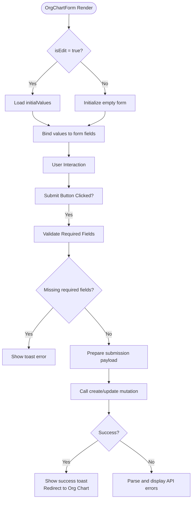
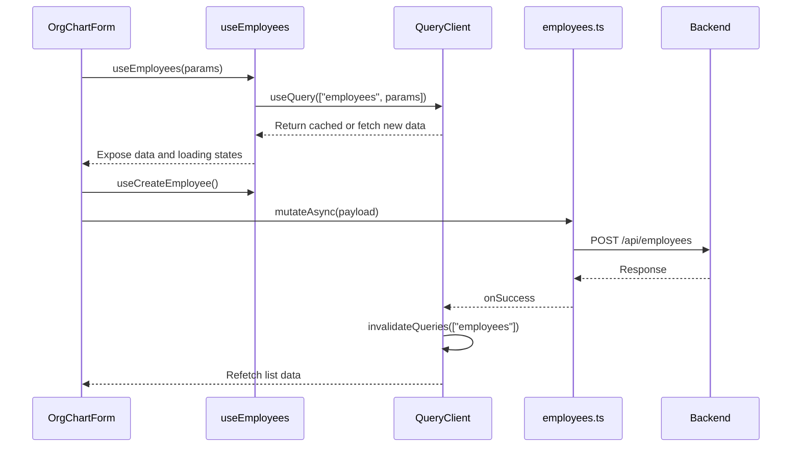

# Employee Management

<cite>
**Referenced Files in This Document**  
- [org-chart-form.tsx](file://src/components/org-chart/org-chart-form.tsx)
- [use-employees.ts](file://src/hooks/queries/use-employees.ts)
- [employees.ts](file://src/services/employees.ts)
</cite>

## Table of Contents
1. [Introduction](#introduction)
2. [Form Implementation](#form-implementation)
3. [Data Fetching and State Management](#data-fetching-and-state-management)
4. [Form Submission and Mutation Flow](#form-submission-and-mutation-flow)
5. [Error Handling and User Feedback](#error-handling-and-user-feedback)
6. [Employee Relationships and Validation](#employee-relationships-and-validation)
7. [Conclusion](#conclusion)

## Introduction
The Org Chart module enables comprehensive employee management through dynamic routing and form-based interactions. This document details the implementation of viewing, creating, and editing employee records using a unified form component. It covers the integration of React Query hooks for data synchronization, Zod-based validation (inferred from schema usage), and react-hook-form for state management. The system ensures real-time consistency across views by leveraging caching and invalidation strategies.

## Form Implementation

The `OrgChartForm` component serves as a unified interface for both creating and editing employee records. It accepts `initialValues` to pre-populate fields during edit mode and uses a boolean `isEdit` flag to determine behavior. The form supports dynamic field handling including text inputs, rich text editing for education details, file uploads for profile pictures, and selectable tags for branch departments.

Key features include:
- Unified create/edit logic via conditional mutation calls
- Dynamic file upload handling with preview and removal support
- Rich text input for educational qualifications
- Single-select department assignment via `SelectableTags`



**Diagram sources**
- [org-chart-form.tsx](file://src/components/org-chart/org-chart-form.tsx#L1-L257)

**Section sources**
- [org-chart-form.tsx](file://src/components/org-chart/org-chart-form.tsx#L1-L257)

## Data Fetching and State Management

Employee data is managed using React Query through the `use-employees` hook. The `useEmployees` and `useEmployee` hooks provide list and detail queries respectively, with a stale time of 60 seconds to balance freshness and performance. Department data is fetched via `useDepartments` to populate the branch department selection.

Form state is managed directly within the component using React hooks:
- `selectedBranchDeptId` tracks selected department
- `educationHtml` stores rich text content
- `selectedFiles` manages uploaded profile images
- `isRemovingPicture` flags image deletion intent

The `useMemo` hook optimizes department item generation by memoizing the transformation of API response into UI-ready options.



**Diagram sources**
- [use-employees.ts](file://src/hooks/queries/use-employees.ts#L1-L89)
- [org-chart-form.tsx](file://src/components/org-chart/org-chart-form.tsx#L1-L257)

**Section sources**
- [use-employees.ts](file://src/hooks/queries/use-employees.ts#L1-L89)

## Form Submission and Mutation Flow

Form submission is handled through React Query mutations. The `handleSubmit` function prevents default form behavior, collects form data, validates required fields (name and department), and constructs a payload for API submission.

Two distinct mutations are used:
- `useCreateEmployee` for new employee creation
- `useUpdateEmployee(id)` for updates, accepting the employee ID

Upon successful mutation, the system:
1. Shows a success toast notification
2. Invalidates relevant queries to trigger refetch
3. Redirects to the main org chart view

Profile picture handling supports three states:
- New upload (file included in payload)
- Removal (null sent when image cleared)
- No change (undefined omitted from payload)

**Section sources**
- [org-chart-form.tsx](file://src/components/org-chart/org-chart-form.tsx#L1-L257)
- [use-employees.ts](file://src/hooks/queries/use-employees.ts#L29-L50)

## Error Handling and User Feedback

The system implements robust error handling during form submission. API-level errors are parsed from the response data, with field-specific messages displayed as individual toast notifications. Generic errors fall back to a default message.

Client-side validation enforces:
- Required full name
- Required branch/department selection

The error parsing logic iterates through response keys and values, supporting both string messages and array-of-strings formats commonly returned by REST APIs.

```mermaid
flowchart TD
A[Submit Form] --> B[Validate Fields]
B --> C{Valid?}
C --> |No| D[Show Required Field Error]
C --> |Yes| E[Call API]
E --> F{Success?}
F --> |Yes| G[Show Success Toast<br/>Redirect]
F --> |No| H[Parse Error Response]
H --> I{Has Field Errors?}
I --> |Yes| J[Display Each Error<br/>via toast.error()]
I --> |No| K[Show Generic Error]
J --> L[Stay on Form]
K --> L
D --> L
```

**Diagram sources**
- [org-chart-form.tsx](file://src/components/org-chart/org-chart-form.tsx#L1-L257)

**Section sources**
- [org-chart-form.tsx](file://src/components/org-chart/org-chart-form.tsx#L1-L257)

## Employee Relationships and Validation

While direct manager-subordinate relationships are not currently implemented in the form schema, the system provides the foundation for such features. The `branch_department_id` field establishes organizational hierarchy through departmental assignment.

To prevent circular references in future implementations:
- Manager selection should exclude the current employee
- Backend validation should detect cycles in reporting chains
- Frontend could implement real-time validation during selection

The current implementation focuses on departmental hierarchy rather than individual reporting lines, but the data model supports expansion to include direct manager relationships.

**Section sources**
- [org-chart-form.tsx](file://src/components/org-chart/org-chart-form.tsx#L1-L257)
- [employees.ts](file://src/services/employees.ts)

## Conclusion

The employee management system in the Org Chart module delivers a cohesive experience for creating and editing employee records. By leveraging React Query for data synchronization and a unified form component for both create and edit operations, the implementation ensures consistency and maintainability. The integration of file uploads, rich text editing, and dynamic select fields provides a comprehensive data entry interface. With proper validation and error handling, the system maintains data integrity while offering clear user feedback. Future enhancements could expand on relationship management to fully realize the organizational hierarchy visualization.