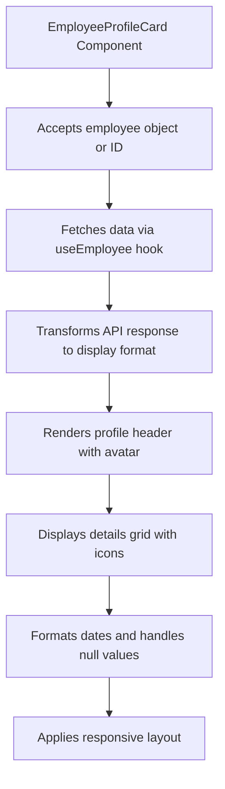
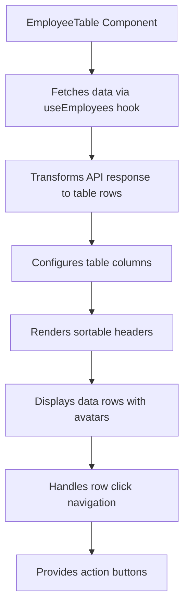
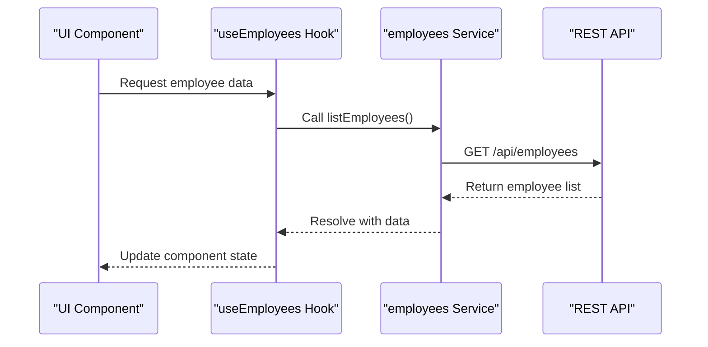
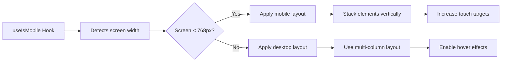
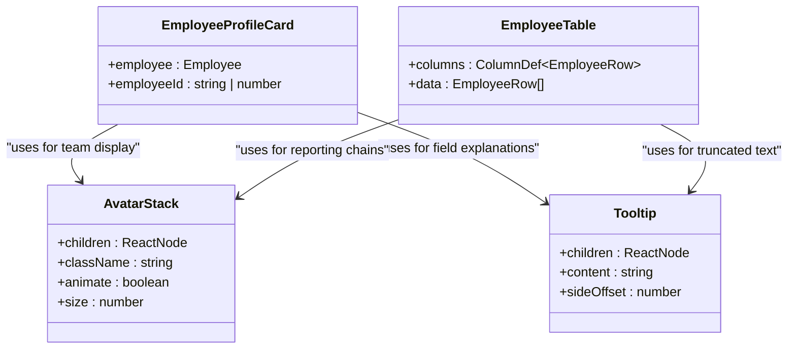

# Org Chart Visualization

<cite>
**Referenced Files in This Document**   
- [employee-profile-card.tsx](file://src/components/org-chart/employee-profile-card.tsx)
- [employee-table.tsx](file://src/components/org-chart/employee-table.tsx)
- [use-employees.ts](file://src/hooks/queries/use-employees.ts)
- [employees.ts](file://src/services/employees.ts)
- [avatar-stack.tsx](file://src/components/ui/avatar-stack.tsx)
- [tooltip.tsx](file://src/components/ui/tooltip.tsx)
- [use-mobile.ts](file://src/hooks/use-mobile.ts)
- [page.tsx](file://src/app/(admin)/dashboard/org-chart/page.tsx)
</cite>

## Table of Contents
1. [Introduction](#introduction)
2. [Core Components Overview](#core-components-overview)
3. [Employee Profile Card Implementation](#employee-profile-card-implementation)
4. [Employee Table View](#employee-table-view)
5. [Data Fetching and State Management](#data-fetching-and-state-management)
6. [Responsive Design Strategy](#responsive-design-strategy)
7. [UI Components Integration](#ui-components-integration)
8. [Performance Considerations](#performance-considerations)
9. [Customization and Styling](#customization-and-styling)

## Introduction
The Org Chart feature provides a comprehensive visualization of organizational hierarchy through interactive employee profile cards and a structured tabular view. This system enables administrators to navigate reporting structures, access detailed employee information, and manage workforce data efficiently. The implementation combines recursive component patterns, responsive layouts, and performance-optimized data rendering to deliver a seamless user experience across devices.

## Core Components Overview
The org chart functionality is built around two primary visualization components: the employee profile card for detailed individual views and the employee table for structured data presentation. These components work in tandem to provide multiple perspectives on the organizational structure, with shared data fetching logic and consistent styling through Tailwind CSS.

**Section sources**
- [employee-profile-card.tsx](file://src/components/org-chart/employee-profile-card.tsx#L1-L177)
- [employee-table.tsx](file://src/components/org-chart/employee-table.tsx#L1-L199)

## Employee Profile Card Implementation
The `EmployeeProfileCard` component renders detailed employee information in a visually rich card format. It accepts either a complete employee object or an employee ID, fetching data as needed through the `useEmployee` hook. The component displays profile images with fallback initials, status badges, and a comprehensive details grid with icon indicators for various attributes such as contact information, department, and reporting structure.

Data transformation occurs within the component to reconcile API response formats with the expected display structure, including date formatting and nested field extraction. The card layout adapts to different screen sizes, with responsive flexbox arrangements that optimize information density.

**Diagram sources**
- [employee-profile-card.tsx](file://src/components/org-chart/employee-profile-card.tsx#L1-L177)

**Section sources**
- [employee-profile-card.tsx](file://src/components/org-chart/employee-profile-card.tsx#L1-L177)

## Employee Table View
The `EmployeeTable` component provides a structured alternative to the hierarchical org chart, presenting employee data in a sortable, paginated table format. Built on React Table, it displays key information including employee names, locations, departments, roles, and reporting relationships. Each row is interactive, navigating to the employee's detailed profile when clicked.

The table includes filtering and sorting capabilities, with visual indicators for pinned rows. Action buttons allow for employee deletion with confirmation, while avatar components display reporting managers. The implementation uses `useMemo` for data transformation and `useEffect` for sorting logic, ensuring optimal re-renders.

**Diagram sources**
- [employee-table.tsx](file://src/components/org-chart/employee-table.tsx#L1-L199)

**Section sources**
- [employee-table.tsx](file://src/components/org-chart/employee-table.tsx#L1-L199)

## Data Fetching and State Management
The org chart components leverage React Query for efficient data fetching and caching. The `useEmployees` hook retrieves the complete employee list for the table view, while `useEmployee` fetches individual employee details for profile cards. Both hooks implement stale time caching (60 seconds) to balance data freshness with performance.

Data from the API is transformed to match component requirements, extracting nested fields from the `branch_department` structure and normalizing date formats. Error states and loading conditions are handled gracefully, with appropriate fallback UI elements.

**Diagram sources**
- [use-employees.ts](file://src/hooks/queries/use-employees.ts#L12-L27)
- [employees.ts](file://src/services/employees.ts#L29-L39)

**Section sources**
- [use-employees.ts](file://src/hooks/queries/use-employees.ts#L12-L88)
- [employees.ts](file://src/services/employees.ts#L1-L134)

## Responsive Design Strategy
The org chart interface adapts to different screen sizes using a mobile-first approach. The `useIsMobile` hook detects viewport width, enabling conditional rendering and layout adjustments. On smaller screens, the interface prioritizes vertical stacking and touch-friendly elements, while desktop views utilize multi-column layouts and enhanced hover interactions.

The profile card component adjusts its internal layout between mobile and desktop modes, reorganizing the profile header and details grid to optimize space usage. The table component maintains readability across devices through responsive column sizing and horizontal scrolling when necessary.

**Diagram sources**
- [use-mobile.ts](file://src/hooks/use-mobile.ts#L4-L18)

**Section sources**
- [use-mobile.ts](file://src/hooks/use-mobile.ts#L4-L18)
- [employee-profile-card.tsx](file://src/components/org-chart/employee-profile-card.tsx#L1-L177)

## UI Components Integration
The org chart leverages several reusable UI components to enhance the user experience. The `AvatarStack` component could be used to visualize team compositions or reporting groups, displaying multiple avatars with overlapping positioning. The `Tooltip` component provides contextual information on hover, particularly useful for truncated text or icon explanations.

These components follow a consistent design system with configurable props for size, animation, and styling. They integrate seamlessly with the org chart's Tailwind CSS styling, maintaining visual harmony across the application.

**Diagram sources**
- [avatar-stack.tsx](file://src/components/ui/avatar-stack.tsx#L10-L50)
- [tooltip.tsx](file://src/components/ui/tooltip.tsx#L20-L28)

**Section sources**
- [avatar-stack.tsx](file://src/components/ui/avatar-stack.tsx#L1-L51)
- [tooltip.tsx](file://src/components/ui/tooltip.tsx#L1-L61)

## Performance Considerations
The org chart implementation addresses performance challenges associated with rendering large organizational hierarchies. Data fetching is optimized through React Query's caching mechanism, reducing redundant API calls. The table component uses `useMemo` to memoize transformed data, preventing unnecessary reprocessing during re-renders.

While the current implementation does not include virtualization for extremely large datasets, the architecture supports future enhancements such as windowing or pagination. The use of efficient data transformation patterns and selective re-renders through React's reconciliation process ensures smooth performance for typical organizational sizes.

**Section sources**
- [employee-table.tsx](file://src/components/org-chart/employee-table.tsx#L1-L199)
- [use-employees.ts](file://src/hooks/queries/use-employees.ts#L12-L88)

## Customization and Styling
The org chart components are styled using Tailwind CSS, enabling extensive customization through utility classes. The `EmployeeProfileCard` and `EmployeeTable` components expose their styling through className props, allowing integration with different design systems.

Key visual elements such as badges, avatars, and cards follow a consistent color scheme that can be modified by updating Tailwind's theme configuration. Icon styling is handled through CSS masks, allowing color changes without requiring multiple icon assets. Component props control layout behavior, animation states, and content visibility, providing flexibility for different use cases.

**Section sources**
- [employee-profile-card.tsx](file://src/components/org-chart/employee-profile-card.tsx#L1-L177)
- [employee-table.tsx](file://src/components/org-chart/employee-table.tsx#L1-L199)
- [page.tsx](file://src/app/(admin)/dashboard/org-chart/page.tsx#L9-L33)