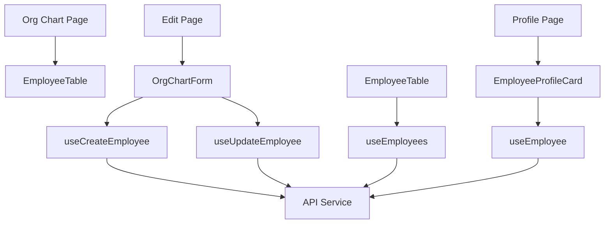
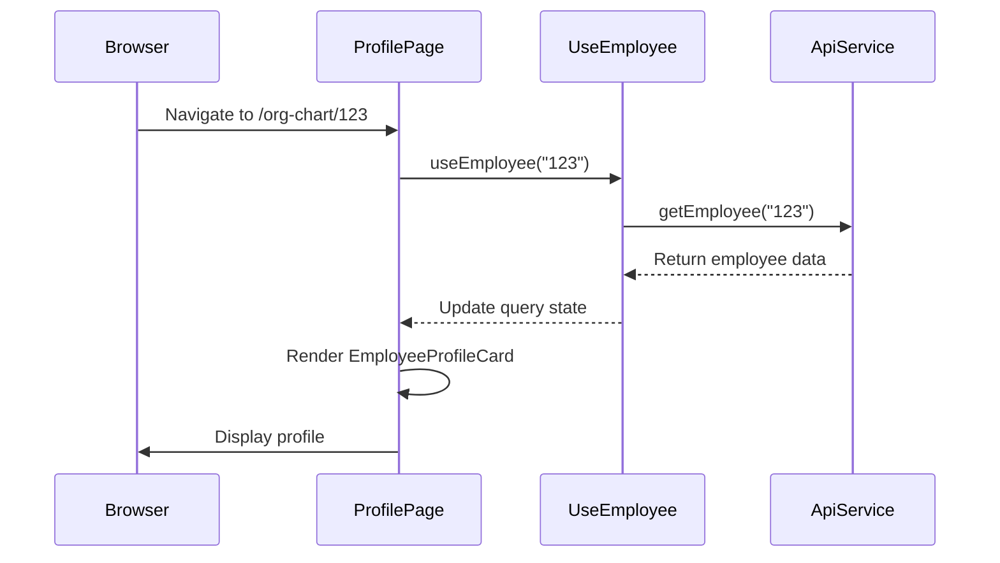
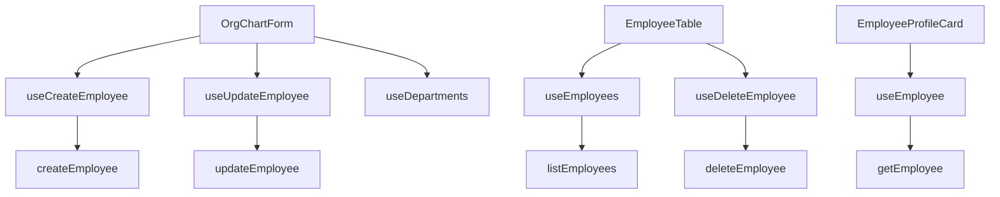

# Org Chart

<cite>
**Referenced Files in This Document**   
- [page.tsx](file://src/app/(admin)/dashboard/org-chart/page.tsx)
- [page.tsx](file://src/app/(admin)/dashboard/org-chart/[id]/page.tsx)
- [edit/page.tsx](file://src/app/(admin)/dashboard/org-chart/[id]/edit/page.tsx)
- [new/page.tsx](file://src/app/(admin)/dashboard/org-chart/new/page.tsx)
- [org-chart-form.tsx](file://src/components/org-chart/org-chart-form.tsx)
- [employee-profile-card.tsx](file://src/components/org-chart/employee-profile-card.tsx)
- [employee-table.tsx](file://src/components/org-chart/employee-table.tsx)
- [use-employees.ts](file://src/hooks/queries/use-employees.ts)
</cite>

## Table of Contents
1. [Introduction](#introduction)
2. [Project Structure](#project-structure)
3. [Core Components](#core-components)
4. [Architecture Overview](#architecture-overview)
5. [Detailed Component Analysis](#detailed-component-analysis)
6. [Dependency Analysis](#dependency-analysis)
7. [Performance Considerations](#performance-considerations)
8. [Troubleshooting Guide](#troubleshooting-guide)
9. [Conclusion](#conclusion)

## Introduction
The Org Chart module is a central component of the CartwrightKing Admin ERP system, designed to visualize organizational hierarchy and manage employee reporting structures. It provides both interactive and tabular views of employee data, enabling administrators to efficiently navigate, create, edit, and delete employee records. The module integrates with backend services through React Query hooks and supports dynamic routing for individual employee profiles and editing flows. This document details the implementation of key features including the interactive chart view, employee profile cards, table-based data display, form handling, and real-time data synchronization.

## Project Structure
The Org Chart module is organized under the `src/app/(admin)/dashboard/org-chart` directory with a clear routing structure that supports listing, viewing, creating, and editing employee records. The component logic is separated into reusable UI components under `src/components/org-chart`, while data fetching and mutation logic is abstracted into custom hooks.

```mermaid
graph TD
A[Org Chart Module] --> B[/org-chart/page.tsx]
A --> C[/org-chart/[id]/page.tsx]
A --> D[/org-chart/[id]/edit/page.tsx]
A --> E[/org-chart/new/page.tsx]
A --> F[Components]
F --> G[org-chart-form.tsx]
F --> H[employee-profile-card.tsx]
F --> I[employee-table.tsx]
A --> J[Hooks]
J --> K[use-employees.ts]
```

**Diagram sources**
- [page.tsx](file://src/app/(admin)/dashboard/org-chart/page.tsx)
- [org-chart-form.tsx](file://src/components/org-chart/org-chart-form.tsx)
- [use-employees.ts](file://src/hooks/queries/use-employees.ts)

**Section sources**
- [page.tsx](file://src/app/(admin)/dashboard/org-chart/page.tsx)
- [org-chart-form.tsx](file://src/components/org-chart/org-chart-form.tsx)

## Core Components
The Org Chart module consists of several core components that work together to provide a comprehensive employee management interface. These include the main listing page, individual profile view, editing interface, creation form, and reusable UI components for displaying employee data in both card and table formats. The implementation leverages Next.js App Router for server-side rendering and client-side interactivity, with dynamic routes for individual employee records.

**Section sources**
- [page.tsx](file://src/app/(admin)/dashboard/org-chart/page.tsx)
- [employee-table.tsx](file://src/components/org-chart/employee-table.tsx)
- [employee-profile-card.tsx](file://src/components/org-chart/employee-profile-card.tsx)

## Architecture Overview
The Org Chart module follows a component-based architecture with clear separation of concerns between presentation, data fetching, and business logic. The module uses React Server Components for initial rendering and client components for interactive features. Data is managed through React Query, providing caching, background updates, and automatic refetching on mutations.



**Diagram sources**
- [page.tsx](file://src/app/(admin)/dashboard/org-chart/page.tsx)
- [employee-table.tsx](file://src/components/org-chart/employee-table.tsx)
- [employee-profile-card.tsx](file://src/components/org-chart/employee-profile-card.tsx)
- [org-chart-form.tsx](file://src/components/org-chart/org-chart-form.tsx)
- [use-employees.ts](file://src/hooks/queries/use-employees.ts)

## Detailed Component Analysis

### Org Chart Listing Page
The main Org Chart page serves as the entry point for the module, displaying a table of all employees with sorting, filtering, and navigation capabilities. It includes a header with breadcrumb navigation and an action button to create new employees.

```mermaid
flowchart TD
Start([Page Load]) --> Header[Render PageHeader]
Header --> Table[Render EmployeeTable]
Table --> Fetch[useEmployees Hook]
Fetch --> API[Call listEmployees()]
API --> Cache[Store in React Query Cache]
Cache --> Display[Render Table Rows]
Display --> Click[Row Click Event]
Click --> Navigate[Go to Profile Page]
```

**Diagram sources**
- [page.tsx](file://src/app/(admin)/dashboard/org-chart/page.tsx)
- [employee-table.tsx](file://src/components/org-chart/employee-table.tsx)
- [use-employees.ts](file://src/hooks/queries/use-employees.ts)

**Section sources**
- [page.tsx](file://src/app/(admin)/dashboard/org-chart/page.tsx)

### Employee Profile View
The employee profile page displays detailed information about a specific employee using a card-based layout. It supports dynamic routing with the `[id]` parameter and fetches employee data using the `useEmployee` hook.

#### For API/Service Components:


**Diagram sources**
- [page.tsx](file://src/app/(admin)/dashboard/org-chart/[id]/page.tsx)
- [employee-profile-card.tsx](file://src/components/org-chart/employee-profile-card.tsx)
- [use-employees.ts](file://src/hooks/queries/use-employees.ts#L20-L27)

**Section sources**
- [page.tsx](file://src/app/(admin)/dashboard/org-chart/[id]/page.tsx)
- [employee-profile-card.tsx](file://src/components/org-chart/employee-profile-card.tsx)

### Form Creation and Editing Flows
The Org Chart module provides unified form handling for both creating and editing employee records through the `org-chart-form.tsx` component. The form supports conditional rendering based on the `isEdit` prop and uses dynamic routing with `[id]` parameters for editing existing records.

#### For Complex Logic Components:
```mermaid
flowchart TD
Start([Form Initialization]) --> Check[isEdit ?]
Check --> |Yes| FetchData[useEmployee(id)]
Check --> |No| UseInitial[Use empty initialValues]
FetchData --> Populate[Populate form fields]
UseInitial --> Populate
Populate --> User[User edits fields]
User --> Submit[Submit form]
Submit --> Validate[Validate required fields]
Validate --> |Invalid| ShowError[Show toast error]
Validate --> |Valid| Prepare[Prepare payload]
Prepare --> Mutation[useCreateEmployee or useUpdateEmployee]
Mutation --> API[Call createEmployee or updateEmployee]
API --> |Success| Invalidate[Invalidate queries]
API --> |Success| Redirect[Redirect to org chart]
API --> |Error| HandleError[Parse and display errors]
```

**Diagram sources**
- [org-chart-form.tsx](file://src/components/org-chart/org-chart-form.tsx)
- [edit/page.tsx](file://src/app/(admin)/dashboard/org-chart/[id]/edit/page.tsx)
- [new/page.tsx](file://src/app/(admin)/dashboard/org-chart/new/page.tsx)
- [use-employees.ts](file://src/hooks/queries/use-employees.ts)

**Section sources**
- [org-chart-form.tsx](file://src/components/org-chart/org-chart-form.tsx)
- [edit/page.tsx](file://src/app/(admin)/dashboard/org-chart/[id]/edit/page.tsx)
- [new/page.tsx](file://src/app/(admin)/dashboard/org-chart/new/page.tsx)

## Dependency Analysis
The Org Chart module has well-defined dependencies between components, hooks, and services. The dependency graph shows how UI components rely on data-fetching hooks, which in turn depend on API service functions.



**Diagram sources**
- [org-chart-form.tsx](file://src/components/org-chart/org-chart-form.tsx)
- [employee-table.tsx](file://src/components/org-chart/employee-table.tsx)
- [employee-profile-card.tsx](file://src/components/org-chart/employee-profile-card.tsx)
- [use-employees.ts](file://src/hooks/queries/use-employees.ts)

**Section sources**
- [use-employees.ts](file://src/hooks/queries/use-employees.ts)

## Performance Considerations
The Org Chart module implements several performance optimizations to ensure smooth operation even with large datasets. React Query's caching mechanism with a 60-second stale time reduces unnecessary network requests. The `useMemo` hook is used in `org-chart-form.tsx` to optimize department data processing, and `React.useCallback` patterns prevent unnecessary re-renders. Data transformation is performed efficiently in the `useMemo` callback within `employee-table.tsx`, ensuring that large employee lists are processed only when necessary.

## Troubleshooting Guide
Common issues in the Org Chart module typically relate to data fetching, form validation, and state synchronization. The module includes built-in error handling with toast notifications for form submission failures. When employees fail to load, the `useEmployee` and `useEmployees` hooks provide error states that are displayed to users. For form validation, required fields (name and branch department) are checked before submission, with appropriate error messages displayed via the toast system. The React Query invalidation pattern ensures that after any mutation (create, update, delete), the employee list is automatically refreshed, preventing stale data issues.

**Section sources**
- [org-chart-form.tsx](file://src/components/org-chart/org-chart-form.tsx)
- [use-employees.ts](file://src/hooks/queries/use-employees.ts)
- [employee-table.tsx](file://src/components/org-chart/employee-table.tsx)

## Conclusion
The Org Chart module provides a comprehensive solution for managing organizational hierarchy within the CartwrightKing Admin ERP system. Through its well-structured component architecture, effective use of React Query for data management, and thoughtful implementation of creation and editing flows, the module delivers a robust and user-friendly experience. The separation of concerns between presentation components and data logic makes the codebase maintainable and extensible. Future enhancements could include drag-and-drop reorganization capabilities and circular reference detection for reporting structures, building upon the solid foundation already in place.