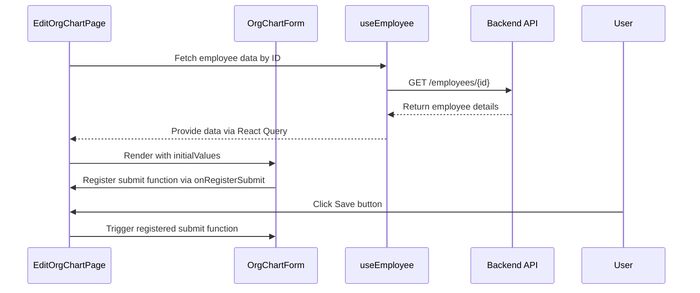
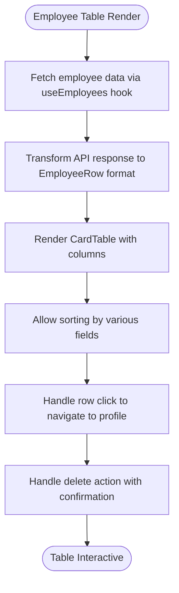
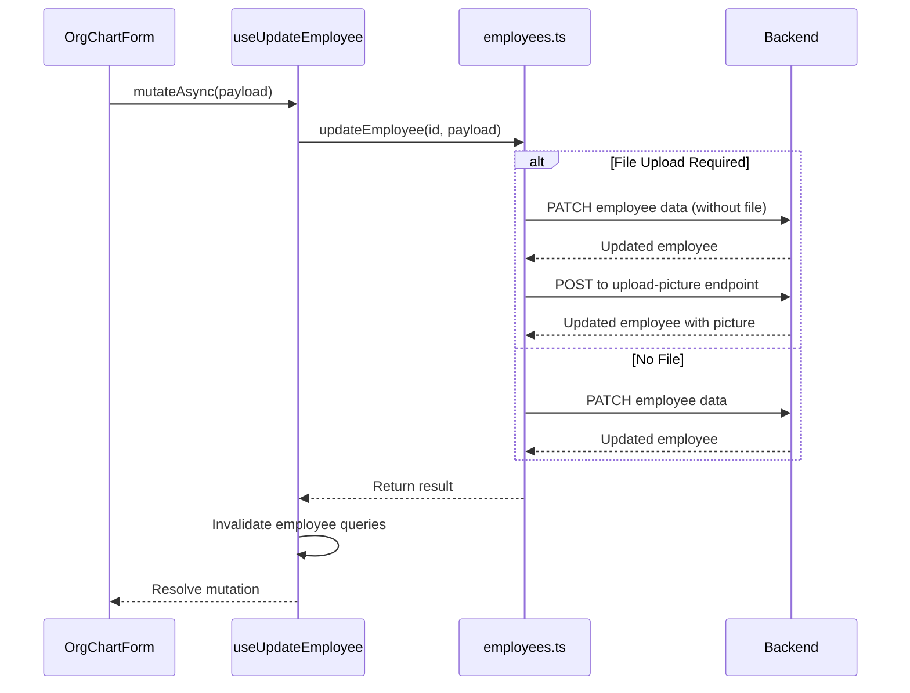
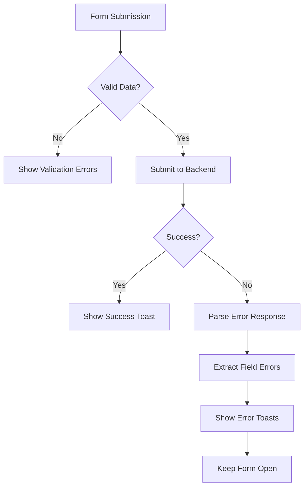
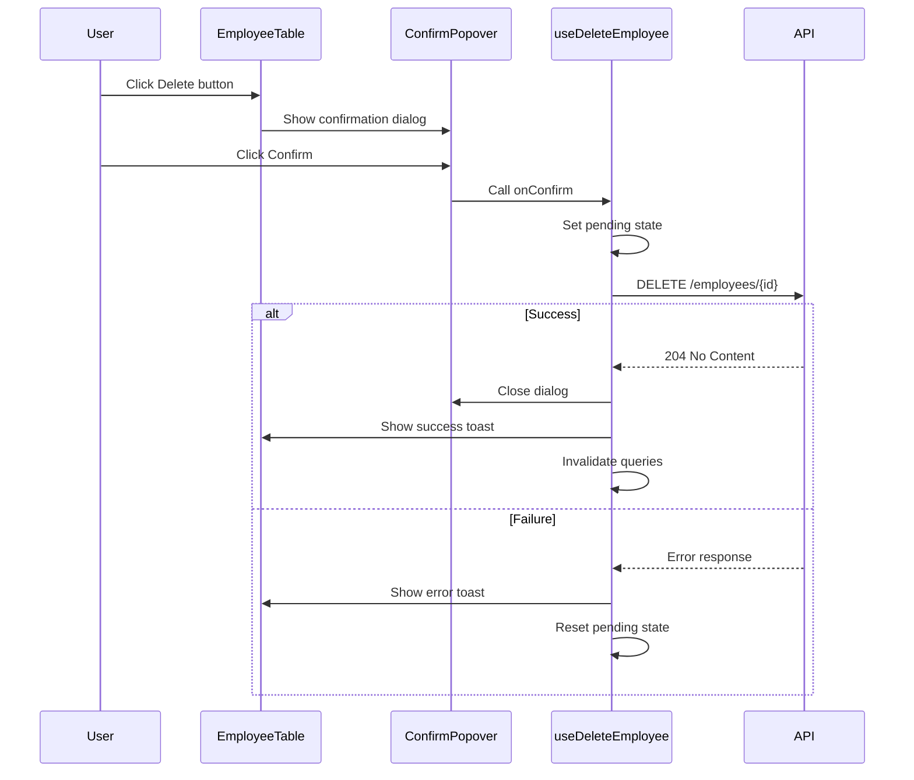

# Structural Editing

<cite>
**Referenced Files in This Document**   
- [edit/page.tsx](file://src/app/(admin)/dashboard/org-chart/[id]/edit/page.tsx)
- [employee-table.tsx](file://src/components/org-chart/employee-table.tsx)
- [employees.ts](file://src/services/employees.ts)
- [confirm-popover.tsx](file://src/components/common/confirm-popover.tsx)
- [org-chart-form.tsx](file://src/components/org-chart/org-chart-form.tsx)
</cite>

## Table of Contents
1. [Introduction](#introduction)
2. [Edit Interface and Form Workflow](#edit-interface-and-form-workflow)
3. [Table-Based Reorganization and UI Feedback](#table-based-reorganization-and-ui-feedback)
4. [Backend Integration and Transaction Safety](#backend-integration-and-transaction-safety)
5. [Validation and Error Handling](#validation-and-error-handling)
6. [Destructive Action Confirmation](#destructive-action-confirmation)
7. [Scalability and Batch Update Patterns](#scalability-and-batch-update-patterns)

## Introduction
The Org Chart module in the CartwrightKing Admin ERP system provides robust structural editing capabilities that allow administrators to modify reporting lines, reassign teams, and adjust hierarchical positions. These operations are supported through dedicated interfaces that ensure data integrity, provide real-time feedback, and prevent invalid organizational states. This document details the implementation of these features, focusing on the form-based editing workflow, table-driven reorganization, backend service integration, and user experience considerations for structural changes.

## Edit Interface and Form Workflow

The structural editing process begins with the dedicated edit interface located at `src/app/(admin)/dashboard/org-chart/[id]/edit/page.tsx`. This page renders a form pre-populated with employee data fetched via the `useEmployee` hook, which queries the backend using the employee ID from the URL parameters.

The form is implemented in `org-chart-form.tsx` and supports both creation and editing modes. When editing an existing employee, initial values are mapped from the API response to the form fields, including personal details, role, department assignment, and profile picture. The form uses controlled components and React state to manage inputs, rich text content (for education), and file uploads.

A key architectural pattern is the decoupling of the Save action from the form submission. The `onRegisterSubmit` callback allows the parent `EditOrgChartPage` to register the form's submit function, enabling the Save button in the `PageHeader` to trigger form submission externally. This enhances usability by keeping the primary action visible even when scrolling through long forms.

**Diagram sources**
- [edit/page.tsx](file://src/app/(admin)/dashboard/org-chart/[id]/edit/page.tsx#L1-L68)
- [org-chart-form.tsx](file://src/components/org-chart/org-chart-form.tsx#L26-L253)

**Section sources**
- [edit/page.tsx](file://src/app/(admin)/dashboard/org-chart/[id]/edit/page.tsx#L1-L68)
- [org-chart-form.tsx](file://src/components/org-chart/org-chart-form.tsx#L26-L253)

## Table-Based Reorganization and UI Feedback

The `EmployeeTable` component provides a table-based interface for viewing and managing organizational structure. Located in `employee-table.tsx`, it displays employees with key information including reporting relationships, department assignments, and contact details.

While the current implementation does not include drag-and-drop functionality for reordering, it supports sorting through the `sortedBy` state variable, which controls the display order of employee records. The table columns include "Reporting to" which visually represents the hierarchical structure by showing the manager's name and avatar alongside each employee.

UI feedback is implemented through several mechanisms:
- Hover states on table rows (cursor changes to pointer)
- Loading indicators during data fetch operations
- Disabled states on action buttons during pending operations
- Visual feedback during delete operations with loading states

The table also integrates with the `usePinnedRows` hook to allow users to pin important employee records for quick access, enhancing usability when working with large organizational charts.

**Diagram sources**
- [employee-table.tsx](file://src/components/org-chart/employee-table.tsx#L0-L199)

**Section sources**
- [employee-table.tsx](file://src/components/org-chart/employee-table.tsx#L0-L199)

## Backend Integration and Transaction Safety

Structural changes are persisted through the `employees.ts` service located in `src/services/employees.ts`. This service provides a comprehensive API for employee management operations, including creation, retrieval, updating, and deletion.

The service implements transaction safety through several mechanisms:

1. **Atomic Operations**: Each update operation is atomic, ensuring that partial updates cannot leave the system in an inconsistent state.

2. **File Handling Strategy**: The service distinguishes between file and non-file operations. When updating an employee with a profile picture, it first updates the employee record via JSON PATCH, then uploads the picture through a dedicated endpoint. This two-step process ensures data consistency even if the file upload fails.

3. **Profile Picture Management**: Specialized endpoints handle profile picture uploads and deletions separately from employee data updates, allowing for proper media handling without affecting core employee information.

4. **Query Client Invalidation**: The React Query hooks (`useCreateEmployee`, `useUpdateEmployee`, `useDeleteEmployee`) automatically invalidate relevant queries upon successful mutation, ensuring the UI reflects the latest state from the server.

**Diagram sources**
- [employees.ts](file://src/services/employees.ts#L0-L134)
- [org-chart-form.tsx](file://src/components/org-chart/org-chart-form.tsx#L26-L253)

**Section sources**
- [employees.ts](file://src/services/employees.ts#L0-L134)

## Validation and Error Handling

The system implements comprehensive validation at multiple levels to prevent invalid organizational states:

**Client-Side Validation**:
- Required field validation (name and branch department)
- Email format validation
- Form state management to track changes and prevent accidental data loss

**Server-Side Validation**:
- The backend enforces referential integrity for department assignments
- Unique constraints on email addresses
- Business rule validation for reporting relationships

Error handling is implemented through a structured approach:
- API errors are parsed and displayed as toast notifications
- Field-specific validation errors are extracted from the response and shown to users
- Network errors and server failures trigger appropriate error messages
- The form remains in place after failed submissions, allowing users to correct errors

The error handling workflow in `OrgChartForm` captures API response errors and converts them into user-friendly toast messages, ensuring that users understand what went wrong and how to fix it.

**Section sources**
- [org-chart-form.tsx](file://src/components/org-chart/org-chart-form.tsx#L26-L253)

## Destructive Action Confirmation

Destructive actions, such as employee deletion, are protected by confirmation dialogs implemented through the `ConfirmPopover` component. This reusable component provides a consistent user experience for confirming potentially dangerous operations.

Key features of the confirmation system:
- Clear title and description explaining the action
- Destructive styling for the confirm button
- Disabled states during pending operations
- Loading indicators during asynchronous operations
- Automatic closing after successful confirmation

The implementation in `employee-table.tsx` integrates the confirmation popover with the delete action, ensuring that users cannot accidentally delete employee records. The popover prevents the action when the delete operation is already pending, avoiding duplicate requests.

**Diagram sources**
- [confirm-popover.tsx](file://src/components/common/confirm-popover.tsx#L0-L62)
- [employee-table.tsx](file://src/components/org-chart/employee-table.tsx#L30-L199)

**Section sources**
- [confirm-popover.tsx](file://src/components/common/confirm-popover.tsx#L0-L62)
- [employee-table.tsx](file://src/components/org-chart/employee-table.tsx#L30-L199)

## Scalability and Batch Update Patterns

While the current implementation focuses on individual employee operations, the architecture supports potential scalability improvements and batch update patterns:

**Current Limitations**:
- No drag-and-drop reorganization for bulk structural changes
- No explicit support for batch updates of multiple employees
- Table sorting but no drag-based reordering

**Potential Scalability Enhancements**:
1. **Batch Update Endpoint**: The backend could implement a bulk update endpoint that accepts multiple employee changes in a single transaction, reducing network overhead.

2. **Drag-and-Drop Reordering**: The table could be enhanced with drag-and-drop functionality to allow visual reorganization of reporting lines, with changes batched and sent to the server.

3. **Optimistic Updates**: For better perceived performance, the UI could implement optimistic updates, immediately reflecting changes in the interface while the backend operation completes.

4. **Change Queuing**: For large organizations, changes could be queued and processed asynchronously, with status tracking for long-running operations.

5. **Hierarchical Validation**: Before applying structural changes, the system could validate the entire organizational hierarchy to prevent circular reporting relationships or other invalid states.

The service layer in `employees.ts` is well-structured to support these future enhancements, with clear separation between data access, mutation logic, and error handling.

**Section sources**
- [employees.ts](file://src/services/employees.ts#L0-L134)
- [employee-table.tsx](file://src/components/org-chart/employee-table.tsx#L0-L199)