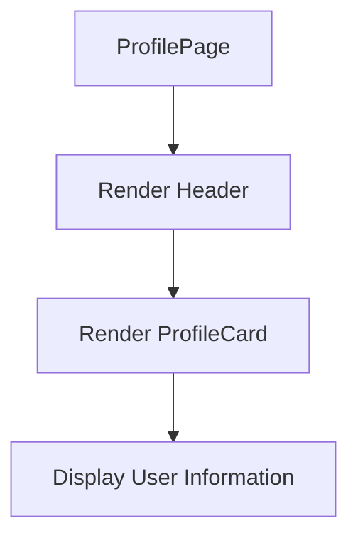
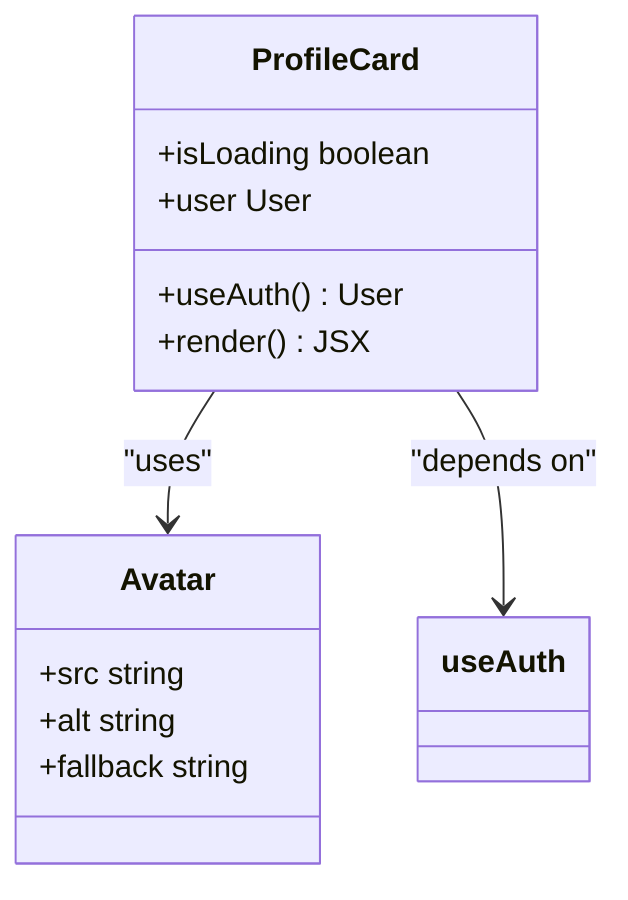
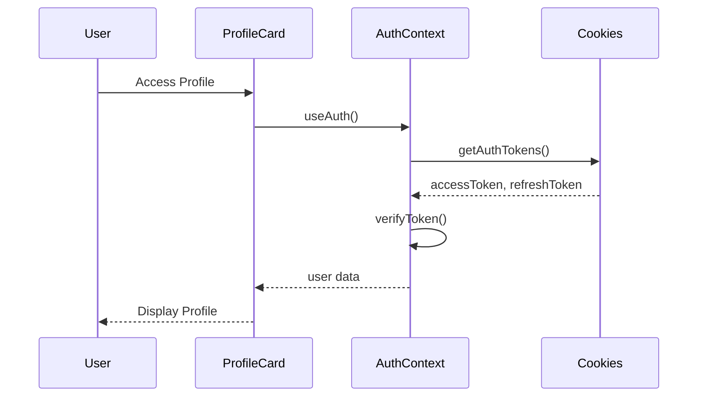
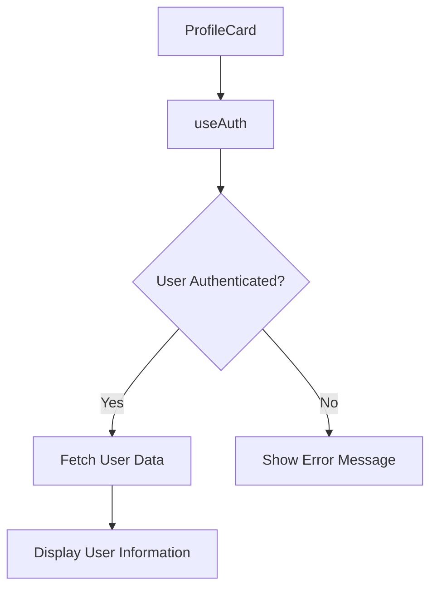
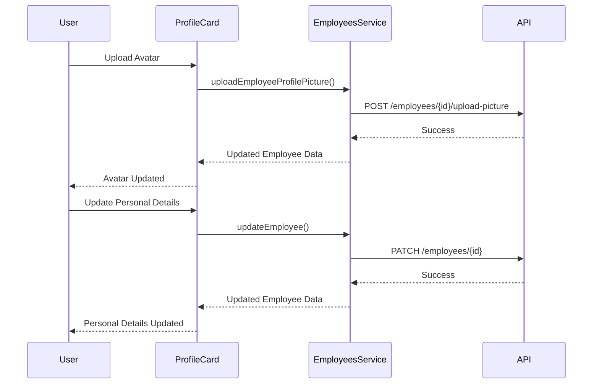
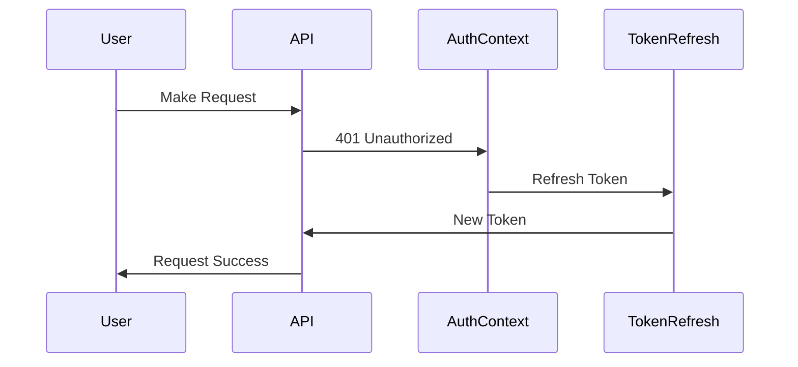
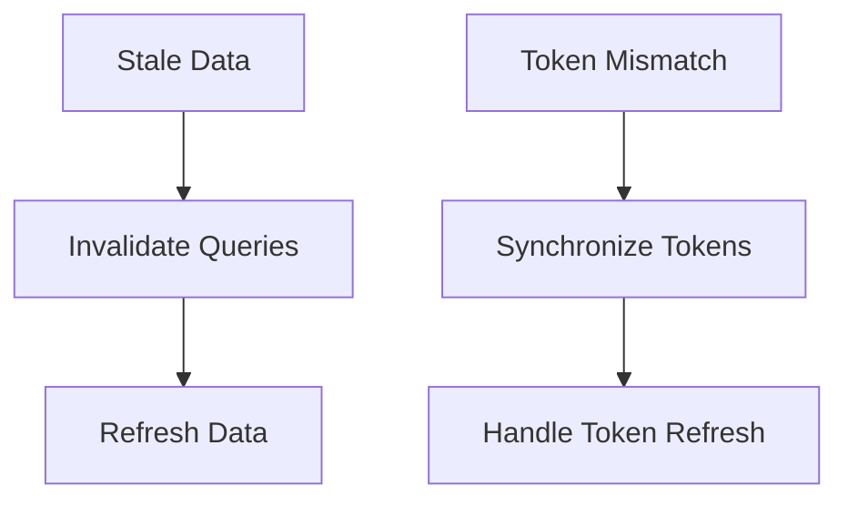

# Profile

<cite>
**Referenced Files in This Document**   
- [profile-card.tsx](file://src/components/profile/profile-card.tsx)
- [page.tsx](file://src/app/(admin)/dashboard/profile/page.tsx)
- [auth-context.tsx](file://src/contexts/auth-context.tsx)
- [employees.ts](file://src/services/employees.ts)
- [use-employees.ts](file://src/hooks/queries/use-employees.ts)
- [api.ts](file://src/lib/api.ts)
- [cookies.ts](file://src/lib/cookies.ts)
</cite>

## Table of Contents
1. [Introduction](#introduction)
2. [Profile Page Implementation](#profile-page-implementation)
3. [Profile Card Component](#profile-card-component)
4. [Authentication Context Integration](#authentication-context-integration)
5. [User Data Retrieval and Display](#user-data-retrieval-and-display)
6. [Avatar Handling and Personal Detail Updates](#avatar-handling-and-personal-detail-updates)
7. [Session Synchronization](#session-synchronization)
8. [Common Issues and Solutions](#common-issues-and-solutions)
9. [Conclusion](#conclusion)

## Introduction
The Profile feature in the ERP system enables users to view and manage their personal information within a secure, authenticated environment. This document details the implementation of the profile functionality, focusing on the profile page, the `ProfileCard` component, and its integration with the authentication context. It explains how user data is retrieved from the employees service and displayed in a read-edit interface, covering avatar handling, personal detail updates, and session synchronization. Common issues such as stale data after updates and authentication token mismatches are addressed with practical solutions based on the actual context and service patterns. The content is designed to be accessible to end-users while providing technical depth on state consistency for developers.

## Profile Page Implementation
The profile page serves as the main interface for users to access their personal information. It is implemented as a server component that renders the `ProfileCard` component within a structured layout. The page includes a header with a title and description, followed by a centered `ProfileCard` that displays the user's avatar, name, and role. The implementation ensures a clean and focused user experience by minimizing distractions and emphasizing the profile information.

**Diagram sources**
- [page.tsx](file://src/app/(admin)/dashboard/profile/page.tsx)

**Section sources**
- [page.tsx](file://src/app/(admin)/dashboard/profile/page.tsx)

## Profile Card Component
The `ProfileCard` component is responsible for displaying the user's profile information in a card format. It uses the `useAuth` hook to retrieve the authenticated user's data from the context. The component handles loading states by displaying skeleton placeholders while the user data is being fetched. If the user data is not available, it shows appropriate error messages. The card includes the user's avatar, name, and role, with the avatar being displayed using the `Avatar` component from the UI library.

**Diagram sources**
- [profile-card.tsx](file://src/components/profile/profile-card.tsx)

**Section sources**
- [profile-card.tsx](file://src/components/profile/profile-card.tsx)

## Authentication Context Integration
The Profile feature integrates with the authentication context to ensure that only authenticated users can access their profile information. The `useAuth` hook is used to retrieve the user's data and authentication status from the context. The context is initialized with the user's tokens stored in cookies, and it listens for storage events to update the user's data when the tokens are refreshed. The authentication context also handles token refresh and logout, ensuring that the user's session remains valid and secure.

**Diagram sources**
- [auth-context.tsx](file://src/contexts/auth-context.tsx)
- [cookies.ts](file://src/lib/cookies.ts)

**Section sources**
- [auth-context.tsx](file://src/contexts/auth-context.tsx)
- [cookies.ts](file://src/lib/cookies.ts)

## User Data Retrieval and Display
User data is retrieved from the employees service using the `useEmployee` hook, which fetches the employee's details by their ID. The data is then displayed in the `ProfileCard` component. The component uses React Query to manage the data fetching and caching, ensuring that the data is up-to-date and minimizing unnecessary network requests. The user's avatar, name, and role are displayed in a clean and organized manner, with the avatar being fetched from the server and displayed using the `Avatar` component.

**Diagram sources**
- [profile-card.tsx](file://src/components/profile/profile-card.tsx)
- [use-employees.ts](file://src/hooks/queries/use-employees.ts)

**Section sources**
- [profile-card.tsx](file://src/components/profile/profile-card.tsx)
- [use-employees.ts](file://src/hooks/queries/use-employees.ts)

## Avatar Handling and Personal Detail Updates
The Profile feature supports avatar handling and personal detail updates. Users can upload a new avatar or remove the existing one. The avatar is uploaded using a dedicated endpoint that handles file uploads separately from the employee data update. This ensures that the avatar is updated correctly and efficiently. Personal details such as name, role, and contact information can be updated through a form that sends a PATCH request to the employees service. The form handles file uploads and data updates in a single request, ensuring that the user's data is consistent and up-to-date.

**Diagram sources**
- [employees.ts](file://src/services/employees.ts)
- [profile-card.tsx](file://src/components/profile/profile-card.tsx)

**Section sources**
- [employees.ts](file://src/services/employees.ts)
- [profile-card.tsx](file://src/components/profile/profile-card.tsx)

## Session Synchronization
Session synchronization is handled through the authentication context and the API client. The authentication context listens for storage events and custom events to update the user's data when the tokens are refreshed or the user logs out. The API client intercepts requests and responses to handle token refresh and error handling. When a request fails due to an expired token, the API client automatically refreshes the token and retries the request. This ensures that the user's session remains valid and that the user does not experience interruptions due to token expiration.

**Diagram sources**
- [api.ts](file://src/lib/api.ts)
- [auth-context.tsx](file://src/contexts/auth-context.tsx)

**Section sources**
- [api.ts](file://src/lib/api.ts)
- [auth-context.tsx](file://src/contexts/auth-context.tsx)

## Common Issues and Solutions
### Stale Data After Updates
Stale data can occur when the user's data is not updated immediately after an update. This is resolved by invalidating the relevant queries in React Query after a successful update. The `useUpdateEmployee` mutation invalidates the employee list and detail queries, ensuring that the data is refreshed and up-to-date.

### Authentication Token Mismatches
Authentication token mismatches can occur when the token in the cookies does not match the token in the API client. This is resolved by synchronizing the tokens through the authentication context and the API client. The context listens for storage events and custom events to update the tokens, and the API client intercepts requests and responses to handle token refresh and error handling.

**Diagram sources**
- [use-employees.ts](file://src/hooks/queries/use-employees.ts)
- [api.ts](file://src/lib/api.ts)

**Section sources**
- [use-employees.ts](file://src/hooks/queries/use-employees.ts)
- [api.ts](file://src/lib/api.ts)

## Conclusion
The Profile feature in the ERP system provides a robust and secure way for users to view and manage their personal information. The implementation of the profile page, the `ProfileCard` component, and the integration with the authentication context ensure a seamless and user-friendly experience. The feature handles avatar uploads and personal detail updates efficiently, and it maintains session synchronization through the authentication context and the API client. Common issues such as stale data and token mismatches are addressed with practical solutions, ensuring that the user's data remains consistent and up-to-date. This documentation provides a comprehensive overview of the Profile feature, making it accessible to end-users while offering technical depth for developers.