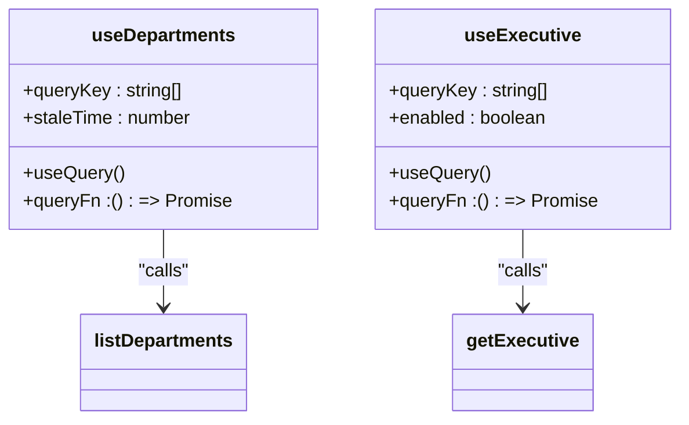
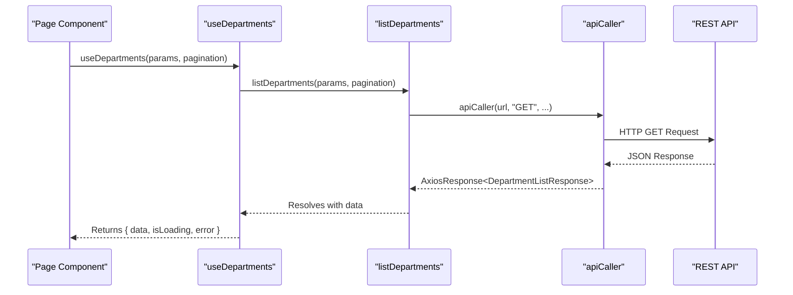
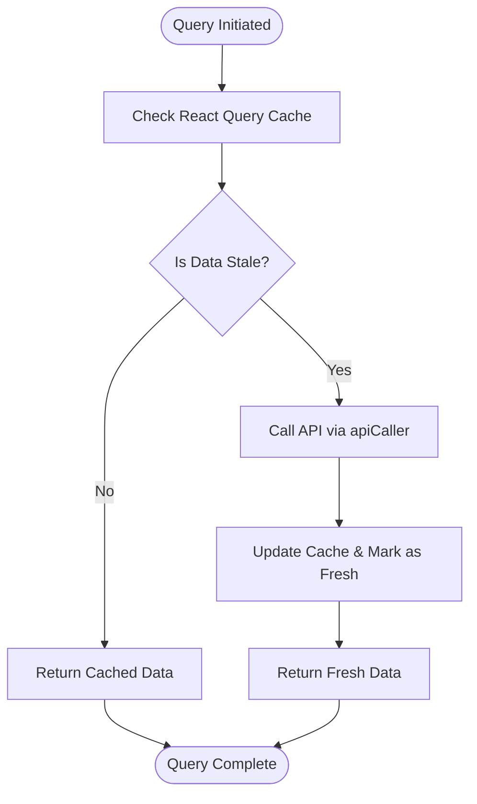
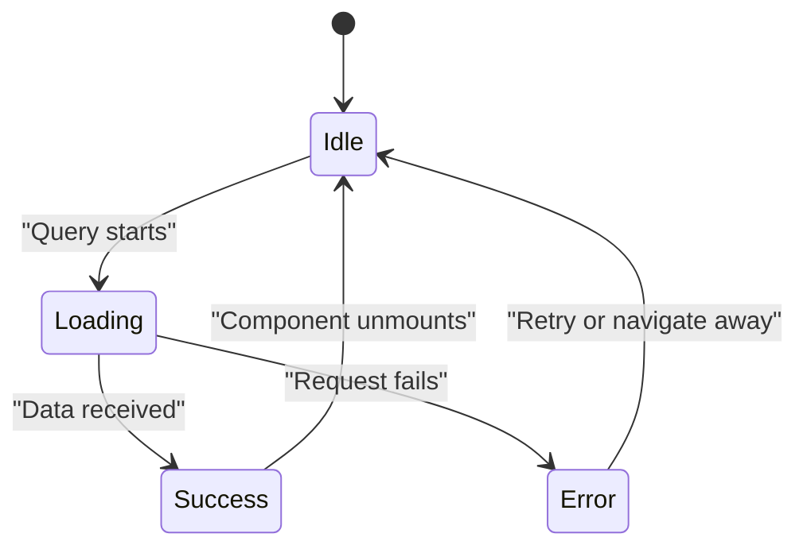
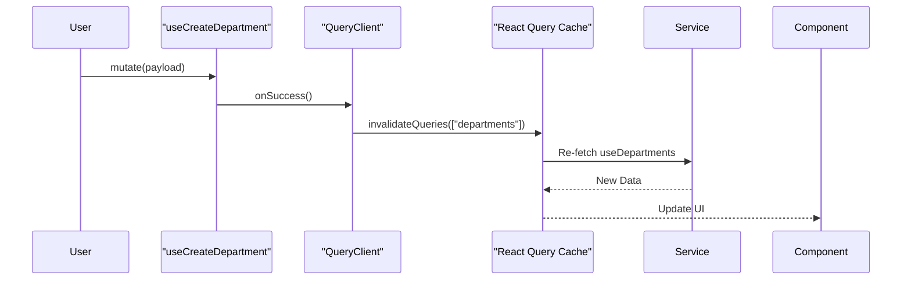

# Data Fetching with React Query

<cite>
**Referenced Files in This Document**   
- [use-departments.ts](file://src/hooks/queries/use-departments.ts)
- [use-executive-members.ts](file://src/hooks/queries/use-executive-members.ts)
- [departments.ts](file://src/services/departments.ts)
- [executive-members.ts](file://src/services/executive-members.ts)
- [api-routes.ts](file://src/constants/api-routes.ts)
- [api-caller.ts](file://src/lib/api-caller.ts)
- [departments-table.tsx](file://src/components/departments/departments-table.tsx)
- [executive-members-table.tsx](file://src/components/executive-members/executive-members-table.tsx)
- [page.tsx](file://src/app/(admin)/dashboard/departments/page.tsx)
- [page.tsx](file://src/app/(admin)/dashboard/executive-members/page.tsx)
</cite>

## Table of Contents
1. [Introduction](#introduction)
2. [Core Data Fetching Hooks](#core-data-fetching-hooks)
3. [Integration Between Hooks and Service Layer](#integration-between-hooks-and-service-layer)
4. [Query Configuration and Caching Strategy](#query-configuration-and-caching-strategy)
5. [Error Handling and Loading States](#error-handling-and-loading-states)
6. [Automatic Refetching and Stale Time](#automatic-refetching-and-stale-time)
7. [Concrete Usage in Page Components](#concrete-usage-in-page-components)
8. [Handling Dependent Queries and Pagination](#handling-dependent-queries-and-pagination)
9. [Common Issues and Optimization Patterns](#common-issues-and-optimization-patterns)
10. [Query Prefetching and Server Hydration](#query-prefetching-and-server-hydration)
11. [Best Practices for Cache Invalidation](#best-practices-for-cache-invalidation)

## Introduction
This document provides a comprehensive overview of the data fetching mechanism implemented using `@tanstack/react-query` in the CartwrightKing Admin ERP system. It explains how custom hooks such as `useDepartments` and `useExecutives` abstract API interactions into declarative patterns, enabling efficient state management, caching, and synchronization between UI components and backend services. The integration covers query execution, mutation handling, error states, and performance optimizations.

## Core Data Fetching Hooks

The application leverages React Query to encapsulate data-fetching logic within reusable custom hooks located in the `src/hooks/queries` directory. These hooks abstract away direct API calls and provide a consistent interface for components to consume data.

For example, `useDepartments` retrieves a paginated list of departments by accepting optional filter parameters and pagination settings. Similarly, `useExecutive` fetches details of a specific executive member based on their ID. These hooks return objects containing `data`, `isLoading`, `error`, and other metadata that can be directly used in React components.

**Diagram sources**
- [use-departments.ts](file://src/hooks/queries/use-departments.ts#L4-L13)
- [use-executive-members.ts](file://src/hooks/queries/use-executive-members.ts#L10-L18)

**Section sources**
- [use-departments.ts](file://src/hooks/queries/use-departments.ts#L4-L54)
- [use-executive-members.ts](file://src/hooks/queries/use-executive-members.ts#L10-L90)

## Integration Between Hooks and Service Layer

Custom hooks are tightly integrated with service functions defined in `src/services`. Each hook uses a corresponding service function as its `queryFn`. For instance, `useDepartments` calls `listDepartments`, which constructs query parameters and invokes `apiCaller` to make the actual HTTP request.

This separation ensures that business logic remains in the service layer while hooks manage only the React Query lifecycle. The `apiCaller` utility handles Axios configuration, content-type management (especially for `FormData`), and error propagation.

**Diagram sources**
- [use-departments.ts](file://src/hooks/queries/use-departments.ts#L4-L13)
- [departments.ts](file://src/services/departments.ts#L44-L73)
- [api-caller.ts](file://src/lib/api-caller.ts#L12-L82)

**Section sources**
- [departments.ts](file://src/services/departments.ts#L44-L93)
- [executive-members.ts](file://src/services/executive-members.ts#L25-L160)
- [api-caller.ts](file://src/lib/api-caller.ts#L12-L82)

## Query Configuration and Caching Strategy

React Query keys are structured as arrays to ensure uniqueness and dependency tracking. For example, `["departments", params, pagination]` ensures that different combinations of filters or page numbers result in separate cached entries.

The `staleTime` is set to 60,000 milliseconds (1 minute) across most queries, meaning data is considered fresh for one minute before being marked as stale. This reduces unnecessary refetching while ensuring reasonably up-to-date information.

Query keys also support dynamic segments like IDs, enabling precise cache targeting. For instance, `["executives", id]` allows individual executive records to be cached independently.

**Diagram sources**
- [use-departments.ts](file://src/hooks/queries/use-departments.ts#L6-L13)
- [use-executive-members.ts](file://src/hooks/queries/use-executive-members.ts#L10-L18)

**Section sources**
- [use-departments.ts](file://src/hooks/queries/use-departments.ts#L4-L54)
- [use-executive-members.ts](file://src/hooks/queries/use-executive-members.ts#L10-L90)

## Error Handling and Loading States

React Query automatically manages loading and error states. Components consuming these hooks can check `isLoading` to display spinners or skeletons and `error` to show fallback UIs.

In `DepartmentsTable`, the component conditionally renders a loading message or error indicator based on the result of `useDepartments`. This eliminates the need for manual state management in components.

Additionally, mutations like `useDeleteExecutive` expose `isPending` (formerly `isLoading`) to prevent duplicate submissions during async operations.

**Diagram sources**
- [departments-table.tsx](file://src/components/departments/departments-table.tsx#L45-L75)
- [executive-members-table.tsx](file://src/components/executive-members/executive-members-table.tsx#L50-L60)

**Section sources**
- [departments-table.tsx](file://src/components/departments/departments-table.tsx#L30-L244)
- [executive-members-table.tsx](file://src/components/executive-members/executive-members-table.tsx#L30-L190)

## Automatic Refetching and Stale Time

By default, React Query does not automatically refetch stale data unless the user returns to the page or triggers a re-render. However, this behavior can be customized using options like `refetchOnWindowFocus` or `refetchInterval`.

In the current implementation, `staleTime: 60_000` prevents immediate refetching on every render, improving performance. If real-time updates are needed, `refetchInterval` could be added to poll the API periodically.

Cache invalidation is handled explicitly via `useQueryClient().invalidateQueries()` after mutations. For example, creating a new department invalidates the `"departments"` query key, triggering a background refetch.

**Diagram sources**
- [use-departments.ts](file://src/hooks/queries/use-departments.ts#L27-L35)
- [use-executive-members.ts](file://src/hooks/queries/use-executive-members.ts#L30-L38)

**Section sources**
- [use-departments.ts](file://src/hooks/queries/use-departments.ts#L27-L54)
- [use-executive-members.ts](file://src/hooks/queries/use-executive-members.ts#L30-L90)

## Concrete Usage in Page Components

Page components like `DepartmentsPage` and `ExecutiveMembersPage` use these hooks directly to load data without managing lifecycle events manually.

For example, `DepartmentsPage` imports `useDepartments` and passes it to `DepartmentsTable`,