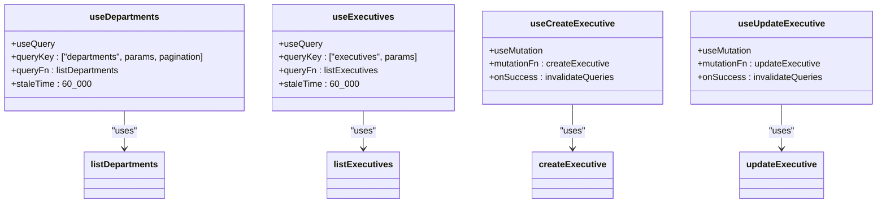
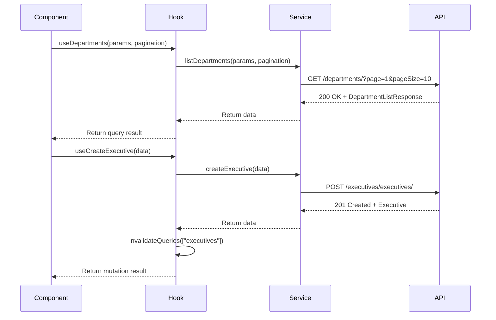
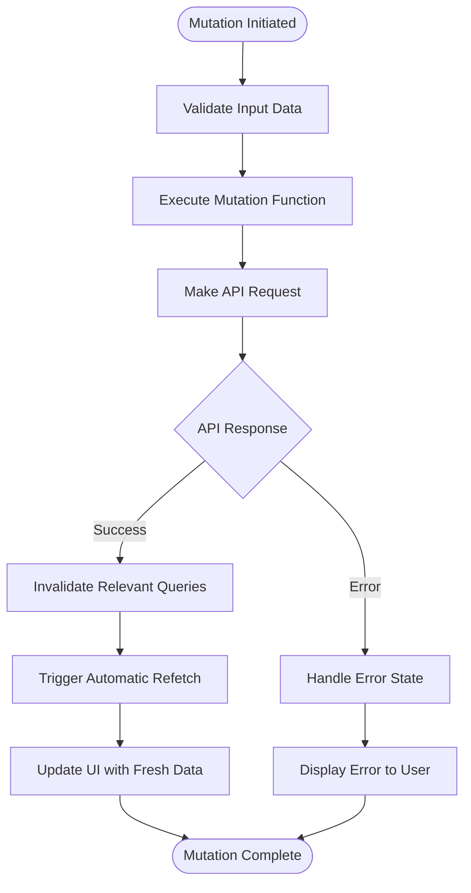
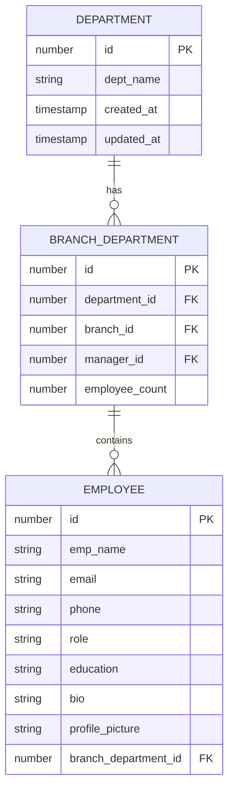
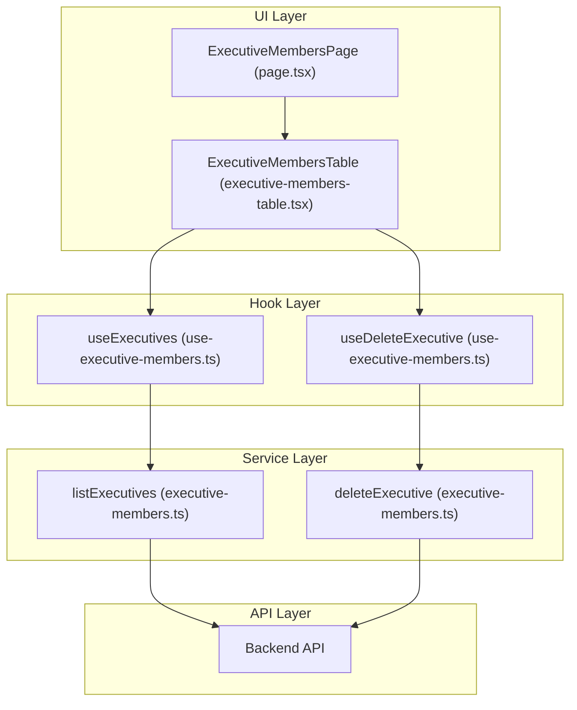

# Data Management

<cite>
**Referenced Files in This Document**   
- [use-departments.ts](file://src/hooks/queries/use-departments.ts)
- [use-employees.ts](file://src/hooks/queries/use-employees.ts)
- [use-executive-members.ts](file://src/hooks/queries/use-executive-members.ts)
- [departments.ts](file://src/services/departments.ts)
- [employees.ts](file://src/services/employees.ts)
- [executive-members.ts](file://src/services/executive-members.ts)
- [api-routes.ts](file://src/constants/api-routes.ts)
- [api-caller.ts](file://src/lib/api-caller.ts)
- [departments-table.tsx](file://src/components/departments/departments-table.tsx)
- [executive-members-table.tsx](file://src/components/executive-members/executive-members-table.tsx)
- [page.tsx](file://src/app/(admin)/dashboard/executive-members/page.tsx)
</cite>

## Table of Contents
1. [Introduction](#introduction)
2. [Core Data Entities and Domain Model](#core-data-entities-and-domain-model)
3. [CRUD Operations Implementation](#crud-operations-implementation)
4. [React Query Hook Architecture](#react-query-hook-architecture)
5. [Data Fetching and Caching Strategy](#data-fetching-and-caching-strategy)
6. [State Synchronization and Mutation Handling](#state-synchronization-and-mutation-handling)
7. [Pagination and Filtering Mechanisms](#pagination-and-filtering-mechanisms)
8. [Component-Hook-Service Invocation Chain](#component-hook-service-invocation-chain)
9. [Common Data Synchronization Issues and Solutions](#common-data-synchronization-issues-and-solutions)
10. [Debugging and Monitoring Query States](#debugging-and-monitoring-query-states)

## Introduction
This document provides a comprehensive analysis of the data management system in the CartwrightKing Admin ERP application, focusing on CRUD operations and state synchronization across key entities: departments, executive members, and employees. The system leverages React Query for efficient data fetching, caching, and mutation handling, ensuring optimal performance and real-time data consistency. The documentation details the implementation of custom hooks, service functions, and API client interactions, along with the domain model for paginated responses, filtering, and sorting. Special attention is given to advanced React Query features such as prefetching, optimistic updates, and infinite queries, while also addressing common issues like stale data and race conditions.

## Core Data Entities and Domain Model
The data management system revolves around three primary entities: departments, executive members, and employees. Each entity follows a consistent domain model with standardized response structures for list and detail operations. The domain model is defined through TypeScript interfaces in the `api.d.ts` file, which is auto-generated from OpenAPI specifications, ensuring type safety and consistency across the application.

The `DepartmentListResponse` type includes a `departments` object containing metadata such as `count`, `page`, and `page_size`, along with an array of `results` containing the actual department data. Similarly, the `EmployeeListResponse` and `ExecutiveListResponse` types follow a consistent pattern with `count`, `next`, `previous`, and `results` properties, enabling standardized pagination and navigation across all entities.

**Section sources**
- [api.d.ts](file://src/types/api.d.ts#L6-L11)
- [departments.ts](file://src/services/departments.ts#L27-L34)
- [employees.ts](file://src/services/employees.ts#L6-L11)
- [executive-members.ts](file://src/services/executive-members.ts#L12-L20)

## CRUD Operations Implementation
The CRUD operations for each entity are implemented through dedicated service functions in the `services` directory. These functions handle the communication with the backend API using the `apiCaller` utility, which abstracts the Axios request configuration and error handling. The service functions are organized by entity, with each file containing functions for listing, retrieving, creating, updating, and deleting records.

For example, the `listDepartments` function in `departments.ts` constructs a URL with optional query parameters for filtering and pagination, then makes a GET request to the API endpoint. The `createExecutive` function in `executive-members.ts` demonstrates file upload support by constructing a FormData object for profile picture uploads. The service functions return typed responses, ensuring type safety and enabling seamless integration with React Query hooks.

**Section sources**
- [departments.ts](file://src/services/departments.ts#L44-L73)
- [employees.ts](file://src/services/employees.ts#L29-L34)
- [executive-members.ts](file://src/services/executive-members.ts#L75-L160)
- [api-caller.ts](file://src/lib/api-caller.ts#L12-L82)

## React Query Hook Architecture
The data management system employs a custom hook architecture built on React Query to encapsulate data fetching and mutation logic. Each entity has a corresponding hook file in the `hooks/queries` directory, containing custom hooks for common operations. These hooks abstract the complexity of React Query configuration and provide a clean, reusable interface for components.

The `useDepartments` hook demonstrates the standard pattern for data fetching hooks, accepting optional parameters for filtering and pagination. It uses the `useQuery` hook with a query key that includes the entity name, parameters, and pagination settings, ensuring proper cache invalidation and data consistency. The `useExecutives` hook follows the same pattern, with additional hooks for mutations such as `useCreateExecutive` and `useUpdateExecutive`.

**Diagram sources**
- [use-departments.ts](file://src/hooks/queries/use-departments.ts#L4-L13)
- [use-executive-members.ts](file://src/hooks/queries/use-executive-members.ts#L4-L90)
- [departments.ts](file://src/services/departments.ts#L44-L73)
- [executive-members.ts](file://src/services/executive-members.ts#L75-L160)

**Section sources**
- [use-departments.ts](file://src/hooks/queries/use-departments.ts#L4-L13)
- [use-employees.ts](file://src/hooks/queries/use-employees.ts#L12-L18)
- [use-executive-members.ts](file://src/hooks/queries/use-executive-members.ts#L4-L90)

## Data Fetching and Caching Strategy
The data fetching and caching strategy is centered around React Query's powerful caching mechanism, which automatically handles data synchronization and cache invalidation. The system uses a stale time of 60,000 milliseconds (1 minute) for all queries, ensuring that data remains fresh while minimizing unnecessary network requests.

The caching strategy is implemented through carefully constructed query keys that include entity names, parameters, and pagination settings. This ensures that different combinations of parameters and pagination result in separate cache entries, preventing data conflicts. The `useQueryClient` is used in mutation hooks to invalidate relevant queries after successful mutations, triggering automatic refetching of stale data.

**Diagram sources**
- [use-departments.ts](file://src/hooks/queries/use-departments.ts#L4-L13)
- [use-executive-members.ts](file://src/hooks/queries/use-executive-members.ts#L4-L90)
- [departments.ts](file://src/services/departments.ts#L44-L73)
- [executive-members.ts](file://src/services/executive-members.ts#L75-L160)
- [api-routes.ts](file://src/constants/api-routes.ts#L13-L21)

**Section sources**
- [use-departments.ts](file://src/hooks/queries/use-departments.ts#L4-L13)
- [use-executive-members.ts](file://src/hooks/queries/use-executive-members.ts#L4-L90)
- [api-caller.ts](file://src/lib/api-caller.ts#L12-L82)

## State Synchronization and Mutation Handling
State synchronization is achieved through React Query's mutation hooks, which provide a robust mechanism for handling CRUD operations and maintaining data consistency. The mutation hooks use the `useMutation` function from React Query, with `onSuccess` callbacks that invalidate relevant queries to trigger automatic refetching.

The `useCreateExecutive` hook demonstrates the standard pattern for create mutations, with an `onSuccess` callback that invalidates the `executives` query key, causing all components using the `useExecutives` hook to automatically refetch their data. The `useUpdateExecutive` hook follows the same pattern, with additional invalidation of the specific executive's detail query to ensure both list and detail views are updated.

**Diagram sources**
- [use-executive-members.ts](file://src/hooks/queries/use-executive-members.ts#L4-L90)
- [executive-members.ts](file://src/services/executive-members.ts#L75-L160)

**Section sources**
- [use-executive-members.ts](file://src/hooks/queries/use-executive-members.ts#L4-L90)
- [executive-members.ts](file://src/services/executive-members.ts#L75-L160)

## Pagination and Filtering Mechanisms
The pagination and filtering mechanisms are implemented through a combination of server-side and client-side processing. The system supports both server-side pagination, where the backend API handles pagination through query parameters, and client-side pagination, where the frontend manages pagination of cached data.

The `useDepartments` hook accepts a `pagination` parameter that is converted to 0-based indexing and included in the query parameters sent to the API. The `DepartmentsTable` component demonstrates a hybrid approach, using server-side pagination to fetch data from the API and client-side pagination to navigate through cached data. This approach optimizes network usage while providing a smooth user experience.

**Diagram sources**
- [use-departments.ts](file://src/hooks/queries/use-departments.ts#L4-L13)
- [departments-table.tsx](file://src/components/departments/departments-table.tsx#L0-L244)
- [departments.ts](file://src/services/departments.ts#L44-L73)

**Section sources**
- [use-departments.ts](file://src/hooks/queries/use-departments.ts#L4-L13)
- [departments-table.tsx](file://src/components/departments/departments-table.tsx#L0-L244)
- [departments.ts](file://src/services/departments.ts#L44-L73)

## Component-Hook-Service Invocation Chain
The component-hook-service invocation chain follows a clean, layered architecture that separates concerns and promotes reusability. Components in the `components` directory use custom hooks from the `hooks/queries` directory to access data, while the hooks use service functions from the `services` directory to communicate with the backend API.

The `ExecutiveMembersTable` component demonstrates this pattern, using the `useExecutives` hook to fetch executive member data and the `useDeleteExecutive` hook to handle delete operations. The `ExecutiveMembersPage` component renders the table and provides navigation controls, creating a complete user interface for managing executive members.

**Diagram sources**
- [page.tsx](file://src/app/(admin)/dashboard/executive-members/page.tsx#L0-L29)
- [executive-members-table.tsx](file://src/components/executive-members/executive-members-table.tsx#L0-L190)
- [use-executive-members.ts](file://src/hooks/queries/use-executive-members.ts#L4-L90)
- [executive-members.ts](file://src/services/executive-members.ts#L75-L160)

**Section sources**
- [page.tsx](file://src/app/(admin)/dashboard/executive-members/page.tsx#L0-L29)
- [executive-members-table.tsx](file://src/components/executive-members/executive-members-table.tsx#L0-L190)
- [use-executive-members.ts](file://src/hooks/queries/use-executive-members.ts#L4-L90)

## Common Data Synchronization Issues and Solutions
The data management system addresses several common data synchronization issues through careful design and implementation. Stale data is mitigated through the use of React Query's stale time configuration and automatic refetching after mutations. Race conditions during mutations are prevented by using React Query's mutation hooks, which handle loading states and prevent concurrent executions.

Optimistic updates are not explicitly implemented in the current system, but the architecture supports them through React Query's `onMutate` callback, which allows updating the cache before the mutation is sent to the server. This feature could be added to improve perceived performance for certain operations.

The system also handles file uploads through FormData objects, with special handling for profile picture uploads and deletions. The `apiCaller` function ensures proper Content-Type headers are set for FormData requests, preventing common issues with file uploads.

**Section sources**
- [use-executive-members.ts](file://src/hooks/queries/use-executive-members.ts#L4-L90)
- [executive-members.ts](file://src/services/executive-members.ts#L75-L160)
- [api-caller.ts](file://src/lib/api-caller.ts#L12-L82)

## Debugging and Monitoring Query States
Debugging and monitoring query states is facilitated through React Query's built-in devtools and the structured error handling in the application. The query hooks expose loading, error, and success states that can be used to provide feedback to users and diagnose issues.

The `DepartmentsTable` component demonstrates error handling by displaying an error message when data loading fails, while the `ExecutiveMembersTable` component uses the `toast` utility to provide feedback on delete operations. These patterns can be extended to other components to provide comprehensive error handling and user feedback.

Developers can use React Query's devtools to inspect query states, monitor network requests, and diagnose performance issues. The consistent use of query keys and mutation callbacks makes it easy to trace data flow and identify potential issues in the data management system.

**Section sources**
- [departments-table.tsx](file://src/components/departments/departments-table.tsx#L0-L244)
- [executive-members-table.tsx](file://src/components/executive-members/executive-members-table.tsx#L0-L190)
- [use-executive-members.ts](file://src/hooks/queries/use-executive-members.ts#L4-L90)