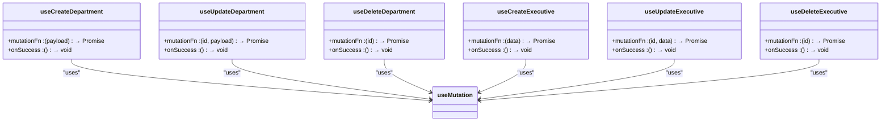
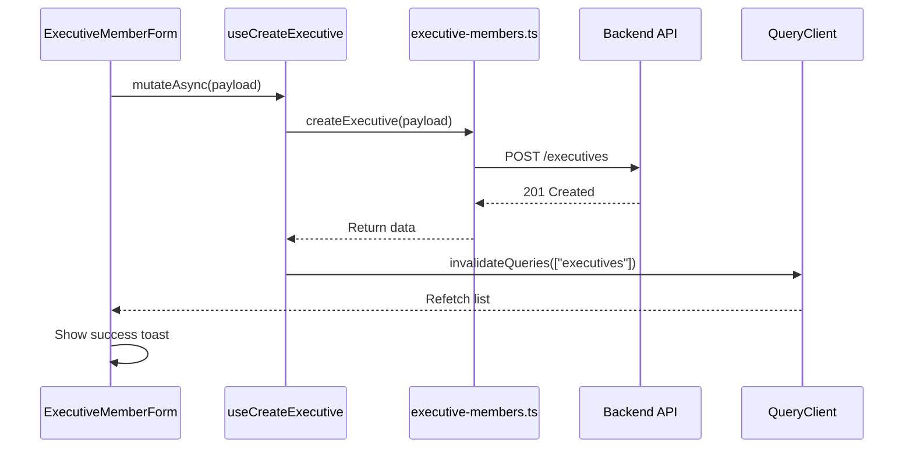
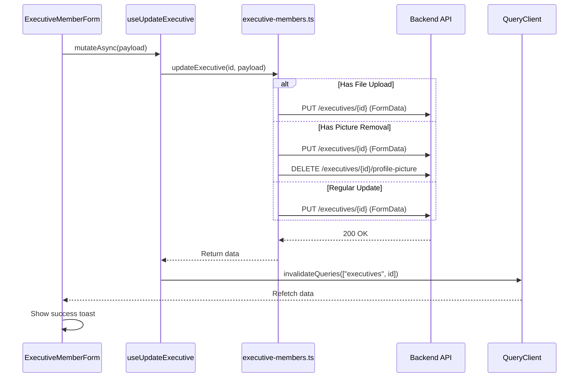
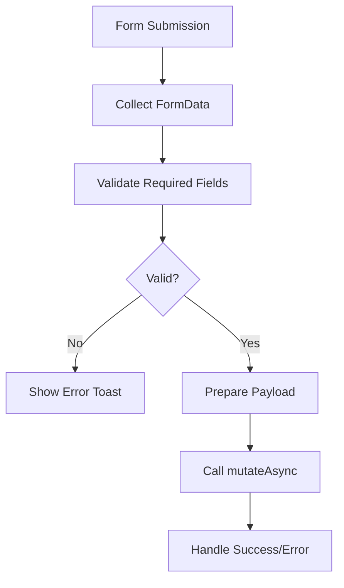

# Data Mutations and State Updates

<cite>
**Referenced Files in This Document**   
- [use-departments.ts](file://src/hooks/queries/use-departments.ts)
- [use-executive-members.ts](file://src/hooks/queries/use-executive-members.ts)
- [executive-member-form.tsx](file://src/components/executive-members/executive-member-form.tsx)
- [executive-members-table.tsx](file://src/components/executive-members/executive-members-table.tsx)
- [departments.ts](file://src/services/departments.ts)
- [executive-members.ts](file://src/services/executive-members.ts)
</cite>

## Table of Contents
1. [Introduction](#introduction)
2. [Core Mutation Hooks](#core-mutation-hooks)
3. [Create Operations](#create-operations)
4. [Update Operations](#update-operations)
5. [Delete Operations](#delete-operations)
6. [Integration with React Hook Form and Validation](#integration-with-react-hook-form-and-validation)
7. [Error Handling and Rollback Strategies](#error-handling-and-rollback-strategies)
8. [Performance and Re-render Optimization](#performance-and-re-render-optimization)
9. [Debugging Mutation State](#debugging-mutation-state)
10. [Conclusion](#conclusion)

## Introduction
This document details the implementation of data mutation operations in the CartwrightKing Admin ERP system using React Query's `useMutation` hook. The focus is on managing create, update, and delete actions for key entities such as departments and executive members. The system integrates React Query for state management, React Hook Form patterns, and Zod-based validation to ensure data integrity. The mutation flow spans from UI form submission through service invocation and cache synchronization, ensuring a responsive and consistent user experience.

## Core Mutation Hooks
The application implements dedicated custom hooks for handling mutations on departments and executive members. These hooks abstract the complexity of API interactions and cache management, providing a clean interface for components.



**Diagram sources**
- [use-departments.ts](file://src/hooks/queries/use-departments.ts#L43-L72)
- [use-executive-members.ts](file://src/hooks/queries/use-executive-members.ts#L32-L64)

**Section sources**
- [use-departments.ts](file://src/hooks/queries/use-departments.ts#L43-L72)
- [use-executive-members.ts](file://src/hooks/queries/use-executive-members.ts#L32-L64)

## Create Operations
Creating new entities such as departments or executive members is handled through dedicated mutation hooks that encapsulate the entire process from form submission to cache invalidation.

The `useCreateDepartment` and `useCreateExecutive` hooks define the mutation function and success callback. Upon successful creation, the relevant query caches are invalidated to ensure the UI reflects the latest data.



**Diagram sources**
- [use-executive-members.ts](file://src/hooks/queries/use-executive-members.ts#L32-L41)
- [executive-member-form.tsx](file://src/components/executive-members/executive-member-form.tsx#L43-L43)

**Section sources**
- [use-departments.ts](file://src/hooks/queries/use-departments.ts#L43-L51)
- [use-executive-members.ts](file://src/hooks/queries/use-executive-members.ts#L32-L41)
- [executive-member-form.tsx](file://src/components/executive-members/executive-member-form.tsx#L43-L43)

## Update Operations
Updating existing entities follows a similar pattern to creation but includes the entity ID as a parameter. The `useUpdateDepartment` and `useUpdateExecutive` hooks are configured with the specific ID of the entity being modified.

The update process supports complex scenarios such as profile picture management, where file uploads are handled via FormData. The system distinguishes between updating text fields, uploading new images, and removing existing pictures.



**Diagram sources**
- [use-executive-members.ts](file://src/hooks/queries/use-executive-members.ts#L43-L53)
- [executive-members.ts](file://src/services/executive-members.ts#L78-L141)
- [executive-member-form.tsx](file://src/components/executive-members/executive-member-form.tsx#L44-L44)

**Section sources**
- [use-departments.ts](file://src/hooks/queries/use-departments.ts#L53-L62)
- [use-executive-members.ts](file://src/hooks/queries/use-executive-members.ts#L43-L53)
- [executive-members.ts](file://src/services/executive-members.ts#L78-L141)

## Delete Operations
Deletion operations are implemented with appropriate confirmation mechanisms and cache synchronization. The `useDeleteDepartment` and `useDeleteExecutive` hooks handle the removal of entities and automatically invalidate relevant caches.

In the UI, deletion is typically triggered through a confirmation popover to prevent accidental data loss. The mutation is awaited, and appropriate feedback is provided to the user.

```mermaid
flowchart TD
A[User Clicks Delete] --> B{Show Confirmation}
B --> C[User Confirms]
C --> D[Call mutateAsync(id)]
D --> E[API DELETE Request]
E --> F{Success?}
F --> |Yes| G[Invalidate Queries]
F --> |No| H[Show Error Toast]
G --> I[Show Success Toast]
H --> J[Log Error]
```

**Diagram sources**
- [use-executive-members.ts](file://src/hooks/queries/use-executive-members.ts#L55-L64)
- [executive-members-table.tsx](file://src/components/executive-members/executive-members-table.tsx#L36-L36)

**Section sources**
- [use-departments.ts](file://src/hooks/queries/use-departments.ts#L64-L72)
- [use-executive-members.ts](file://src/hooks/queries/use-executive-members.ts#L55-L64)
- [executive-members-table.tsx](file://src/components/executive-members/executive-members-table.tsx#L36-L36)

## Integration with React Hook Form and Validation
The mutation process is tightly integrated with form handling and validation. While the current implementation uses native form handling with FormData, it follows principles similar to React Hook Form by collecting and validating input before mutation.

The `ExecutiveMemberForm` component demonstrates this integration, where form data is collected, validated client-side, and then passed to the appropriate mutation hook. Field-level validation ensures required fields are populated before submission.



**Diagram sources**
- [executive-member-form.tsx](file://src/components/executive-members/executive-member-form.tsx#L43-L44)

**Section sources**
- [executive-member-form.tsx](file://src/components/executive-members/executive-member-form.tsx#L43-L44)

## Error Handling and Rollback Strategies
The system implements comprehensive error handling for mutation operations. When a mutation fails, the application provides detailed feedback to the user by parsing error responses from the server.

The `onError` callback is implicitly handled in the form component's try-catch block, where server validation errors are extracted and displayed as individual toast notifications. This approach provides granular feedback on what specific fields failed validation.

For rollback strategies, the system relies on React Query's default behavior of not automatically rolling back optimistic updates since most mutations do not implement the `onMutate` context. Instead, the focus is on preventing invalid states through client-side validation before mutation execution.

**Section sources**
- [executive-member-form.tsx](file://src/components/executive-members/executive-member-form.tsx#L43-L44)

## Performance and Re-render Optimization
The mutation implementation considers performance by minimizing unnecessary re-renders and optimizing cache invalidation. React Query's built-in caching and background refetching reduce the need for manual state management.

The `staleTime` configuration in query hooks (set to 60,000ms) ensures data remains fresh without excessive network requests. Cache invalidation is targeted to specific query keys, avoiding full-page re-renders when possible.

Mutation status flags such as `isPending` are used in the UI to provide feedback during asynchronous operations, improving perceived performance. The use of `useMemo` for data transformation in table components further optimizes rendering performance.

**Section sources**
- [use-departments.ts](file://src/hooks/queries/use-departments.ts#L11-L20)
- [executive-members-table.tsx](file://src/components/executive-members/executive-members-table.tsx#L21-L21)

## Debugging Mutation State
Debugging mutation operations can be accomplished through several approaches:

1. **Mutation Status Monitoring**: The `useMutation` return object provides status flags including `isPending`, `isError`, and `isSuccess` that can be used to trace the mutation lifecycle.

2. **Error Payload Inspection**: When mutations fail, the error object contains the full response from the server, including validation messages that can be logged for debugging.

3. **React Query Devtools**: The application can leverage React Query's devtools to inspect mutation calls, parameters, and outcomes in real-time.

4. **Console Logging**: Strategic console warnings are implemented in error cases, such as when profile picture deletion fails during an update operation.

**Section sources**
- [executive-member-form.tsx](file://src/components/executive-members/executive-member-form.tsx#L43-L44)
- [executive-members.ts](file://src/services/executive-members.ts#L78-L141)

## Conclusion
The data mutation system in the CartwrightKing Admin ERP application effectively leverages React Query's `useMutation` hook to manage create, update, and delete operations for key entities. The implementation provides a robust pattern for handling asynchronous operations with proper error handling, cache synchronization, and user feedback. By encapsulating mutation logic in custom hooks, the system promotes reusability and maintainability across components. Future enhancements could include optimistic updates with rollback capabilities and more sophisticated form validation using Zod schemas.