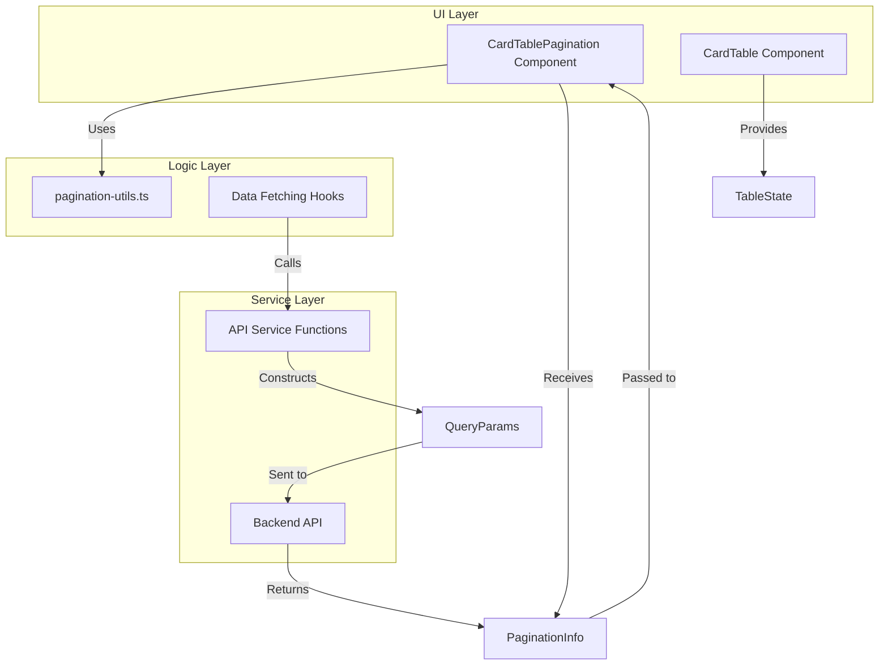
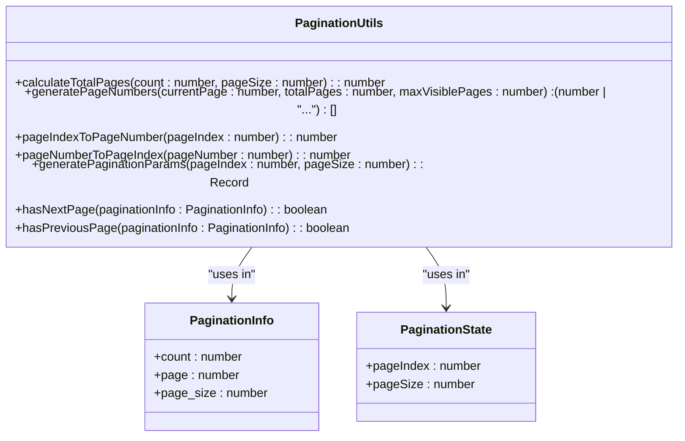
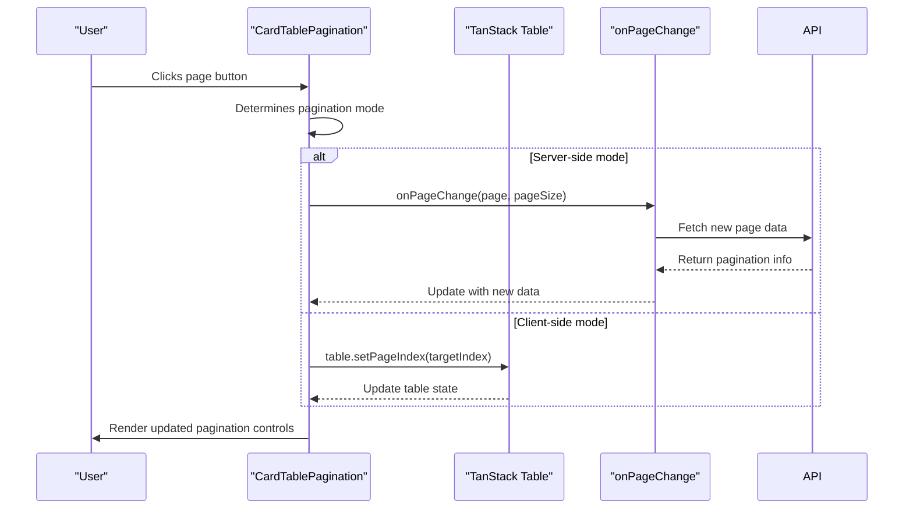
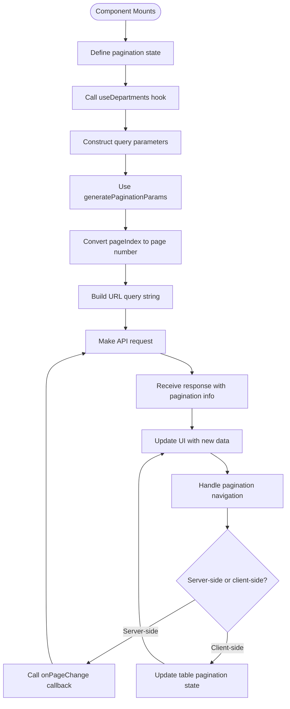
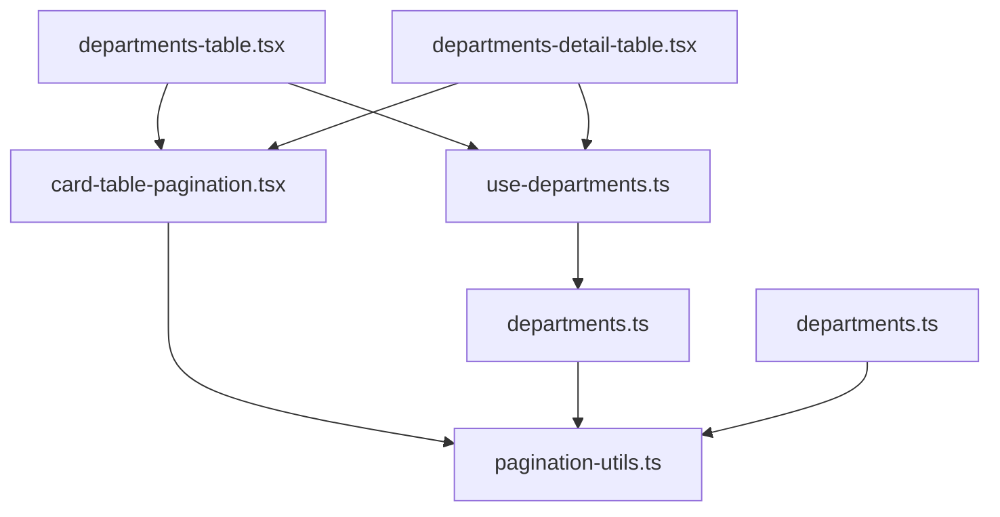

# Pagination System

<cite>
**Referenced Files in This Document**   
- [pagination-utils.ts](file://src/lib/pagination-utils.ts)
- [card-table-pagination.tsx](file://src/components/card-table/card-table-pagination.tsx)
- [use-departments.ts](file://src/hooks/queries/use-departments.ts)
- [departments.ts](file://src/services/departments.ts)
- [departments-table.tsx](file://src/components/departments/departments-table.tsx)
- [departments-detail-table.tsx](file://src/components/departments/departments-detail-table.tsx)
</cite>

## Table of Contents
1. [Introduction](#introduction)
2. [Core Components](#core-components)
3. [Architecture Overview](#architecture-overview)
4. [Detailed Component Analysis](#detailed-component-analysis)
5. [Dependency Analysis](#dependency-analysis)
6. [Performance Considerations](#performance-considerations)
7. [Troubleshooting Guide](#troubleshooting-guide)
8. [Conclusion](#conclusion)

## Introduction
The pagination system in the CartwrightKing Admin ERP application provides a robust mechanism for handling large datasets across various administrative modules. This documentation details the implementation of offset-based pagination using page numbers and limit parameters, as managed through the `pagination-utils.ts` utility library and rendered via the `card-table-pagination` component. The system supports both server-side and client-side pagination patterns, with integration into data fetching hooks and table components. This document explains the technical implementation, user interface behavior, common issues, and future extension possibilities for more advanced pagination patterns.

## Core Components

The pagination system consists of several key components that work together to provide a seamless user experience when navigating through large datasets. The core functionality is implemented in the `pagination-utils.ts` file, which provides essential functions for calculating page counts, generating page number displays, and converting between zero-based and one-based indexing systems. The `card-table-pagination.tsx` component renders the actual pagination controls and manages user interactions. Data fetching hooks like `use-departments.ts` integrate with the pagination system to request data from the API, while service functions in `departments.ts` construct the appropriate query parameters for paginated requests.

**Section sources**
- [pagination-utils.ts](file://src/lib/pagination-utils.ts#L1-L122)
- [card-table-pagination.tsx](file://src/components/card-table/card-table-pagination.tsx#L1-L133)

## Architecture Overview

The pagination architecture follows a layered approach where utility functions handle core logic, components manage UI rendering and user interactions, and data hooks facilitate communication with the backend API. The system is designed to support both server-side and client-side pagination through a unified interface.

**Diagram sources**
- [pagination-utils.ts](file://src/lib/pagination-utils.ts#L1-L122)
- [card-table-pagination.tsx](file://src/components/card-table/card-table-pagination.tsx#L1-L133)
- [departments.ts](file://src/services/departments.ts#L1-L158)

## Detailed Component Analysis

### Pagination Utilities Analysis
The `pagination-utils.ts` file contains the foundational logic for the pagination system. It defines interfaces for pagination state and provides several key functions for handling pagination calculations.

**Diagram sources**
- [pagination-utils.ts](file://src/lib/pagination-utils.ts#L6-L122)

**Section sources**
- [pagination-utils.ts](file://src/lib/pagination-utils.ts#L6-L122)

### Card Table Pagination Component Analysis
The `card-table-pagination.tsx` component renders the pagination controls and manages user interactions. It supports both server-side and client-side pagination modes based on whether pagination information is provided.

**Diagram sources**
- [card-table-pagination.tsx](file://src/components/card-table/card-table-pagination.tsx#L29-L129)

**Section sources**
- [card-table-pagination.tsx](file://src/components/card-table/card-table-pagination.tsx#L1-L133)

### Data Fetching Integration Analysis
The pagination system integrates with data fetching hooks and service functions to construct API requests with appropriate pagination parameters.

**Diagram sources**
- [use-departments.ts](file://src/hooks/queries/use-departments.ts#L1-L74)
- [departments.ts](file://src/services/departments.ts#L46-L85)

**Section sources**
- [use-departments.ts](file://src/hooks/queries/use-departments.ts#L1-L74)
- [departments.ts](file://src/services/departments.ts#L1-L158)

## Dependency Analysis

The pagination system has a clear dependency hierarchy where higher-level components depend on lower-level utilities and services.

**Diagram sources**
- [card-table-pagination.tsx](file://src/components/card-table/card-table-pagination.tsx#L1-L133)
- [pagination-utils.ts](file://src/lib/pagination-utils.ts#L1-L122)
- [use-departments.ts](file://src/hooks/queries/use-departments.ts#L1-L74)
- [departments.ts](file://src/services/departments.ts#L1-L158)
- [departments-table.tsx](file://src/components/departments/departments-table.tsx#L1-L245)
- [departments-detail-table.tsx](file://src/components/departments/departments-detail-table.tsx#L1-L181)

**Section sources**
- [card-table-pagination.tsx](file://src/components/card-table/card-table-pagination.tsx#L1-L133)
- [pagination-utils.ts](file://src/lib/pagination-utils.ts#L1-L122)
- [use-departments.ts](file://src/hooks/queries/use-departments.ts#L1-L74)
- [departments.ts](file://src/services/departments.ts#L1-L158)

## Performance Considerations

The pagination system is designed with performance in mind, particularly when dealing with large datasets. The offset-based pagination approach using page numbers and page size parameters allows for efficient data retrieval from the backend. However, there are some performance implications to consider:

1. For very large datasets, deep pagination (navigating to high page numbers) can become inefficient as the database must skip over an increasing number of records.

2. The system implements caching strategies in components like `departments-table.tsx` where multiple server pages are cached to support virtual pagination of flattened data structures.

3. The `generatePageNumbers` function in `pagination-utils.ts` limits the number of visible page buttons to prevent UI clutter, defaulting to a maximum of 3 visible pages with ellipsis for omitted ranges.

4. When integrating with TanStack Table, the system can leverage both server-side and client-side pagination modes, allowing developers to choose the most appropriate approach based on data size and access patterns.

**Section sources**
- [pagination-utils.ts](file://src/lib/pagination-utils.ts#L30-L51)
- [departments-table.tsx](file://src/components/departments/departments-table.tsx#L31-L64)

## Troubleshooting Guide

### Common Issues and Solutions

**Incorrect Page Resets After Filtering**
When applying filters to paginated data, the page index should be reset to 0 to ensure users see results from the beginning. This can be handled by resetting the pagination state when filter parameters change.

**Boundary Edge Cases**
The pagination system handles edge cases such as:
- Empty datasets (count = 0)
- Page sizes of 0 or negative values
- Page numbers exceeding the total number of pages
- Navigation to non-existent pages

These are managed through validation in functions like `calculateTotalPages` and boundary checks in navigation handlers.

**Performance with Large Datasets**
For tables with very large numbers of records, consider implementing cursor-based pagination instead of offset-based pagination to avoid performance degradation on deep pages.

**Virtual Pagination Challenges**
In components like `departments-table.tsx` that implement virtual pagination over flattened data, ensure that the estimated row count is accurate to prevent navigation issues. The system calculates an average number of branches per department to estimate the total flattened row count.

**Section sources**
- [pagination-utils.ts](file://src/lib/pagination-utils.ts#L15-L25)
- [card-table-pagination.tsx](file://src/components/card-table/card-table-pagination.tsx#L55-L88)
- [departments-table.tsx](file://src/components/departments/departments-table.tsx#L94-L127)

## Conclusion

The pagination system in the CartwrightKing Admin ERP application provides a comprehensive solution for managing large datasets across various administrative modules. By combining utility functions in `pagination-utils.ts` with the `card-table-pagination` component, the system offers a flexible approach that supports both server-side and client-side pagination patterns. The integration with data fetching hooks and service functions ensures consistent API communication with properly formatted pagination parameters. For future enhancements, the system could be extended to support cursor-based pagination or infinite scrolling patterns, particularly for datasets where offset-based pagination may present performance challenges. The current implementation effectively balances usability, performance, and maintainability across the application's various table components.