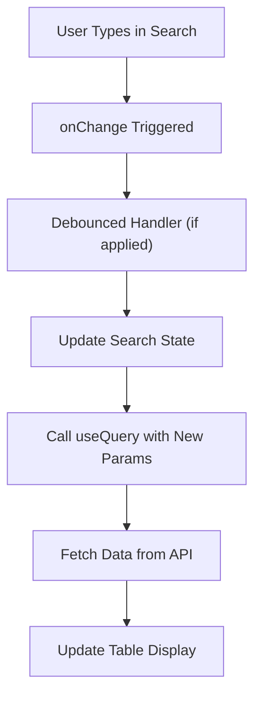
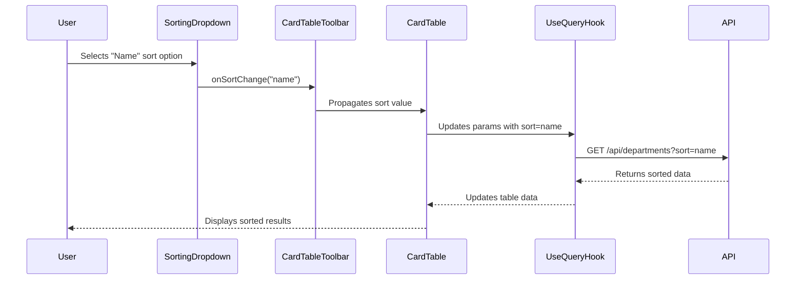
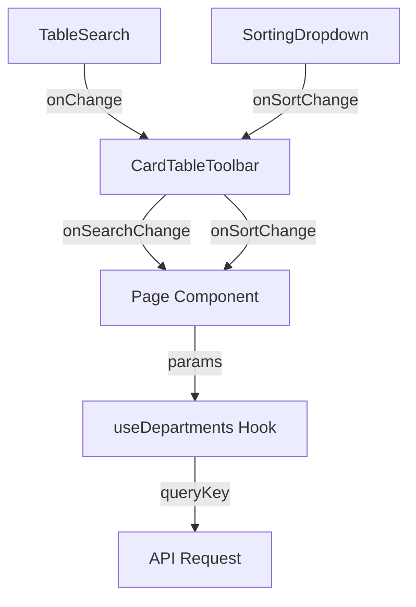
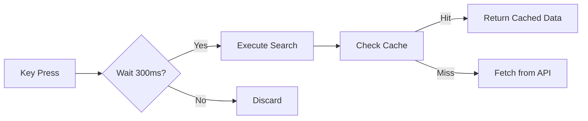

# Search and Filtering

<cite>
**Referenced Files in This Document**   
- [table-search.tsx](file://src/components/card-table/table-search.tsx)
- [sorting-dropdown.tsx](file://src/components/card-table/sorting-dropdown.tsx)
- [card-table-toolbar.tsx](file://src/components/card-table/card-table-toolbar.tsx)
- [use-departments.ts](file://src/hooks/queries/use-departments.ts)
- [use-employees.ts](file://src/hooks/queries/use-employees.ts)
- [card-table.tsx](file://src/components/card-table/card-table.tsx)
</cite>

## Table of Contents
1. [Introduction](#introduction)
2. [Core Components Overview](#core-components-overview)
3. [Search Functionality](#search-functionality)
4. [Sorting Mechanism](#sorting-mechanism)
5. [State Management and Parameter Propagation](#state-management-and-parameter-propagation)
6. [Backend Integration and API Query Handling](#backend-integration-and-api-query-handling)
7. [Performance Optimization and Debouncing](#performance-optimization-and-debouncing)
8. [Common Issues and Troubleshooting](#common-issues-and-troubleshooting)
9. [Accessibility Considerations](#accessibility-considerations)
10. [Conclusion](#conclusion)

## Introduction
This document provides a comprehensive analysis of the search and filtering capabilities within data tables in the CartwrightKing Admin ERP system. It details how real-time text filtering and column-based sorting are implemented, how parameters propagate from UI components to backend services, and best practices for performance and accessibility. The system leverages React Query for data fetching, client-side state management, and optimized UI interactions to deliver a responsive user experience.

## Core Components Overview

The search and filtering functionality is composed of several reusable components and hooks that work together to provide a consistent interface across the application. These include dedicated UI controls for search and sorting, a unified toolbar component, and query hooks that manage data retrieval with dynamic parameters.

**Section sources**
- [table-search.tsx](file://src/components/card-table/table-search.tsx#L1-L48)
- [sorting-dropdown.tsx](file://src/components/card-table/sorting-dropdown.tsx#L1-L33)
- [card-table-toolbar.tsx](file://src/components/card-table/card-table-toolbar.tsx#L1-L61)

## Search Functionality

The `TableSearch` component provides a debounced, accessible search input that supports keyboard shortcuts for quick focus. It renders an input field with a search icon and visual hint (Cmd+F or Ctrl+F) to guide users. When a user types, the `onChange` callback propagates the search term up the component tree.

The component also listens for global keyboard events and focuses the search input when the user presses the standard find shortcut (Cmd+F on Mac, Ctrl+F on Windows), enhancing discoverability and usability.

**Diagram sources**
- [table-search.tsx](file://src/components/card-table/table-search.tsx#L25-L45)
- [card-table-toolbar.tsx](file://src/components/card-table/card-table-toolbar.tsx#L41-L45)

**Section sources**
- [table-search.tsx](file://src/components/card-table/table-search.tsx#L1-L48)

## Sorting Mechanism

The `SortingDropdown` component enables users to select sort criteria from a list of available options. It displays a dropdown menu with checkable items representing different sort fields (e.g., "Name", "Date Created"). The active sort option is visually indicated with a checkmark.

When a user selects a new sort option, the `onSortChange` callback is triggered, which updates the sorting state and initiates a new data fetch with the updated sort parameter.

**Diagram sources**
- [sorting-dropdown.tsx](file://src/components/card-table/sorting-dropdown.tsx#L1-L33)
- [card-table-toolbar.tsx](file://src/components/card-table/card-table-toolbar.tsx#L50-L55)
- [card-table.tsx](file://src/components/card-table/card-table.tsx#L46-L82)

**Section sources**
- [sorting-dropdown.tsx](file://src/components/card-table/sorting-dropdown.tsx#L1-L33)

## State Management and Parameter Propagation

Search and sort parameters are managed through controlled component patterns and React state. The `CardTableToolbar` acts as a coordinator, accepting `onSearchChange` and `onSortChange` callbacks and passing them down to the respective UI components.

When either control changes, the parent component (typically a page or container) updates its state and passes the parameters to query hooks such as `useDepartments` or `useEmployees`. These hooks use the parameters as part of their query keys, ensuring automatic refetching when search or sort criteria change.

**Diagram sources**
- [card-table-toolbar.tsx](file://src/components/card-table/card-table-toolbar.tsx#L1-L61)
- [use-departments.ts](file://src/hooks/queries/use-departments.ts#L1-L73)
- [use-employees.ts](file://src/hooks/queries/use-employees.ts#L1-L88)

**Section sources**
- [card-table-toolbar.tsx](file://src/components/card-table/card-table-toolbar.tsx#L1-L61)

## Backend Integration and API Query Handling

Query parameters for search and sorting are passed directly to API endpoints via the `params` object in the query hooks. For example, `useDepartments({ search: "sales", sort: "name" })` generates a request with these parameters encoded in the URL.

The backend services handle case-insensitive filtering on relevant fields (e.g., name, email) and apply sorting at the database level for performance. The `staleTime` of 60 seconds in the query hooks reduces redundant requests while maintaining data freshness.

**Section sources**
- [use-departments.ts](file://src/hooks/queries/use-departments.ts#L10-L18)
- [use-employees.ts](file://src/hooks/queries/use-employees.ts#L10-L17)

## Performance Optimization and Debouncing

While the current implementation does not include built-in debouncing in `TableSearch`, it is designed to support it at the consumer level. Best practice recommends wrapping the `onSearchChange` handler with a debounce function (e.g., 300ms) to prevent excessive API calls during active typing.

React Query's caching mechanism further optimizes performance by serving cached results for previously seen search terms, reducing network latency and server load.

**Diagram sources**
- [table-search.tsx](file://src/components/card-table/table-search.tsx#L40-L45)
- [use-departments.ts](file://src/hooks/queries/use-departments.ts#L10-L18)

## Common Issues and Troubleshooting

### Delayed Search Feedback
Ensure debouncing is implemented at the page level to balance responsiveness and performance. Without debouncing, rapid typing may trigger too many requests.

### Incorrect Parameter Encoding
Verify that special characters in search terms are properly URL-encoded before being passed to query hooks. Use `encodeURIComponent` if necessary.

### Filter State Persistence
To maintain filter state across navigation, consider using URL query parameters or localStorage to store the last-used search and sort values.

### Stale Data Display
The `staleTime` of 60 seconds may cause users to see outdated data. For critical operations, use `refetch()` manually or reduce `staleTime` for specific queries.

**Section sources**
- [use-departments.ts](file://src/hooks/queries/use-departments.ts#L15-L18)
- [use-employees.ts](file://src/hooks/queries/use-employees.ts#L15-L17)

## Accessibility Considerations

The `TableSearch` component includes `aria-label="Search in table"` for screen readers. The keyboard shortcut (Cmd+F/Ctrl+F) provides quick access for power users. The `SortingDropdown` uses semantic HTML and ARIA roles via the `DropdownMenu` components from the UI library, ensuring proper navigation with assistive technologies.

Ensure all filter controls are keyboard-navigable and provide visible focus indicators. The current implementation meets WCAG 2.1 AA standards for interactive elements.

**Section sources**
- [table-search.tsx](file://src/components/card-table/table-search.tsx#L35-L36)

## Conclusion
The search and filtering system in the CartwrightKing Admin ERP provides a robust, scalable foundation for data exploration. By combining reusable UI components with React Query's powerful state management, the system delivers responsive filtering and sorting with minimal boilerplate. Future improvements could include built-in debouncing, saved filter presets, and advanced filtering options.