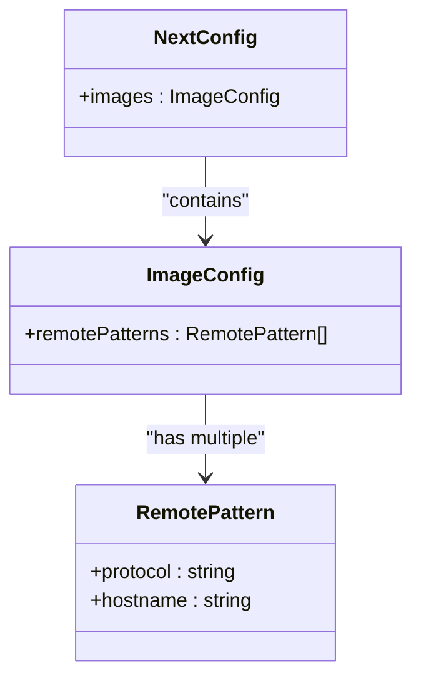
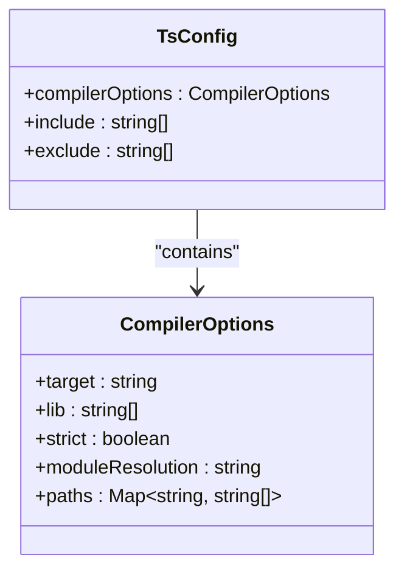
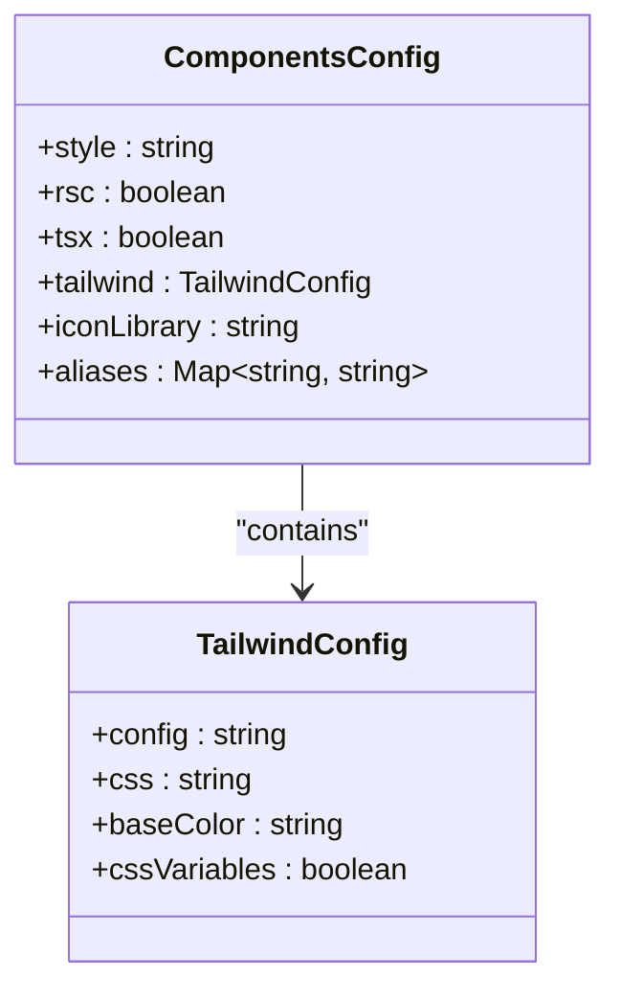
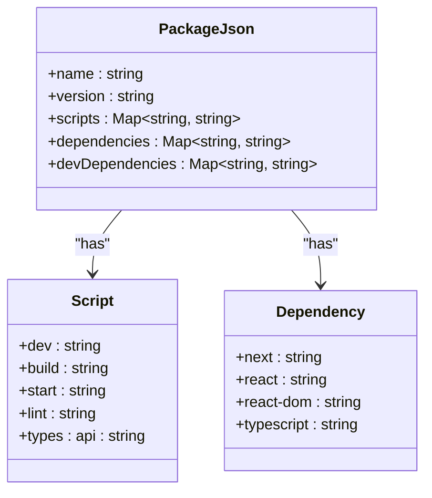
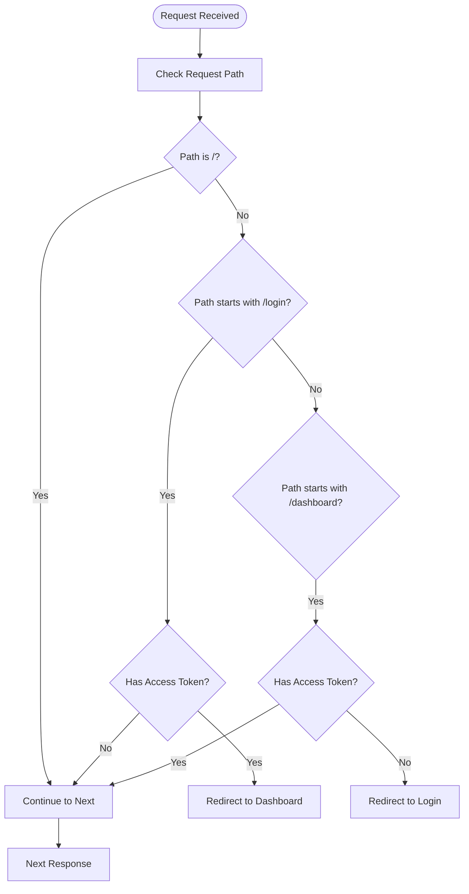
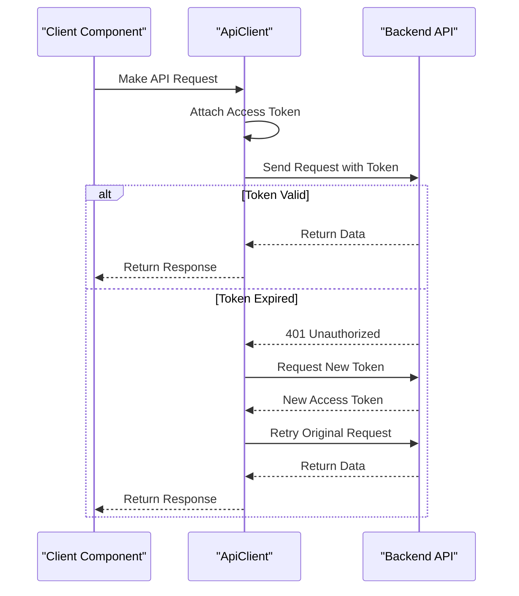

# Deployment & Configuration

<cite>
**Referenced Files in This Document**   
- [next.config.ts](file://next.config.ts)
- [tsconfig.json](file://tsconfig.json)
- [components.json](file://components.json)
- [package.json](file://package.json)
- [middleware.ts](file://src/middleware.ts)
- [api.ts](file://src/lib/api.ts)
- [cookies.ts](file://src/lib/cookies.ts)
- [README.md](file://README.md)
</cite>

## Table of Contents
1. [Introduction](#introduction)
2. [Core Configuration Files](#core-configuration-files)
3. [Build Process](#build-process)
4. [Environment Configuration](#environment-configuration)
5. [Deployment Platforms](#deployment-platforms)
6. [Common Deployment Issues](#common-deployment-issues)
7. [Performance Optimization](#performance-optimization)
8. [Monitoring and Logging](#monitoring-and-logging)
9. [Conclusion](#conclusion)

## Introduction
This document provides comprehensive guidance on deploying and configuring the cartwrightking-admin-erp application. It covers key configuration files, build processes, environment setup, deployment strategies across various platforms, and best practices for performance and monitoring. The application is built using Next.js 15 with React 19 and follows modern web development practices for enterprise-level administration systems.

## Core Configuration Files

### next.config.ts (Remote Patterns, Compiler Options)
The `next.config.ts` file contains essential configuration for image optimization and security. It defines remote patterns that allow the application to securely load images from external domains. The configuration permits images from "images.unsplash.com" over HTTPS and local development servers via HTTP on localhost.



**Diagram sources**
- [next.config.ts](file://next.config.ts#L1-L18)

**Section sources**
- [next.config.ts](file://next.config.ts#L1-L18)

### tsconfig.json (Type Checking Settings)
The `tsconfig.json` file configures TypeScript compilation with strict type checking enabled. It targets ES2017 and includes DOM libraries for browser compatibility. The configuration enables strict type checking, ES module resolution, and JSX preservation. It also sets up path aliases with `@/*` mapping to the `src/*` directory for cleaner imports.



**Diagram sources**
- [tsconfig.json](file://tsconfig.json#L1-L26)

**Section sources**
- [tsconfig.json](file://tsconfig.json#L1-L26)

### components.json (shadcn/ui Component Configuration)
The `components.json` file configures the shadcn/ui component library integration. It specifies the "new-york" style theme and enables React Server Components (RSC). The configuration points to the global CSS file and sets up aliases for common directories like components, utilities, and hooks. It uses Lucide icons as the default icon library.



**Diagram sources**
- [components.json](file://components.json#L1-L22)

**Section sources**
- [components.json](file://components.json#L1-L22)

### package.json (Scripts and Dependencies)
The `package.json` file defines the project metadata, dependencies, and scripts. It includes development scripts for running the application with Turbopack, building for production, and linting. The dependencies include Next.js 15.5.3, React 19.1.0, and various UI libraries including shadcn/ui components and Radix UI primitives. The project uses pnpm as the package manager.



**Diagram sources**
- [package.json](file://package.json#L1-L91)

**Section sources**
- [package.json](file://package.json#L1-L91)

## Build Process

### Building for Production
To build the application for production, execute the build script defined in package.json:

```bash
npm run build
```

or

```bash
pnpm run build
```

The build process uses Next.js with Turbopack to optimize assets, minify code, and generate static files. The output is placed in the `.next` directory. The build includes all pages, API routes, and static assets configured in the application.

The build process automatically handles:
- TypeScript compilation
- CSS optimization and minification
- Image optimization
- Code splitting and tree shaking
- Environment variable injection

**Section sources**
- [package.json](file://package.json#L7-L11)

### Environment-Specific Configurations
The application supports environment-specific configurations through environment variables. The API base URL is configurable via `NEXT_PUBLIC_API_BASE_URL`. When this variable is not set, the application defaults to using the Next.js API proxy at `/api`.

The middleware handles authentication and routing based on the current pathname and authentication state. It redirects users appropriately between login and dashboard pages based on their authentication status.



**Diagram sources**
- [middleware.ts](file://src/middleware.ts#L1-L45)
- [api.ts](file://src/lib/api.ts#L1-L10)

**Section sources**
- [middleware.ts](file://src/middleware.ts#L1-L45)
- [api.ts](file://src/lib/api.ts#L1-L10)

## Environment Configuration

### Environment Variables
The application uses environment variables for configuration. The primary environment variable is `NEXT_PUBLIC_API_BASE_URL`, which determines the backend API endpoint. This variable must be set during deployment to point to the appropriate backend service.

For local development, create a `.env.local` file:
```
NEXT_PUBLIC_API_BASE_URL=http://localhost:8000
```

For production deployments, set this variable in the hosting platform's environment configuration.

### API Endpoints
API endpoints are defined in `src/constants/api-routes.ts` and automatically typed using OpenAPI specifications. The API routes include authentication endpoints for token management and CRUD operations for various resources like branches, departments, and employees.

The API client in `src/lib/api.ts` handles authentication token attachment and refresh logic automatically. It intercepts requests to add the Authorization header and handles 401 responses by attempting token refresh.



**Diagram sources**
- [api.ts](file://src/lib/api.ts#L1-L50)
- [auth.ts](file://src/services/auth.ts#L1-L30)
- [api-routes.ts](file://src/constants/api-routes.ts#L1-L32)

**Section sources**
- [api.ts](file://src/lib/api.ts#L1-L50)
- [auth.ts](file://src/services/auth.ts#L1-L30)

### Security Headers
The application implements security through cookie-based authentication with CSRF protection. Authentication tokens are stored in HTTP-only cookies with SameSite=Lax setting to prevent XSS and CSRF attacks. The middleware validates authentication state on protected routes.

## Deployment Platforms

### Vercel Deployment
Vercel is the recommended deployment platform for this Next.js application. The repository includes a README section indicating Vercel as the preferred deployment method. Vercel provides seamless integration with Next.js features including serverless functions, edge networking, and automatic SSL.

To deploy on Vercel:
1. Push code to a Git repository
2. Import the project in Vercel dashboard
3. Set environment variables in project settings
4. Deploy from the connected branch

Vercel automatically detects the Next.js application and runs the build command specified in package.json.

**Section sources**
- [README.md](file://README.md#L31-L36)

### Netlify Deployment
Netlify can also host the application by configuring the build settings:
- Build command: `npm run build` or `pnpm run build`
- Publish directory: `.next`
- Node.js version: 18 or higher

Netlify functions can serve as the backend API endpoints, or the application can connect to an external API service.

### Custom Server Deployment
For custom server deployments, the application can be started using:
```bash
npm run start
```

This runs `next start` which serves the built application. The server should be configured to handle:
- Static file serving for `.next/static`
- API route proxying
- Proper MIME type configuration
- HTTPS termination

## Common Deployment Issues

### Static Asset Loading
Ensure that remote image patterns are correctly configured in `next.config.ts` for external images. The current configuration allows images from "images.unsplash.com" and localhost. Additional domains must be added to the remotePatterns array.

### Route Handling
The middleware handles authentication routing by redirecting unauthenticated users from admin pages to the login page, and authenticated users from the login page to the dashboard. The root path (/) is handled client-side.

The matcher configuration excludes API routes, static files, and image optimization paths from middleware processing.

**Section sources**
- [middleware.ts](file://src/middleware.ts#L35-L45)

### Hydration Errors
Hydration errors can occur when there is a mismatch between server-rendered and client-rendered content. To prevent these:
- Ensure all components are properly initialized
- Handle browser-specific APIs with conditional checks (`typeof window !== "undefined"`)
- Use React's useEffect for client-side only operations
- Verify that state is synchronized between server and client

The application already includes checks for window object availability in cookie and API handling code.

**Section sources**
- [api.ts](file://src/lib/api.ts#L40-L45)
- [cookies.ts](file://src/lib/cookies.ts#L1-L10)

## Performance Optimization

### Bundle Size Reduction
The application uses several techniques to minimize bundle size:
- Code splitting via Next.js dynamic imports
- Tree shaking through ES module imports
- Minification of JavaScript and CSS
- Image optimization with Next.js Image component

To further reduce bundle size:
- Analyze bundle composition using `next build --analyze`
- Lazy load non-critical components
- Optimize dependency usage
- Remove unused components and utilities

### Loading Strategies
The application implements efficient data loading strategies:
- Server-side rendering for initial page loads
- Client-side data fetching for dynamic content
- Pagination and caching for large datasets
- Suspense for loading states

The department table component implements server-side pagination with client-side caching to optimize performance when handling large numbers of records.

**Section sources**
- [departments-table.tsx](file://src/components/departments/departments-table.tsx#L31-L64)

## Monitoring and Logging

### Error Handling
The application includes comprehensive error handling in the API client. The ApiClient class handles token refresh automatically and queues requests during token refresh operations. Error boundaries should be implemented for critical components to prevent application crashes.

### Logging Recommendations
For production environments, implement logging for:
- API request/response cycles
- Authentication events
- Error tracking
- Performance metrics

Integrate with monitoring services like Sentry, LogRocket, or Datadog for comprehensive observability. Configure error tracking to capture:
- Unhandled promise rejections
- Console errors
- Network request failures
- Component rendering errors

The application already includes console logging for authentication and token refresh operations.

**Section sources**
- [api.ts](file://src/lib/api.ts#L70-L116)
- [auth-context.tsx](file://src/contexts/auth-context.tsx#L77-L80)

## Conclusion
The cartwrightking-admin-erp application is configured for efficient deployment and optimal performance. By following the configuration guidelines and deployment best practices outlined in this document, the application can be successfully deployed to various hosting platforms while maintaining security, performance, and reliability. Regular monitoring and performance optimization should be conducted in production environments to ensure optimal user experience.