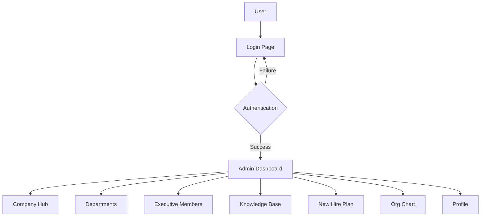
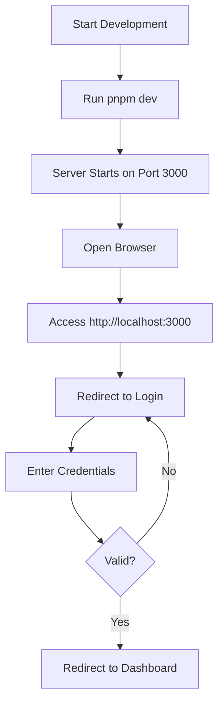
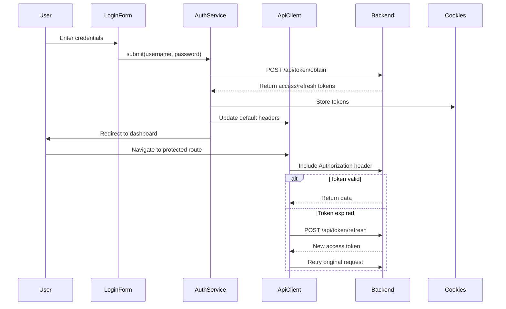

# Getting Started

<cite>
**Referenced Files in This Document**   
- [README.md](file://README.md)
- [package.json](file://package.json)
- [next.config.ts](file://next.config.ts)
- [src/app/(auth)/login/page.tsx](file://src/app/(auth)/login/page.tsx)
- [src/components/auth/login-form.tsx](file://src/components/auth/login-form.tsx)
- [src/hooks/queries/use-auth.ts](file://src/hooks/queries/use-auth.ts)
- [src/services/auth.ts](file://src/services/auth.ts)
- [src/lib/api-caller.ts](file://src/lib/api-caller.ts)
- [src/lib/api.ts](file://src/lib/api.ts)
- [src/lib/cookies.ts](file://src/lib/cookies.ts)
- [src/contexts/auth-context.tsx](file://src/contexts/auth-context.tsx)
- [src/components/auth/auth-guard.tsx](file://src/components/auth/auth-guard.tsx)
- [src/app/(auth)/layout.tsx](file://src/app/(auth)/layout.tsx)
- [src/app/(admin)/layout.tsx](file://src/app/(admin)/layout.tsx)
- [src/app/(admin)/dashboard/page.tsx](file://src/app/(admin)/dashboard/page.tsx)
</cite>

## Table of Contents
1. [Introduction](#introduction)
2. [System Overview](#system-overview)
3. [Prerequisites](#prerequisites)
4. [Development Environment Setup](#development-environment-setup)
5. [Running the Application](#running-the-application)
6. [Authentication Flow](#authentication-flow)
7. [Navigation Structure](#navigation-structure)
8. [Common Setup Issues](#common-setup-issues)
9. [Performance and Debugging Tips](#performance-and-debugging-tips)

## Introduction

This document provides a comprehensive guide for setting up and running the cartwrightking-admin-erp application. It covers the initial setup, authentication mechanisms, navigation patterns, and troubleshooting common issues encountered during development.

**Section sources**
- [README.md](file://README.md)

## System Overview

The cartwrightking-admin-erp is a Next.js-based admin ERP system designed for enterprise resource planning and management. The application features a modular architecture with distinct administrative sections including company hub, departments, executive members, knowledge base, new hire plans, and organizational charts. The system implements role-based access control and uses a client-side authentication mechanism with token persistence via cookies.

The application follows the App Router pattern in Next.js 15, with route groups used to separate authenticated admin routes from authentication flows. Key technologies include React 19, TypeScript, TanStack Query for data fetching, and Tailwind CSS for styling.



**Diagram sources**
- [src/app/(auth)/login/page.tsx](file://src/app/(auth)/login/page.tsx)
- [src/app/(admin)/dashboard/page.tsx](file://src/app/(admin)/dashboard/page.tsx)

## Prerequisites

Before setting up the development environment, ensure you have the following prerequisites:

- **Node.js**: Version 18 or higher
- **pnpm**: Package manager (version 8 or higher recommended)
- **TypeScript**: Fundamental knowledge required for development
- **Next.js**: Understanding of App Router, Server Components, and client-side rendering
- **React**: Proficiency in React 19 features including hooks and component patterns
- **Browser Developer Tools**: For debugging and performance analysis

The application uses modern JavaScript/TypeScript features and assumes familiarity with asynchronous programming, REST APIs, and state management patterns.

**Section sources**
- [package.json](file://package.json)
- [tsconfig.json](file://tsconfig.json)

## Development Environment Setup

To set up the development environment for the cartwrightking-admin-erp application, follow these steps:

1. **Install Node.js**: Download and install Node.js (version 18 or higher) from the official website.

2. **Install pnpm**: Install the pnpm package manager globally:
   ```bash
   npm install -g pnpm
   ```

3. **Clone the repository**: Obtain the source code from the repository.

4. **Install dependencies**: Navigate to the project root directory and install all required packages:
   ```bash
   pnpm install
   ```

5. **Environment configuration**: Create a `.env.local` file in the project root to define environment variables. At minimum, configure:
   ```
   NEXT_PUBLIC_API_BASE_URL=http://localhost:8000
   ```

6. **TypeScript setup**: The project includes a `tsconfig.json` file with appropriate configurations. No additional setup is required.

7. **Build the API types**: Generate TypeScript types from the backend API schema:
   ```bash
   pnpm types:api
   ```

The application is configured to work with Vercel deployment, but can be run locally with the development server.

**Section sources**
- [package.json](file://package.json)
- [next.config.ts](file://next.config.ts)
- [README.md](file://README.md)

## Running the Application

The application can be run in development or production modes using the following commands:

**Development Mode**:
```bash
pnpm dev
```
This starts the Next.js development server with Turbopack, enabling hot module replacement and fast refresh. The application will be available at `http://localhost:3000`.

**Production Mode**:
```bash
pnpm build
pnpm start
```
The build command compiles the application for production, and the start command runs the optimized server.

**Linting**:
```bash
pnpm lint
```
Runs ESLint to check code quality and adherence to coding standards.

After starting the development server, navigate to `http://localhost:3000` to access the application. The login page is the entry point for authenticated users.



**Diagram sources**
- [package.json](file://package.json)
- [src/app/(auth)/layout.tsx](file://src/app/(auth)/layout.tsx)

## Authentication Flow

The authentication system in cartwrightking-admin-erp implements a token-based authentication mechanism with automatic token refresh capabilities. The flow begins at the login page, where users enter their credentials.

The login form component (`LoginForm`) captures username and password inputs, validates them using Zod, and submits the credentials to the authentication service. Upon successful authentication, the access and refresh tokens are stored in cookies using the `setAuthCookies` function.

The `api` instance in `src/lib/api.ts` includes request and response interceptors that automatically attach the access token to outgoing requests and handle 401 responses by attempting to refresh the token. This ensures seamless authentication without requiring users to log in repeatedly.

The `AuthContext` provides authentication state to the entire application, while the `AuthGuard` component protects routes by redirecting unauthenticated users to the login page and authenticated users away from authentication routes.



**Diagram sources**
- [src/components/auth/login-form.tsx](file://src/components/auth/login-form.tsx)
- [src/services/auth.ts](file://src/services/auth.ts)
- [src/lib/api.ts](file://src/lib/api.ts)
- [src/contexts/auth-context.tsx](file://src/contexts/auth-context.tsx)

## Navigation Structure

The application implements a clear navigation structure using Next.js App Router with route groups. The `(auth)` route group contains authentication-related pages, while the `(admin)` group contains all authenticated administrative interfaces.

The `AuthLayout` wraps authentication pages and includes the `AuthGuard` with `requireAuth={false}` to prevent authenticated users from accessing login pages. Conversely, the `AdminLayout` protects all admin routes with `AuthGuard` set to `requireAuth={true}`.

The admin layout includes a sidebar navigation component (`AdminSidebar`) and top navigation bar (`AdminTopbar