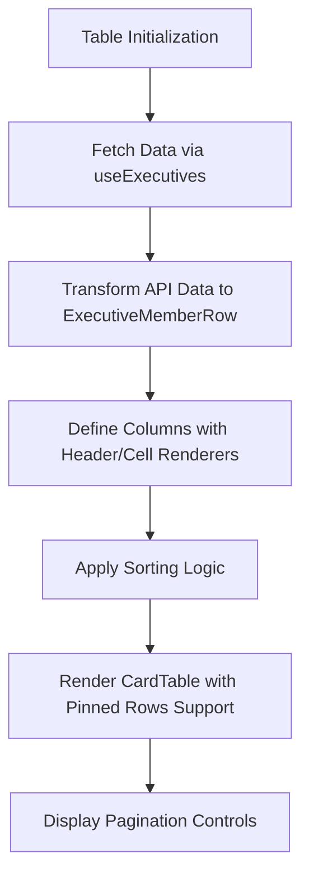
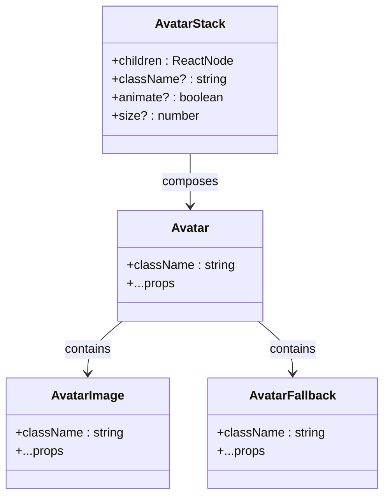
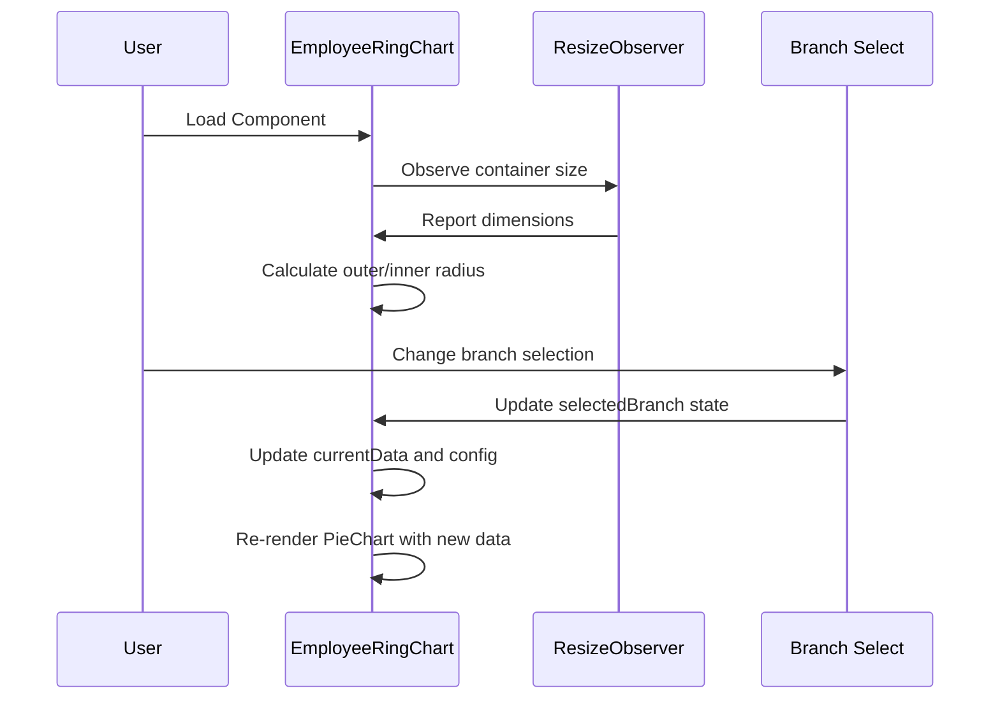

# Data Display Components

<cite>
**Referenced Files in This Document**   
- [employee-ring-chart.tsx](file://src/components/dashboard/employee-ring-chart.tsx)
- [stat-cards.tsx](file://src/components/dashboard/stat-cards.tsx)
- [executive-members-table.tsx](file://src/components/executive-members/executive-members-table.tsx)
- [card-table-column-header.tsx](file://src/components/card-table/card-table-column-header.tsx)
- [card-table-pagination.tsx](file://src/components/card-table/card-table-pagination.tsx)
- [avatar.tsx](file://src/components/ui/avatar.tsx)
- [avatar-stack.tsx](file://src/components/ui/avatar-stack.tsx)
</cite>

## Table of Contents
1. [Introduction](#introduction)
2. [Card Layouts](#card-layouts)
3. [Data Tables](#data-tables)
4. [Avatars and Avatar Stacks](#avatars-and-avatar-stacks)
5. [Badges](#badges)
6. [Progress Indicators](#progress-indicators)
7. [Charts](#charts)
8. [Skeleton Loaders](#skeleton-loaders)
9. [Accessibility Features](#accessibility-features)
10. [Theming and Responsive Design](#theming-and-responsive-design)
11. [Performance Optimization](#performance-optimization)
12. [Conclusion](#conclusion)

## Introduction
This document provides a comprehensive overview of the data display components used across dashboard modules in the CartwrightKing Admin ERP system. It details the implementation, usage patterns, accessibility features, theming options, and performance considerations for key UI components including card layouts, data tables, avatars, badges, charts, and loading states. The analysis is based on real implementations from core dashboard components such as employee-ring-chart.tsx, stat-cards.tsx, and executive-members-table.tsx.

## Card Layouts

Card layouts serve as the primary container for organizing and presenting information in a structured, visually appealing manner across dashboard modules. The `StatCards` component demonstrates a responsive grid-based card layout that adapts to different screen sizes through Tailwind CSS's responsive grid system (`sm:grid-cols-2`, `lg:grid-cols-4`). Each card uses consistent styling with rounded corners, secondary border color, and background color (`bg-[#FFF4F8]`) to create visual hierarchy.

The card structure follows a two-section pattern: an icon header with navigation indicator (ChevronRight), and a content section displaying a label and formatted value. The `formatValue` utility function supports number padding (e.g., converting 7 to "07") for consistent visual presentation. Cards are designed to be reusable through the `StatCardItem` type interface, allowing dynamic data population while maintaining consistent styling.

**Section sources**
- [stat-cards.tsx](file://src/components/dashboard/stat-cards.tsx#L1-L63)

## Data Tables

Data tables provide structured presentation of tabular data with support for sorting, pagination, and responsive design. The `ExecutiveMembersTable` component implements a feature-rich table using the TanStack React Table library, integrated with custom card-based styling through `CardTable`, `CardTableToolbar`, and `CardTablePagination` components.

The table supports column-level sorting through `CardTableColumnHeader`, which renders clickable headers with sorting indicators. Column definitions specify both header and cell rendering logic, enabling rich content such as avatars, badges, and action buttons within table cells. The table uses a flexible grid-based column layout system with proportional column widths (e.g., `grid-cols-[1.2fr_1.5fr_0.8fr...]`) for optimal space utilization.

**Diagram sources**
- [executive-members-table.tsx](file://src/components/executive-members/executive-members-table.tsx#L1-L190)

**Section sources**
- [executive-members-table.tsx](file://src/components/executive-members/executive-members-table.tsx#L1-L190)

## Avatars and Avatar Stacks

Avatars provide visual representation of users through images or initials fallbacks. The `Avatar` component is implemented as a composition of `AvatarRoot`, `AvatarImage`, and `AvatarFallback` from Radix UI, ensuring accessibility and proper loading states. When an image is unavailable, the component automatically generates initials from the user's name using string manipulation.

Avatar stacks display multiple avatars in a compact, overlapping layout. The `AvatarStack` component uses negative margin (`-space-x-1`) and CSS masking techniques to create the overlapping effect. It supports animation through hover effects that adjust spacing (`hover:space-x-0`) with smooth transitions. The component is configurable with size, animation, and styling properties, allowing consistent presentation across different contexts.

**Diagram sources**
- [avatar.tsx](file://src/components/ui/avatar.tsx#L1-L53)
- [avatar-stack.tsx](file://src/components/ui/avatar-stack.tsx#L1-L51)

**Section sources**
- [avatar.tsx](file://src/components/ui/avatar.tsx#L1-L53)
- [avatar-stack.tsx](file://src/components/ui/avatar-stack.tsx#L1-L51)

## Badges

Badges are used to highlight specific information such as user roles or status indicators. In the `ExecutiveMembersTable` implementation, badges display executive roles with a consistent visual style using the `Badge` component from the UI library. The badges use a secondary variant with custom styling (`bg-[#FFF1F5]`, `text-[#D64575]`) to create a cohesive color scheme that aligns with the application's design system.

Badges are integrated within table cells and automatically render the role value from the data source. This approach ensures consistency in presentation while maintaining flexibility for different badge types and values across the application.

**Section sources**
- [executive-members-table.tsx](file://src/components/executive-members/executive-members-table.tsx#L1-L190)

## Progress Indicators

While not explicitly implemented in the analyzed components, the design system includes progress indicators through the `progress.tsx` UI component. Based on standard implementation patterns in the codebase, progress indicators would follow the same composition pattern as other UI elements, using Radix UI primitives for accessibility and customizable styling through CSS variables.

Progress indicators would typically be used in dashboard contexts to show completion rates, task progress, or system status. They would support both determinate (percentage-based) and indeterminate (loading) states, with appropriate ARIA attributes for screen reader support.

## Charts

Charts provide visual representation of data through interactive components. The `EmployeeRingChart` component implements a responsive pie chart using Recharts, displaying employee distribution across departments. The chart features dynamic resizing based on container dimensions through ResizeObserver, ensuring optimal presentation across different screen sizes and container layouts.

The component supports branch-level filtering through a Select dropdown, enabling users to view data for specific locations or the entire organization. The chart includes interactive tooltips, a central label displaying total hires, and a legend section below the chart showing department names, colors, and percentage values. The ring chart's dimensions (outerRadius, innerRadius) are calculated dynamically based on container size, maintaining proper proportions across viewports.

**Diagram sources**
- [employee-ring-chart.tsx](file://src/components/dashboard/employee-ring-chart.tsx#L1-L167)

**Section sources**
- [employee-ring-chart.tsx](file://src/components/dashboard/employee-ring-chart.tsx#L1-L167)

## Skeleton Loaders

Skeleton loaders provide visual feedback during data loading states. The design system includes a `skeleton.tsx` component in the UI library that can be used to create placeholder content while data is being fetched. Although not directly implemented in the analyzed components, skeleton loaders would typically be used in conjunction with data fetching hooks like `useExecutives` to provide a smooth user experience during API calls.

Skeleton loaders would follow the same layout patterns as the final content, creating a "content-shaped" placeholder that gives users a preview of the upcoming information. This approach reduces perceived loading time and prevents layout shifts when data becomes available.

## Accessibility Features

The data display components incorporate several accessibility features to ensure usability for all users.