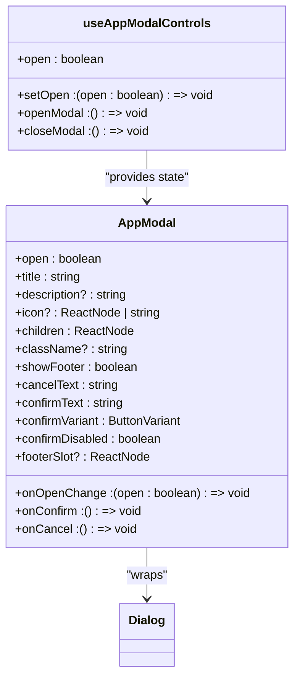
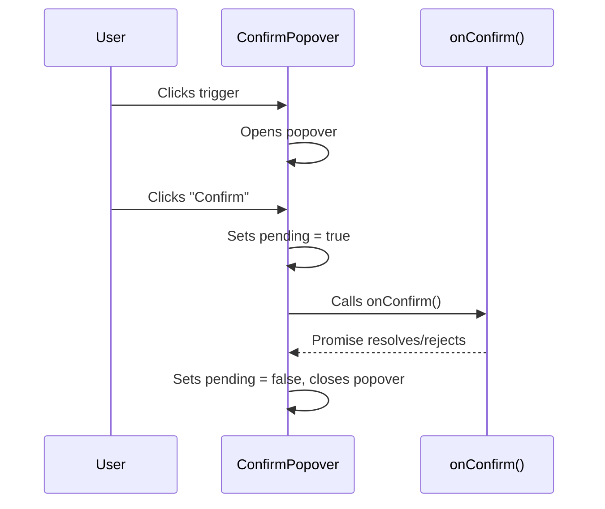
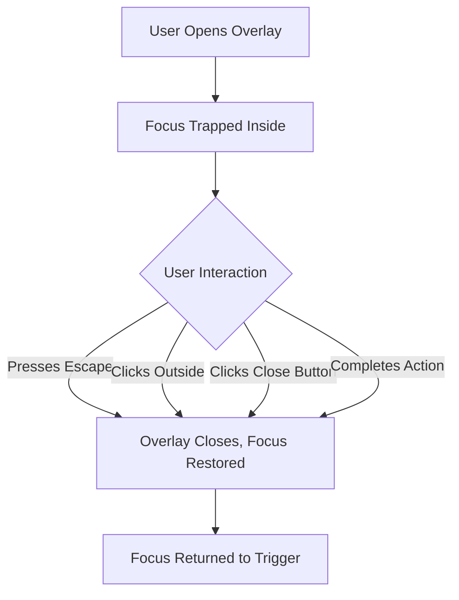
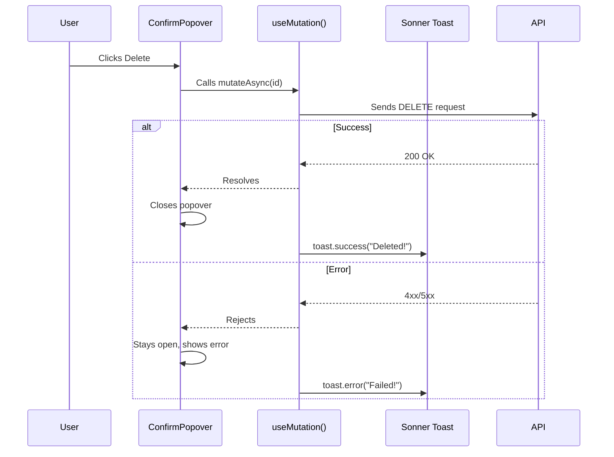

# Feedback & Overlay Components

<cite>
**Referenced Files in This Document**   
- [app-modal.tsx](file://src/components/common/app-modal.tsx)
- [confirm-popover.tsx](file://src/components/common/confirm-popover.tsx)
- [sonner.tsx](file://src/components/ui/sonner.tsx)
- [use-departments.ts](file://src/hooks/queries/use-departments.ts)
- [departments-table.tsx](file://src/components/departments/departments-table.tsx)
- [executive-members-table.tsx](file://src/components/executive-members/executive-members-table.tsx)
</cite>

## Table of Contents
1. [Introduction](#introduction)
2. [Core Overlay Components](#core-overlay-components)
3. [AppModal: Custom Modal Wrapper](#appmodal-custom-modal-wrapper)
4. [ConfirmPopover: Inline Confirmation Pattern](#confirmpopover-inline-confirmation-pattern)
5. [Lifecycle and Trigger Mechanisms](#lifecycle-and-trigger-mechanisms)
6. [Animation and Transition Behavior](#animation-and-transition-behavior)
7. [Accessibility Features](#accessibility-features)
8. [Integration with React Query and Sonner](#integration-with-react-query-and-sonner)
9. [Usage in Data Tables: Delete Confirmation Flows](#usage-in-data-tables-delete-confirmation-flows)
10. [Stacking Context and Mobile Adaptation](#stacking-context-and-mobile-adaptation)

## Introduction
This document provides comprehensive documentation for UI components that deliver user feedback and overlay content within the CartwrightKing Admin ERP system. It focuses on modal dialogs, confirmation popovers, and toast notifications, detailing their implementation, integration patterns, accessibility features, and usage in critical workflows such as data deletion. The `AppModal` and `ConfirmPopover` components serve as primary examples of custom wrappers around base shadcn/ui primitives, enhancing reusability and consistency across the application.

## Core Overlay Components

The system utilizes a layered approach to user feedback and overlay content, employing distinct components for different interaction patterns:

- **Alerts**: For inline, non-blocking status messages.
- **Dialogs/Modals**: For focused, blocking interactions requiring user input.
- **Drawers/Sheets**: For sliding panels, typically on mobile or for form-heavy workflows.
- **Popovers**: For contextual, non-modal floating content.
- **Toasts**: For transient, system-generated notifications.
- **Tooltips**: For supplementary information on hover or focus.

Primary implementations are built using Radix UI primitives and styled via shadcn/ui, ensuring accessibility and consistency.

**Section sources**
- [app-modal.tsx](file://src/components/common/app-modal.tsx#L1-L113)
- [confirm-popover.tsx](file://src/components/common/confirm-popover.tsx#L1-L59)
- [sonner.tsx](file://src/components/ui/sonner.tsx#L1-L22)

## AppModal: Custom Modal Wrapper

The `AppModal` component is a reusable wrapper around the shadcn/ui `Dialog` primitive, standardizing the appearance and behavior of modal dialogs across the application. It accepts a comprehensive set of props to control its content, actions, and visual presentation.

Key features include:
- **Header with Icon**: Supports custom icons (React elements or image paths) for visual context.
- **Scrollable Content Area**: Content is constrained to 65vh with overflow scrolling.
- **Configurable Footer**: Optional footer with customizable button text, variants, and disabled states.
- **Flexible Footer Slot**: Allows for completely custom footer content via the `footerSlot` prop.
- **Controlled State**: Uses the `open` and `onOpenChange` pattern for external state management.

A companion hook, `useAppModalControls`, provides a convenient way to manage the modal's open state with `openModal` and `closeModal` functions.

**Diagram sources**
- [app-modal.tsx](file://src/components/common/app-modal.tsx#L36-L105)
- [app-modal.tsx](file://src/components/common/app-modal.tsx#L108-L113)

**Section sources**
- [app-modal.tsx](file://src/components/common/app-modal.tsx#L36-L113)

## ConfirmPopover: Inline Confirmation Pattern

The `ConfirmPopover` component provides a lightweight, inline confirmation mechanism, ideal for destructive actions like deletions. It wraps the shadcn/ui `Popover` primitive and manages its own internal state (`open`, `pending`).

Key features include:
- **Trigger as Child**: The component uses `asChild` on the `PopoverTrigger`, allowing any element (e.g., a button) to be passed as the trigger.
- **Pending State**: Disables the confirm button and displays a "Working..." message during the asynchronous `onConfirm` callback.
- **Accessibility**: The trigger is wrapped in a `` with `aria-disabled` to properly convey its state.
- **Alignment**: The popover content is aligned to the "end" of the trigger for a consistent placement.

**Diagram sources**
- [confirm-popover.tsx](file://src/components/common/confirm-popover.tsx#L16-L59)

**Section sources**
- [confirm-popover.tsx](file://src/components/common/confirm-popover.tsx#L16-L59)

## Lifecycle and Trigger Mechanisms

Overlay components follow a predictable lifecycle controlled by state and user interaction.

- **AppModal**: Uses a controlled pattern. The parent component manages the `open` state, typically via `useAppModalControls`. The modal is triggered by calling `openModal()`, and dismissed by clicking the close button, the overlay, or pressing Escape.
- **ConfirmPopover**: Uses an uncontrolled pattern with internal state. The popover opens when the trigger is clicked and closes when the user clicks "Cancel," "Confirm," or outside the popover. The `disabled` prop prevents the trigger from opening the popover.

Both components integrate with React's state management to ensure smooth rendering and reactivity.

**Section sources**
- [app-modal.tsx](file://src/components/common/app-modal.tsx#L36-L105)
- [confirm-popover.tsx](file://src/components/common/confirm-popover.tsx#L16-L59)

## Animation and Transition Behavior

All overlay components inherit their animation behavior from the underlying Radix UI primitives, which are powered by CSS transitions defined in the application's Tailwind configuration.

- **Dialog/Modal**: Enters with a `scale-95` to `scale-100` transform and a fade-in opacity transition. Exits with the reverse animation.
- **Popover**: Slides in from the top with a small translateY and fades in. The transition is smooth and non-intrusive.
- **Sonner Toasts**: Slide in from the right (or bottom on mobile) with a fade-in effect and slide out on dismissal.

These animations are defined in the shadcn/ui component implementations and are not customized in the application code, ensuring a consistent feel.

## Accessibility Features

The components prioritize accessibility through the following features:

- **Focus Trapping**: Both `Dialog` and `Popover` automatically trap focus within their content when open, ensuring keyboard navigation remains within the overlay.
- **Escape Key Dismissal**: Pressing the `Escape` key closes both modals and popovers, providing a standard keyboard interaction.
- **ARIA Attributes**: The components use appropriate ARIA roles (`dialog`, `alertdialog`, `tooltip`) and labels (`aria-labelledby`, `aria-describedby`) to convey their purpose to screen readers.
- **Semantic Structure**: The `AppModal` uses `DialogHeader`, `DialogTitle`, and `DialogDescription` to create a clear information hierarchy.
- **Visual Indicators**: The `ConfirmPopover` uses the `destructive` button variant for the confirm action, providing a clear visual cue for dangerous operations.

**Diagram sources**
- [app-modal.tsx](file://src/components/common/app-modal.tsx#L36-L105)
- [confirm-popover.tsx](file://src/components/common/confirm-popover.tsx#L16-L59)

**Section sources**
- [app-modal.tsx](file://src/components/common/app-modal.tsx#L36-L105)
- [confirm-popover.tsx](file://src/components/common/confirm-popover.tsx#L16-L59)

## Integration with React Query and Sonner

The feedback system is tightly integrated with data mutation and notification patterns.

- **React Query Mutations**: Components like `useDeleteDepartment` return a `useMutation` object. The `onConfirm` handler in a `ConfirmPopover` is typically set to the `mutateAsync` function of this mutation.
- **Success/Error Feedback**: Upon mutation success or failure, the application uses the `sonner` library to display toast notifications. The `Toaster` component, configured in `sonner.tsx`, renders these toasts with theming that matches the application's design system.

This pattern ensures that users receive immediate, non-blocking feedback on the outcome of their actions.

**Diagram sources**
- [use-departments.ts](file://src/hooks/queries/use-departments.ts#L64-L72)
- [sonner.tsx](file://src/components/ui/sonner.tsx#L5-L22)

**Section sources**
- [use-departments.ts](file://src/hooks/queries/use-departments.ts#L64-L72)
- [sonner.tsx](file://src/components/ui/sonner.tsx#L5-L22)

## Usage in Data Tables: Delete Confirmation Flows

The `ConfirmPopover` is extensively used in data tables for safe deletion of records.

- **Departments Table**: The `departments-table.tsx` component renders a delete button for each row. This button is wrapped in a `ConfirmPopover`, with its `onConfirm` handler linked to the `useDeleteDepartment` mutation.
- **Executive Members Table**: Similarly, the `executive-members-table.tsx` uses `ConfirmPopover` for member deletion, ensuring irreversible actions require explicit confirmation.

This pattern prevents accidental data loss and provides a consistent user experience across different data management views.

**Section sources**
- [departments-table.tsx](file://src/components/departments/departments-table.tsx)
- [executive-members-table.tsx](file://src/components/executive-members/executive-members-table.tsx)

## Stacking Context and Mobile Adaptation

The application manages visual hierarchy and adapts overlays for mobile devices.

- **Stacking Context**: The use of Tailwind's `z-index` utilities (`z-50`, `z-40`) ensures that overlays appear above the main content and navigation elements. The `Dialog` and `Popover` components are rendered at appropriate z-levels to prevent being obscured.
- **Mobile Adaptation**: On mobile, the `AppModal`'s `max-w-[680px]` class ensures it scales appropriately. The `sonner` toasts are configured to stack and are positioned in a way that does not obstruct critical UI elements on smaller screens. The `ConfirmPopover` remains functional, though its placement logic (`align="end"`) may be adjusted in future mobile-optimized versions.

These considerations ensure a usable and visually coherent experience across all device sizes.

**Section sources**
- [app-modal.tsx](file://src/components/common/app-modal.tsx#L36-L105)
- [sonner.tsx](file://src/components/ui/sonner.tsx#L5-L22)