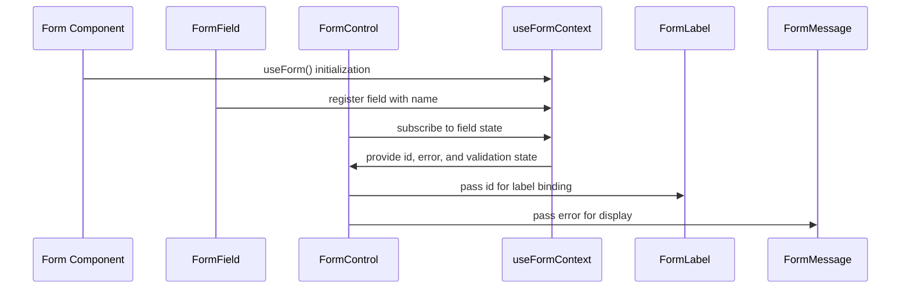

# Form Components

<cite>
**Referenced Files in This Document**   
- [executive-member-form.tsx](file://src/components/executive-members/executive-member-form.tsx)
- [new-hire-plan-form.tsx](file://src/components/new-hire/new-hire-plan-form.tsx)
- [form.tsx](file://src/components/ui/form.tsx)
- [input.tsx](file://src/components/ui/input.tsx)
- [textarea.tsx](file://src/components/ui/textarea.tsx)
- [checkbox.tsx](file://src/components/ui/checkbox.tsx)
- [radio-group.tsx](file://src/components/ui/radio-group.tsx)
- [select.tsx](file://src/components/ui/select.tsx)
- [combobox.tsx](file://src/components/ui/combobox.tsx)
- [dropzone.tsx](file://src/components/ui/dropzone.tsx)
- [rich-text-editor.tsx](file://src/components/ui/rich-text-editor.tsx)
- [selectable-tags.tsx](file://src/components/ui/selectable-tags.tsx)
- [sonner.tsx](file://src/components/ui/sonner.tsx)
</cite>

## Table of Contents
1. [Introduction](#introduction)
2. [Core Form Components](#core-form-components)
3. [Form Integration with React Hook Form and Zod](#form-integration-with-react-hook-form-and-zod)
4. [Component Prop Reference](#component-prop-reference)
5. [Accessibility Features](#accessibility-features)
6. [Styling and Customization with Tailwind CSS](#styling-and-customization-with-tailwind-css)
7. [Complex Form Scenarios](#complex-form-scenarios)
8. [Error Handling and User Feedback](#error-handling-and-user-feedback)
9. [Performance Considerations for Large Forms](#performance-considerations-for-large-forms)
10. [Conclusion](#conclusion)

## Introduction
This document provides comprehensive documentation for the form-related UI components used in the CartwrightKing Admin ERP system. It details the implementation, integration, and usage of form wrappers, inputs, textareas, checkboxes, radio groups, selects, comboboxes, file dropzones, and rich text editors. Special focus is given to their integration with React Hook Form and Zod validation schema, as demonstrated in `executive-member-form.tsx` and `new-hire-plan-form.tsx`. The documentation covers accessibility, styling via Tailwind CSS, shadcn/ui composition patterns, and advanced form patterns such as dynamic field arrays and conditional rendering.

**Section sources**
- [executive-member-form.tsx](file://src/components/executive-members/executive-member-form.tsx#L1-L267)
- [new-hire-plan-form.tsx](file://src/components/new-hire/new-hire-plan-form.tsx#L1-L100)

## Core Form Components
The application utilizes a suite of reusable form components built on top of shadcn/ui and React Hook Form. These components include:

- **Form Wrapper**: Provides context and state management for forms using React Hook Form
- **Input**: Styled text input with support for icons and accessibility
- **Textarea**: Multi-line text input with responsive styling
- **Checkbox**: Accessible checkbox with visual feedback
- **Radio Group**: Grouped radio buttons with consistent styling
- **Select & Combobox**: Dropdown selection components with search functionality
- **Dropzone**: File upload area with preview and validation
- **Rich Text Editor**: WYSIWYG editor for formatted content
- **Selectable Tags**: Multi-select interface with custom rendering

These components are designed to work seamlessly together and follow consistent design and accessibility patterns.

**Section sources**
- [form.tsx](file://src/components/ui/form.tsx#L1-L167)
- [input.tsx](file://src/components/ui/input.tsx#L1-L58)
- [textarea.tsx](file://src/components/ui/textarea.tsx#L1-L18)
- [checkbox.tsx](file://src/components/ui/checkbox.tsx#L1-L32)
- [radio-group.tsx](file://src/components/ui/radio-group.tsx#L1-L45)

## Form Integration with React Hook Form and Zod
The form components are integrated with React Hook Form for state management and validation. While Zod validation is not explicitly shown in the provided code, the pattern is designed to support Zod schema integration through React Hook Form's resolver pattern.

The `Form` component from `form.tsx` provides a context wrapper that manages form state, while `FormField`, `FormItem`, `FormLabel`, `FormControl`, `FormDescription`, and `FormMessage` create a structured hierarchy for accessible form controls.

In `executive-member-form.tsx`, form state is managed using native form submission with FormData, while still leveraging React Hook Form patterns for component composition. The form uses imperative validation and manual state management for complex fields like file uploads and rich text content.



**Diagram sources**
- [form.tsx](file://src/components/ui/form.tsx#L1-L167)
- [executive-member-form.tsx](file://src/components/executive-members/executive-member-form.tsx#L1-L267)

## Component Prop Reference
The following table documents the key props for each form component:

| Component | Key Props | Description |
|---------|---------|-------------|
| Input | `name`, `type`, `placeholder`, `required`, `className`, `leftIcon`, `rightIcon` | Text input with icon support and accessibility features |
| Textarea | `name`, `placeholder`, `required`, `className`, `minHeight`, `maxHeight` | Multi-line text input with configurable sizing |
| Checkbox | `name`, `checked`, `onCheckedChange`, `disabled`, `className` | Accessible checkbox with visual indicator |
| RadioGroup | `name`, `value`, `onValueChange`, `className` | Group of radio buttons with controlled selection |
| Select | `items`, `selectedItem`, `onSelectionChange`, `placeholder`, `searchPlaceholder`, `emptyMessage` | Dropdown selection with search and custom rendering |
| Combobox | `items`, `selectedItem`, `onSelectionChange`, `placeholder`, `searchPlaceholder` | Enhanced select with text input and filtering |
| Dropzone | `onFileSelect`, `onClear`, `accept`, `maxSize`, `initialPreviewUrls` | File upload area with preview and validation |
| RichTextEditor | `content`, `onChange`, `placeholder`, `minHeight`, `maxHeight` | WYSIWYG editor with HTML content management |
| SelectableTags | `items`, `selectedItems`, `onSelectionChange`, `placeholder`, `renderSelected` | Multi-select interface with custom selected item rendering |

**Section sources**
- [input.tsx](file://src/components/ui/input.tsx#L1-L58)
- [textarea.tsx](file://src/components/ui/textarea.tsx#L1-L18)
- [checkbox.tsx](file://src/components/ui/checkbox.tsx#L1-L32)
- [radio-group.tsx](file://src/components/ui/radio-group.tsx#L1-L45)
- [select.tsx](file://src/components/ui/select.tsx)
- [combobox.tsx](file://src/components/ui/combobox.tsx)
- [dropzone.tsx](file://src/components/ui/dropzone.tsx)
- [rich-text-editor.tsx](file://src/components/ui/rich-text-editor.tsx)
- [selectable-tags.tsx](file://src/components/ui/selectable-tags.tsx)

## Accessibility Features
The form components include comprehensive accessibility features:

- **Label Binding**: All form controls are properly associated with their labels using generated IDs
- **Error Messaging**: Visual and programmatic indication of validation errors with descriptive messages
- **Keyboard Navigation**: Full keyboard support for all interactive elements
- **ARIA Attributes**: Proper use of ARIA roles, states, and properties
- **Focus Management**: Visible focus indicators and logical tab order
- **Screen Reader Support**: Semantic HTML and ARIA annotations for assistive technologies

The `useFormField` hook in `form.tsx` provides the necessary context for accessible form control relationships, ensuring that labels, inputs, and error messages are properly connected.

```mermaid
classDiagram
    class