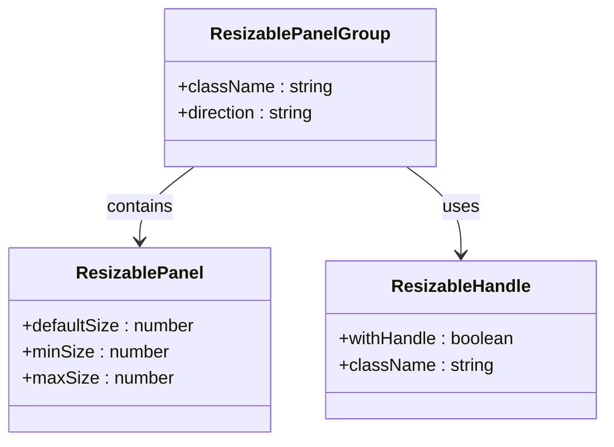
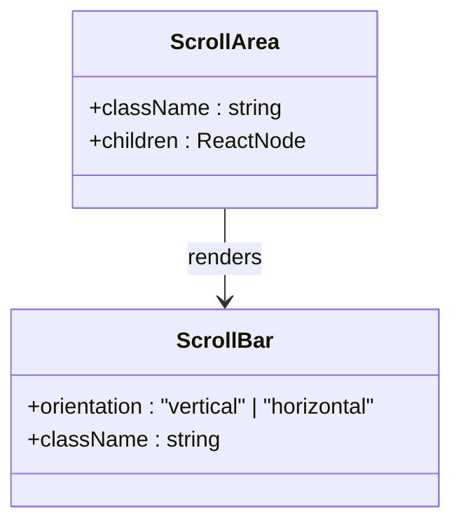
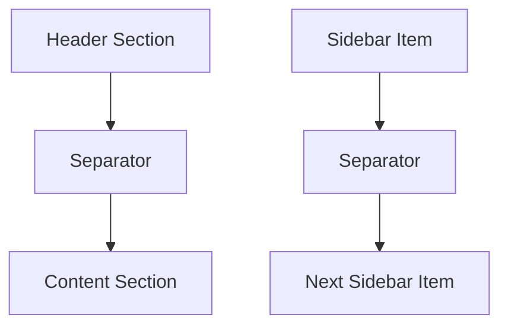
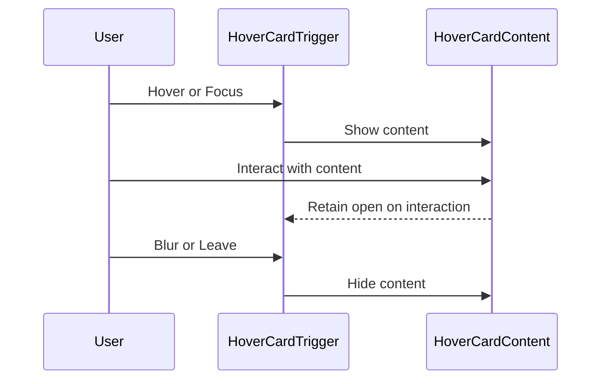
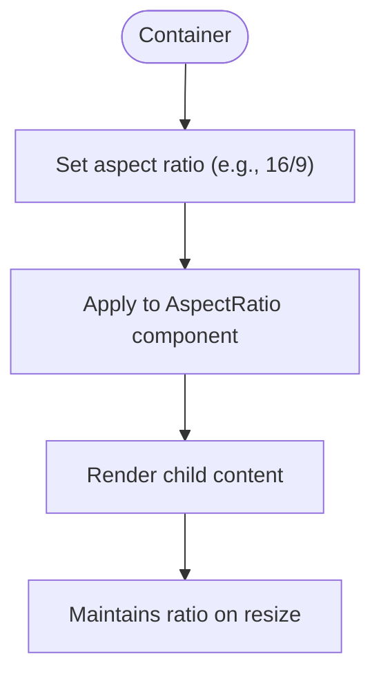
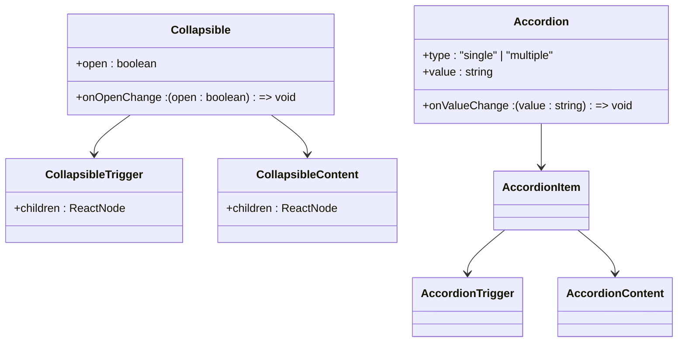
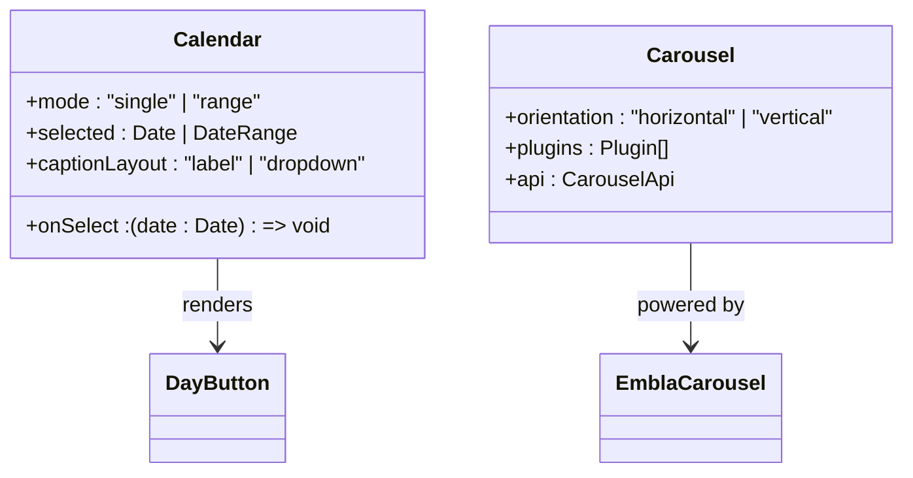
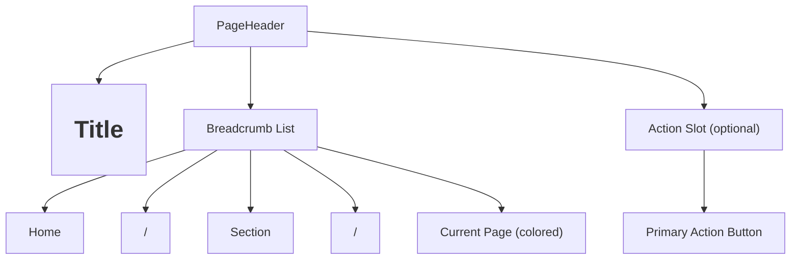
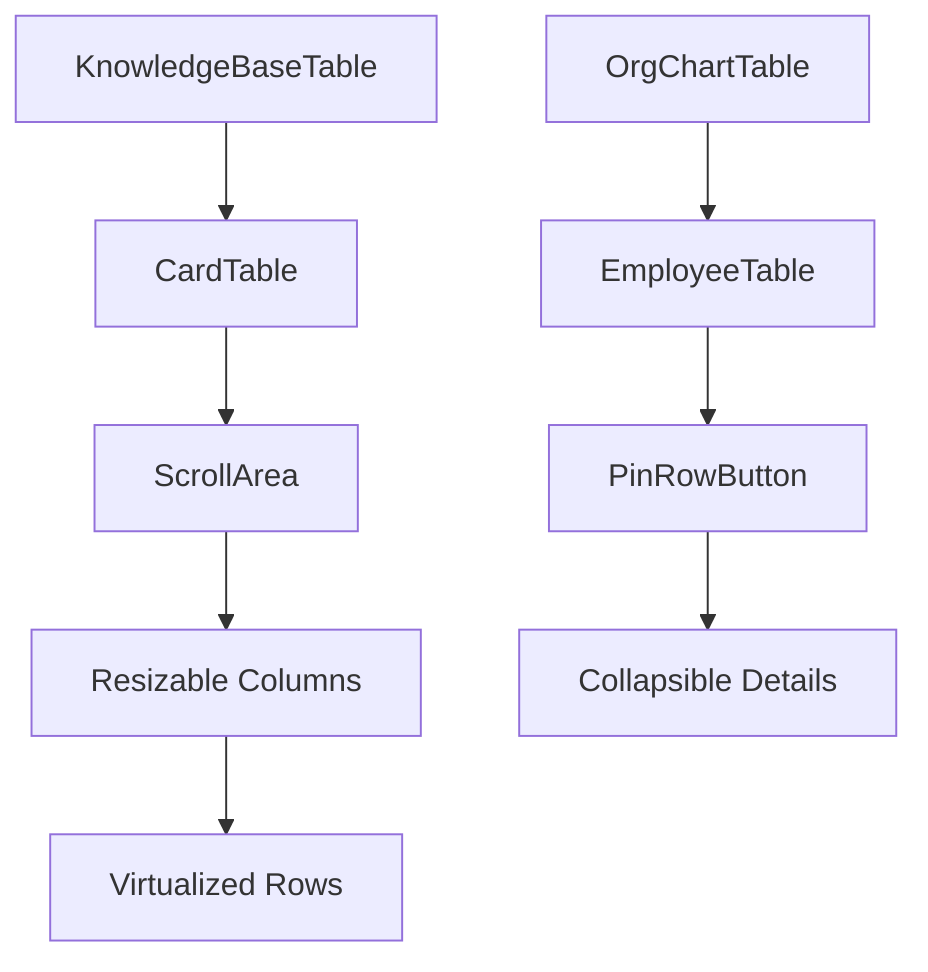

# Layout & Utility Components

<cite>
**Referenced Files in This Document**   
- [page-header.tsx](file://src/components/page-header.tsx)
- [resizable.tsx](file://src/components/ui/resizable.tsx)
- [scroll-area.tsx](file://src/components/ui/scroll-area.tsx)
- [separator.tsx](file://src/components/ui/separator.tsx)
- [hover-card.tsx](file://src/components/ui/hover-card.tsx)
- [aspect-ratio.tsx](file://src/components/ui/aspect-ratio.tsx)
- [collapsible.tsx](file://src/components/ui/collapsible.tsx)
- [accordion.tsx](file://src/components/ui/accordion.tsx)
- [calendar.tsx](file://src/components/ui/calendar.tsx)
- [carousel.tsx](file://src/components/ui/carousel.tsx)
- [knowledge-base-table.tsx](file://src/components/knowledge-base/knowledge-base-table.tsx)
- [employee-table.tsx](file://src/components/org-chart/employee-table.tsx)
</cite>

## Table of Contents
1. [Introduction](#introduction)
2. [Core Layout Components](#core-layout-components)
3. [Utility Components for Enhanced Interaction](#utility-components-for-enhanced-interaction)
4. [Composition Patterns with Page Header](#composition-patterns-with-page-header)
5. [Responsive and Touch Behavior](#responsive-and-touch-behavior)
6. [Accessibility Considerations](#accessibility-considerations)
7. [Performance Implications](#performance-implications)
8. [Theming and Integration Guidance](#theming-and-integration-guidance)
9. [Conclusion](#conclusion)

## Introduction
This document provides comprehensive documentation for layout and utility components that support structural organization and enhanced user interactions within the CartwrightKing Admin ERP system. These components are essential for building data-intensive interfaces such as knowledge base tables and organizational charts. The documentation covers resizable panels, scrollable areas, visual separators, hover cards, aspect ratio containers, collapsible sections, accordions, calendars, and carousels. Special emphasis is placed on composition patterns using `page-header.tsx` to ensure consistent page layouts across the application.

**Section sources**
- [page-header.tsx](file://src/components/page-header.tsx#L1-L62)

## Core Layout Components

### Resizable Panels
Resizable panels enable users to dynamically adjust the size of interface sections, improving workspace customization in multi-panel layouts. Implemented via `ResizablePanelGroup`, `ResizablePanel`, and `ResizableHandle`, these components support both horizontal and vertical configurations. The handle includes an optional grip icon for better visual affordance.

**Diagram sources**
- [resizable.tsx](file://src/components/ui/resizable.tsx#L1-L56)

**Section sources**
- [resizable.tsx](file://src/components/ui/resizable.tsx#L1-L56)

### Scrollable Areas
ScrollArea wraps content with customizable scrollbars that appear only when needed, supporting both vertical and horizontal orientations. It uses Radix UI’s ScrollAreaPrimitive to ensure smooth scrolling performance and consistent cross-browser behavior. This component is critical for managing overflow in data-dense tables and dashboards.

**Diagram sources**
- [scroll-area.tsx](file://src/components/ui/scroll-area.tsx#L7-L28)

**Section sources**
- [scroll-area.tsx](file://src/components/ui/scroll-area.tsx#L7-L58)

### Visual Separators
The Separator component renders a thin line to visually divide content sections. It supports both horizontal and vertical orientations and is commonly used in toolbars, menus, and form sections to improve visual hierarchy and readability.

**Diagram sources**
- [separator.tsx](file://src/components/ui/separator.tsx#L7-L25)

**Section sources**
- [separator.tsx](file://src/components/ui/separator.tsx#L7-L28)

## Utility Components for Enhanced Interaction

### Hover Cards
HoverCard provides contextual information on hover or focus, enhancing discoverability without cluttering the interface. Composed of `HoverCard`, `HoverCardTrigger`, and `HoverCardContent`, it supports accessible keyboard navigation and is ideal for displaying user profiles or metadata in tables.

**Diagram sources**
- [hover-card.tsx](file://src/components/ui/hover-card.tsx#L7-L44)

**Section sources**
- [hover-card.tsx](file://src/components/ui/hover-card.tsx#L7-L44)

### Aspect Ratio Containers
AspectRatio ensures media elements maintain consistent proportions across devices by setting a container’s height relative to its width. This is particularly useful for embedding videos or images in responsive layouts.

**Diagram sources**
- [aspect-ratio.tsx](file://src/components/ui/aspect-ratio.tsx#L4-L8)

**Section sources**
- [aspect-ratio.tsx](file://src/components/ui/aspect-ratio.tsx#L4-L11)

### Collapsible Sections and Accordions
Collapsible allows toggling content visibility with smooth animations. Accordion extends this pattern to multiple items, ensuring only one panel is open at a time. Both support keyboard navigation (Enter/Space to toggle) and are used in settings panels and FAQ sections.

**Diagram sources**
- [collapsible.tsx](file://src/components/ui/collapsible.tsx#L4-L8)
- [accordion.tsx](file://src/components/ui/accordion.tsx#L8-L12)

**Section sources**
- [collapsible.tsx](file://src/components/ui/collapsible.tsx#L4-L33)
- [accordion.tsx](file://src/components/ui/accordion.tsx#L8-L66)

### Calendars and Carousels
Calendar provides a fully accessible date picker with support for localization, range selection, and custom styling. Carousel enables horizontal swiping through content slides, with touch and keyboard support (ArrowLeft/ArrowRight).

**Diagram sources**
- [calendar.tsx](file://src/components/ui/calendar.tsx#L13-L172)
- [carousel.tsx](file://src/components/ui/carousel.tsx#L44-L132)

**Section sources**
- [calendar.tsx](file://src/components/ui/calendar.tsx#L13-L213)
- [carousel.tsx](file://src/components/ui/carousel.tsx#L44-L132)

## Composition Patterns with Page Header
The `PageHeader` component demonstrates effective composition of layout utilities to create consistent, navigable page structures. It combines breadcrumbs, dynamic titles, and action buttons within a responsive container.

Key props:
- **title**: Main page title (string)
- **crumbs**: Array of `{label, href}` objects for breadcrumb trail
- **action**: Optional React node (e.g., button) for primary actions
- **className**: Additional styling

This pattern is reused across admin modules like company hub, departments, and knowledge base, ensuring UI consistency.

**Section sources**
- [page-header.tsx](file://src/components/page-header.tsx#L1-L62)

## Responsive and Touch Behavior
Layout components are designed with responsive behavior:
- Resizable panels adapt to container size changes
- ScrollArea supports touch scrolling on mobile devices
- Carousel enables swipe gestures via Embla
- HoverCard switches to tap-to-reveal on touch devices

Breakpoints are managed using Tailwind’s `md:` prefix, ensuring mobile-first design. All interactive elements maintain usability on both desktop and tablet interfaces.

**Section sources**
- [resizable.tsx](file://src/components/ui/resizable.tsx#L1-L56)
- [scroll-area.tsx](file://src/components/ui/scroll-area.tsx#L7-L58)
- [carousel.tsx](file://src/components/ui/carousel.tsx#L44-L132)

## Accessibility Considerations
All components follow WAI-ARIA guidelines:
- Accordions support keyboard navigation (Tab, Enter, Space)
- Calendar allows full keyboard date selection
- Hover cards are accessible via focus and support dismissal
- Labels and roles are properly assigned
- Color contrast meets WCAG standards

Focus management is handled internally by Radix UI primitives, ensuring robust accessibility without additional implementation effort.

**Section sources**
- [accordion.tsx](file://src/components/ui/accordion.tsx#L8-L66)
- [calendar.tsx](file://src/components/ui/calendar.tsx#L13-L213)
- [hover-card.tsx](file://src/components/ui/hover-card.tsx#L7-L44)

## Performance Implications
Nested scrolling and dynamic sizing can impact performance:
- Use ScrollArea judiciously to avoid deep nesting
- Memoize resizable panel content to prevent re-renders
- Limit carousel items with virtualization if needed
- Calendar renders only visible months to optimize load

In data-intensive interfaces like `knowledge-base-table.tsx` and `employee-table.tsx`, these components are integrated with virtualized tables to maintain 60fps performance.

**Diagram sources**
- [knowledge-base-table.tsx](file://src/components/knowledge-base/knowledge-base-table.tsx#L1-L162)
- [employee-table.tsx](file://src/components/org-chart/employee-table.tsx#L1-L199)

**Section sources**
- [knowledge-base-table.tsx](file://src/components/knowledge-base/knowledge-base-table.tsx#L1-L162)
- [employee-table.tsx](file://src/components/org-chart/employee-table.tsx#L1-L199)

## Theming and Integration Guidance
Components are theme-aware and integrate seamlessly with the application’s design system:
- Use `cn()` utility for className composition
- Leverage Tailwind classes for customization
- Extend via props without modifying base components
- Combine with other UI categories (e.g., buttons, badges)

For integration:
- Wrap content in appropriate layout containers
- Use semantic props for behavior control
- Compose with data-fetching hooks (e.g., `useEmployees`)
- Ensure consistent spacing using utility classes

**Section sources**
- [lib/utils.ts](file://src/lib/utils.ts)
- [button.tsx](file://src/components/ui/button.tsx)

## Conclusion
The layout and utility components in the CartwrightKing Admin ERP system provide a robust foundation for building structured, interactive, and accessible interfaces. By leveraging composition patterns—particularly through `PageHeader`—and adhering to responsive and accessibility best practices, developers can create consistent, high-performance user experiences across all